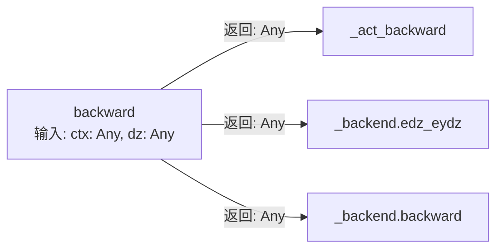
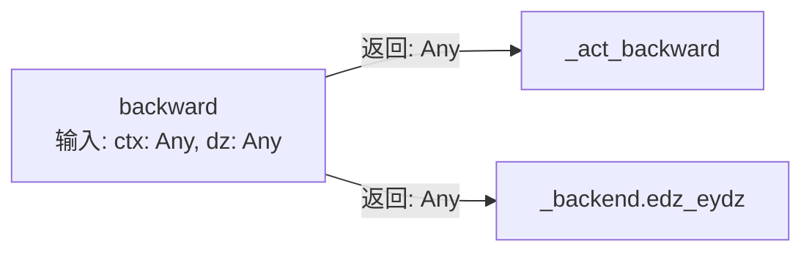
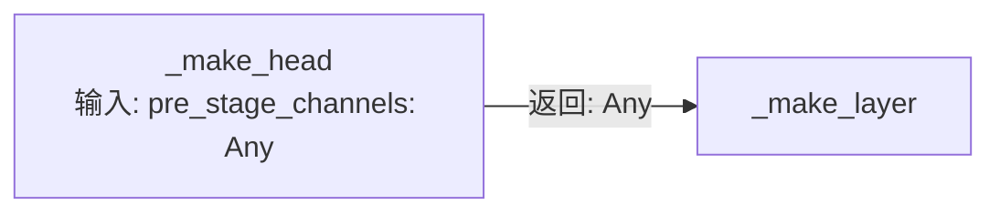
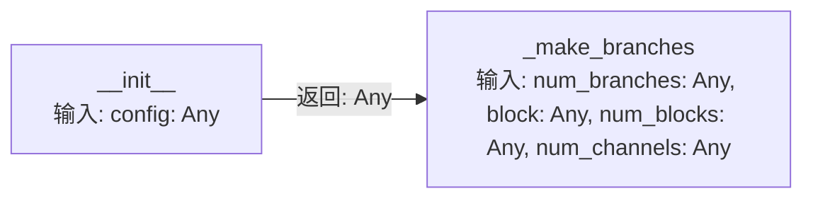
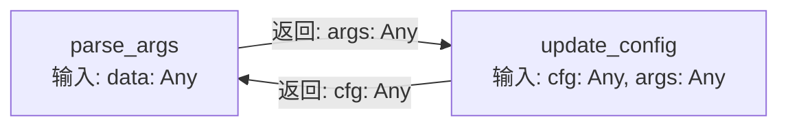
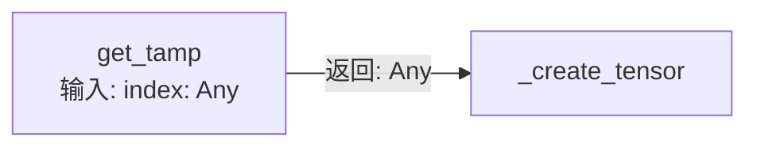

# RAG 知识库全量文本预览

此文件包含 RAG Agent 检索使用的所有自然语言知识块（共 1335 条）。

---

## 知识块 ID: 0

## Class: AggregationCalculator
- **File**: analysis\aggregation_calculator.py:22
- **Description**: 聚合计算器
- **Methods Count**: 10


---

## 知识块 ID: 1

## Method: AggregationCalculator.__init__(self: Any, hierarchy_model: HierarchyModel)
- **Type**: Method
- **Parent Class**: AggregationCalculator
- **File**: analysis\aggregation_calculator.py:25
- **Description**: No description provided.
- **Return Type**: None
- **Parameters**: self: Any, hierarchy_model: HierarchyModel


---

## 知识块 ID: 2

## Method: AggregationCalculator.calculate_all_relations(self: Any)
- **Type**: Method
- **Parent Class**: AggregationCalculator
- **File**: analysis\aggregation_calculator.py:36
- **Description**: 计算所有层级的聚合关系
- **Return Type**: None
- **Parameters**: self: Any


---

## 知识块 ID: 3

## Method: AggregationCalculator._calculate_folder_relations(self: Any)
- **Type**: Method
- **Parent Class**: AggregationCalculator
- **File**: analysis\aggregation_calculator.py:60
- **Description**: 从第3层的调用图聚合出第2层的文件夹间关系
关键：保留具体的实体对信息以便后续追踪
- **Return Type**: None
- **Parameters**: self: Any


---

## 知识块 ID: 4

## Method: AggregationCalculator._calculate_function_relations(self: Any)
- **Type**: Method
- **Parent Class**: AggregationCalculator
- **File**: analysis\aggregation_calculator.py:110
- **Description**: 从第3层的调用图聚合出第1层的功能间关系
这是最重要的聚合，代表不同功能分区之间的依赖
- **Return Type**: None
- **Parameters**: self: Any


---

## 知识块 ID: 5

## Method: AggregationCalculator._calculate_statistics(self: Any)
- **Type**: Method
- **Parent Class**: AggregationCalculator
- **File**: analysis\aggregation_calculator.py:172
- **Description**: 计算各层的聚合统计信息
- **Return Type**: None
- **Parameters**: self: Any


---

## 知识块 ID: 6

## Method: AggregationCalculator.calculate_node_sizes(self: Any, base_size: int = 10)
- **Type**: Method
- **Parent Class**: AggregationCalculator
- **File**: analysis\aggregation_calculator.py:235
- **Description**: 计算节点大小（用于可视化）
节点大小 = base_size + 包含的代码量
- **Return Type**: Dict[str, float]
- **Parameters**: self: Any, base_size: int


---

## 知识块 ID: 7

## Method: AggregationCalculator.calculate_edge_widths(self: Any, base_width: float = 1.0, max_width: float = 5.0)
- **Type**: Method
- **Parent Class**: AggregationCalculator
- **File**: analysis\aggregation_calculator.py:260
- **Description**: 计算边的宽度（用于可视化）
边的宽度 = 调用次数 * 权重系数
- **Return Type**: Dict[str, float]
- **Parameters**: self: Any, base_width: float, max_width: float


---

## 知识块 ID: 8

## Method: AggregationCalculator.get_critical_paths(self: Any, max_depth: int = 3)
- **Type**: Method
- **Parent Class**: AggregationCalculator
- **File**: analysis\aggregation_calculator.py:292
- **Description**: 获取关键路径（参与"重要-1"代码的调用链）
这有助于可视化展示最重要的功能流程
- **Return Type**: List[List[str]]
- **Parameters**: self: Any, max_depth: int


---

## 知识块 ID: 9

## Method: AggregationCalculator._trace_incoming_calls(self: Any, entity_id: str, max_depth: int)
- **Type**: Method
- **Parent Class**: AggregationCalculator
- **File**: analysis\aggregation_calculator.py:311
- **Description**: 追踪调用链
- **Return Type**: List[str]
- **Parameters**: self: Any, entity_id: str, max_depth: int


---

## 知识块 ID: 10

## Method: AggregationCalculator.generate_summary_report(self: Any)
- **Type**: Method
- **Parent Class**: AggregationCalculator
- **File**: analysis\aggregation_calculator.py:331
- **Description**: 生成聚合分析报告
- **Return Type**: Dict
- **Parameters**: self: Any


---

## 知识块 ID: 11

## Class: CodeAnalyzer
- **File**: demo_code_package\codebase_analyzer\analyzer.py:8
- **Description**: 代码分析器类
- **Methods Count**: 8


---

## 知识块 ID: 12

## Method: CodeAnalyzer.__init__(self: Any)
- **Type**: Method
- **Parent Class**: CodeAnalyzer
- **File**: demo_code_package\codebase_analyzer\analyzer.py:11
- **Description**: 初始化分析器
- **Return Type**: None
- **Parameters**: self: Any


---

## 知识块 ID: 13

## Method: CodeAnalyzer.add_parser(self: Any, parser: CodeParser)
- **Type**: Method
- **Parent Class**: CodeAnalyzer
- **File**: demo_code_package\codebase_analyzer\analyzer.py:17
- **Description**: 添加解析器

Args:
    parser: 代码解析器实例
- **Return Type**: None
- **Parameters**: self: Any, parser: CodeParser


---

## 知识块 ID: 14

## Method: CodeAnalyzer.analyze_project(self: Any, file_paths: list)
- **Type**: Method
- **Parent Class**: CodeAnalyzer
- **File**: demo_code_package\codebase_analyzer\analyzer.py:26
- **Description**: 分析整个项目

Args:
    file_paths: 文件路径列表
    
Returns:
    分析结果字典
- **Return Type**: dict
- **Parameters**: self: Any, file_paths: list


---

## 知识块 ID: 15

## Method: CodeAnalyzer._build_call_graph(self: Any, results: list)
- **Type**: Method
- **Parent Class**: CodeAnalyzer
- **File**: demo_code_package\codebase_analyzer\analyzer.py:51
- **Description**: 构建调用图
- **Return Type**: None
- **Parameters**: self: Any, results: list


---

## 知识块 ID: 16

## Method: CodeAnalyzer._find_method_calls(self: Any, method_node: Any)
- **Type**: Method
- **Parent Class**: CodeAnalyzer
- **File**: demo_code_package\codebase_analyzer\analyzer.py:61
- **Description**: 查找方法调用
- **Return Type**: None
- **Parameters**: self: Any, method_node: Any


---

## 知识块 ID: 17

## Method: CodeAnalyzer._get_method_signature(self: Any, cls_node: Any, method_node: Any)
- **Type**: Method
- **Parent Class**: CodeAnalyzer
- **File**: demo_code_package\codebase_analyzer\analyzer.py:70
- **Description**: 获取方法签名
- **Return Type**: None
- **Parameters**: self: Any, cls_node: Any, method_node: Any


---

## 知识块 ID: 18

## Method: CodeAnalyzer._build_class_hierarchy(self: Any, results: list)
- **Type**: Method
- **Parent Class**: CodeAnalyzer
- **File**: demo_code_package\codebase_analyzer\analyzer.py:76
- **Description**: 构建类继承关系
- **Return Type**: None
- **Parameters**: self: Any, results: list


---

## 知识块 ID: 19

## Method: CodeAnalyzer.get_statistics(self: Any)
- **Type**: Method
- **Parent Class**: CodeAnalyzer
- **File**: demo_code_package\codebase_analyzer\analyzer.py:86
- **Description**: 获取统计信息

Returns:
    统计信息字典
- **Return Type**: dict
- **Parameters**: self: Any


---

## 知识块 ID: 20

## Class: CallGraph
- **File**: analysis\call_graph.py:14
- **Description**: 方法调用图
- **Methods Count**: 16


---

## 知识块 ID: 21

## Method: CallGraph.__init__(self: Any, report: ProjectAnalysisReport)
- **Type**: Method
- **Parent Class**: CallGraph
- **File**: analysis\call_graph.py:17
- **Description**: No description provided.
- **Return Type**: None
- **Parameters**: self: Any, report: ProjectAnalysisReport


---

## 知识块 ID: 22

## Method: CallGraph._build_graph(self: Any)
- **Type**: Method
- **Parent Class**: CallGraph
- **File**: analysis\call_graph.py:29
- **Description**: 从 report 中构建调用图
- **Return Type**: None
- **Parameters**: self: Any


---

## 知识块 ID: 23

## Method: CallGraph.get_called_methods(self: Any, method_sig: str)
- **Type**: Method
- **Parent Class**: CallGraph
- **File**: analysis\call_graph.py:36
- **Description**: 获取方法调用的所有方法
- **Return Type**: Set[str]
- **Parameters**: self: Any, method_sig: str


---

## 知识块 ID: 24

## Method: CallGraph.get_calling_methods(self: Any, method_sig: str)
- **Type**: Method
- **Parent Class**: CallGraph
- **File**: analysis\call_graph.py:40
- **Description**: 获取调用方法的所有方法
- **Return Type**: Set[str]
- **Parameters**: self: Any, method_sig: str


---

## 知识块 ID: 25

## Method: CallGraph.find_call_chain(self: Any, from_method: str, to_method: str, max_depth: int = 10)
- **Type**: Method
- **Parent Class**: CallGraph
- **File**: analysis\call_graph.py:44
- **Description**: 寻找从 from_method 到 to_method 的调用链
- **Return Type**: Optional[List[str]]
- **Parameters**: self: Any, from_method: str, to_method: str, max_depth: int


---

## 知识块 ID: 26

## Method: CallGraph.find_all_call_chains(self: Any, from_method: str, max_depth: int = 5)
- **Type**: Method
- **Parent Class**: CallGraph
- **File**: analysis\call_graph.py:69
- **Description**: 找到从 from_method 开始的所有调用链
- **Return Type**: Dict[str, List[str]]
- **Parameters**: self: Any, from_method: str, max_depth: int


---

## 知识块 ID: 27

## Method: CallGraph.dfs(node: str, path: List[str])
- **Type**: Method
- **Parent Class**: CallGraph
- **File**: analysis\call_graph.py:177
- **Description**: No description provided.
- **Return Type**: None
- **Parameters**: node: str, path: List[str]


---

## 知识块 ID: 28

## Method: CallGraph.trace_execution_path(self: Any, entry_method: str, max_depth: int = 8)
- **Type**: Method
- **Parent Class**: CallGraph
- **File**: analysis\call_graph.py:88
- **Description**: 追踪执行路径
- **Return Type**: ExecutionPath
- **Parameters**: self: Any, entry_method: str, max_depth: int


---

## 知识块 ID: 29

## Method: CallGraph.traverse(method_sig: str, depth: int = 0)
- **Type**: Method
- **Parent Class**: CallGraph
- **File**: analysis\call_graph.py:103
- **Description**: No description provided.
- **Return Type**: None
- **Parameters**: method_sig: str, depth: int


---

## 知识块 ID: 30

## Method: CallGraph._get_method_info(self: Any, method_sig: str)
- **Type**: Method
- **Parent Class**: CallGraph
- **File**: analysis\call_graph.py:129
- **Description**: 从报告中获取方法信息
- **Return Type**: Optional[MethodInfo]
- **Parameters**: self: Any, method_sig: str


---

## 知识块 ID: 31

## Method: CallGraph._infer_method_purpose(self: Any, method: MethodInfo)
- **Type**: Method
- **Parent Class**: CallGraph
- **File**: analysis\call_graph.py:144
- **Description**: 推断方法的目的
- **Return Type**: str
- **Parameters**: self: Any, method: MethodInfo


---

## 知识块 ID: 32

## Method: CallGraph.find_cycles(self: Any)
- **Type**: Method
- **Parent Class**: CallGraph
- **File**: analysis\call_graph.py:171
- **Description**: 查找调用图中的循环
- **Return Type**: List[List[str]]
- **Parameters**: self: Any


---

## 知识块 ID: 33

## Method: CallGraph.get_call_depth(self: Any, method_sig: str)
- **Type**: Method
- **Parent Class**: CallGraph
- **File**: analysis\call_graph.py:200
- **Description**: 获取方法的调用深度层级
- **Return Type**: Dict[int, List[str]]
- **Parameters**: self: Any, method_sig: str


---

## 知识块 ID: 34

## Method: CallGraph.get_most_called_methods(self: Any, top_n: int = 10)
- **Type**: Method
- **Parent Class**: CallGraph
- **File**: analysis\call_graph.py:221
- **Description**: 获取被调用最频繁的方法
- **Return Type**: List[Tuple[str, int]]
- **Parameters**: self: Any, top_n: int


---

## 知识块 ID: 35

## Method: CallGraph.get_statistics(self: Any)
- **Type**: Method
- **Parent Class**: CallGraph
- **File**: analysis\call_graph.py:232
- **Description**: 获取调用图的统计信息
- **Return Type**: Dict
- **Parameters**: self: Any


---

## 知识块 ID: 36

## Method: CallGraph._find_entry_points(self: Any)
- **Type**: Method
- **Parent Class**: CallGraph
- **File**: analysis\call_graph.py:242
- **Description**: 找到调用图的入口点（没有调用者的方法）
- **Return Type**: List[str]
- **Parameters**: self: Any


---

## 知识块 ID: 37

## Class: ExecutionFlowAnalyzer
- **File**: analysis\call_graph.py:253
- **Description**: 执行流分析
- **Methods Count**: 4


---

## 知识块 ID: 38

## Method: ExecutionFlowAnalyzer.__init__(self: Any, call_graph: CallGraph, report: ProjectAnalysisReport)
- **Type**: Method
- **Parent Class**: ExecutionFlowAnalyzer
- **File**: analysis\call_graph.py:256
- **Description**: No description provided.
- **Return Type**: None
- **Parameters**: self: Any, call_graph: CallGraph, report: ProjectAnalysisReport


---

## 知识块 ID: 39

## Method: ExecutionFlowAnalyzer.analyze_execution_flow(self: Any)
- **Type**: Method
- **Parent Class**: ExecutionFlowAnalyzer
- **File**: analysis\call_graph.py:260
- **Description**: 分析项目的执行流
- **Return Type**: List[ExecutionPath]
- **Parameters**: self: Any


---

## 知识块 ID: 40

## Method: ExecutionFlowAnalyzer.find_critical_path(self: Any, execution_paths: List[ExecutionPath])
- **Type**: Method
- **Parent Class**: ExecutionFlowAnalyzer
- **File**: analysis\call_graph.py:271
- **Description**: 找到最关键的执行路径（最深的）
- **Return Type**: Optional[ExecutionPath]
- **Parameters**: self: Any, execution_paths: List[ExecutionPath]


---

## 知识块 ID: 41

## Method: ExecutionFlowAnalyzer.estimate_execution_time(self: Any, path: ExecutionPath)
- **Type**: Method
- **Parent Class**: ExecutionFlowAnalyzer
- **File**: analysis\call_graph.py:278
- **Description**: 估计执行时间（简单估计）
- **Return Type**: str
- **Parameters**: self: Any, path: ExecutionPath


---

## 知识块 ID: 42

## Class: CallGraphAnalyzer
- **File**: analysis\call_graph_analyzer.py:13
- **Description**: 提取代码中的方法调用关系
- **Methods Count**: 7


---

## 知识块 ID: 43

## Method: CallGraphAnalyzer.__init__(self: Any)
- **Type**: Method
- **Parent Class**: CallGraphAnalyzer
- **File**: analysis\call_graph_analyzer.py:16
- **Description**: No description provided.
- **Return Type**: None
- **Parameters**: self: Any


---

## 知识块 ID: 44

## Method: CallGraphAnalyzer.extract_calls_from_method(self: Any, method_code: str, class_name: str, method_name: str)
- **Type**: Method
- **Parent Class**: CallGraphAnalyzer
- **File**: analysis\call_graph_analyzer.py:36
- **Description**: 从单个方法的源代码提取所有函数调用

Args:
    method_code: 方法的源代码
    class_name: 所属类名
    method_name: 方法名
    
Returns:
    调用的函数集合
- **Return Type**: Set[str]
- **Parameters**: self: Any, method_code: str, class_name: str, method_name: str


---

## 知识块 ID: 45

## Method: CallGraphAnalyzer.build_call_graph(self: Any, analyzer_report: Any)
- **Type**: Method
- **Parent Class**: CallGraphAnalyzer
- **File**: analysis\call_graph_analyzer.py:144
- **Description**: 从分析器报告构建完整的调用图
使用方法的完整源代码进行AST分析（修复：之前使用docstring导致0个关系）

Args:
    analyzer_report: CodeAnalyzer的report对象
- **Return Type**: None
- **Parameters**: self: Any, analyzer_report: Any


---

## 知识块 ID: 46

## Method: CallGraphAnalyzer.get_call_chain(self: Any, method_sig: str, max_depth: int = 3)
- **Type**: Method
- **Parent Class**: CallGraphAnalyzer
- **File**: analysis\call_graph_analyzer.py:209
- **Description**: 获取方法的调用链 (递归追踪)

参考JUnitGenie的递归约束求解思路

Args:
    method_sig: 方法签名
    max_depth: 最大递归深度 (JUnitGenie使用3层)
    
Returns:
    调用链列表
- **Return Type**: List[List[str]]
- **Parameters**: self: Any, method_sig: str, max_depth: int


---

## 知识块 ID: 47

## Method: CallGraphAnalyzer.detect_cyclic_calls(self: Any)
- **Type**: Method
- **Parent Class**: CallGraphAnalyzer
- **File**: analysis\call_graph_analyzer.py:235
- **Description**: 检测循环调用
- **Return Type**: List[List[str]]
- **Parameters**: self: Any


---

## 知识块 ID: 48

## Method: CallGraphAnalyzer.dfs(node: Any, path: Any, visited: Any)
- **Type**: Method
- **Parent Class**: CallGraphAnalyzer
- **File**: analysis\call_graph_analyzer.py:239
- **Description**: No description provided.
- **Return Type**: None
- **Parameters**: node: Any, path: Any, visited: Any


---

## 知识块 ID: 49

## Method: CallGraphAnalyzer.get_call_statistics(self: Any)
- **Type**: Method
- **Parent Class**: CallGraphAnalyzer
- **File**: analysis\call_graph_analyzer.py:263
- **Description**: 获取调用图统计信息
- **Return Type**: Dict
- **Parameters**: self: Any


---

## 知识块 ID: 50

## Class: CallVisitor
- **File**: analysis\call_graph_analyzer.py:55
- **Description**: No description provided.
- **Methods Count**: 4


---

## 知识块 ID: 51

## Method: CallVisitor.visit_Call(self: Any, node: Any)
- **Type**: Method
- **Parent Class**: CallVisitor
- **File**: analysis\call_graph_analyzer.py:56
- **Description**: No description provided.
- **Return Type**: None
- **Parameters**: self: Any, node: Any


---

## 知识块 ID: 52

## Method: CallVisitor._is_valid_method_call(self: Any, call_name: str)
- **Type**: Method
- **Parent Class**: CallVisitor
- **File**: analysis\call_graph_analyzer.py:63
- **Description**: 检查调用是否是有效的方法调用（过滤掉容器方法和属性访问链）

Args:
    call_name: 调用名称，如 "dict.values", "func.incoming_calls.values"

Returns:
    True 如果是有效的方法调用，False 如果是容器方法或属性访问链
- **Return Type**: bool
- **Parameters**: self: Any, call_name: str


---

## 知识块 ID: 53

## Method: CallVisitor._get_call_name(self: Any, node: Any)
- **Type**: Method
- **Parent Class**: CallVisitor
- **File**: analysis\call_graph_analyzer.py:110
- **Description**: 从Call节点提取函数名
- **Return Type**: None
- **Parameters**: self: Any, node: Any


---

## 知识块 ID: 54

## Method: CallVisitor._get_expr_name(self: Any, node: Any)
- **Type**: Method
- **Parent Class**: CallVisitor
- **File**: analysis\call_graph_analyzer.py:123
- **Description**: 递归获取表达式的名称
- **Return Type**: None
- **Parameters**: self: Any, node: Any


---

## 知识块 ID: 55

## Class: CFGNode
- **File**: analysis\cfg_generator.py:14
- **Description**: CFG节点
- **Methods Count**: 0


---

## 知识块 ID: 56

## Class: CFGEdge
- **File**: analysis\cfg_generator.py:24
- **Description**: CFG边
- **Methods Count**: 0


---

## 知识块 ID: 57

## Class: ControlFlowGraph
- **File**: analysis\cfg_generator.py:32
- **Description**: 控制流图
- **Methods Count**: 2


---

## 知识块 ID: 58

## Method: ControlFlowGraph.to_dot(self: Any)
- **Type**: Method
- **Parent Class**: ControlFlowGraph
- **File**: analysis\cfg_generator.py:38
- **Description**: 转换为DOT格式
- **Return Type**: str
- **Parameters**: self: Any


---

## 知识块 ID: 59

## Method: ControlFlowGraph.to_json(self: Any)
- **Type**: Method
- **Parent Class**: ControlFlowGraph
- **File**: analysis\cfg_generator.py:64
- **Description**: 转换为JSON格式
- **Return Type**: Dict
- **Parameters**: self: Any


---

## 知识块 ID: 60

## Class: CFGGenerator
- **File**: analysis\cfg_generator.py:88
- **Description**: CFG生成器
- **Methods Count**: 3


---

## 知识块 ID: 61

## Method: CFGGenerator.__init__(self: Any)
- **Type**: Method
- **Parent Class**: CFGGenerator
- **File**: analysis\cfg_generator.py:91
- **Description**: No description provided.
- **Return Type**: None
- **Parameters**: self: Any


---

## 知识块 ID: 62

## Method: CFGGenerator.generate_cfg(self: Any, source_code: str, method_name: str = '')
- **Type**: Method
- **Parent Class**: CFGGenerator
- **File**: analysis\cfg_generator.py:94
- **Description**: 从源代码生成CFG

Args:
    source_code: 方法源代码
    method_name: 方法名称
    
Returns:
    ControlFlowGraph对象
- **Return Type**: ControlFlowGraph
- **Parameters**: self: Any, source_code: str, method_name: str


---

## 知识块 ID: 63

## Method: CFGGenerator._new_node_id(self: Any)
- **Type**: Method
- **Parent Class**: CFGGenerator
- **File**: analysis\cfg_generator.py:143
- **Description**: 生成新的节点ID
- **Return Type**: str
- **Parameters**: self: Any


---

## 知识块 ID: 64

## Class: CFGVisitor
- **File**: analysis\cfg_generator.py:149
- **Description**: CFG AST访问器
- **Methods Count**: 7


---

## 知识块 ID: 65

## Method: CFGVisitor.__init__(self: Any, cfg: ControlFlowGraph, entry_id: str, generator: CFGGenerator)
- **Type**: Method
- **Parent Class**: CFGVisitor
- **File**: analysis\cfg_generator.py:152
- **Description**: No description provided.
- **Return Type**: None
- **Parameters**: self: Any, cfg: ControlFlowGraph, entry_id: str, generator: CFGGenerator


---

## 知识块 ID: 66

## Method: CFGVisitor.visit_FunctionDef(self: Any, node: ast.FunctionDef)
- **Type**: Method
- **Parent Class**: CFGVisitor
- **File**: analysis\cfg_generator.py:159
- **Description**: 访问函数定义
- **Return Type**: None
- **Parameters**: self: Any, node: ast.FunctionDef


---

## 知识块 ID: 67

## Method: CFGVisitor.visit_If(self: Any, node: ast.If)
- **Type**: Method
- **Parent Class**: CFGVisitor
- **File**: analysis\cfg_generator.py:165
- **Description**: 访问if语句
- **Return Type**: None
- **Parameters**: self: Any, node: ast.If


---

## 知识块 ID: 68

## Method: CFGVisitor.visit_While(self: Any, node: ast.While)
- **Type**: Method
- **Parent Class**: CFGVisitor
- **File**: analysis\cfg_generator.py:238
- **Description**: 访问while循环
- **Return Type**: None
- **Parameters**: self: Any, node: ast.While


---

## 知识块 ID: 69

## Method: CFGVisitor.visit_Return(self: Any, node: ast.Return)
- **Type**: Method
- **Parent Class**: CFGVisitor
- **File**: analysis\cfg_generator.py:291
- **Description**: 访问return语句
- **Return Type**: None
- **Parameters**: self: Any, node: ast.Return


---

## 知识块 ID: 70

## Method: CFGVisitor.visit_Expr(self: Any, node: ast.Expr)
- **Type**: Method
- **Parent Class**: CFGVisitor
- **File**: analysis\cfg_generator.py:312
- **Description**: 访问表达式语句
- **Return Type**: None
- **Parameters**: self: Any, node: ast.Expr


---

## 知识块 ID: 71

## Method: CFGVisitor.visit_Assign(self: Any, node: ast.Assign)
- **Type**: Method
- **Parent Class**: CFGVisitor
- **File**: analysis\cfg_generator.py:334
- **Description**: 访问赋值语句
- **Return Type**: None
- **Parameters**: self: Any, node: ast.Assign


---

## 知识块 ID: 72

## Class: ElementType
- **File**: analysis\code_model.py:10
- **Description**: 代码元素类型
- **Methods Count**: 0


---

## 知识块 ID: 73

## Class: RelationType
- **File**: analysis\hierarchy_model.py:22
- **Description**: 关系类型
- **Methods Count**: 0


---

## 知识块 ID: 74

## Class: RepositoryInfo
- **File**: analysis\code_model.py:81
- **Description**: 仓库/项目信息
- **Methods Count**: 1


---

## 知识块 ID: 75

## Method: RepositoryInfo.__repr__(self: Any)
- **Type**: Method
- **Parent Class**: RepositoryInfo
- **File**: analysis\code_model.py:92
- **Description**: No description provided.
- **Return Type**: None
- **Parameters**: self: Any


---

## 知识块 ID: 76

## Class: SourceLocation
- **File**: analysis\code_model.py:97
- **Description**: 源代码位置
- **Methods Count**: 1


---

## 知识块 ID: 77

## Method: SourceLocation.__str__(self: Any)
- **Type**: Method
- **Parent Class**: SourceLocation
- **File**: analysis\code_model.py:105
- **Description**: No description provided.
- **Return Type**: None
- **Parameters**: self: Any


---

## 知识块 ID: 78

## Class: PackageInfo
- **File**: analysis\code_model.py:110
- **Description**: 包/模块信息
- **Methods Count**: 1


---

## 知识块 ID: 79

## Method: PackageInfo.__repr__(self: Any)
- **Type**: Method
- **Parent Class**: PackageInfo
- **File**: analysis\code_model.py:121
- **Description**: No description provided.
- **Return Type**: None
- **Parameters**: self: Any


---

## 知识块 ID: 80

## Class: Parameter
- **File**: analysis\code_model.py:126
- **Description**: 方法参数（作为独立实体）
- **Methods Count**: 1


---

## 知识块 ID: 81

## Method: Parameter.__repr__(self: Any)
- **Type**: Method
- **Parent Class**: Parameter
- **File**: analysis\code_model.py:135
- **Description**: No description provided.
- **Return Type**: None
- **Parameters**: self: Any


---

## 知识块 ID: 82

## Class: ReturnValue
- **File**: analysis\code_model.py:142
- **Description**: 返回值（作为独立实体）
- **Methods Count**: 1


---

## 知识块 ID: 83

## Method: ReturnValue.__repr__(self: Any)
- **Type**: Method
- **Parent Class**: ReturnValue
- **File**: analysis\code_model.py:150
- **Description**: No description provided.
- **Return Type**: None
- **Parameters**: self: Any


---

## 知识块 ID: 84

## Class: CFGEntity
- **File**: analysis\code_model.py:155
- **Description**: 控制流图实体（作为独立实体）
- **Methods Count**: 1


---

## 知识块 ID: 85

## Method: CFGEntity.__repr__(self: Any)
- **Type**: Method
- **Parent Class**: CFGEntity
- **File**: analysis\code_model.py:165
- **Description**: No description provided.
- **Return Type**: None
- **Parameters**: self: Any


---

## 知识块 ID: 86

## Class: DFGEntity
- **File**: analysis\code_model.py:170
- **Description**: 数据流图实体（作为独立实体）
- **Methods Count**: 1


---

## 知识块 ID: 87

## Method: DFGEntity.__repr__(self: Any)
- **Type**: Method
- **Parent Class**: DFGEntity
- **File**: analysis\code_model.py:180
- **Description**: No description provided.
- **Return Type**: None
- **Parameters**: self: Any


---

## 知识块 ID: 88

## Class: MethodInfo
- **File**: analysis\code_model.py:185
- **Description**: 方法信息
- **Methods Count**: 2


---

## 知识块 ID: 89

## Method: MethodInfo.get_full_name(self: Any)
- **Type**: Method
- **Parent Class**: MethodInfo
- **File**: analysis\code_model.py:206
- **Description**: 获取完整方法名 (ClassName.methodName)
- **Return Type**: str
- **Parameters**: self: Any


---

## 知识块 ID: 90

## Method: MethodInfo.__repr__(self: Any)
- **Type**: Method
- **Parent Class**: MethodInfo
- **File**: analysis\code_model.py:210
- **Description**: No description provided.
- **Return Type**: None
- **Parameters**: self: Any


---

## 知识块 ID: 91

## Class: FieldInfo
- **File**: analysis\code_model.py:216
- **Description**: 字段/属性信息
- **Methods Count**: 0


---

## 知识块 ID: 92

## Class: ClassInfo
- **File**: analysis\code_model.py:227
- **Description**: 类信息
- **Methods Count**: 4


---

## 知识块 ID: 93

## Method: ClassInfo.add_method(self: Any, method: MethodInfo)
- **Type**: Method
- **Parent Class**: ClassInfo
- **File**: analysis\code_model.py:243
- **Description**: 添加方法
- **Return Type**: None
- **Parameters**: self: Any, method: MethodInfo


---

## 知识块 ID: 94

## Method: ClassInfo.add_field(self: Any, field: FieldInfo)
- **Type**: Method
- **Parent Class**: ClassInfo
- **File**: analysis\code_model.py:247
- **Description**: 添加字段
- **Return Type**: None
- **Parameters**: self: Any, field: FieldInfo


---

## 知识块 ID: 95

## Method: ClassInfo.get_all_method_signatures(self: Any)
- **Type**: Method
- **Parent Class**: ClassInfo
- **File**: analysis\code_model.py:251
- **Description**: 获取所有方法签名
- **Return Type**: Set[str]
- **Parameters**: self: Any


---

## 知识块 ID: 96

## Method: ClassInfo.__repr__(self: Any)
- **Type**: Method
- **Parent Class**: ClassInfo
- **File**: analysis\code_model.py:255
- **Description**: No description provided.
- **Return Type**: None
- **Parameters**: self: Any


---

## 知识块 ID: 97

## Class: CallRelation
- **File**: analysis\code_model.py:262
- **Description**: 调用关系
- **Methods Count**: 0


---

## 知识块 ID: 98

## Class: DependencyRelation
- **File**: analysis\code_model.py:271
- **Description**: 类之间的依赖关系
- **Methods Count**: 0


---

## 知识块 ID: 99

## Class: ExecutionEntry
- **File**: analysis\code_model.py:280
- **Description**: 执行入口点
- **Methods Count**: 0


---

## 知识块 ID: 100

## Class: ExecutionStep
- **File**: analysis\code_model.py:289
- **Description**: 执行步骤
- **Methods Count**: 0


---

## 知识块 ID: 101

## Class: ExecutionPath
- **File**: analysis\code_model.py:300
- **Description**: 执行路径
- **Methods Count**: 1


---

## 知识块 ID: 102

## Method: ExecutionPath.add_step(self: Any, step: ExecutionStep)
- **Type**: Method
- **Parent Class**: ExecutionPath
- **File**: analysis\code_model.py:306
- **Description**: 添加执行步骤
- **Return Type**: None
- **Parameters**: self: Any, step: ExecutionStep


---

## 知识块 ID: 103

## Class: ConfigRequirement
- **File**: analysis\code_model.py:313
- **Description**: 配置需求
- **Methods Count**: 0


---

## 知识块 ID: 104

## Class: ConfigRequirements
- **File**: analysis\code_model.py:322
- **Description**: 配置需求集合
- **Methods Count**: 0


---

## 知识块 ID: 105

## Class: DataFlowInfo
- **File**: analysis\code_model.py:331
- **Description**: 数据流信息
- **Methods Count**: 0


---

## 知识块 ID: 106

## Class: ProjectAnalysisReport
- **File**: analysis\code_model.py:341
- **Description**: 完整的项目分析报告
- **Methods Count**: 6


---

## 知识块 ID: 107

## Method: ProjectAnalysisReport.add_class(self: Any, class_info: ClassInfo)
- **Type**: Method
- **Parent Class**: ProjectAnalysisReport
- **File**: analysis\code_model.py:372
- **Description**: 添加类
- **Return Type**: None
- **Parameters**: self: Any, class_info: ClassInfo


---

## 知识块 ID: 108

## Method: ProjectAnalysisReport.add_call_relation(self: Any, relation: CallRelation)
- **Type**: Method
- **Parent Class**: ProjectAnalysisReport
- **File**: analysis\code_model.py:376
- **Description**: 添加调用关系
- **Return Type**: None
- **Parameters**: self: Any, relation: CallRelation


---

## 知识块 ID: 109

## Method: ProjectAnalysisReport.get_class_count(self: Any)
- **Type**: Method
- **Parent Class**: ProjectAnalysisReport
- **File**: analysis\code_model.py:380
- **Description**: 获取类数量
- **Return Type**: int
- **Parameters**: self: Any


---

## 知识块 ID: 110

## Method: ProjectAnalysisReport.get_method_count(self: Any)
- **Type**: Method
- **Parent Class**: ProjectAnalysisReport
- **File**: analysis\code_model.py:384
- **Description**: 获取方法总数
- **Return Type**: int
- **Parameters**: self: Any


---

## 知识块 ID: 111

## Method: ProjectAnalysisReport.get_total_methods_called(self: Any, method_sig: str)
- **Type**: Method
- **Parent Class**: ProjectAnalysisReport
- **File**: analysis\code_model.py:388
- **Description**: 获取某个方法调用的所有方法
- **Return Type**: Set[str]
- **Parameters**: self: Any, method_sig: str


---

## 知识块 ID: 112

## Method: ProjectAnalysisReport.get_all_callers_of(self: Any, method_sig: str)
- **Type**: Method
- **Parent Class**: ProjectAnalysisReport
- **File**: analysis\code_model.py:396
- **Description**: 获取调用某个方法的所有方法
- **Return Type**: Set[str]
- **Parameters**: self: Any, method_sig: str


---

## 知识块 ID: 113

## Class: AnalysisStatistics
- **File**: analysis\code_model.py:406
- **Description**: 分析统计信息
- **Methods Count**: 0


---

## 知识块 ID: 114

## Class: CodeSemanticClueExtractor
- **File**: analysis\code_semantic_clue_extractor.py:19
- **Description**: 代码语义线索提取器
- **Methods Count**: 15


---

## 知识块 ID: 115

## Method: CodeSemanticClueExtractor.__init__(self: Any)
- **Type**: Method
- **Parent Class**: CodeSemanticClueExtractor
- **File**: analysis\code_semantic_clue_extractor.py:22
- **Description**: 初始化提取器
- **Return Type**: None
- **Parameters**: self: Any


---

## 知识块 ID: 116

## Method: CodeSemanticClueExtractor.extract_clues(self: Any, method_info: Optional[MethodInfo] = None, class_info: Optional[ClassInfo] = None, file_content: Optional[str] = None)
- **Type**: Method
- **Parent Class**: CodeSemanticClueExtractor
- **File**: analysis\code_semantic_clue_extractor.py:26
- **Description**: 从代码中提取语义线索

Args:
    method_info: 方法信息（可选）
    class_info: 类信息（可选）
    file_content: 文件完整内容（可选，用于提取导入语句）

Returns:
    包含语义线索的字典：
    {
        "decorators": List[str],              # 装饰器列表
        "inheritance": List[str],             # 继承关系列表
        "imports": List[str],                 # 导入语句列表
        "docstring": str,                     # docstring
        "comments": List[str],                # 功能性注释
        "exceptions": List[str],              # 异常类型列表
        "dependencies": List[str],            # 依赖列表（参数类型、返回值类型等）
        "annotations": Dict[str, str],        # 类型注解 {"param_name": "type", "return": "type"}
        "class_modifiers": List[str],         # 类修饰符（如果有class_info）
        "method_modifiers": List[str],        # 方法修饰符
    }
- **Return Type**: Dict[str, Any]
- **Parameters**: self: Any, method_info: Optional[MethodInfo], class_info: Optional[ClassInfo], file_content: Optional[str]


---

## 知识块 ID: 117

## Method: CodeSemanticClueExtractor._extract_decorators(self: Any, source_code: str)
- **Type**: Method
- **Parent Class**: CodeSemanticClueExtractor
- **File**: analysis\code_semantic_clue_extractor.py:104
- **Description**: 提取装饰器

Examples:
    @app.route('/api/parse') -> ["app.route"]
    @cache -> ["cache"]
    @require_auth -> ["require_auth"]
- **Return Type**: List[str]
- **Parameters**: self: Any, source_code: str


---

## 知识块 ID: 118

## Method: CodeSemanticClueExtractor._decorator_to_string(self: Any, decorator_node: ast.expr)
- **Type**: Method
- **Parent Class**: CodeSemanticClueExtractor
- **File**: analysis\code_semantic_clue_extractor.py:138
- **Description**: 将AST装饰器节点转换为字符串
- **Return Type**: str
- **Parameters**: self: Any, decorator_node: ast.expr


---

## 知识块 ID: 119

## Method: CodeSemanticClueExtractor._extract_decorators_regex(self: Any, source_code: str)
- **Type**: Method
- **Parent Class**: CodeSemanticClueExtractor
- **File**: analysis\code_semantic_clue_extractor.py:160
- **Description**: 使用正则表达式提取装饰器（后备方法）
- **Return Type**: List[str]
- **Parameters**: self: Any, source_code: str


---

## 知识块 ID: 120

## Method: CodeSemanticClueExtractor._extract_inheritance(self: Any, class_info: ClassInfo)
- **Type**: Method
- **Parent Class**: CodeSemanticClueExtractor
- **File**: analysis\code_semantic_clue_extractor.py:175
- **Description**: 提取继承关系（已在上层方法中处理，这里保留作为独立方法）
- **Return Type**: List[str]
- **Parameters**: self: Any, class_info: ClassInfo


---

## 知识块 ID: 121

## Method: CodeSemanticClueExtractor._extract_imports(self: Any, file_content: str)
- **Type**: Method
- **Parent Class**: CodeSemanticClueExtractor
- **File**: analysis\code_semantic_clue_extractor.py:183
- **Description**: 提取导入语句

Examples:
    import os -> ["import os"]
    from analysis import Analyzer -> ["from analysis import Analyzer"]
    from .utils import helper -> ["from .utils import helper"]
- **Return Type**: List[str]
- **Parameters**: self: Any, file_content: str


---

## 知识块 ID: 122

## Method: CodeSemanticClueExtractor._extract_imports_regex(self: Any, file_content: str)
- **Type**: Method
- **Parent Class**: CodeSemanticClueExtractor
- **File**: analysis\code_semantic_clue_extractor.py:214
- **Description**: 使用正则表达式提取导入语句（后备方法）
- **Return Type**: List[str]
- **Parameters**: self: Any, file_content: str


---

## 知识块 ID: 123

## Method: CodeSemanticClueExtractor._extract_functional_comments(self: Any, source_code: str)
- **Type**: Method
- **Parent Class**: CodeSemanticClueExtractor
- **File**: analysis\code_semantic_clue_extractor.py:231
- **Description**: 提取功能性注释（过滤掉TODO、FIXME等非功能性注释）

Examples:
    # API endpoint -> "API endpoint"
    # 解析Python代码 -> "解析Python代码"
- **Return Type**: List[str]
- **Parameters**: self: Any, source_code: str


---

## 知识块 ID: 124

## Method: CodeSemanticClueExtractor._extract_exception_types(self: Any, source_code: str)
- **Type**: Method
- **Parent Class**: CodeSemanticClueExtractor
- **File**: analysis\code_semantic_clue_extractor.py:254
- **Description**: 提取异常类型

Examples:
    raise ParseError(...) -> ["ParseError"]
    except ValidationError: -> ["ValidationError"]
- **Return Type**: List[str]
- **Parameters**: self: Any, source_code: str


---

## 知识块 ID: 125

## Method: CodeSemanticClueExtractor._exception_to_string(self: Any, exc_node: ast.expr)
- **Type**: Method
- **Parent Class**: CodeSemanticClueExtractor
- **File**: analysis\code_semantic_clue_extractor.py:290
- **Description**: 将AST异常节点转换为字符串
- **Return Type**: str
- **Parameters**: self: Any, exc_node: ast.expr


---

## 知识块 ID: 126

## Method: CodeSemanticClueExtractor._extract_exceptions_regex(self: Any, source_code: str)
- **Type**: Method
- **Parent Class**: CodeSemanticClueExtractor
- **File**: analysis\code_semantic_clue_extractor.py:303
- **Description**: 使用正则表达式提取异常类型（后备方法）
- **Return Type**: List[str]
- **Parameters**: self: Any, source_code: str


---

## 知识块 ID: 127

## Method: CodeSemanticClueExtractor._extract_dependencies(self: Any, method_info: MethodInfo, class_info: Optional[ClassInfo] = None)
- **Type**: Method
- **Parent Class**: CodeSemanticClueExtractor
- **File**: analysis\code_semantic_clue_extractor.py:319
- **Description**: 提取依赖（参数类型、返回值类型等）

Args:
    method_info: 方法信息
    class_info: 类信息（可选）

Returns:
    依赖类型列表
- **Return Type**: List[str]
- **Parameters**: self: Any, method_info: MethodInfo, class_info: Optional[ClassInfo]


---

## 知识块 ID: 128

## Method: CodeSemanticClueExtractor._extract_type_annotations(self: Any, source_code: str)
- **Type**: Method
- **Parent Class**: CodeSemanticClueExtractor
- **File**: analysis\code_semantic_clue_extractor.py:349
- **Description**: 提取类型注解

Returns:
    {"param_name": "type", "return": "type"}
- **Return Type**: Dict[str, str]
- **Parameters**: self: Any, source_code: str


---

## 知识块 ID: 129

## Method: CodeSemanticClueExtractor._annotation_to_string(self: Any, annotation_node: ast.expr)
- **Type**: Method
- **Parent Class**: CodeSemanticClueExtractor
- **File**: analysis\code_semantic_clue_extractor.py:393
- **Description**: 将AST类型注解节点转换为字符串（简化版本）
- **Return Type**: str
- **Parameters**: self: Any, annotation_node: ast.expr


---

## 知识块 ID: 130

## Class: CommunityDetector
- **File**: analysis\community_detector.py:30
- **Description**: 社区检测器 - 用于功能分区识别
- **Methods Count**: 13


---

## 知识块 ID: 131

## Method: CommunityDetector.__init__(self: Any)
- **Type**: Method
- **Parent Class**: CommunityDetector
- **File**: analysis\community_detector.py:33
- **Description**: No description provided.
- **Return Type**: None
- **Parameters**: self: Any


---

## 知识块 ID: 132

## Method: CommunityDetector.detect_communities(self: Any, call_graph: Dict[str, Set[str]], algorithm: str = 'louvain', weight_threshold: float = 0.0)
- **Type**: Method
- **Parent Class**: CommunityDetector
- **File**: analysis\community_detector.py:37
- **Description**: 检测社区（功能分区）

Args:
    call_graph: 调用图 {caller: Set[callees]}
    algorithm: 算法名称 ("louvain", "leiden", "greedy_modularity", "label_propagation")
    weight_threshold: 边权重阈值，低于此值的边将被忽略

Returns:
    分区列表，每个分区包含方法列表和模块度
- **Return Type**: List[Dict[str, Any]]
- **Parameters**: self: Any, call_graph: Dict[str, Set[str]], algorithm: str, weight_threshold: float


---

## 知识块 ID: 133

## Method: CommunityDetector._build_graph(self: Any, call_graph: Dict[str, Set[str]], weight_threshold: float = 0.0)
- **Type**: Method
- **Parent Class**: CommunityDetector
- **File**: analysis\community_detector.py:88
- **Description**: 构建NetworkX图
- **Return Type**: nx.DiGraph
- **Parameters**: self: Any, call_graph: Dict[str, Set[str]], weight_threshold: float


---

## 知识块 ID: 134

## Method: CommunityDetector._calculate_edge_weight(self: Any, caller: str, callee: str, call_graph: Dict[str, Set[str]])
- **Type**: Method
- **Parent Class**: CommunityDetector
- **File**: analysis\community_detector.py:110
- **Description**: 计算边权重

权重公式：
weight = base_count + depth_bonus + uniqueness_bonus

- base_count: 基础调用次数（这里简化为1，实际可以从调用图统计）
- depth_bonus: 调用深度奖励
- uniqueness_bonus: 唯一性奖励（如果A只调用B，B只被A调用）
- **Return Type**: float
- **Parameters**: self: Any, caller: str, callee: str, call_graph: Dict[str, Set[str]]


---

## 知识块 ID: 135

## Method: CommunityDetector._run_algorithm(self: Any, algorithm: str)
- **Type**: Method
- **Parent Class**: CommunityDetector
- **File**: analysis\community_detector.py:143
- **Description**: 运行社区检测算法
- **Return Type**: List[Set[str]]
- **Parameters**: self: Any, algorithm: str


---

## 知识块 ID: 136

## Method: CommunityDetector._louvain_algorithm(self: Any, G: nx.Graph)
- **Type**: Method
- **Parent Class**: CommunityDetector
- **File**: analysis\community_detector.py:160
- **Description**: Louvain算法
- **Return Type**: List[Set[str]]
- **Parameters**: self: Any, G: nx.Graph


---

## 知识块 ID: 137

## Method: CommunityDetector._leiden_algorithm(self: Any, G: nx.Graph)
- **Type**: Method
- **Parent Class**: CommunityDetector
- **File**: analysis\community_detector.py:176
- **Description**: Leiden算法
- **Return Type**: List[Set[str]]
- **Parameters**: self: Any, G: nx.Graph


---

## 知识块 ID: 138

## Method: CommunityDetector._greedy_modularity_algorithm(self: Any, G: nx.Graph)
- **Type**: Method
- **Parent Class**: CommunityDetector
- **File**: analysis\community_detector.py:198
- **Description**: Greedy Modularity算法（networkx内置）
- **Return Type**: List[Set[str]]
- **Parameters**: self: Any, G: nx.Graph


---

## 知识块 ID: 139

## Method: CommunityDetector._label_propagation_algorithm(self: Any, G: nx.Graph)
- **Type**: Method
- **Parent Class**: CommunityDetector
- **File**: analysis\community_detector.py:206
- **Description**: Label Propagation算法（networkx内置）
- **Return Type**: List[Set[str]]
- **Parameters**: self: Any, G: nx.Graph


---

## 知识块 ID: 140

## Method: CommunityDetector._calculate_modularity(self: Any, community: Set[str])
- **Type**: Method
- **Parent Class**: CommunityDetector
- **File**: analysis\community_detector.py:212
- **Description**: 计算社区的模块度
- **Return Type**: float
- **Parameters**: self: Any, community: Set[str]


---

## 知识块 ID: 141

## Method: CommunityDetector._count_internal_calls(self: Any, community: Set[str])
- **Type**: Method
- **Parent Class**: CommunityDetector
- **File**: analysis\community_detector.py:237
- **Description**: 统计社区内部调用数
- **Return Type**: int
- **Parameters**: self: Any, community: Set[str]


---

## 知识块 ID: 142

## Method: CommunityDetector._count_external_calls(self: Any, community: Set[str])
- **Type**: Method
- **Parent Class**: CommunityDetector
- **File**: analysis\community_detector.py:250
- **Description**: 统计跨社区调用数
- **Return Type**: int
- **Parameters**: self: Any, community: Set[str]


---

## 知识块 ID: 143

## Method: CommunityDetector.get_statistics(self: Any)
- **Type**: Method
- **Parent Class**: CommunityDetector
- **File**: analysis\community_detector.py:263
- **Description**: 获取检测统计信息
- **Return Type**: Dict[str, Any]
- **Parameters**: self: Any


---

## 知识块 ID: 144

## Class: ContainsRelationExtractor
- **File**: analysis\contains_relation_extractor.py:16
- **Description**: 包含关系抽取器
- **Methods Count**: 7


---

## 知识块 ID: 145

## Method: ContainsRelationExtractor.__init__(self: Any)
- **Type**: Method
- **Parent Class**: ContainsRelationExtractor
- **File**: analysis\contains_relation_extractor.py:19
- **Description**: No description provided.
- **Return Type**: None
- **Parameters**: self: Any


---

## 知识块 ID: 146

## Method: ContainsRelationExtractor.extract_all_contains_relations(self: Any, report: ProjectAnalysisReport)
- **Type**: Method
- **Parent Class**: ContainsRelationExtractor
- **File**: analysis\contains_relation_extractor.py:22
- **Description**: 抽取所有包含关系

Returns:
    List of (source_id, target_id, relation_type) tuples
- **Return Type**: List[Tuple[str, str, RelationType]]
- **Parameters**: self: Any, report: ProjectAnalysisReport


---

## 知识块 ID: 147

## Method: ContainsRelationExtractor._extract_repository_contains_package(self: Any, report: ProjectAnalysisReport)
- **Type**: Method
- **Parent Class**: ContainsRelationExtractor
- **File**: analysis\contains_relation_extractor.py:48
- **Description**: 抽取仓库 → 包/模块的包含关系
- **Return Type**: None
- **Parameters**: self: Any, report: ProjectAnalysisReport


---

## 知识块 ID: 148

## Method: ContainsRelationExtractor._extract_package_contains_class(self: Any, report: ProjectAnalysisReport)
- **Type**: Method
- **Parent Class**: ContainsRelationExtractor
- **File**: analysis\contains_relation_extractor.py:63
- **Description**: 抽取包/模块 → 类的包含关系
- **Return Type**: None
- **Parameters**: self: Any, report: ProjectAnalysisReport


---

## 知识块 ID: 149

## Method: ContainsRelationExtractor._extract_file_contains_class(self: Any, report: ProjectAnalysisReport)
- **Type**: Method
- **Parent Class**: ContainsRelationExtractor
- **File**: analysis\contains_relation_extractor.py:83
- **Description**: 抽取文件 → 类的包含关系
- **Return Type**: None
- **Parameters**: self: Any, report: ProjectAnalysisReport


---

## 知识块 ID: 150

## Method: ContainsRelationExtractor._extract_class_contains_method_and_field(self: Any, report: ProjectAnalysisReport)
- **Type**: Method
- **Parent Class**: ContainsRelationExtractor
- **File**: analysis\contains_relation_extractor.py:97
- **Description**: 抽取类 → 方法/字段的包含关系
- **Return Type**: None
- **Parameters**: self: Any, report: ProjectAnalysisReport


---

## 知识块 ID: 151

## Method: ContainsRelationExtractor._extract_function_contains_parameter(self: Any, report: ProjectAnalysisReport)
- **Type**: Method
- **Parent Class**: ContainsRelationExtractor
- **File**: analysis\contains_relation_extractor.py:120
- **Description**: 抽取函数/方法 → 参数的包含关系
- **Return Type**: None
- **Parameters**: self: Any, report: ProjectAnalysisReport


---

## 知识块 ID: 152

## Class: CrossFileAnalyzer
- **File**: analysis\cross_file_analyzer.py:13
- **Description**: 检测代码中的跨文件依赖
- **Methods Count**: 9


---

## 知识块 ID: 153

## Method: CrossFileAnalyzer.__init__(self: Any)
- **Type**: Method
- **Parent Class**: CrossFileAnalyzer
- **File**: analysis\cross_file_analyzer.py:16
- **Description**: No description provided.
- **Return Type**: None
- **Parameters**: self: Any


---

## 知识块 ID: 154

## Method: CrossFileAnalyzer.build_method_location_map(self: Any, analyzer_report: Any, project_path: str)
- **Type**: Method
- **Parent Class**: CrossFileAnalyzer
- **File**: analysis\cross_file_analyzer.py:21
- **Description**: 构建方法签名到文件路径的映射

Args:
    analyzer_report: CodeAnalyzer的report对象
    project_path: 项目路径
    
Returns:
    方法签名 -> 文件路径的映射
- **Return Type**: Dict[str, str]
- **Parameters**: self: Any, analyzer_report: Any, project_path: str


---

## 知识块 ID: 155

## Method: CrossFileAnalyzer.analyze_cross_file_calls(self: Any, call_graph: Dict[str, Set[str]], method_location: Dict[str, str])
- **Type**: Method
- **Parent Class**: CrossFileAnalyzer
- **File**: analysis\cross_file_analyzer.py:53
- **Description**: 分析调用图中的跨文件调用
使用真实的call_graph数据（修复：之前数据源为空导致0个跨文件调用）

Args:
    call_graph: 调用图 (方法签名 -> 被调用方法集合)
    method_location: 方法到文件的映射
    
Returns:
    跨文件调用列表
- **Return Type**: List[Tuple]
- **Parameters**: self: Any, call_graph: Dict[str, Set[str]], method_location: Dict[str, str]


---

## 知识块 ID: 156

## Method: CrossFileAnalyzer.get_file_dependencies(self: Any, file_path: str)
- **Type**: Method
- **Parent Class**: CrossFileAnalyzer
- **File**: analysis\cross_file_analyzer.py:111
- **Description**: 获取文件依赖的所有其他文件

Args:
    file_path: 文件路径
    
Returns:
    文件集合
- **Return Type**: Set[str]
- **Parameters**: self: Any, file_path: str


---

## 知识块 ID: 157

## Method: CrossFileAnalyzer.detect_circular_dependencies(self: Any)
- **Type**: Method
- **Parent Class**: CrossFileAnalyzer
- **File**: analysis\cross_file_analyzer.py:136
- **Description**: 检测文件间的循环依赖

Returns:
    循环依赖列表
- **Return Type**: List[List[str]]
- **Parameters**: self: Any


---

## 知识块 ID: 158

## Method: CrossFileAnalyzer.dfs(node: Any, path: Any)
- **Type**: Method
- **Parent Class**: CrossFileAnalyzer
- **File**: analysis\cross_file_analyzer.py:146
- **Description**: No description provided.
- **Return Type**: None
- **Parameters**: node: Any, path: Any


---

## 知识块 ID: 159

## Method: CrossFileAnalyzer.get_file_coupling(self: Any)
- **Type**: Method
- **Parent Class**: CrossFileAnalyzer
- **File**: analysis\cross_file_analyzer.py:169
- **Description**: 计算文件间的耦合度

Returns:
    文件耦合度信息
- **Return Type**: Dict[str, Dict]
- **Parameters**: self: Any


---

## 知识块 ID: 160

## Method: CrossFileAnalyzer.build_file_dependency_graph(self: Any, analyzer_report: Any, project_path: str)
- **Type**: Method
- **Parent Class**: CrossFileAnalyzer
- **File**: analysis\cross_file_analyzer.py:190
- **Description**: 构建文件依赖图，返回Cytoscape.js格式

Args:
    analyzer_report: CodeAnalyzer的report对象
    project_path: 项目路径
    
Returns:
    包含nodes和edges的图数据
- **Return Type**: Dict
- **Parameters**: self: Any, analyzer_report: Any, project_path: str


---

## 知识块 ID: 161

## Method: CrossFileAnalyzer.get_cross_file_statistics(self: Any)
- **Type**: Method
- **Parent Class**: CrossFileAnalyzer
- **File**: analysis\cross_file_analyzer.py:246
- **Description**: 获取跨文件依赖的统计信息
- **Return Type**: Dict
- **Parameters**: self: Any


---

## 知识块 ID: 162

## Class: DataFlowAnalyzer
- **File**: analysis\data_flow_analyzer.py:12
- **Description**: 提取代码中的数据流依赖
- **Methods Count**: 8


---

## 知识块 ID: 163

## Method: DataFlowAnalyzer.__init__(self: Any)
- **Type**: Method
- **Parent Class**: DataFlowAnalyzer
- **File**: analysis\data_flow_analyzer.py:15
- **Description**: No description provided.
- **Return Type**: None
- **Parameters**: self: Any


---

## 知识块 ID: 164

## Method: DataFlowAnalyzer.extract_variable_dependencies(self: Any, method_code: str, class_name: str, method_name: str)
- **Type**: Method
- **Parent Class**: DataFlowAnalyzer
- **File**: analysis\data_flow_analyzer.py:20
- **Description**: 从方法代码提取变量依赖

参考JUnitGenie的approach

Args:
    method_code: 方法源代码
    class_name: 类名
    method_name: 方法名
    
Returns:
    变量依赖信息
- **Return Type**: Dict
- **Parameters**: self: Any, method_code: str, class_name: str, method_name: str


---

## 知识块 ID: 165

## Method: DataFlowAnalyzer.analyze_field_accesses(self: Any, analyzer_report: Any)
- **Type**: Method
- **Parent Class**: DataFlowAnalyzer
- **File**: analysis\data_flow_analyzer.py:122
- **Description**: 分析每个方法访问的字段
使用source_code而不是docstring进行AST分析（修复：之前使用docstring导致0个字段访问）

Args:
    analyzer_report: CodeAnalyzer的report对象
    
Returns:
    方法 -> 字段集合的映射
- **Return Type**: Dict[str, Set[str]]
- **Parameters**: self: Any, analyzer_report: Any


---

## 知识块 ID: 166

## Method: DataFlowAnalyzer._extract_field_accesses_from_ast(self: Any, code: str, class_info: Any)
- **Type**: Method
- **Parent Class**: DataFlowAnalyzer
- **File**: analysis\data_flow_analyzer.py:160
- **Description**: 从源代码的AST中提取对类字段的访问
- **Return Type**: Set[str]
- **Parameters**: self: Any, code: str, class_info: Any


---

## 知识块 ID: 167

## Method: DataFlowAnalyzer._extract_field_accesses(self: Any, code: str, class_info: Any)
- **Type**: Method
- **Parent Class**: DataFlowAnalyzer
- **File**: analysis\data_flow_analyzer.py:193
- **Description**: 从代码提取对类字段的访问
- **Return Type**: Set[str]
- **Parameters**: self: Any, code: str, class_info: Any


---

## 知识块 ID: 168

## Method: DataFlowAnalyzer.analyze_parameter_flow(self: Any, call_graph: Dict[str, Set[str]], analyzer_report: Any)
- **Type**: Method
- **Parent Class**: DataFlowAnalyzer
- **File**: analysis\data_flow_analyzer.py:212
- **Description**: 分析参数在方法间的流动

Args:
    call_graph: 调用图
    analyzer_report: CodeAnalyzer的report对象
    
Returns:
    参数流动列表
- **Return Type**: List[Tuple]
- **Parameters**: self: Any, call_graph: Dict[str, Set[str]], analyzer_report: Any


---

## 知识块 ID: 169

## Method: DataFlowAnalyzer.build_data_flow_graph(self: Any, analyzer_report: Any)
- **Type**: Method
- **Parent Class**: DataFlowAnalyzer
- **File**: analysis\data_flow_analyzer.py:253
- **Description**: 构建数据流图，返回Cytoscape.js格式

Returns:
    包含nodes和edges的图数据
- **Return Type**: Dict
- **Parameters**: self: Any, analyzer_report: Any


---

## 知识块 ID: 170

## Method: DataFlowAnalyzer.get_data_flow_statistics(self: Any)
- **Type**: Method
- **Parent Class**: DataFlowAnalyzer
- **File**: analysis\data_flow_analyzer.py:307
- **Description**: 获取数据流统计信息
- **Return Type**: Dict
- **Parameters**: self: Any


---

## 知识块 ID: 171

## Class: DataFlowVisitor
- **File**: analysis\data_flow_analyzer.py:43
- **Description**: No description provided.
- **Methods Count**: 5


---

## 知识块 ID: 172

## Method: DataFlowVisitor.visit_Assign(self: Any, node: Any)
- **Type**: Method
- **Parent Class**: DataFlowVisitor
- **File**: analysis\data_flow_analyzer.py:44
- **Description**: 处理赋值语句
- **Return Type**: None
- **Parameters**: self: Any, node: Any


---

## 知识块 ID: 173

## Method: DataFlowVisitor.visit_Return(self: Any, node: Any)
- **Type**: Method
- **Parent Class**: DataFlowVisitor
- **File**: analysis\data_flow_analyzer.py:78
- **Description**: 处理return语句
- **Return Type**: None
- **Parameters**: self: Any, node: Any


---

## 知识块 ID: 174

## Method: DataFlowVisitor._get_call_name(self: Any, node: Any)
- **Type**: Method
- **Parent Class**: DataFlowVisitor
- **File**: analysis\data_flow_analyzer.py:86
- **Description**: 从Call节点提取函数名
- **Return Type**: None
- **Parameters**: self: Any, node: Any


---

## 知识块 ID: 175

## Method: DataFlowVisitor._get_attr_name(self: Any, node: Any)
- **Type**: Method
- **Parent Class**: DataFlowVisitor
- **File**: analysis\data_flow_analyzer.py:94
- **Description**: 从Attribute节点提取属性名
- **Return Type**: None
- **Parameters**: self: Any, node: Any


---

## 知识块 ID: 176

## Method: DataFlowVisitor._extract_names_from_expr(self: Any, node: Any)
- **Type**: Method
- **Parent Class**: DataFlowVisitor
- **File**: analysis\data_flow_analyzer.py:100
- **Description**: 从表达式提取所有变量名
- **Return Type**: None
- **Parameters**: self: Any, node: Any


---

## 知识块 ID: 177

## Class: FieldAccessVisitor
- **File**: analysis\data_flow_analyzer.py:177
- **Description**: No description provided.
- **Methods Count**: 1


---

## 知识块 ID: 178

## Method: FieldAccessVisitor.visit_Attribute(self: Any, node: Any)
- **Type**: Method
- **Parent Class**: FieldAccessVisitor
- **File**: analysis\data_flow_analyzer.py:178
- **Description**: 访问属性访问节点 (如 self.field, obj.field)
- **Return Type**: None
- **Parameters**: self: Any, node: Any


---

## 知识块 ID: 179

## Class: DFGNode
- **File**: analysis\dfg_generator.py:14
- **Description**: DFG节点（变量定义或使用）
- **Methods Count**: 0


---

## 知识块 ID: 180

## Class: DFGEdge
- **File**: analysis\dfg_generator.py:24
- **Description**: DFG边（数据流）
- **Methods Count**: 0


---

## 知识块 ID: 181

## Class: DataFlowGraph
- **File**: analysis\dfg_generator.py:32
- **Description**: 数据流图
- **Methods Count**: 2


---

## 知识块 ID: 182

## Method: DataFlowGraph.to_dot(self: Any)
- **Type**: Method
- **Parent Class**: DataFlowGraph
- **File**: analysis\dfg_generator.py:38
- **Description**: 转换为DOT格式
- **Return Type**: str
- **Parameters**: self: Any


---

## 知识块 ID: 183

## Method: DataFlowGraph.to_json(self: Any)
- **Type**: Method
- **Parent Class**: DataFlowGraph
- **File**: analysis\dfg_generator.py:57
- **Description**: 转换为JSON格式
- **Return Type**: Dict
- **Parameters**: self: Any


---

## 知识块 ID: 184

## Class: DFGGenerator
- **File**: analysis\dfg_generator.py:81
- **Description**: DFG生成器
- **Methods Count**: 3


---

## 知识块 ID: 185

## Method: DFGGenerator.__init__(self: Any)
- **Type**: Method
- **Parent Class**: DFGGenerator
- **File**: analysis\dfg_generator.py:84
- **Description**: No description provided.
- **Return Type**: None
- **Parameters**: self: Any


---

## 知识块 ID: 186

## Method: DFGGenerator.generate_dfg(self: Any, source_code: str, method_name: str = '')
- **Type**: Method
- **Parent Class**: DFGGenerator
- **File**: analysis\dfg_generator.py:88
- **Description**: 从源代码生成DFG

Args:
    source_code: 方法源代码
    method_name: 方法名称
    
Returns:
    DataFlowGraph对象
- **Return Type**: DataFlowGraph
- **Parameters**: self: Any, source_code: str, method_name: str


---

## 知识块 ID: 187

## Method: DFGGenerator._new_node_id(self: Any)
- **Type**: Method
- **Parent Class**: DFGGenerator
- **File**: analysis\dfg_generator.py:113
- **Description**: 生成新的节点ID
- **Return Type**: str
- **Parameters**: self: Any


---

## 知识块 ID: 188

## Class: DFGVisitor
- **File**: analysis\dfg_generator.py:119
- **Description**: DFG AST访问器
- **Methods Count**: 4


---

## 知识块 ID: 189

## Method: DFGVisitor.__init__(self: Any, dfg: DataFlowGraph, generator: DFGGenerator)
- **Type**: Method
- **Parent Class**: DFGVisitor
- **File**: analysis\dfg_generator.py:122
- **Description**: No description provided.
- **Return Type**: None
- **Parameters**: self: Any, dfg: DataFlowGraph, generator: DFGGenerator


---

## 知识块 ID: 190

## Method: DFGVisitor.visit_Assign(self: Any, node: ast.Assign)
- **Type**: Method
- **Parent Class**: DFGVisitor
- **File**: analysis\dfg_generator.py:127
- **Description**: 访问赋值语句（变量定义）
- **Return Type**: None
- **Parameters**: self: Any, node: ast.Assign


---

## 知识块 ID: 191

## Method: DFGVisitor.visit_Name(self: Any, node: ast.Name)
- **Type**: Method
- **Parent Class**: DFGVisitor
- **File**: analysis\dfg_generator.py:158
- **Description**: 访问名称（变量使用）
- **Return Type**: None
- **Parameters**: self: Any, node: ast.Name


---

## 知识块 ID: 192

## Method: DFGVisitor._visit_expression(self: Any, node: ast.AST)
- **Type**: Method
- **Parent Class**: DFGVisitor
- **File**: analysis\dfg_generator.py:180
- **Description**: 访问表达式，提取变量使用
- **Return Type**: None
- **Parameters**: self: Any, node: ast.AST


---

## 知识块 ID: 193

## Class: EntryPoint
- **File**: analysis\entry_point_identifier.py:15
- **Description**: 入口点
- **Methods Count**: 2


---

## 知识块 ID: 194

## Method: EntryPoint.__init__(self: Any, method_sig: str, score: float, reasons: List[str])
- **Type**: Method
- **Parent Class**: EntryPoint
- **File**: analysis\entry_point_identifier.py:18
- **Description**: 初始化入口点

Args:
    method_sig: 方法签名
    score: 入口点评分（0-1）
    reasons: 识别原因列表
- **Return Type**: None
- **Parameters**: self: Any, method_sig: str, score: float, reasons: List[str]


---

## 知识块 ID: 195

## Method: EntryPoint.to_dict(self: Any)
- **Type**: Method
- **Parent Class**: EntryPoint
- **File**: analysis\entry_point_identifier.py:31
- **Description**: 转换为字典
- **Return Type**: Dict[str, Any]
- **Parameters**: self: Any


---

## 知识块 ID: 196

## Class: EntryPointIdentifier
- **File**: analysis\entry_point_identifier.py:40
- **Description**: 入口点识别器
- **Methods Count**: 7


---

## 知识块 ID: 197

## Method: EntryPointIdentifier.__init__(self: Any, call_graph: Dict[str, Set[str]], analyzer_report: Any = None, method_location: Dict[str, str] = None)
- **Type**: Method
- **Parent Class**: EntryPointIdentifier
- **File**: analysis\entry_point_identifier.py:43
- **Description**: 初始化识别器

Args:
    call_graph: 调用图 {caller: Set[callees]}
    analyzer_report: 代码分析报告（可选，用于获取方法详细信息）
    method_location: 方法位置映射 {method_sig: file_path}（可选）
- **Return Type**: None
- **Parameters**: self: Any, call_graph: Dict[str, Set[str]], analyzer_report: Any, method_location: Dict[str, str]


---

## 知识块 ID: 198

## Method: EntryPointIdentifier.identify_entry_points(self: Any, partition: Dict[str, Any], all_partitions: List[Dict[str, Any]] = None, score_threshold: float = 0.5)
- **Type**: Method
- **Parent Class**: EntryPointIdentifier
- **File**: analysis\entry_point_identifier.py:66
- **Description**: 识别功能分区的入口点

Args:
    partition: 功能分区字典，包含：
        - partition_id: 分区ID
        - methods: 方法签名列表
    all_partitions: 所有分区列表（用于检测跨分区调用）
    score_threshold: 入口点评分阈值（默认0.5）

Returns:
    入口点列表（按评分降序排列）
- **Return Type**: List[EntryPoint]
- **Parameters**: self: Any, partition: Dict[str, Any], all_partitions: List[Dict[str, Any]], score_threshold: float


---

## 知识块 ID: 199

## Method: EntryPointIdentifier._calculate_entry_point_score(self: Any, method_sig: str, partition_methods: Set[str], other_partition_methods: Set[str])
- **Type**: Method
- **Parent Class**: EntryPointIdentifier
- **File**: analysis\entry_point_identifier.py:114
- **Description**: 计算入口点评分

评分因素：
1. 入度分析（入度为0或极低） - 权重 0.3
2. 外部调用检测（被其他分区调用） - 权重 0.3
3. 特殊标记识别（@app.route、main()、__init__等） - 权重 0.2
4. 调用链深度（在调用链的起点） - 权重 0.2

Args:
    method_sig: 方法签名
    partition_methods: 分区方法集合
    other_partition_methods: 其他分区方法集合

Returns:
    (评分, 原因列表)
- **Return Type**: Tuple[float, List[str]]
- **Parameters**: self: Any, method_sig: str, partition_methods: Set[str], other_partition_methods: Set[str]


---

## 知识块 ID: 200

## Method: EntryPointIdentifier._check_special_markers(self: Any, method_sig: str)
- **Type**: Method
- **Parent Class**: EntryPointIdentifier
- **File**: analysis\entry_point_identifier.py:184
- **Description**: 检查特殊标记

特殊标记包括：
- main() 函数
- __init__ 方法
- @app.route 装饰器（Flask）
- @router.get/post 装饰器（FastAPI）
- test_ 开头（测试入口）
- run() / execute() / start() 等常见入口方法名

Args:
    method_sig: 方法签名

Returns:
    特殊标记原因（如果有）
- **Return Type**: Optional[str]
- **Parameters**: self: Any, method_sig: str


---

## 知识块 ID: 201

## Method: EntryPointIdentifier._check_decorators(self: Any, method_sig: str)
- **Type**: Method
- **Parent Class**: EntryPointIdentifier
- **File**: analysis\entry_point_identifier.py:225
- **Description**: 检查装饰器
- **Return Type**: Optional[str]
- **Parameters**: self: Any, method_sig: str


---

## 知识块 ID: 202

## Method: EntryPointIdentifier._calculate_call_chain_depth(self: Any, method_sig: str, partition_methods: Set[str], max_depth: int = 10)
- **Type**: Method
- **Parent Class**: EntryPointIdentifier
- **File**: analysis\entry_point_identifier.py:249
- **Description**: 计算调用链深度评分

如果方法在调用链的起点（调用很多其他方法，但很少被调用），
则更可能是入口点。

Args:
    method_sig: 方法签名
    partition_methods: 分区方法集合
    max_depth: 最大深度

Returns:
    深度评分（0-1）
- **Return Type**: float
- **Parameters**: self: Any, method_sig: str, partition_methods: Set[str], max_depth: int


---

## 知识块 ID: 203

## Method: EntryPointIdentifier.get_entry_point_statistics(self: Any, entry_points: List[EntryPoint])
- **Type**: Method
- **Parent Class**: EntryPointIdentifier
- **File**: analysis\entry_point_identifier.py:286
- **Description**: 获取入口点统计信息
- **Return Type**: Dict[str, Any]
- **Parameters**: self: Any, entry_points: List[EntryPoint]


---

## 知识块 ID: 204

## Class: EntryPointIdentifierGenerator
- **File**: analysis\entry_point_identifier.py:310
- **Description**: 入口点识别器生成器（批量处理）
- **Methods Count**: 2


---

## 知识块 ID: 205

## Method: EntryPointIdentifierGenerator.__init__(self: Any, call_graph: Dict[str, Set[str]], analyzer_report: Any = None, method_location: Dict[str, str] = None)
- **Type**: Method
- **Parent Class**: EntryPointIdentifierGenerator
- **File**: analysis\entry_point_identifier.py:313
- **Description**: 初始化生成器

Args:
    call_graph: 调用图
    analyzer_report: 代码分析报告
    method_location: 方法位置映射
- **Return Type**: None
- **Parameters**: self: Any, call_graph: Dict[str, Set[str]], analyzer_report: Any, method_location: Dict[str, str]


---

## 知识块 ID: 206

## Method: EntryPointIdentifierGenerator.identify_all_partitions_entry_points(self: Any, partitions: List[Dict[str, Any]], score_threshold: float = 0.5)
- **Type**: Method
- **Parent Class**: EntryPointIdentifierGenerator
- **File**: analysis\entry_point_identifier.py:326
- **Description**: 为所有功能分区识别入口点

Args:
    partitions: 功能分区列表
    score_threshold: 入口点评分阈值

Returns:
    {partition_id: [EntryPoint]}
- **Return Type**: Dict[str, List[EntryPoint]]
- **Parameters**: self: Any, partitions: List[Dict[str, Any]], score_threshold: float


---

## 知识块 ID: 207

## Class: FunctionCallGraphGenerator
- **File**: analysis\function_call_graph_generator.py:14
- **Description**: 函数调用图生成器
- **Methods Count**: 4


---

## 知识块 ID: 208

## Method: FunctionCallGraphGenerator.__init__(self: Any, call_graph: Dict[str, Set[str]])
- **Type**: Method
- **Parent Class**: FunctionCallGraphGenerator
- **File**: analysis\function_call_graph_generator.py:17
- **Description**: 初始化生成器

Args:
    call_graph: 完整的调用图 {caller: Set[callees]}
- **Return Type**: None
- **Parameters**: self: Any, call_graph: Dict[str, Set[str]]


---

## 知识块 ID: 209

## Method: FunctionCallGraphGenerator.generate_partition_call_graph(self: Any, partition: Dict[str, Any])
- **Type**: Method
- **Parent Class**: FunctionCallGraphGenerator
- **File**: analysis\function_call_graph_generator.py:26
- **Description**: 为功能分区生成调用图

Args:
    partition: 功能分区字典，包含：
        - partition_id: 分区ID
        - methods: 方法签名列表

Returns:
    调用图字典：
    {
        "partition_id": str,
        "internal_edges": List[Dict],  # 分区内部调用边
        "external_edges": List[Dict],  # 跨分区调用边
        "nodes": List[Dict],  # 节点列表
        "statistics": Dict  # 统计信息
    }
- **Return Type**: Dict[str, Any]
- **Parameters**: self: Any, partition: Dict[str, Any]


---

## 知识块 ID: 210

## Method: FunctionCallGraphGenerator.generate_all_partitions_call_graphs(self: Any, partitions: List[Dict[str, Any]])
- **Type**: Method
- **Parent Class**: FunctionCallGraphGenerator
- **File**: analysis\function_call_graph_generator.py:110
- **Description**: 为所有功能分区生成调用图

Args:
    partitions: 功能分区列表

Returns:
    {partition_id: call_graph_dict}
- **Return Type**: Dict[str, Dict[str, Any]]
- **Parameters**: self: Any, partitions: List[Dict[str, Any]]


---

## 知识块 ID: 211

## Method: FunctionCallGraphGenerator.generate_visualization_data(self: Any, partition_call_graph: Dict[str, Any], include_external: bool = True)
- **Type**: Method
- **Parent Class**: FunctionCallGraphGenerator
- **File**: analysis\function_call_graph_generator.py:132
- **Description**: 生成可视化数据（用于前端展示）

Args:
    partition_call_graph: 分区调用图（generate_partition_call_graph的返回结果）
    include_external: 是否包含跨分区调用边

Returns:
    可视化数据字典（Cytoscape.js格式）：
    {
        "nodes": List[Dict],
        "edges": List[Dict]
    }
- **Return Type**: Dict[str, Any]
- **Parameters**: self: Any, partition_call_graph: Dict[str, Any], include_external: bool


---

## 知识块 ID: 212

## Class: HyperEdge
- **File**: analysis\function_call_hypergraph.py:14
- **Description**: 超边 - 连接多个节点的边
- **Methods Count**: 2


---

## 知识块 ID: 213

## Method: HyperEdge.__init__(self: Any, hyperedge_id: str, nodes: List[str], edge_type: str = 'call_pattern')
- **Type**: Method
- **Parent Class**: HyperEdge
- **File**: analysis\function_call_hypergraph.py:17
- **Description**: 初始化超边

Args:
    hyperedge_id: 超边ID
    nodes: 连接的节点列表
    edge_type: 边类型（call_pattern, data_flow_pattern等）
- **Return Type**: None
- **Parameters**: self: Any, hyperedge_id: str, nodes: List[str], edge_type: str


---

## 知识块 ID: 214

## Method: HyperEdge.to_dict(self: Any)
- **Type**: Method
- **Parent Class**: HyperEdge
- **File**: analysis\function_call_hypergraph.py:31
- **Description**: 转换为字典
- **Return Type**: Dict[str, Any]
- **Parameters**: self: Any


---

## 知识块 ID: 215

## Class: FunctionCallHypergraph
- **File**: analysis\function_call_hypergraph.py:41
- **Description**: 函数调用超图
- **Methods Count**: 13


---

## 知识块 ID: 216

## Method: FunctionCallHypergraph.__init__(self: Any, partition_id: str)
- **Type**: Method
- **Parent Class**: FunctionCallHypergraph
- **File**: analysis\function_call_hypergraph.py:44
- **Description**: 初始化超图

Args:
    partition_id: 功能分区ID
- **Return Type**: None
- **Parameters**: self: Any, partition_id: str


---

## 知识块 ID: 217

## Method: FunctionCallHypergraph.add_node(self: Any, node_id: str, node_data: Dict[str, Any])
- **Type**: Method
- **Parent Class**: FunctionCallHypergraph
- **File**: analysis\function_call_hypergraph.py:57
- **Description**: 添加节点
- **Return Type**: None
- **Parameters**: self: Any, node_id: str, node_data: Dict[str, Any]


---

## 知识块 ID: 218

## Method: FunctionCallHypergraph.add_hyperedge(self: Any, hyperedge: HyperEdge)
- **Type**: Method
- **Parent Class**: FunctionCallHypergraph
- **File**: analysis\function_call_hypergraph.py:61
- **Description**: 添加超边
- **Return Type**: None
- **Parameters**: self: Any, hyperedge: HyperEdge


---

## 知识块 ID: 219

## Method: FunctionCallHypergraph.identify_call_patterns(self: Any, call_graph: Dict[str, Set[str]], partition_methods: Set[str])
- **Type**: Method
- **Parent Class**: FunctionCallHypergraph
- **File**: analysis\function_call_hypergraph.py:65
- **Description**: 识别调用模式（超边）

调用模式包括：
1. 链式调用：A -> B -> C
2. 扇出调用：A -> B, A -> C, A -> D
3. 扇入调用：A -> C, B -> C, D -> C
4. 循环调用：A -> B -> A

Args:
    call_graph: 调用图
    partition_methods: 分区方法集合
    
Returns:
    调用模式字典 {pattern_id: [method_sigs]}
- **Return Type**: Dict[str, List[str]]
- **Parameters**: self: Any, call_graph: Dict[str, Set[str]], partition_methods: Set[str]


---

## 知识块 ID: 220

## Method: FunctionCallHypergraph._find_call_chains(self: Any, call_graph: Dict[str, Set[str]], partition_methods: Set[str], max_depth: int = 5)
- **Type**: Method
- **Parent Class**: FunctionCallHypergraph
- **File**: analysis\function_call_hypergraph.py:121
- **Description**: 查找调用链
- **Return Type**: List[List[str]]
- **Parameters**: self: Any, call_graph: Dict[str, Set[str]], partition_methods: Set[str], max_depth: int


---

## 知识块 ID: 221

## Method: FunctionCallHypergraph.dfs(node: str, path: List[str])
- **Type**: Method
- **Parent Class**: FunctionCallHypergraph
- **File**: analysis\function_call_hypergraph.py:195
- **Description**: No description provided.
- **Return Type**: None
- **Parameters**: node: str, path: List[str]


---

## 知识块 ID: 222

## Method: FunctionCallHypergraph._find_fanout_patterns(self: Any, call_graph: Dict[str, Set[str]], partition_methods: Set[str])
- **Type**: Method
- **Parent Class**: FunctionCallHypergraph
- **File**: analysis\function_call_hypergraph.py:156
- **Description**: 查找扇出模式
- **Return Type**: Dict[str, Set[str]]
- **Parameters**: self: Any, call_graph: Dict[str, Set[str]], partition_methods: Set[str]


---

## 知识块 ID: 223

## Method: FunctionCallHypergraph._find_fanin_patterns(self: Any, call_graph: Dict[str, Set[str]], partition_methods: Set[str])
- **Type**: Method
- **Parent Class**: FunctionCallHypergraph
- **File**: analysis\function_call_hypergraph.py:169
- **Description**: 查找扇入模式
- **Return Type**: Dict[str, Set[str]]
- **Parameters**: self: Any, call_graph: Dict[str, Set[str]], partition_methods: Set[str]


---

## 知识块 ID: 224

## Method: FunctionCallHypergraph._find_cycles(self: Any, call_graph: Dict[str, Set[str]], partition_methods: Set[str])
- **Type**: Method
- **Parent Class**: FunctionCallHypergraph
- **File**: analysis\function_call_hypergraph.py:189
- **Description**: 查找循环调用
- **Return Type**: List[List[str]]
- **Parameters**: self: Any, call_graph: Dict[str, Set[str]], partition_methods: Set[str]


---

## 知识块 ID: 225

## Method: FunctionCallHypergraph.build_hypergraph(self: Any, call_graph: Dict[str, Set[str]], partition_methods: Set[str])
- **Type**: Method
- **Parent Class**: FunctionCallHypergraph
- **File**: analysis\function_call_hypergraph.py:220
- **Description**: 构建超图

Args:
    call_graph: 调用图（完整的调用图，包含整个项目的调用关系）
    partition_methods: 分区方法集合
- **Return Type**: None
- **Parameters**: self: Any, call_graph: Dict[str, Set[str]], partition_methods: Set[str]


---

## 知识块 ID: 226

## Method: FunctionCallHypergraph._get_pattern_type(self: Any, pattern_id: str)
- **Type**: Method
- **Parent Class**: FunctionCallHypergraph
- **File**: analysis\function_call_hypergraph.py:266
- **Description**: 获取模式类型
- **Return Type**: str
- **Parameters**: self: Any, pattern_id: str


---

## 知识块 ID: 227

## Method: FunctionCallHypergraph.to_visualization_data(self: Any)
- **Type**: Method
- **Parent Class**: FunctionCallHypergraph
- **File**: analysis\function_call_hypergraph.py:278
- **Description**: 生成可视化数据（Cytoscape.js格式）

注意：超图在标准图可视化库中需要特殊处理
这里我们将超边转换为多个普通边来表示
- **Return Type**: Dict[str, Any]
- **Parameters**: self: Any


---

## 知识块 ID: 228

## Method: FunctionCallHypergraph.to_dict(self: Any)
- **Type**: Method
- **Parent Class**: FunctionCallHypergraph
- **File**: analysis\function_call_hypergraph.py:472
- **Description**: 转换为字典
- **Return Type**: Dict[str, Any]
- **Parameters**: self: Any


---

## 知识块 ID: 229

## Class: FunctionCallHypergraphGenerator
- **File**: analysis\function_call_hypergraph.py:482
- **Description**: 函数调用超图生成器
- **Methods Count**: 3


---

## 知识块 ID: 230

## Method: FunctionCallHypergraphGenerator.__init__(self: Any, call_graph: Dict[str, Set[str]])
- **Type**: Method
- **Parent Class**: FunctionCallHypergraphGenerator
- **File**: analysis\function_call_hypergraph.py:485
- **Description**: 初始化生成器

Args:
    call_graph: 完整的调用图 {caller: Set[callees]}
- **Return Type**: None
- **Parameters**: self: Any, call_graph: Dict[str, Set[str]]


---

## 知识块 ID: 231

## Method: FunctionCallHypergraphGenerator.generate_partition_hypergraph(self: Any, partition: Dict[str, Any])
- **Type**: Method
- **Parent Class**: FunctionCallHypergraphGenerator
- **File**: analysis\function_call_hypergraph.py:494
- **Description**: 为功能分区生成超图

Args:
    partition: 功能分区字典，包含：
        - partition_id: 分区ID
        - methods: 方法签名列表

Returns:
    FunctionCallHypergraph对象
- **Return Type**: FunctionCallHypergraph
- **Parameters**: self: Any, partition: Dict[str, Any]


---

## 知识块 ID: 232

## Method: FunctionCallHypergraphGenerator.generate_all_partitions_hypergraphs(self: Any, partitions: List[Dict[str, Any]])
- **Type**: Method
- **Parent Class**: FunctionCallHypergraphGenerator
- **File**: analysis\function_call_hypergraph.py:518
- **Description**: 为所有功能分区生成超图

Args:
    partitions: 功能分区列表

Returns:
    {partition_id: hypergraph}
- **Return Type**: Dict[str, FunctionCallHypergraph]
- **Parameters**: self: Any, partitions: List[Dict[str, Any]]


---

## 知识块 ID: 233

## Class: ImportanceLevel
- **File**: analysis\hierarchy_model.py:14
- **Description**: 代码重要级别
- **Methods Count**: 0


---

## 知识块 ID: 234

## Class: CodeDetail
- **File**: analysis\hierarchy_model.py:35
- **Description**: 第4层：代码细节（最底层）
- **Methods Count**: 0


---

## 知识块 ID: 235

## Class: GraphEdge
- **File**: analysis\hierarchy_model.py:72
- **Description**: 图的边
- **Methods Count**: 0


---

## 知识块 ID: 236

## Class: CodeGraph
- **File**: analysis\hierarchy_model.py:84
- **Description**: 第3层：代码元素及其关系图
- **Methods Count**: 0


---

## 知识块 ID: 237

## Class: FolderStats
- **File**: analysis\hierarchy_model.py:101
- **Description**: 文件夹的聚合统计
- **Methods Count**: 0


---

## 知识块 ID: 238

## Class: FolderRelation
- **File**: analysis\hierarchy_model.py:112
- **Description**: 文件夹之间的关系
- **Methods Count**: 0


---

## 知识块 ID: 239

## Class: FolderNode
- **File**: analysis\hierarchy_model.py:121
- **Description**: 第2层：文件夹节点
- **Methods Count**: 0


---

## 知识块 ID: 240

## Class: FunctionStats
- **File**: llm\code_understanding_agent.py:44
- **Description**: No description provided.
- **Methods Count**: 0


---

## 知识块 ID: 241

## Class: FunctionRelation
- **File**: analysis\hierarchy_model.py:156
- **Description**: 功能之间的关系
- **Methods Count**: 0


---

## 知识块 ID: 242

## Class: FunctionPartition
- **File**: llm\code_understanding_agent.py:52
- **Description**: 功能分区定义
- **Methods Count**: 0


---

## 知识块 ID: 243

## Class: HierarchyMetadata
- **File**: analysis\hierarchy_model.py:194
- **Description**: 元数据
- **Methods Count**: 0


---

## 知识块 ID: 244

## Class: HierarchyModel
- **File**: analysis\hierarchy_model.py:207
- **Description**: 四层层级模型
- **Methods Count**: 3


---

## 知识块 ID: 245

## Method: HierarchyModel.to_dict(self: Any)
- **Type**: Method
- **Parent Class**: HierarchyModel
- **File**: analysis\hierarchy_model.py:236
- **Description**: 转换为字典（便于JSON序列化）
- **Return Type**: Dict
- **Parameters**: self: Any


---

## 知识块 ID: 246

## Method: HierarchyModel.to_json(self: Any, filepath: str)
- **Type**: Method
- **Parent Class**: HierarchyModel
- **File**: analysis\hierarchy_model.py:254
- **Description**: 保存为JSON文件
- **Return Type**: None
- **Parameters**: self: Any, filepath: str


---

## 知识块 ID: 247

## Method: HierarchyModel.from_json(cls: Any, filepath: str)
- **Type**: Method
- **Parent Class**: HierarchyModel
- **File**: analysis\hierarchy_model.py:260
- **Description**: 从JSON文件加载（不完全恢复，仅用于查看）
- **Return Type**: HierarchyModel
- **Parameters**: cls: Any, filepath: str


---

## 知识块 ID: 248

## Class: InheritanceAnalyzer
- **File**: analysis\inheritance_analyzer.py:12
- **Description**: 提取代码中的继承关系
- **Methods Count**: 9


---

## 知识块 ID: 249

## Method: InheritanceAnalyzer.__init__(self: Any)
- **Type**: Method
- **Parent Class**: InheritanceAnalyzer
- **File**: analysis\inheritance_analyzer.py:15
- **Description**: No description provided.
- **Return Type**: None
- **Parameters**: self: Any


---

## 知识块 ID: 250

## Method: InheritanceAnalyzer.build_inheritance_graph(self: Any, analyzer_report: Any)
- **Type**: Method
- **Parent Class**: InheritanceAnalyzer
- **File**: analysis\inheritance_analyzer.py:20
- **Description**: 从分析器报告构建继承关系图

Args:
    analyzer_report: CodeAnalyzer的report对象
    
Returns:
    包含所有继承关系的字典
- **Return Type**: Dict
- **Parameters**: self: Any, analyzer_report: Any


---

## 知识块 ID: 251

## Method: InheritanceAnalyzer.get_parent_classes(self: Any, class_name: str)
- **Type**: Method
- **Parent Class**: InheritanceAnalyzer
- **File**: analysis\inheritance_analyzer.py:50
- **Description**: 获取类的所有祖先类（递归）

Args:
    class_name: 类名
    
Returns:
    所有祖先类的列表
- **Return Type**: List[str]
- **Parameters**: self: Any, class_name: str


---

## 知识块 ID: 252

## Method: InheritanceAnalyzer.get_child_classes(self: Any, class_name: str)
- **Type**: Method
- **Parent Class**: InheritanceAnalyzer
- **File**: analysis\inheritance_analyzer.py:70
- **Description**: 获取类的所有子类

Args:
    class_name: 父类名
    
Returns:
    所有子类的列表
- **Return Type**: List[str]
- **Parameters**: self: Any, class_name: str


---

## 知识块 ID: 253

## Method: InheritanceAnalyzer.get_inheritance_depth(self: Any, class_name: str)
- **Type**: Method
- **Parent Class**: InheritanceAnalyzer
- **File**: analysis\inheritance_analyzer.py:89
- **Description**: 获取类在继承树中的深度

Args:
    class_name: 类名
    
Returns:
    继承深度 (0表示没有父类)
- **Return Type**: int
- **Parameters**: self: Any, class_name: str


---

## 知识块 ID: 254

## Method: InheritanceAnalyzer.detect_inheritance_cycles(self: Any)
- **Type**: Method
- **Parent Class**: InheritanceAnalyzer
- **File**: analysis\inheritance_analyzer.py:108
- **Description**: 检测继承关系中的循环

Returns:
    循环继承链列表
- **Return Type**: List[List[str]]
- **Parameters**: self: Any


---

## 知识块 ID: 255

## Method: InheritanceAnalyzer.dfs(node: Any, path: Any)
- **Type**: Method
- **Parent Class**: InheritanceAnalyzer
- **File**: analysis\inheritance_analyzer.py:118
- **Description**: No description provided.
- **Return Type**: None
- **Parameters**: node: Any, path: Any


---

## 知识块 ID: 256

## Method: InheritanceAnalyzer.get_inheritance_statistics(self: Any, analyzer_report: Any)
- **Type**: Method
- **Parent Class**: InheritanceAnalyzer
- **File**: analysis\inheritance_analyzer.py:141
- **Description**: 获取继承关系统计信息
- **Return Type**: Dict
- **Parameters**: self: Any, analyzer_report: Any


---

## 知识块 ID: 257

## Method: InheritanceAnalyzer.build_type_hierarchy_graph(self: Any, analyzer_report: Any)
- **Type**: Method
- **Parent Class**: InheritanceAnalyzer
- **File**: analysis\inheritance_analyzer.py:171
- **Description**: 构建完整的类型层级图，包括类、接口和抽象类

返回格式适合Cytoscape.js可视化
- **Return Type**: Dict
- **Parameters**: self: Any, analyzer_report: Any


---

## 知识块 ID: 258

## Class: InputOutputInfo
- **File**: analysis\io_extractor.py:14
- **Description**: 输入/输出信息
- **Methods Count**: 0


---

## 知识块 ID: 259

## Class: IOExtractor
- **File**: analysis\io_extractor.py:26
- **Description**: 输入/输出提取器
- **Methods Count**: 1


---

## 知识块 ID: 260

## Method: IOExtractor.extract_io(self: Any, source_code: str, function_name: str, parameters: List)
- **Type**: Method
- **Parent Class**: IOExtractor
- **File**: analysis\io_extractor.py:29
- **Description**: 提取函数的输入/输出信息

Args:
    source_code: 函数源代码
    function_name: 函数名称
    parameters: 参数列表（Parameter对象列表）
    
Returns:
    InputOutputInfo对象
- **Return Type**: InputOutputInfo
- **Parameters**: self: Any, source_code: str, function_name: str, parameters: List


---

## 知识块 ID: 261

## Class: IOVisitor
- **File**: analysis\io_extractor.py:61
- **Description**: IO AST访问器
- **Methods Count**: 6


---

## 知识块 ID: 262

## Method: IOVisitor.__init__(self: Any, io_info: InputOutputInfo)
- **Type**: Method
- **Parent Class**: IOVisitor
- **File**: analysis\io_extractor.py:64
- **Description**: No description provided.
- **Return Type**: None
- **Parameters**: self: Any, io_info: InputOutputInfo


---

## 知识块 ID: 263

## Method: IOVisitor.visit_Return(self: Any, node: ast.Return)
- **Type**: Method
- **Parent Class**: IOVisitor
- **File**: analysis\io_extractor.py:67
- **Description**: 访问return语句（输出）
- **Return Type**: None
- **Parameters**: self: Any, node: ast.Return


---

## 知识块 ID: 264

## Method: IOVisitor.visit_Global(self: Any, node: ast.Global)
- **Type**: Method
- **Parent Class**: IOVisitor
- **File**: analysis\io_extractor.py:77
- **Description**: 访问global语句
- **Return Type**: None
- **Parameters**: self: Any, node: ast.Global


---

## 知识块 ID: 265

## Method: IOVisitor.visit_Name(self: Any, node: ast.Name)
- **Type**: Method
- **Parent Class**: IOVisitor
- **File**: analysis\io_extractor.py:82
- **Description**: 访问名称（可能是全局变量）
- **Return Type**: None
- **Parameters**: self: Any, node: ast.Name


---

## 知识块 ID: 266

## Method: IOVisitor.visit_Call(self: Any, node: ast.Call)
- **Type**: Method
- **Parent Class**: IOVisitor
- **File**: analysis\io_extractor.py:87
- **Description**: 访问函数调用
- **Return Type**: None
- **Parameters**: self: Any, node: ast.Call


---

## 知识块 ID: 267

## Method: IOVisitor._infer_type(self: Any, node: ast.AST)
- **Type**: Method
- **Parent Class**: IOVisitor
- **File**: analysis\io_extractor.py:101
- **Description**: 推断类型（简化版本）
- **Return Type**: str
- **Parameters**: self: Any, node: ast.AST


---

## 知识块 ID: 268

## Class: OptimizationHistory
- **File**: analysis\llm_partition_optimizer.py:37
- **Description**: 优化历史记录
- **Methods Count**: 0


---

## 知识块 ID: 269

## Class: OptimizationResult
- **File**: analysis\llm_partition_optimizer.py:51
- **Description**: 优化结果
- **Methods Count**: 1


---

## 知识块 ID: 270

## Method: OptimizationResult.to_dict(self: Any)
- **Type**: Method
- **Parent Class**: OptimizationResult
- **File**: analysis\llm_partition_optimizer.py:57
- **Description**: 转换为字典
- **Return Type**: Dict[str, Any]
- **Parameters**: self: Any


---

## 知识块 ID: 271

## Class: LLMPartitionOptimizer
- **File**: analysis\llm_partition_optimizer.py:66
- **Description**: LLM分区优化器 - 使用LangChain tool辅助优化
- **Methods Count**: 14


---

## 知识块 ID: 272

## Method: LLMPartitionOptimizer.__init__(self: Any, api_key: str, base_url: str = 'https://api.deepseek.com/v1', project_path: Optional[str] = None, report: Optional[ProjectAnalysisReport] = None)
- **Type**: Method
- **Parent Class**: LLMPartitionOptimizer
- **File**: analysis\llm_partition_optimizer.py:69
- **Description**: 初始化优化器

Args:
    api_key: DeepSeek API密钥
    base_url: DeepSeek API基础URL
    project_path: 项目路径
    report: 项目分析报告
- **Return Type**: None
- **Parameters**: self: Any, api_key: str, base_url: str, project_path: Optional[str], report: Optional[ProjectAnalysisReport]


---

## 知识块 ID: 273

## Method: LLMPartitionOptimizer._init_llm(self: Any)
- **Type**: Method
- **Parent Class**: LLMPartitionOptimizer
- **File**: analysis\llm_partition_optimizer.py:103
- **Description**: 初始化LLM客户端
- **Return Type**: None
- **Parameters**: self: Any


---

## 知识块 ID: 274

## Method: LLMPartitionOptimizer.optimize_partitions(self: Any, initial_partitions: List[Dict[str, Any]], call_graph: Dict[str, Set[str]], multi_source_info: Optional[Dict[str, Any]] = None, max_iterations: int = 3, modularity_improvement_threshold: float = 0.1)
- **Type**: Method
- **Parent Class**: LLMPartitionOptimizer
- **File**: analysis\llm_partition_optimizer.py:130
- **Description**: 优化功能分区

Args:
    initial_partitions: 初始分区列表（来自社区检测）
    call_graph: 调用图 {caller: Set[callees]}
    multi_source_info: 多源信息（来自MultiSourceInfoCollector）
    max_iterations: 最大迭代次数
    modularity_improvement_threshold: 模块度提升阈值（>此值继续迭代）

Returns:
    优化结果
- **Return Type**: OptimizationResult
- **Parameters**: self: Any, initial_partitions: List[Dict[str, Any]], call_graph: Dict[str, Set[str]], multi_source_info: Optional[Dict[str, Any]], max_iterations: int, modularity_improvement_threshold: float


---

## 知识块 ID: 275

## Method: LLMPartitionOptimizer._build_method_profiles(self: Any, partitions: List[Dict[str, Any]])
- **Type**: Method
- **Parent Class**: LLMPartitionOptimizer
- **File**: analysis\llm_partition_optimizer.py:227
- **Description**: 构建方法功能画像
- **Return Type**: None
- **Parameters**: self: Any, partitions: List[Dict[str, Any]]


---

## 知识块 ID: 276

## Method: LLMPartitionOptimizer._get_optimization_suggestions(self: Any, partitions: List[Dict[str, Any]], call_graph: Dict[str, Set[str]], multi_source_info: Optional[Dict[str, Any]], iteration: int)
- **Type**: Method
- **Parent Class**: LLMPartitionOptimizer
- **File**: analysis\llm_partition_optimizer.py:241
- **Description**: 获取LLM的优化建议

Returns:
    优化建议字典（包含合并、拆分、调整建议）
- **Return Type**: Dict[str, Any]
- **Parameters**: self: Any, partitions: List[Dict[str, Any]], call_graph: Dict[str, Set[str]], multi_source_info: Optional[Dict[str, Any]], iteration: int


---

## 知识块 ID: 277

## Method: LLMPartitionOptimizer._build_system_prompt(self: Any)
- **Type**: Method
- **Parent Class**: LLMPartitionOptimizer
- **File**: analysis\llm_partition_optimizer.py:270
- **Description**: 构建system prompt
- **Return Type**: str
- **Parameters**: self: Any


---

## 知识块 ID: 278

## Method: LLMPartitionOptimizer._build_user_prompt(self: Any, partitions: List[Dict[str, Any]], call_graph: Dict[str, Set[str]], multi_source_info: Optional[Dict[str, Any]], iteration: int)
- **Type**: Method
- **Parent Class**: LLMPartitionOptimizer
- **File**: analysis\llm_partition_optimizer.py:290
- **Description**: 构建user prompt
- **Return Type**: str
- **Parameters**: self: Any, partitions: List[Dict[str, Any]], call_graph: Dict[str, Set[str]], multi_source_info: Optional[Dict[str, Any]], iteration: int


---

## 知识块 ID: 279

## Method: LLMPartitionOptimizer._parse_llm_response(self: Any, response_text: str)
- **Type**: Method
- **Parent Class**: LLMPartitionOptimizer
- **File**: analysis\llm_partition_optimizer.py:336
- **Description**: 解析LLM响应
- **Return Type**: Dict[str, Any]
- **Parameters**: self: Any, response_text: str


---

## 知识块 ID: 280

## Method: LLMPartitionOptimizer._apply_optimization_suggestions(self: Any, partitions: List[Dict[str, Any]], suggestions: Dict[str, Any], call_graph: Dict[str, Set[str]])
- **Type**: Method
- **Parent Class**: LLMPartitionOptimizer
- **File**: analysis\llm_partition_optimizer.py:354
- **Description**: 应用优化建议

Returns:
    (优化后的分区列表, LLM推理说明)
- **Return Type**: Tuple[List[Dict[str, Any]], str]
- **Parameters**: self: Any, partitions: List[Dict[str, Any]], suggestions: Dict[str, Any], call_graph: Dict[str, Set[str]]


---

## 知识块 ID: 281

## Method: LLMPartitionOptimizer._merge_partitions(self: Any, partitions: List[Dict[str, Any]], call_graph: Dict[str, Set[str]])
- **Type**: Method
- **Parent Class**: LLMPartitionOptimizer
- **File**: analysis\llm_partition_optimizer.py:422
- **Description**: 合并多个分区
- **Return Type**: Dict[str, Any]
- **Parameters**: self: Any, partitions: List[Dict[str, Any]], call_graph: Dict[str, Set[str]]


---

## 知识块 ID: 282

## Method: LLMPartitionOptimizer._split_partition(self: Any, partition: Dict[str, Any], sub_partitions: List[List[str]], call_graph: Dict[str, Set[str]])
- **Type**: Method
- **Parent Class**: LLMPartitionOptimizer
- **File**: analysis\llm_partition_optimizer.py:458
- **Description**: 拆分分区
- **Return Type**: List[Dict[str, Any]]
- **Parameters**: self: Any, partition: Dict[str, Any], sub_partitions: List[List[str]], call_graph: Dict[str, Set[str]]


---

## 知识块 ID: 283

## Method: LLMPartitionOptimizer._adjust_method_belonging(self: Any, partitions: List[Dict[str, Any]], method_sig: str, from_partition_id: str, to_partition_ids: List[str])
- **Type**: Method
- **Parent Class**: LLMPartitionOptimizer
- **File**: analysis\llm_partition_optimizer.py:499
- **Description**: 调整方法归属（允许方法属于多个分区）
- **Return Type**: List[Dict[str, Any]]
- **Parameters**: self: Any, partitions: List[Dict[str, Any]], method_sig: str, from_partition_id: str, to_partition_ids: List[str]


---

## 知识块 ID: 284

## Method: LLMPartitionOptimizer._calculate_average_modularity(self: Any, partitions: List[Dict[str, Any]])
- **Type**: Method
- **Parent Class**: LLMPartitionOptimizer
- **File**: analysis\llm_partition_optimizer.py:527
- **Description**: 计算平均模块度
- **Return Type**: float
- **Parameters**: self: Any, partitions: List[Dict[str, Any]]


---

## 知识块 ID: 285

## Method: LLMPartitionOptimizer._build_statistics(self: Any, initial_partitions: List[Dict[str, Any]], final_partitions: List[Dict[str, Any]])
- **Type**: Method
- **Parent Class**: LLMPartitionOptimizer
- **File**: analysis\llm_partition_optimizer.py:534
- **Description**: 构建统计信息
- **Return Type**: Dict[str, Any]
- **Parameters**: self: Any, initial_partitions: List[Dict[str, Any]], final_partitions: List[Dict[str, Any]]


---

## 知识块 ID: 286

## Class: MethodFunctionProfile
- **File**: analysis\method_function_profile_builder.py:21
- **Description**: 方法功能画像
- **Methods Count**: 1


---

## 知识块 ID: 287

## Method: MethodFunctionProfile.to_dict(self: Any)
- **Type**: Method
- **Parent Class**: MethodFunctionProfile
- **File**: analysis\method_function_profile_builder.py:35
- **Description**: 转换为字典（用于JSON序列化）
- **Return Type**: Dict[str, Any]
- **Parameters**: self: Any


---

## 知识块 ID: 288

## Class: MethodFunctionProfileBuilder
- **File**: analysis\method_function_profile_builder.py:40
- **Description**: 方法功能画像构建器
- **Methods Count**: 8


---

## 知识块 ID: 289

## Method: MethodFunctionProfileBuilder.__init__(self: Any, project_path: str, report: ProjectAnalysisReport)
- **Type**: Method
- **Parent Class**: MethodFunctionProfileBuilder
- **File**: analysis\method_function_profile_builder.py:43
- **Description**: 初始化构建器

Args:
    project_path: 项目根路径
    report: 项目分析报告
- **Return Type**: None
- **Parameters**: self: Any, project_path: str, report: ProjectAnalysisReport


---

## 知识块 ID: 290

## Method: MethodFunctionProfileBuilder.build_profile(self: Any, method_signature: str)
- **Type**: Method
- **Parent Class**: MethodFunctionProfileBuilder
- **File**: analysis\method_function_profile_builder.py:60
- **Description**: 为指定方法构建功能画像

Args:
    method_signature: 方法签名 (ClassName.methodName)

Returns:
    方法功能画像，如果方法不存在则返回None
- **Return Type**: Optional[MethodFunctionProfile]
- **Parameters**: self: Any, method_signature: str


---

## 知识块 ID: 291

## Method: MethodFunctionProfileBuilder.build_profiles_batch(self: Any, method_signatures: List[str])
- **Type**: Method
- **Parent Class**: MethodFunctionProfileBuilder
- **File**: analysis\method_function_profile_builder.py:120
- **Description**: 批量构建功能画像

Args:
    method_signatures: 方法签名列表

Returns:
    {method_signature: MethodFunctionProfile}
- **Return Type**: Dict[str, MethodFunctionProfile]
- **Parameters**: self: Any, method_signatures: List[str]


---

## 知识块 ID: 292

## Method: MethodFunctionProfileBuilder._find_method(self: Any, method_signature: str)
- **Type**: Method
- **Parent Class**: MethodFunctionProfileBuilder
- **File**: analysis\method_function_profile_builder.py:143
- **Description**: 查找方法信息和类信息

Returns:
    (MethodInfo, ClassInfo) 或 (None, None)
- **Return Type**: Tuple[Optional[MethodInfo], Optional[ClassInfo]]
- **Parameters**: self: Any, method_signature: str


---

## 知识块 ID: 293

## Method: MethodFunctionProfileBuilder._get_file_path(self: Any, method_info: MethodInfo, class_info: Optional[ClassInfo])
- **Type**: Method
- **Parent Class**: MethodFunctionProfileBuilder
- **File**: analysis\method_function_profile_builder.py:177
- **Description**: 获取文件路径

Returns:
    文件路径（绝对路径），如果无法确定则返回None
- **Return Type**: Optional[str]
- **Parameters**: self: Any, method_info: MethodInfo, class_info: Optional[ClassInfo]


---

## 知识块 ID: 294

## Method: MethodFunctionProfileBuilder._get_file_content(self: Any, file_path: str)
- **Type**: Method
- **Parent Class**: MethodFunctionProfileBuilder
- **File**: analysis\method_function_profile_builder.py:204
- **Description**: 获取文件内容（带缓存）

Args:
    file_path: 文件路径

Returns:
    文件内容，如果读取失败则返回None
- **Return Type**: Optional[str]
- **Parameters**: self: Any, file_path: str


---

## 知识块 ID: 295

## Method: MethodFunctionProfileBuilder.clear_cache(self: Any)
- **Type**: Method
- **Parent Class**: MethodFunctionProfileBuilder
- **File**: analysis\method_function_profile_builder.py:228
- **Description**: 清空缓存
- **Return Type**: None
- **Parameters**: self: Any


---

## 知识块 ID: 296

## Method: MethodFunctionProfileBuilder.format_profiles_for_llm(self: Any, profiles: Dict[str, MethodFunctionProfile])
- **Type**: Method
- **Parent Class**: MethodFunctionProfileBuilder
- **File**: analysis\method_function_profile_builder.py:234
- **Description**: 将功能画像格式化为LLM可读的文本

Args:
    profiles: 功能画像字典

Returns:
    格式化的文本
- **Return Type**: str
- **Parameters**: self: Any, profiles: Dict[str, MethodFunctionProfile]


---

## 知识块 ID: 297

## Class: MultiSourceInfoCollector
- **File**: analysis\multi_source_info_collector.py:20
- **Description**: 多源信息收集器
- **Methods Count**: 14


---

## 知识块 ID: 298

## Method: MultiSourceInfoCollector.__init__(self: Any, project_path: str, report: ProjectAnalysisReport)
- **Type**: Method
- **Parent Class**: MultiSourceInfoCollector
- **File**: analysis\multi_source_info_collector.py:23
- **Description**: No description provided.
- **Return Type**: None
- **Parameters**: self: Any, project_path: str, report: ProjectAnalysisReport


---

## 知识块 ID: 299

## Method: MultiSourceInfoCollector.collect_all(self: Any)
- **Type**: Method
- **Parent Class**: MultiSourceInfoCollector
- **File**: analysis\multi_source_info_collector.py:33
- **Description**: 收集所有多源信息

Returns:
    包含所有收集信息的字典
- **Return Type**: Dict[str, Any]
- **Parameters**: self: Any


---

## 知识块 ID: 300

## Method: MultiSourceInfoCollector._collect_readme(self: Any)
- **Type**: Method
- **Parent Class**: MultiSourceInfoCollector
- **File**: analysis\multi_source_info_collector.py:74
- **Description**: 收集README内容
- **Return Type**: None
- **Parameters**: self: Any


---

## 知识块 ID: 301

## Method: MultiSourceInfoCollector._extract_readme_keywords(self: Any)
- **Type**: Method
- **Parent Class**: MultiSourceInfoCollector
- **File**: analysis\multi_source_info_collector.py:95
- **Description**: 从README提取关键词
- **Return Type**: List[str]
- **Parameters**: self: Any


---

## 知识块 ID: 302

## Method: MultiSourceInfoCollector._collect_comments(self: Any)
- **Type**: Method
- **Parent Class**: MultiSourceInfoCollector
- **File**: analysis\multi_source_info_collector.py:120
- **Description**: 收集代码注释和docstring
- **Return Type**: None
- **Parameters**: self: Any


---

## 知识块 ID: 303

## Method: MultiSourceInfoCollector._collect_path_info(self: Any)
- **Type**: Method
- **Parent Class**: MultiSourceInfoCollector
- **File**: analysis\multi_source_info_collector.py:166
- **Description**: 收集文件路径信息（基础信息，不含语义分析）
- **Return Type**: None
- **Parameters**: self: Any


---

## 知识块 ID: 304

## Method: MultiSourceInfoCollector._collect_naming_patterns(self: Any)
- **Type**: Method
- **Parent Class**: MultiSourceInfoCollector
- **File**: analysis\multi_source_info_collector.py:212
- **Description**: 识别命名模式
- **Return Type**: None
- **Parameters**: self: Any


---

## 知识块 ID: 305

## Method: MultiSourceInfoCollector._extract_prefix(self: Any, name: str)
- **Type**: Method
- **Parent Class**: MultiSourceInfoCollector
- **File**: analysis\multi_source_info_collector.py:248
- **Description**: 提取方法名前缀
- **Return Type**: Optional[str]
- **Parameters**: self: Any, name: str


---

## 知识块 ID: 306

## Method: MultiSourceInfoCollector._extract_suffix(self: Any, name: str)
- **Type**: Method
- **Parent Class**: MultiSourceInfoCollector
- **File**: analysis\multi_source_info_collector.py:263
- **Description**: 提取类名后缀
- **Return Type**: Optional[str]
- **Parameters**: self: Any, name: str


---

## 知识块 ID: 307

## Method: MultiSourceInfoCollector._collect_data_flow_dependencies(self: Any)
- **Type**: Method
- **Parent Class**: MultiSourceInfoCollector
- **File**: analysis\multi_source_info_collector.py:274
- **Description**: 收集数据流依赖
- **Return Type**: None
- **Parameters**: self: Any


---

## 知识块 ID: 308

## Method: MultiSourceInfoCollector._calculate_method_similarities(self: Any)
- **Type**: Method
- **Parent Class**: MultiSourceInfoCollector
- **File**: analysis\multi_source_info_collector.py:308
- **Description**: 计算方法相似度
- **Return Type**: None
- **Parameters**: self: Any


---

## 知识块 ID: 309

## Method: MultiSourceInfoCollector._calculate_similarity(self: Any, method1: str, method2: str)
- **Type**: Method
- **Parent Class**: MultiSourceInfoCollector
- **File**: analysis\multi_source_info_collector.py:323
- **Description**: 计算两个方法的相似度

融合策略：
- 调用关系权重（40%）
- 文件路径相似度（20%）
- 命名模式相似度（15%）
- 数据流依赖（15%）
- 继承关系（10%）
- **Return Type**: float
- **Parameters**: self: Any, method1: str, method2: str


---

## 知识块 ID: 310

## Method: MultiSourceInfoCollector.get_method_info_summary(self: Any, method_sig: str)
- **Type**: Method
- **Parent Class**: MultiSourceInfoCollector
- **File**: analysis\multi_source_info_collector.py:376
- **Description**: 获取方法的综合信息摘要
- **Return Type**: Dict[str, Any]
- **Parameters**: self: Any, method_sig: str


---

## 知识块 ID: 311

## Method: MultiSourceInfoCollector.get_similar_methods(self: Any, method_sig: str, threshold: float = 0.3)
- **Type**: Method
- **Parent Class**: MultiSourceInfoCollector
- **File**: analysis\multi_source_info_collector.py:398
- **Description**: 获取相似方法列表
- **Return Type**: List[Tuple[str, float]]
- **Parameters**: self: Any, method_sig: str, threshold: float


---

## 知识块 ID: 312

## Class: PartitionControlFlowGraph
- **File**: analysis\partition_control_flow_generator.py:16
- **Description**: 功能级控制流图
- **Methods Count**: 8


---

## 知识块 ID: 313

## Method: PartitionControlFlowGraph.__init__(self: Any, partition_id: str)
- **Type**: Method
- **Parent Class**: PartitionControlFlowGraph
- **File**: analysis\partition_control_flow_generator.py:19
- **Description**: 初始化控制流图

Args:
    partition_id: 功能分区ID
- **Return Type**: None
- **Parameters**: self: Any, partition_id: str


---

## 知识块 ID: 314

## Method: PartitionControlFlowGraph.add_method_cfg(self: Any, method_sig: str, cfg: ControlFlowGraph)
- **Type**: Method
- **Parent Class**: PartitionControlFlowGraph
- **File**: analysis\partition_control_flow_generator.py:33
- **Description**: 添加方法的CFG
- **Return Type**: None
- **Parameters**: self: Any, method_sig: str, cfg: ControlFlowGraph


---

## 知识块 ID: 315

## Method: PartitionControlFlowGraph.merge_method_cfg(self: Any, call_graph: Dict[str, Set[str]], partition_methods: Set[str])
- **Type**: Method
- **Parent Class**: PartitionControlFlowGraph
- **File**: analysis\partition_control_flow_generator.py:37
- **Description**: 合并所有方法的CFG

通过方法调用连接不同方法的CFG节点
- **Return Type**: None
- **Parameters**: self: Any, call_graph: Dict[str, Set[str]], partition_methods: Set[str]


---

## 知识块 ID: 316

## Method: PartitionControlFlowGraph._connect_method_calls(self: Any, call_graph: Dict[str, Set[str]], partition_methods: Set[str], node_id_map: Dict[Tuple[str, str], str])
- **Type**: Method
- **Parent Class**: PartitionControlFlowGraph
- **File**: analysis\partition_control_flow_generator.py:95
- **Description**: 通过方法调用连接不同方法的CFG

当方法A调用方法B时，在A的CFG中找到调用节点，连接到B的CFG入口节点
- **Return Type**: None
- **Parameters**: self: Any, call_graph: Dict[str, Set[str]], partition_methods: Set[str], node_id_map: Dict[Tuple[str, str], str]


---

## 知识块 ID: 317

## Method: PartitionControlFlowGraph._identify_cycles(self: Any, call_graph: Dict[str, Set[str]], partition_methods: Set[str])
- **Type**: Method
- **Parent Class**: PartitionControlFlowGraph
- **File**: analysis\partition_control_flow_generator.py:184
- **Description**: 识别功能分区内的循环调用
- **Return Type**: List[List[str]]
- **Parameters**: self: Any, call_graph: Dict[str, Set[str]], partition_methods: Set[str]


---

## 知识块 ID: 318

## Method: PartitionControlFlowGraph.dfs(node: str, path: List[str])
- **Type**: Method
- **Parent Class**: PartitionControlFlowGraph
- **File**: analysis\partition_control_flow_generator.py:191
- **Description**: No description provided.
- **Return Type**: None
- **Parameters**: node: str, path: List[str]


---

## 知识块 ID: 319

## Method: PartitionControlFlowGraph.to_visualization_data(self: Any)
- **Type**: Method
- **Parent Class**: PartitionControlFlowGraph
- **File**: analysis\partition_control_flow_generator.py:216
- **Description**: 生成可视化数据（Cytoscape.js格式）
- **Return Type**: Dict[str, Any]
- **Parameters**: self: Any


---

## 知识块 ID: 320

## Method: PartitionControlFlowGraph.to_dot(self: Any)
- **Type**: Method
- **Parent Class**: PartitionControlFlowGraph
- **File**: analysis\partition_control_flow_generator.py:265
- **Description**: 转换为DOT格式
- **Return Type**: str
- **Parameters**: self: Any


---

## 知识块 ID: 321

## Class: PartitionControlFlowGenerator
- **File**: analysis\partition_control_flow_generator.py:297
- **Description**: 功能级控制流图生成器
- **Methods Count**: 4


---

## 知识块 ID: 322

## Method: PartitionControlFlowGenerator.__init__(self: Any, call_graph: Dict[str, Set[str]], analyzer_report: Any)
- **Type**: Method
- **Parent Class**: PartitionControlFlowGenerator
- **File**: analysis\partition_control_flow_generator.py:300
- **Description**: 初始化生成器

Args:
    call_graph: 调用图
    analyzer_report: 代码分析报告
- **Return Type**: None
- **Parameters**: self: Any, call_graph: Dict[str, Set[str]], analyzer_report: Any


---

## 知识块 ID: 323

## Method: PartitionControlFlowGenerator.generate_partition_control_flow(self: Any, partition: Dict[str, Any])
- **Type**: Method
- **Parent Class**: PartitionControlFlowGenerator
- **File**: analysis\partition_control_flow_generator.py:314
- **Description**: 为功能分区生成控制流图

Args:
    partition: 功能分区字典，包含：
        - partition_id: 分区ID
        - methods: 方法签名列表

Returns:
    PartitionControlFlowGraph对象
- **Return Type**: PartitionControlFlowGraph
- **Parameters**: self: Any, partition: Dict[str, Any]


---

## 知识块 ID: 324

## Method: PartitionControlFlowGenerator._generate_method_cfg(self: Any, method_sig: str)
- **Type**: Method
- **Parent Class**: PartitionControlFlowGenerator
- **File**: analysis\partition_control_flow_generator.py:351
- **Description**: 为单个方法生成CFG
- **Return Type**: Optional[ControlFlowGraph]
- **Parameters**: self: Any, method_sig: str


---

## 知识块 ID: 325

## Method: PartitionControlFlowGenerator.generate_all_partitions_control_flow(self: Any, partitions: List[Dict[str, Any]])
- **Type**: Method
- **Parent Class**: PartitionControlFlowGenerator
- **File**: analysis\partition_control_flow_generator.py:370
- **Description**: 为所有功能分区生成控制流图

Args:
    partitions: 功能分区列表

Returns:
    {partition_id: PartitionControlFlowGraph}
- **Return Type**: Dict[str, PartitionControlFlowGraph]
- **Parameters**: self: Any, partitions: List[Dict[str, Any]]


---

## 知识块 ID: 326

## Class: PartitionDataFlowGraph
- **File**: analysis\partition_data_flow_generator.py:17
- **Description**: 功能级数据流图
- **Methods Count**: 4


---

## 知识块 ID: 327

## Method: PartitionDataFlowGraph.__init__(self: Any, partition_id: str)
- **Type**: Method
- **Parent Class**: PartitionDataFlowGraph
- **File**: analysis\partition_data_flow_generator.py:20
- **Description**: 初始化数据流图

Args:
    partition_id: 功能分区ID
- **Return Type**: None
- **Parameters**: self: Any, partition_id: str


---

## 知识块 ID: 328

## Method: PartitionDataFlowGraph.add_method_dfg(self: Any, method_sig: str, dfg: DataFlowGraph)
- **Type**: Method
- **Parent Class**: PartitionDataFlowGraph
- **File**: analysis\partition_data_flow_generator.py:35
- **Description**: 添加方法的DFG
- **Return Type**: None
- **Parameters**: self: Any, method_sig: str, dfg: DataFlowGraph


---

## 知识块 ID: 329

## Method: PartitionDataFlowGraph.merge_method_dfg(self: Any)
- **Type**: Method
- **Parent Class**: PartitionDataFlowGraph
- **File**: analysis\partition_data_flow_generator.py:39
- **Description**: 合并所有方法的DFG
- **Return Type**: None
- **Parameters**: self: Any


---

## 知识块 ID: 330

## Method: PartitionDataFlowGraph.to_visualization_data(self: Any)
- **Type**: Method
- **Parent Class**: PartitionDataFlowGraph
- **File**: analysis\partition_data_flow_generator.py:105
- **Description**: 生成可视化数据（Cytoscape.js格式）
- **Return Type**: Dict[str, Any]
- **Parameters**: self: Any


---

## 知识块 ID: 331

## Class: PartitionDataFlowGenerator
- **File**: analysis\partition_data_flow_generator.py:154
- **Description**: 功能级数据流图生成器
- **Methods Count**: 7


---

## 知识块 ID: 332

## Method: PartitionDataFlowGenerator.__init__(self: Any, call_graph: Dict[str, Set[str]], analyzer_report: Any, data_flow_analyzer: DataFlowAnalyzer = None)
- **Type**: Method
- **Parent Class**: PartitionDataFlowGenerator
- **File**: analysis\partition_data_flow_generator.py:157
- **Description**: 初始化生成器

Args:
    call_graph: 调用图
    analyzer_report: 代码分析报告
    data_flow_analyzer: 数据流分析器（可选，如果已存在）
- **Return Type**: None
- **Parameters**: self: Any, call_graph: Dict[str, Set[str]], analyzer_report: Any, data_flow_analyzer: DataFlowAnalyzer


---

## 知识块 ID: 333

## Method: PartitionDataFlowGenerator.generate_partition_data_flow(self: Any, partition: Dict[str, Any], entry_points: List[Any] = None)
- **Type**: Method
- **Parent Class**: PartitionDataFlowGenerator
- **File**: analysis\partition_data_flow_generator.py:174
- **Description**: 为功能分区生成数据流图

Args:
    partition: 功能分区字典，包含：
        - partition_id: 分区ID
        - methods: 方法签名列表
    entry_points: 入口点列表（可选，用于从入口点开始追踪）

Returns:
    PartitionDataFlowGraph对象
- **Return Type**: PartitionDataFlowGraph
- **Parameters**: self: Any, partition: Dict[str, Any], entry_points: List[Any]


---

## 知识块 ID: 334

## Method: PartitionDataFlowGenerator._generate_method_dfg(self: Any, method_sig: str)
- **Type**: Method
- **Parent Class**: PartitionDataFlowGenerator
- **File**: analysis\partition_data_flow_generator.py:234
- **Description**: 为单个方法生成DFG
- **Return Type**: Optional[DataFlowGraph]
- **Parameters**: self: Any, method_sig: str


---

## 知识块 ID: 335

## Method: PartitionDataFlowGenerator._trace_parameter_flows(self: Any, partition_dfg: PartitionDataFlowGraph, partition_methods: Set[str], entry_points: List[Any] = None)
- **Type**: Method
- **Parent Class**: PartitionDataFlowGenerator
- **File**: analysis\partition_data_flow_generator.py:253
- **Description**: 追踪参数流动

从入口点开始，追踪参数在方法间的传递
- **Return Type**: List[Dict[str, Any]]
- **Parameters**: self: Any, partition_dfg: PartitionDataFlowGraph, partition_methods: Set[str], entry_points: List[Any]


---

## 知识块 ID: 336

## Method: PartitionDataFlowGenerator._trace_return_value_flows(self: Any, partition_dfg: PartitionDataFlowGraph, partition_methods: Set[str])
- **Type**: Method
- **Parent Class**: PartitionDataFlowGenerator
- **File**: analysis\partition_data_flow_generator.py:278
- **Description**: 追踪返回值流动

追踪方法的返回值如何被其他方法使用
- **Return Type**: List[Dict[str, Any]]
- **Parameters**: self: Any, partition_dfg: PartitionDataFlowGraph, partition_methods: Set[str]


---

## 知识块 ID: 337

## Method: PartitionDataFlowGenerator._identify_shared_states(self: Any, partition_methods: Set[str])
- **Type**: Method
- **Parent Class**: PartitionDataFlowGenerator
- **File**: analysis\partition_data_flow_generator.py:302
- **Description**: 识别共享状态

共享状态包括：
1. 类字段（被多个方法访问）
2. 全局变量（被多个方法访问）
- **Return Type**: Set[str]
- **Parameters**: self: Any, partition_methods: Set[str]


---

## 知识块 ID: 338

## Method: PartitionDataFlowGenerator.generate_all_partitions_data_flow(self: Any, partitions: List[Dict[str, Any]], entry_points_map: Dict[str, List[Any]] = None)
- **Type**: Method
- **Parent Class**: PartitionDataFlowGenerator
- **File**: analysis\partition_data_flow_generator.py:341
- **Description**: 为所有功能分区生成数据流图

Args:
    partitions: 功能分区列表
    entry_points_map: {partition_id: [EntryPoint]}（可选）

Returns:
    {partition_id: PartitionDataFlowGraph}
- **Return Type**: Dict[str, PartitionDataFlowGraph]
- **Parameters**: self: Any, partitions: List[Dict[str, Any]], entry_points_map: Dict[str, List[Any]]


---

## 知识块 ID: 339

## Class: PathSemanticAnalyzer
- **File**: analysis\path_semantic_analyzer.py:17
- **Description**: 文件路径语义分析器
- **Methods Count**: 2


---

## 知识块 ID: 340

## Method: PathSemanticAnalyzer.__init__(self: Any, project_path: Optional[str] = None)
- **Type**: Method
- **Parent Class**: PathSemanticAnalyzer
- **File**: analysis\path_semantic_analyzer.py:48
- **Description**: 初始化路径语义分析器

Args:
    project_path: 项目根路径（用于计算相对路径）
- **Return Type**: None
- **Parameters**: self: Any, project_path: Optional[str]


---

## 知识块 ID: 341

## Method: PathSemanticAnalyzer.extract_path_semantics(self: Any, file_path: str)
- **Type**: Method
- **Parent Class**: PathSemanticAnalyzer
- **File**: analysis\path_semantic_analyzer.py:57
- **Description**: 从文件路径提取语义信息

Args:
    file_path: 文件路径（绝对路径或相对路径）

Returns:
    包含路径语义信息的字典：
    {
        "path_tokens": List[str],           # 路径token列表
        "suggested_functions": List[str],   # 推断的功能列表
        "path_depth": int,                  # 路径深度
        "naming_style": str,                # 命名风格
        "is_module": bool,                  # 是否是模块（深度>1）
        "is_test": bool,                    # 是否是测试文件
        "raw_path": str,                    # 原始路径
        "relative_path": str,               # 相对路径（如果提供了project_path）
        "folder_path": str,                 # 文件夹路径
        "file_name": str,                   # 文件名（不含扩展名）
    }
- **Return Type**: Dict[str, Any]
- **Parameters**: self: Any, file_path: str


---

## 知识块 ID: 342

## Class: SymbolTable
- **File**: analysis\symbol_table.py:9
- **Description**: 符号表，用于管理代码中的所有符号（类、方法、变量等）
- **Methods Count**: 20


---

## 知识块 ID: 343

## Method: SymbolTable.__init__(self: Any)
- **Type**: Method
- **Parent Class**: SymbolTable
- **File**: analysis\symbol_table.py:12
- **Description**: No description provided.
- **Return Type**: None
- **Parameters**: self: Any


---

## 知识块 ID: 344

## Method: SymbolTable.register_class(self: Any, class_info: ClassInfo)
- **Type**: Method
- **Parent Class**: SymbolTable
- **File**: analysis\symbol_table.py:31
- **Description**: 注册类
- **Return Type**: None
- **Parameters**: self: Any, class_info: ClassInfo


---

## 知识块 ID: 345

## Method: SymbolTable.register_method(self: Any, method_info: MethodInfo)
- **Type**: Method
- **Parent Class**: SymbolTable
- **File**: analysis\symbol_table.py:39
- **Description**: 注册方法
- **Return Type**: None
- **Parameters**: self: Any, method_info: MethodInfo


---

## 知识块 ID: 346

## Method: SymbolTable.register_function(self: Any, function_info: MethodInfo)
- **Type**: Method
- **Parent Class**: SymbolTable
- **File**: analysis\symbol_table.py:47
- **Description**: 注册函数（不属于类）
- **Return Type**: None
- **Parameters**: self: Any, function_info: MethodInfo


---

## 知识块 ID: 347

## Method: SymbolTable._register_alias(self: Any, short_name: str, full_name: str)
- **Type**: Method
- **Parent Class**: SymbolTable
- **File**: analysis\symbol_table.py:51
- **Description**: 注册名称别名
- **Return Type**: None
- **Parameters**: self: Any, short_name: str, full_name: str


---

## 知识块 ID: 348

## Method: SymbolTable.resolve_class(self: Any, name: str)
- **Type**: Method
- **Parent Class**: SymbolTable
- **File**: analysis\symbol_table.py:57
- **Description**: 解析类名，返回对应的 ClassInfo
- **Return Type**: Optional[ClassInfo]
- **Parameters**: self: Any, name: str


---

## 知识块 ID: 349

## Method: SymbolTable.resolve_method(self: Any, method_name: str, class_name: Optional[str] = None)
- **Type**: Method
- **Parent Class**: SymbolTable
- **File**: analysis\symbol_table.py:74
- **Description**: 解析方法，返回对应的 MethodInfo
如果提供了 class_name，则先在该类中查找
- **Return Type**: Optional[MethodInfo]
- **Parameters**: self: Any, method_name: str, class_name: Optional[str]


---

## 知识块 ID: 350

## Method: SymbolTable.get_method_by_signature(self: Any, signature: str)
- **Type**: Method
- **Parent Class**: SymbolTable
- **File**: analysis\symbol_table.py:96
- **Description**: 通过完整签名获取方法
- **Return Type**: Optional[MethodInfo]
- **Parameters**: self: Any, signature: str


---

## 知识块 ID: 351

## Method: SymbolTable.get_class_by_name(self: Any, name: str)
- **Type**: Method
- **Parent Class**: SymbolTable
- **File**: analysis\symbol_table.py:100
- **Description**: 通过名称获取类
- **Return Type**: Optional[ClassInfo]
- **Parameters**: self: Any, name: str


---

## 知识块 ID: 352

## Method: SymbolTable.push_scope(self: Any, scope_name: str)
- **Type**: Method
- **Parent Class**: SymbolTable
- **File**: analysis\symbol_table.py:104
- **Description**: 进入新的作用域
- **Return Type**: None
- **Parameters**: self: Any, scope_name: str


---

## 知识块 ID: 353

## Method: SymbolTable.pop_scope(self: Any)
- **Type**: Method
- **Parent Class**: SymbolTable
- **File**: analysis\symbol_table.py:110
- **Description**: 离开当前作用域
- **Return Type**: None
- **Parameters**: self: Any


---

## 知识块 ID: 354

## Method: SymbolTable.get_current_scope(self: Any)
- **Type**: Method
- **Parent Class**: SymbolTable
- **File**: analysis\symbol_table.py:115
- **Description**: 获取当前作用域
- **Return Type**: str
- **Parameters**: self: Any


---

## 知识块 ID: 355

## Method: SymbolTable.add_local_variable(self: Any, var_name: str, var_type: str)
- **Type**: Method
- **Parent Class**: SymbolTable
- **File**: analysis\symbol_table.py:119
- **Description**: 添加本地变量到当前作用域
- **Return Type**: None
- **Parameters**: self: Any, var_name: str, var_type: str


---

## 知识块 ID: 356

## Method: SymbolTable.get_local_variable_type(self: Any, var_name: str)
- **Type**: Method
- **Parent Class**: SymbolTable
- **File**: analysis\symbol_table.py:126
- **Description**: 获取本地变量的类型
- **Return Type**: Optional[str]
- **Parameters**: self: Any, var_name: str


---

## 知识块 ID: 357

## Method: SymbolTable.find_all_references_to_class(self: Any, class_name: str)
- **Type**: Method
- **Parent Class**: SymbolTable
- **File**: analysis\symbol_table.py:133
- **Description**: 找到对某个类的所有引用
- **Return Type**: List[Tuple[str, int]]
- **Parameters**: self: Any, class_name: str


---

## 知识块 ID: 358

## Method: SymbolTable.find_all_references_to_method(self: Any, method_signature: str)
- **Type**: Method
- **Parent Class**: SymbolTable
- **File**: analysis\symbol_table.py:149
- **Description**: 找到对某个方法的所有引用
- **Return Type**: List[Tuple[str, int]]
- **Parameters**: self: Any, method_signature: str


---

## 知识块 ID: 359

## Method: SymbolTable.build_inheritance_chain(self: Any, class_name: str)
- **Type**: Method
- **Parent Class**: SymbolTable
- **File**: analysis\symbol_table.py:161
- **Description**: 构建继承链
- **Return Type**: List[str]
- **Parameters**: self: Any, class_name: str


---

## 知识块 ID: 360

## Method: SymbolTable.get_all_methods_of_class(self: Any, class_name: str, include_inherited: bool = True)
- **Type**: Method
- **Parent Class**: SymbolTable
- **File**: analysis\symbol_table.py:175
- **Description**: 获取类的所有方法，可选择包括继承的方法
- **Return Type**: Dict[str, MethodInfo]
- **Parameters**: self: Any, class_name: str, include_inherited: bool


---

## 知识块 ID: 361

## Method: SymbolTable.get_statistics(self: Any)
- **Type**: Method
- **Parent Class**: SymbolTable
- **File**: analysis\symbol_table.py:195
- **Description**: 获取符号表统计信息
- **Return Type**: Dict
- **Parameters**: self: Any


---

## 知识块 ID: 362

## Method: SymbolTable.__repr__(self: Any)
- **Type**: Method
- **Parent Class**: SymbolTable
- **File**: analysis\symbol_table.py:204
- **Description**: No description provided.
- **Return Type**: None
- **Parameters**: self: Any


---

## 知识块 ID: 363

## Class: DataAccessor
- **File**: data\data_accessor.py:24
- **Description**: 统一数据访问器（线程安全内存缓存）。
- **Methods Count**: 18


---

## 知识块 ID: 364

## Method: DataAccessor.__init__(self: Any)
- **Type**: Method
- **Parent Class**: DataAccessor
- **File**: data\data_accessor.py:27
- **Description**: No description provided.
- **Return Type**: None
- **Parameters**: self: Any


---

## 知识块 ID: 365

## Method: DataAccessor.save_main_analysis(self: Any, project_path: str, graph_data: Dict[str, Any])
- **Type**: Method
- **Parent Class**: DataAccessor
- **File**: data\data_accessor.py:34
- **Description**: No description provided.
- **Return Type**: None
- **Parameters**: self: Any, project_path: str, graph_data: Dict[str, Any]


---

## 知识块 ID: 366

## Method: DataAccessor.get_main_analysis(self: Any, project_path: str)
- **Type**: Method
- **Parent Class**: DataAccessor
- **File**: data\data_accessor.py:39
- **Description**: No description provided.
- **Return Type**: Optional[Dict[str, Any]]
- **Parameters**: self: Any, project_path: str


---

## 知识块 ID: 367

## Method: DataAccessor.delete_main_analysis(self: Any, project_path: str)
- **Type**: Method
- **Parent Class**: DataAccessor
- **File**: data\data_accessor.py:44
- **Description**: No description provided.
- **Return Type**: bool
- **Parameters**: self: Any, project_path: str


---

## 知识块 ID: 368

## Method: DataAccessor.list_main_analysis_keys(self: Any)
- **Type**: Method
- **Parent Class**: DataAccessor
- **File**: data\data_accessor.py:52
- **Description**: No description provided.
- **Return Type**: List[str]
- **Parameters**: self: Any


---

## 知识块 ID: 369

## Method: DataAccessor.save_function_hierarchy(self: Any, project_path: str, result_data: Dict[str, Any])
- **Type**: Method
- **Parent Class**: DataAccessor
- **File**: data\data_accessor.py:57
- **Description**: No description provided.
- **Return Type**: None
- **Parameters**: self: Any, project_path: str, result_data: Dict[str, Any]


---

## 知识块 ID: 370

## Method: DataAccessor.get_function_hierarchy(self: Any, project_path: str)
- **Type**: Method
- **Parent Class**: DataAccessor
- **File**: data\data_accessor.py:62
- **Description**: No description provided.
- **Return Type**: Optional[Dict[str, Any]]
- **Parameters**: self: Any, project_path: str


---

## 知识块 ID: 371

## Method: DataAccessor.delete_function_hierarchy(self: Any, project_path: str)
- **Type**: Method
- **Parent Class**: DataAccessor
- **File**: data\data_accessor.py:67
- **Description**: No description provided.
- **Return Type**: bool
- **Parameters**: self: Any, project_path: str


---

## 知识块 ID: 372

## Method: DataAccessor.list_function_hierarchy_keys(self: Any)
- **Type**: Method
- **Parent Class**: DataAccessor
- **File**: data\data_accessor.py:75
- **Description**: No description provided.
- **Return Type**: List[str]
- **Parameters**: self: Any


---

## 知识块 ID: 373

## Method: DataAccessor.save_report(self: Any, project_path: str, report: Any)
- **Type**: Method
- **Parent Class**: DataAccessor
- **File**: data\data_accessor.py:80
- **Description**: No description provided.
- **Return Type**: None
- **Parameters**: self: Any, project_path: str, report: Any


---

## 知识块 ID: 374

## Method: DataAccessor.get_report(self: Any, project_path: str)
- **Type**: Method
- **Parent Class**: DataAccessor
- **File**: data\data_accessor.py:85
- **Description**: No description provided.
- **Return Type**: Optional[Any]
- **Parameters**: self: Any, project_path: str


---

## 知识块 ID: 375

## Method: DataAccessor.get_all_partitions(self: Any, project_path: str)
- **Type**: Method
- **Parent Class**: DataAccessor
- **File**: data\data_accessor.py:91
- **Description**: 从功能层级结果中获取所有分区的 partition_analyses 列表。
- **Return Type**: List[Dict[str, Any]]
- **Parameters**: self: Any, project_path: str


---

## 知识块 ID: 376

## Method: DataAccessor.get_partition_analysis(self: Any, project_path: str, partition_id: str)
- **Type**: Method
- **Parent Class**: DataAccessor
- **File**: data\data_accessor.py:101
- **Description**: 获取指定分区的分析结果。
- **Return Type**: Optional[Dict[str, Any]]
- **Parameters**: self: Any, project_path: str, partition_id: str


---

## 知识块 ID: 377

## Method: DataAccessor.get_path_analyses(self: Any, project_path: str, partition_id: str)
- **Type**: Method
- **Parent Class**: DataAccessor
- **File**: data\data_accessor.py:111
- **Description**: 获取指定分区的所有路径分析。
- **Return Type**: List[Dict[str, Any]]
- **Parameters**: self: Any, project_path: str, partition_id: str


---

## 知识块 ID: 378

## Method: DataAccessor._extract_io_summary(self: Any, io_graph: Dict[str, Any])
- **Type**: Method
- **Parent Class**: DataAccessor
- **File**: data\data_accessor.py:118
- **Description**: 从 io_graph 中提取简单的 I/O 摘要.
- **Return Type**: Dict[str, List[str]]
- **Parameters**: self: Any, io_graph: Dict[str, Any]


---

## 知识块 ID: 379

## Method: DataAccessor._convert_path_analyses_to_experience_paths(self: Any, path_analyses: List[Dict[str, Any]], partition_id: str)
- **Type**: Method
- **Parent Class**: DataAccessor
- **File**: data\data_accessor.py:135
- **Description**: 将路径分析数据转换为经验路径格式。
- **Return Type**: List[Dict[str, Any]]
- **Parameters**: self: Any, path_analyses: List[Dict[str, Any]], partition_id: str


---

## 知识块 ID: 380

## Method: DataAccessor.get_experience_paths(self: Any, project_path: str, partition_id: Optional[str] = None)
- **Type**: Method
- **Parent Class**: DataAccessor
- **File**: data\data_accessor.py:158
- **Description**: 获取经验路径列表（用于匹配 / 持久化）。
- **Return Type**: List[Dict[str, Any]]
- **Parameters**: self: Any, project_path: str, partition_id: Optional[str]


---

## 知识块 ID: 381

## Method: DataAccessor.load_experience_paths_from_storage(self: Any, project_path: str)
- **Type**: Method
- **Parent Class**: DataAccessor
- **File**: data\data_accessor.py:178
- **Description**: 从 JSON 持久化文件加载经验路径（Phase 1 / Task 1.2）。
- **Return Type**: Optional[List[Dict[str, Any]]]
- **Parameters**: self: Any, project_path: str


---

## 知识块 ID: 382

## Class: ExperiencePathStorage
- **File**: data\experience_path_storage.py:19
- **Description**: 经验路径存储服务
- **Methods Count**: 5


---

## 知识块 ID: 383

## Method: ExperiencePathStorage.__init__(self: Any, storage_dir: str = 'output_analysis/experience_paths')
- **Type**: Method
- **Parent Class**: ExperiencePathStorage
- **File**: data\experience_path_storage.py:22
- **Description**: 初始化存储服务

Args:
    storage_dir: 存储目录（相对项目根路径）
- **Return Type**: None
- **Parameters**: self: Any, storage_dir: str


---

## 知识块 ID: 384

## Method: ExperiencePathStorage._build_filepath(self: Any, project_path: str)
- **Type**: Method
- **Parent Class**: ExperiencePathStorage
- **File**: data\experience_path_storage.py:32
- **Description**: No description provided.
- **Return Type**: Path
- **Parameters**: self: Any, project_path: str


---

## 知识块 ID: 385

## Method: ExperiencePathStorage.save_experience_paths(self: Any, project_path: str, experience_paths: List[Dict[str, Any]], partition_analyses: Dict[str, Dict[str, Any]])
- **Type**: Method
- **Parent Class**: ExperiencePathStorage
- **File**: data\experience_path_storage.py:39
- **Description**: 保存经验路径到 JSON 文件。

Args:
    project_path: 项目路径
    experience_paths: 由 DataAccessor.get_experience_paths 返回的列表
    partition_analyses: analyze_function_hierarchy 生成的分区分析结果
- **Return Type**: Path
- **Parameters**: self: Any, project_path: str, experience_paths: List[Dict[str, Any]], partition_analyses: Dict[str, Dict[str, Any]]


---

## 知识块 ID: 386

## Method: ExperiencePathStorage.load_experience_paths(self: Any, project_path: str)
- **Type**: Method
- **Parent Class**: ExperiencePathStorage
- **File**: data\experience_path_storage.py:88
- **Description**: 加载指定项目的经验路径 JSON。

Returns:
    JSON 对象，如果不存在或加载失败则返回 None。
- **Return Type**: Optional[Dict[str, Any]]
- **Parameters**: self: Any, project_path: str


---

## 知识块 ID: 387

## Method: ExperiencePathStorage.list_all_projects(self: Any)
- **Type**: Method
- **Parent Class**: ExperiencePathStorage
- **File**: data\experience_path_storage.py:112
- **Description**: 列出当前存储目录下已保存的所有项目信息。
- **Return Type**: List[Dict[str, str]]
- **Parameters**: self: Any


---

## 知识块 ID: 388

## Class: FunctionNodeEnhancer
- **File**: demo_code_package\analysis\function_node_enhancer.py:6
- **Description**: 功能节点增强器类
- **Methods Count**: 8


---

## 知识块 ID: 389

## Method: FunctionNodeEnhancer.__init__(self: Any)
- **Type**: Method
- **Parent Class**: FunctionNodeEnhancer
- **File**: demo_code_package\analysis\function_node_enhancer.py:9
- **Description**: 初始化增强器
- **Return Type**: None
- **Parameters**: self: Any


---

## 知识块 ID: 390

## Method: FunctionNodeEnhancer.identify_leaf_nodes(self: Any, partition_methods: Any)
- **Type**: Method
- **Parent Class**: FunctionNodeEnhancer
- **File**: demo_code_package\analysis\function_node_enhancer.py:14
- **Description**: 识别分区内的叶子节点

Args:
    partition_methods: 分区方法集合
    
Returns:
    叶子节点列表
- **Return Type**: None
- **Parameters**: self: Any, partition_methods: Any


---

## 知识块 ID: 391

## Method: FunctionNodeEnhancer.explore_paths_in_partition(self: Any, leaf_nodes: Any, partition_methods: Any, max_depth: Any = 10)
- **Type**: Method
- **Parent Class**: FunctionNodeEnhancer
- **File**: demo_code_package\analysis\function_node_enhancer.py:35
- **Description**: 在分区内从叶子节点探索有向路径

Args:
    leaf_nodes: 叶子节点列表
    partition_methods: 分区方法集合
    max_depth: 最大深度
    
Returns:
    路径映射字典
- **Return Type**: None
- **Parameters**: self: Any, leaf_nodes: Any, partition_methods: Any, max_depth: Any


---

## 知识块 ID: 392

## Method: FunctionNodeEnhancer.explore_paths(self: Any, leaf_nodes: Any, partition_methods: Any, max_depth: Any = 10)
- **Type**: Method
- **Parent Class**: FunctionNodeEnhancer
- **File**: demo_code_package\analysis\function_node_enhancer.py:50
- **Description**: 在分区内从叶子节点探索有向路径

Args:
    leaf_nodes: 叶子节点列表
    partition_methods: 分区方法集合
    max_depth: 最大深度
    
Returns:
    路径映射字典
- **Return Type**: None
- **Parameters**: self: Any, leaf_nodes: Any, partition_methods: Any, max_depth: Any


---

## 知识块 ID: 393

## Method: FunctionNodeEnhancer._build_reverse_graph(self: Any, partition_methods: Any)
- **Type**: Method
- **Parent Class**: FunctionNodeEnhancer
- **File**: demo_code_package\analysis\function_node_enhancer.py:71
- **Description**: 构建反向调用图
- **Return Type**: None
- **Parameters**: self: Any, partition_methods: Any


---

## 知识块 ID: 394

## Method: FunctionNodeEnhancer._backtrack_paths(self: Any, leaf_node: Any, reverse_graph: Any, partition_methods: Any, max_depth: Any)
- **Type**: Method
- **Parent Class**: FunctionNodeEnhancer
- **File**: demo_code_package\analysis\function_node_enhancer.py:83
- **Description**: 回溯查找路径
- **Return Type**: None
- **Parameters**: self: Any, leaf_node: Any, reverse_graph: Any, partition_methods: Any, max_depth: Any


---

## 知识块 ID: 395

## Method: FunctionNodeEnhancer.backtrack(current: Any, path: Any, depth: Any)
- **Type**: Method
- **Parent Class**: FunctionNodeEnhancer
- **File**: demo_code_package\analysis\function_node_enhancer.py:88
- **Description**: No description provided.
- **Return Type**: None
- **Parameters**: current: Any, path: Any, depth: Any


---

## 知识块 ID: 396

## Method: FunctionNodeEnhancer.add_function_nodes(self: Any, hypergraph: Any, paths_map: Any)
- **Type**: Method
- **Parent Class**: FunctionNodeEnhancer
- **File**: demo_code_package\analysis\function_node_enhancer.py:106
- **Description**: 添加功能节点到超图

Args:
    hypergraph: 超图对象
    paths_map: 路径映射字典
- **Return Type**: None
- **Parameters**: self: Any, hypergraph: Any, paths_map: Any


---

## 知识块 ID: 397

## Class: PathLevelAnalyzer
- **File**: demo_code_package\analysis\path_level_analyzer.py:6
- **Description**: 路径级别分析器类
- **Methods Count**: 12


---

## 知识块 ID: 398

## Method: PathLevelAnalyzer.__init__(self: Any)
- **Type**: Method
- **Parent Class**: PathLevelAnalyzer
- **File**: demo_code_package\analysis\path_level_analyzer.py:9
- **Description**: 初始化分析器
- **Return Type**: None
- **Parameters**: self: Any


---

## 知识块 ID: 399

## Method: PathLevelAnalyzer.generate_path_level_cfg(self: Any, path: Any, call_graph: Any, partition_methods: Any)
- **Type**: Method
- **Parent Class**: PathLevelAnalyzer
- **File**: demo_code_package\analysis\path_level_analyzer.py:14
- **Description**: 为一条路径生成功能层级的CFG（控制流图）

Args:
    path: 路径节点列表
    call_graph: 调用图
    partition_methods: 分区方法集合
    
Returns:
    路径级别的CFG数据
- **Return Type**: None
- **Parameters**: self: Any, path: Any, call_graph: Any, partition_methods: Any


---

## 知识块 ID: 400

## Method: PathLevelAnalyzer.generate_path_level_dfg(self: Any, path: Any, call_graph: Any, partition_methods: Any)
- **Type**: Method
- **Parent Class**: PathLevelAnalyzer
- **File**: demo_code_package\analysis\path_level_analyzer.py:49
- **Description**: 为一条路径生成功能层级的DFG（数据流图）

Args:
    path: 路径节点列表
    call_graph: 调用图
    partition_methods: 分区方法集合
    
Returns:
    路径级别的DFG数据
- **Return Type**: None
- **Parameters**: self: Any, path: Any, call_graph: Any, partition_methods: Any


---

## 知识块 ID: 401

## Method: PathLevelAnalyzer._generate_method_cfg(self: Any, method_sig: Any)
- **Type**: Method
- **Parent Class**: PathLevelAnalyzer
- **File**: demo_code_package\analysis\path_level_analyzer.py:86
- **Description**: 生成方法级别的CFG
- **Return Type**: None
- **Parameters**: self: Any, method_sig: Any


---

## 知识块 ID: 402

## Method: PathLevelAnalyzer._generate_method_dfg(self: Any, method_sig: Any)
- **Type**: Method
- **Parent Class**: PathLevelAnalyzer
- **File**: demo_code_package\analysis\path_level_analyzer.py:98
- **Description**: 生成方法级别的DFG
- **Return Type**: None
- **Parameters**: self: Any, method_sig: Any


---

## 知识块 ID: 403

## Method: PathLevelAnalyzer._collect_cfg_nodes_edges(self: Any, method_sig: Any, method_cfg: Any, path_nodes: Any, path_edges: Any)
- **Type**: Method
- **Parent Class**: PathLevelAnalyzer
- **File**: demo_code_package\analysis\path_level_analyzer.py:107
- **Description**: 收集CFG节点和边
- **Return Type**: None
- **Parameters**: self: Any, method_sig: Any, method_cfg: Any, path_nodes: Any, path_edges: Any


---

## 知识块 ID: 404

## Method: PathLevelAnalyzer._collect_dfg_nodes_edges(self: Any, method_sig: Any, method_dfg: Any, path_nodes: Any, path_edges: Any)
- **Type**: Method
- **Parent Class**: PathLevelAnalyzer
- **File**: demo_code_package\analysis\path_level_analyzer.py:125
- **Description**: 收集DFG节点和边
- **Return Type**: None
- **Parameters**: self: Any, method_sig: Any, method_dfg: Any, path_nodes: Any, path_edges: Any


---

## 知识块 ID: 405

## Method: PathLevelAnalyzer._add_method_call_edges(self: Any, path: Any, path_cfgs: Any, path_edges: Any)
- **Type**: Method
- **Parent Class**: PathLevelAnalyzer
- **File**: demo_code_package\analysis\path_level_analyzer.py:135
- **Description**: 添加方法间的调用边
- **Return Type**: None
- **Parameters**: self: Any, path: Any, path_cfgs: Any, path_edges: Any


---

## 知识块 ID: 406

## Method: PathLevelAnalyzer._find_parameter_flows(self: Any, path: Any, partition_methods: Any)
- **Type**: Method
- **Parent Class**: PathLevelAnalyzer
- **File**: demo_code_package\analysis\path_level_analyzer.py:149
- **Description**: 查找参数流动
- **Return Type**: None
- **Parameters**: self: Any, path: Any, partition_methods: Any


---

## 知识块 ID: 407

## Method: PathLevelAnalyzer._find_return_flows(self: Any, path: Any, partition_methods: Any)
- **Type**: Method
- **Parent Class**: PathLevelAnalyzer
- **File**: demo_code_package\analysis\path_level_analyzer.py:163
- **Description**: 查找返回值流动
- **Return Type**: None
- **Parameters**: self: Any, path: Any, partition_methods: Any


---

## 知识块 ID: 408

## Method: PathLevelAnalyzer._generate_dot(self: Any, nodes: Any, edges: Any)
- **Type**: Method
- **Parent Class**: PathLevelAnalyzer
- **File**: demo_code_package\analysis\path_level_analyzer.py:177
- **Description**: 生成DOT格式
- **Return Type**: None
- **Parameters**: self: Any, nodes: Any, edges: Any


---

## 知识块 ID: 409

## Method: PathLevelAnalyzer._generate_dfg_dot(self: Any, nodes: Any, edges: Any, parameter_flows: Any, return_flows: Any)
- **Type**: Method
- **Parent Class**: PathLevelAnalyzer
- **File**: demo_code_package\analysis\path_level_analyzer.py:187
- **Description**: 生成DFG的DOT格式
- **Return Type**: None
- **Parameters**: self: Any, nodes: Any, edges: Any, parameter_flows: Any, return_flows: Any


---

## 知识块 ID: 410

## Class: CodeParser
- **File**: demo_code_package\codebase_analyzer\parser.py:6
- **Description**: 代码解析器类
- **Methods Count**: 8


---

## 知识块 ID: 411

## Method: CodeParser.__init__(self: Any, file_path: str)
- **Type**: Method
- **Parent Class**: CodeParser
- **File**: demo_code_package\codebase_analyzer\parser.py:9
- **Description**: 初始化解析器

Args:
    file_path: 要解析的文件路径
- **Return Type**: None
- **Parameters**: self: Any, file_path: str


---

## 知识块 ID: 412

## Method: CodeParser.parse_file(self: Any)
- **Type**: Method
- **Parent Class**: CodeParser
- **File**: demo_code_package\codebase_analyzer\parser.py:19
- **Description**: 解析文件内容

Returns:
    解析结果字典，包含类、方法等信息
- **Return Type**: dict
- **Parameters**: self: Any


---

## 知识块 ID: 413

## Method: CodeParser._build_ast_tree(self: Any)
- **Type**: Method
- **Parent Class**: CodeParser
- **File**: demo_code_package\codebase_analyzer\parser.py:35
- **Description**: 构建AST树
- **Return Type**: None
- **Parameters**: self: Any


---

## 知识块 ID: 414

## Method: CodeParser._extract_classes(self: Any)
- **Type**: Method
- **Parent Class**: CodeParser
- **File**: demo_code_package\codebase_analyzer\parser.py:40
- **Description**: 提取类定义
- **Return Type**: list
- **Parameters**: self: Any


---

## 知识块 ID: 415

## Method: CodeParser._traverse_for_classes(self: Any, node: Any)
- **Type**: Method
- **Parent Class**: CodeParser
- **File**: demo_code_package\codebase_analyzer\parser.py:45
- **Description**: 遍历AST查找类定义
- **Return Type**: None
- **Parameters**: self: Any, node: Any


---

## 知识块 ID: 416

## Method: CodeParser._extract_functions(self: Any)
- **Type**: Method
- **Parent Class**: CodeParser
- **File**: demo_code_package\codebase_analyzer\parser.py:56
- **Description**: 提取函数定义
- **Return Type**: list
- **Parameters**: self: Any


---

## 知识块 ID: 417

## Method: CodeParser._traverse_for_functions(self: Any, node: Any)
- **Type**: Method
- **Parent Class**: CodeParser
- **File**: demo_code_package\codebase_analyzer\parser.py:61
- **Description**: 遍历AST查找函数定义
- **Return Type**: None
- **Parameters**: self: Any, node: Any


---

## 知识块 ID: 418

## Method: CodeParser._extract_imports(self: Any)
- **Type**: Method
- **Parent Class**: CodeParser
- **File**: demo_code_package\codebase_analyzer\parser.py:72
- **Description**: 提取导入语句
- **Return Type**: list
- **Parameters**: self: Any


---

## 知识块 ID: 419

## Class: ResultVisualizer
- **File**: demo_code_package\codebase_analyzer\visualizer.py:8
- **Description**: 结果可视化器类
- **Methods Count**: 6


---

## 知识块 ID: 420

## Method: ResultVisualizer.__init__(self: Any, analyzer: CodeAnalyzer)
- **Type**: Method
- **Parent Class**: ResultVisualizer
- **File**: demo_code_package\codebase_analyzer\visualizer.py:11
- **Description**: 初始化可视化器

Args:
    analyzer: 代码分析器实例
- **Return Type**: None
- **Parameters**: self: Any, analyzer: CodeAnalyzer


---

## 知识块 ID: 421

## Method: ResultVisualizer.generate_graph(self: Any)
- **Type**: Method
- **Parent Class**: ResultVisualizer
- **File**: demo_code_package\codebase_analyzer\visualizer.py:21
- **Description**: 生成图数据

Returns:
    图数据字典
- **Return Type**: dict
- **Parameters**: self: Any


---

## 知识块 ID: 422

## Method: ResultVisualizer._create_nodes(self: Any)
- **Type**: Method
- **Parent Class**: ResultVisualizer
- **File**: demo_code_package\codebase_analyzer\visualizer.py:38
- **Description**: 创建节点
- **Return Type**: list
- **Parameters**: self: Any


---

## 知识块 ID: 423

## Method: ResultVisualizer._create_edges(self: Any)
- **Type**: Method
- **Parent Class**: ResultVisualizer
- **File**: demo_code_package\codebase_analyzer\visualizer.py:52
- **Description**: 创建边
- **Return Type**: list
- **Parameters**: self: Any


---

## 知识块 ID: 424

## Method: ResultVisualizer.render_html(self: Any, output_path: str)
- **Type**: Method
- **Parent Class**: ResultVisualizer
- **File**: demo_code_package\codebase_analyzer\visualizer.py:67
- **Description**: 渲染为HTML

Args:
    output_path: 输出文件路径
- **Return Type**: None
- **Parameters**: self: Any, output_path: str


---

## 知识块 ID: 425

## Method: ResultVisualizer._generate_html(self: Any)
- **Type**: Method
- **Parent Class**: ResultVisualizer
- **File**: demo_code_package\codebase_analyzer\visualizer.py:78
- **Description**: 生成HTML内容
- **Return Type**: str
- **Parameters**: self: Any


---

## 知识块 ID: 426

## Class: Config
- **File**: demo_code_package\config\config.py:6
- **Description**: 配置类
- **Methods Count**: 4


---

## 知识块 ID: 427

## Method: Config.__init__(self: Any)
- **Type**: Method
- **Parent Class**: Config
- **File**: demo_code_package\config\config.py:9
- **Description**: 初始化配置
- **Return Type**: None
- **Parameters**: self: Any


---

## 知识块 ID: 428

## Method: Config.load(self: Any, file_path: Any)
- **Type**: Method
- **Parent Class**: Config
- **File**: demo_code_package\config\config.py:14
- **Description**: 加载配置文件

Args:
    file_path: 配置文件路径
    
Returns:
    配置数据字典
- **Return Type**: None
- **Parameters**: self: Any, file_path: Any


---

## 知识块 ID: 429

## Method: Config.get(self: Any, key: Any, default: Any = None)
- **Type**: Method
- **Parent Class**: Config
- **File**: demo_code_package\config\config.py:28
- **Description**: 获取配置值

Args:
    key: 配置键
    default: 默认值
    
Returns:
    配置值
- **Return Type**: None
- **Parameters**: self: Any, key: Any, default: Any


---

## 知识块 ID: 430

## Method: Config._read_config_file(self: Any, file_path: Any)
- **Type**: Method
- **Parent Class**: Config
- **File**: demo_code_package\config\config.py:41
- **Description**: 读取配置文件
- **Return Type**: None
- **Parameters**: self: Any, file_path: Any


---

## 知识块 ID: 431

## Class: CodeUnderstandingAgent
- **File**: llm\code_understanding_agent.py:78
- **Description**: 使用LLM理解项目的Agent
- **Methods Count**: 30


---

## 知识块 ID: 432

## Method: CodeUnderstandingAgent.__init__(self: Any, api_key: str, base_url: str = 'https://api.deepseek.com/v1')
- **Type**: Method
- **Parent Class**: CodeUnderstandingAgent
- **File**: llm\code_understanding_agent.py:81
- **Description**: 初始化Agent

Args:
    api_key: DeepSeek API密钥
    base_url: DeepSeek API基础URL
- **Return Type**: None
- **Parameters**: self: Any, api_key: str, base_url: str


---

## 知识块 ID: 433

## Method: CodeUnderstandingAgent.load_project(self: Any, project_path: str)
- **Type**: Method
- **Parent Class**: CodeUnderstandingAgent
- **File**: llm\code_understanding_agent.py:105
- **Description**: 加载项目信息

Args:
    project_path: 项目路径
    
Returns:
    项目基本信息字典
- **Return Type**: Dict[str, Any]
- **Parameters**: self: Any, project_path: str


---

## 知识块 ID: 434

## Method: CodeUnderstandingAgent._load_readme(self: Any)
- **Type**: Method
- **Parent Class**: CodeUnderstandingAgent
- **File**: llm\code_understanding_agent.py:134
- **Description**: 加载README文件
- **Return Type**: str
- **Parameters**: self: Any


---

## 知识块 ID: 435

## Method: CodeUnderstandingAgent._get_project_structure(self: Any)
- **Type**: Method
- **Parent Class**: CodeUnderstandingAgent
- **File**: llm\code_understanding_agent.py:156
- **Description**: 获取项目结构
- **Return Type**: Dict[str, List[str]]
- **Parameters**: self: Any


---

## 知识块 ID: 436

## Method: CodeUnderstandingAgent.analyze_project_overview(self: Any)
- **Type**: Method
- **Parent Class**: CodeUnderstandingAgent
- **File**: llm\code_understanding_agent.py:177
- **Description**: 第一步：分析项目概览（从README）
用LLM理解项目的整体架构和功能

Returns:
    项目概览分析结果
- **Return Type**: str
- **Parameters**: self: Any


---

## 知识块 ID: 437

## Method: CodeUnderstandingAgent._infer_from_structure(self: Any)
- **Type**: Method
- **Parent Class**: CodeUnderstandingAgent
- **File**: llm\code_understanding_agent.py:233
- **Description**: 基于文件结构推断项目功能
- **Return Type**: str
- **Parameters**: self: Any


---

## 知识块 ID: 438

## Method: CodeUnderstandingAgent.identify_important_codes(self: Any, code_symbols: Dict[str, Any])
- **Type**: Method
- **Parent Class**: CodeUnderstandingAgent
- **File**: llm\code_understanding_agent.py:261
- **Description**: 第二步：识别重要代码
基于代码符号表（AST）和README的理解，找出主干代码

Args:
    code_symbols: 代码符号表，包含所有类、方法、函数等
                格式: {file -> {entities}}

Returns:
    重要代码列表
- **Return Type**: List[ImportantCode]
- **Parameters**: self: Any, code_symbols: Dict[str, Any]


---

## 知识块 ID: 439

## Method: CodeUnderstandingAgent._build_symbol_summary(self: Any, code_symbols: Dict[str, Any])
- **Type**: Method
- **Parent Class**: CodeUnderstandingAgent
- **File**: llm\code_understanding_agent.py:328
- **Description**: 构建代码符号摘要（不包含完整源代码，只包含签名和调用关系）
这样能大幅减少token消耗
- **Return Type**: Dict[str, Any]
- **Parameters**: self: Any, code_symbols: Dict[str, Any]


---

## 知识块 ID: 440

## Method: CodeUnderstandingAgent._parse_important_codes(self: Any, response_text: str)
- **Type**: Method
- **Parent Class**: CodeUnderstandingAgent
- **File**: llm\code_understanding_agent.py:367
- **Description**: 解析LLM返回的重要代码标注
- **Return Type**: List[ImportantCode]
- **Parameters**: self: Any, response_text: str


---

## 知识块 ID: 441

## Method: CodeUnderstandingAgent.identify_function_partitions(self: Any, project_info: Dict[str, Any], graph_data: Dict[str, Any] = None, comments_summary: Dict[str, Any] = None)
- **Type**: Method
- **Parent Class**: CodeUnderstandingAgent
- **File**: llm\code_understanding_agent.py:402
- **Description**: 识别功能分区 - 使用 LLM + 图知识库 + README + 代码注释

Args:
    project_info: 项目基本信息（包含 README）
    graph_data: 图数据（用于生成图知识库摘要）
    comments_summary: 代码注释摘要

Returns:
    功能分区列表
- **Return Type**: List[FunctionPartition]
- **Parameters**: self: Any, project_info: Dict[str, Any], graph_data: Dict[str, Any], comments_summary: Dict[str, Any]


---

## 知识块 ID: 442

## Method: CodeUnderstandingAgent._identify_partitions_heuristic(self: Any)
- **Type**: Method
- **Parent Class**: CodeUnderstandingAgent
- **File**: llm\code_understanding_agent.py:548
- **Description**: 使用启发式规则识别功能分区（LLM 失败时的备用方案）
- **Return Type**: List[FunctionPartition]
- **Parameters**: self: Any


---

## 知识块 ID: 443

## Method: CodeUnderstandingAgent._match_folders_by_keywords(self: Any, keywords: List[str])
- **Type**: Method
- **Parent Class**: CodeUnderstandingAgent
- **File**: llm\code_understanding_agent.py:594
- **Description**: 根据关键词匹配文件夹（返回绝对路径）
- **Return Type**: List[str]
- **Parameters**: self: Any, keywords: List[str]


---

## 知识块 ID: 444

## Method: CodeUnderstandingAgent._parse_function_partitions(self: Any, response_text: str)
- **Type**: Method
- **Parent Class**: CodeUnderstandingAgent
- **File**: llm\code_understanding_agent.py:651
- **Description**: 解析 LLM 返回的功能分区 JSON
- **Return Type**: List[FunctionPartition]
- **Parameters**: self: Any, response_text: str


---

## 知识块 ID: 445

## Method: CodeUnderstandingAgent.save_analysis_result(self: Any, output_path: str)
- **Type**: Method
- **Parent Class**: CodeUnderstandingAgent
- **File**: llm\code_understanding_agent.py:683
- **Description**: 保存分析结果为JSON
- **Return Type**: None
- **Parameters**: self: Any, output_path: str


---

## 知识块 ID: 446

## Method: CodeUnderstandingAgent.enhance_partition_with_llm(self: Any, partition: Dict[str, Any], analyzer_report: Any, project_path: str)
- **Type**: Method
- **Parent Class**: CodeUnderstandingAgent
- **File**: llm\code_understanding_agent.py:703
- **Description**: 使用LLM为社区检测的分区生成有意义的名字、描述和关键文件夹

Args:
    partition: 分区字典，包含partition_id、methods等
    analyzer_report: 代码分析报告
    project_path: 项目路径
    
Returns:
    增强后的分区字典，包含name、description、folders、stats等
- **Return Type**: Dict[str, Any]
- **Parameters**: self: Any, partition: Dict[str, Any], analyzer_report: Any, project_path: str


---

## 知识块 ID: 447

## Method: CodeUnderstandingAgent.generate_path_name_and_description(self: Any, path: List[str], analyzer_report: Any, project_path: str)
- **Type**: Method
- **Parent Class**: CodeUnderstandingAgent
- **File**: llm\code_understanding_agent.py:827
- **Description**: 为功能路径生成名称和描述

Args:
    path: 路径节点列表（方法签名）
    analyzer_report: 代码分析报告
    project_path: 项目路径
    
Returns:
    {'name': '路径名称', 'description': '路径描述'}
- **Return Type**: Dict[str, str]
- **Parameters**: self: Any, path: List[str], analyzer_report: Any, project_path: str


---

## 知识块 ID: 448

## Method: CodeUnderstandingAgent.generate_path_input_output_graph(self: Any, path: List[str], analyzer_report: Any, inputs: List[Dict] = None, outputs: List[Dict] = None)
- **Type**: Method
- **Parent Class**: CodeUnderstandingAgent
- **File**: llm\code_understanding_agent.py:907
- **Description**: 为功能路径生成输入输出图

Args:
    path: 路径节点列表（方法签名）
    analyzer_report: 代码分析报告
    inputs: 输入参数汇总
    outputs: 返回值汇总
    
Returns:
    输入输出图数据（包含节点和边的图结构）
- **Return Type**: Dict[str, Any]
- **Parameters**: self: Any, path: List[str], analyzer_report: Any, inputs: List[Dict], outputs: List[Dict]


---

## 知识块 ID: 449

## Method: CodeUnderstandingAgent._get_method_info(self: Any, method_sig: str, analyzer_report: Any)
- **Type**: Method
- **Parent Class**: CodeUnderstandingAgent
- **File**: llm\code_understanding_agent.py:1071
- **Description**: 获取方法信息
- **Return Type**: Optional[Dict[str, Any]]
- **Parameters**: self: Any, method_sig: str, analyzer_report: Any


---

## 知识块 ID: 450

## Method: CodeUnderstandingAgent._parse_path_enhancement(self: Any, response_text: str)
- **Type**: Method
- **Parent Class**: CodeUnderstandingAgent
- **File**: llm\code_understanding_agent.py:1103
- **Description**: 解析LLM返回的路径增强信息
- **Return Type**: Optional[Dict[str, Any]]
- **Parameters**: self: Any, response_text: str


---

## 知识块 ID: 451

## Method: CodeUnderstandingAgent._parse_io_graph(self: Any, response_text: str)
- **Type**: Method
- **Parent Class**: CodeUnderstandingAgent
- **File**: llm\code_understanding_agent.py:1116
- **Description**: 解析LLM返回的输入输出图
- **Return Type**: Optional[Dict[str, Any]]
- **Parameters**: self: Any, response_text: str


---

## 知识块 ID: 452

## Method: CodeUnderstandingAgent.analyze_path_call_chain_type(self: Any, path: List[str], call_graph: Dict[str, Set[str]], analyzer_report: Any)
- **Type**: Method
- **Parent Class**: CodeUnderstandingAgent
- **File**: llm\code_understanding_agent.py:1149
- **Description**: 分析方法调用链的类型，识别调用关系模式

Args:
    path: 路径节点列表（方法签名）
    call_graph: 调用图 {caller: {callee1, callee2, ...}}
    analyzer_report: 代码分析报告
    
Returns:
    调用链分析结果，包含：
    - call_chain_type: 调用链类型（如"顺序调用"、"总方法调用"、"直接调用"等）
    - main_method: 总方法（如果有）
    - intermediate_methods: 中间方法列表
    - direct_calls: 直接调用关系列表
    - explanation: LLM生成的解释说明
- **Return Type**: Dict[str, Any]
- **Parameters**: self: Any, path: List[str], call_graph: Dict[str, Set[str]], analyzer_report: Any


---

## 知识块 ID: 453

## Method: CodeUnderstandingAgent._parse_call_chain_analysis(self: Any, response_text: str)
- **Type**: Method
- **Parent Class**: CodeUnderstandingAgent
- **File**: llm\code_understanding_agent.py:1290
- **Description**: 解析LLM返回的调用链分析结果
- **Return Type**: Optional[Dict[str, Any]]
- **Parameters**: self: Any, response_text: str


---

## 知识块 ID: 454

## Method: CodeUnderstandingAgent._analyze_call_chain_heuristic(self: Any, path: List[str], call_graph: Dict[str, Set[str]], direct_calls: List[tuple], potential_main_methods: List[Dict])
- **Type**: Method
- **Parent Class**: CodeUnderstandingAgent
- **File**: llm\code_understanding_agent.py:1303
- **Description**: 使用启发式规则分析调用链类型
- **Return Type**: Dict[str, Any]
- **Parameters**: self: Any, path: List[str], call_graph: Dict[str, Set[str]], direct_calls: List[tuple], potential_main_methods: List[Dict]


---

## 知识块 ID: 455

## Method: CodeUnderstandingAgent._infer_path_name(self: Any, path: List[str], method_info_list: List[Dict])
- **Type**: Method
- **Parent Class**: CodeUnderstandingAgent
- **File**: llm\code_understanding_agent.py:1339
- **Description**: 从路径推断名称（启发式规则）
- **Return Type**: str
- **Parameters**: self: Any, path: List[str], method_info_list: List[Dict]


---

## 知识块 ID: 456

## Method: CodeUnderstandingAgent._build_io_graph_heuristic(self: Any, method_io_list: List[Dict])
- **Type**: Method
- **Parent Class**: CodeUnderstandingAgent
- **File**: llm\code_understanding_agent.py:1359
- **Description**: 构建输入输出图（启发式规则）
- **Return Type**: Dict[str, Any]
- **Parameters**: self: Any, method_io_list: List[Dict]


---

## 知识块 ID: 457

## Method: CodeUnderstandingAgent._parse_partition_enhancement(self: Any, response_text: str)
- **Type**: Method
- **Parent Class**: CodeUnderstandingAgent
- **File**: llm\code_understanding_agent.py:1424
- **Description**: 解析LLM返回的分区增强信息
- **Return Type**: Optional[Dict[str, Any]]
- **Parameters**: self: Any, response_text: str


---

## 知识块 ID: 458

## Method: CodeUnderstandingAgent._infer_partition_name(self: Any, class_names: set, method_names: list)
- **Type**: Method
- **Parent Class**: CodeUnderstandingAgent
- **File**: llm\code_understanding_agent.py:1437
- **Description**: 从类名和方法名推断分区名称（启发式规则）
- **Return Type**: str
- **Parameters**: self: Any, class_names: set, method_names: list


---

## 知识块 ID: 459

## Method: CodeUnderstandingAgent._call_api_directly(self: Any, system_prompt: str, user_prompt: str)
- **Type**: Method
- **Parent Class**: CodeUnderstandingAgent
- **File**: llm\code_understanding_agent.py:1472
- **Description**: 直接调用 DeepSeek API（不使用 LangChain）
- **Return Type**: str
- **Parameters**: self: Any, system_prompt: str, user_prompt: str


---

## 知识块 ID: 460

## Method: CodeUnderstandingAgent.explain_path_cfg_dfg(self: Any, path: List[str], cfg_dot: str, dfg_dot: str, analyzer_report: Any = None, inputs: List[Dict] = None, outputs: List[Dict] = None)
- **Type**: Method
- **Parent Class**: CodeUnderstandingAgent
- **File**: llm\code_understanding_agent.py:1498
- **Description**: 使用LLM解释一条功能路径的 CFG/DFG，返回可直接前端展示的 Markdown 文本。
目标：让不熟悉 CFG/DFG 的用户能快速读懂“在这条路径上如何执行/数据如何流动”。
- **Return Type**: Dict[str, str]
- **Parameters**: self: Any, path: List[str], cfg_dot: str, dfg_dot: str, analyzer_report: Any, inputs: List[Dict], outputs: List[Dict]


---

## 知识块 ID: 461

## Method: CodeUnderstandingAgent._truncate(s: str, n: int)
- **Type**: Method
- **Parent Class**: CodeUnderstandingAgent
- **File**: llm\code_understanding_agent.py:1535
- **Description**: No description provided.
- **Return Type**: str
- **Parameters**: s: str, n: int


---

## 知识块 ID: 462

## Class: PythonParser
- **File**: parsers\python_parser.py:290
- **Description**: Python 代码解析器
- **Methods Count**: 3


---

## 知识块 ID: 463

## Method: PythonParser.get_supported_extensions(self: Any)
- **Type**: Method
- **Parent Class**: PythonParser
- **File**: parsers\python_parser.py:293
- **Description**: 支持的文件扩展名
- **Return Type**: List[str]
- **Parameters**: self: Any


---

## 知识块 ID: 464

## Method: PythonParser.parse_file(self: Any, file_path: Any, report: Any = None)
- **Type**: Method
- **Parent Class**: PythonParser
- **File**: parsers\python_parser.py:297
- **Description**: 解析 Python 文件
- **Return Type**: None
- **Parameters**: self: Any, file_path: Any, report: Any


---

## 知识块 ID: 465

## Method: PythonParser.find_entry_points(self: Any)
- **Type**: Method
- **Parent Class**: PythonParser
- **File**: parsers\python_parser.py:335
- **Description**: 识别项目入口点
- **Return Type**: List[ExecutionEntry]
- **Parameters**: self: Any


---

## 知识块 ID: 466

## Class: EnhancedVisualizer
- **File**: visualization\enhanced_visualizer.py:14
- **Description**: 增强的代码可视化器 - 支持多种视图
- **Methods Count**: 11


---

## 知识块 ID: 467

## Method: EnhancedVisualizer.__init__(self: Any)
- **Type**: Method
- **Parent Class**: EnhancedVisualizer
- **File**: visualization\enhanced_visualizer.py:17
- **Description**: No description provided.
- **Return Type**: None
- **Parameters**: self: Any


---

## 知识块 ID: 468

## Method: EnhancedVisualizer.generate_call_graph_view(self: Any, call_graph: Dict[str, Set[str]])
- **Type**: Method
- **Parent Class**: EnhancedVisualizer
- **File**: visualization\enhanced_visualizer.py:21
- **Description**: 生成方法调用图可视化数据

Args:
    call_graph: 调用图 {caller -> {callees}}
    
Returns:
    Cytoscape格式的图数据
- **Return Type**: Dict
- **Parameters**: self: Any, call_graph: Dict[str, Set[str]]


---

## 知识块 ID: 469

## Method: EnhancedVisualizer.generate_field_access_view(self: Any, field_accesses: Dict[str, Set[str]])
- **Type**: Method
- **Parent Class**: EnhancedVisualizer
- **File**: visualization\enhanced_visualizer.py:81
- **Description**: 生成字段访问可视化数据

Args:
    field_accesses: 字段访问关系 {method -> {fields}}
    
Returns:
    Cytoscape格式的图数据
- **Return Type**: Dict
- **Parameters**: self: Any, field_accesses: Dict[str, Set[str]]


---

## 知识块 ID: 470

## Method: EnhancedVisualizer.generate_cross_file_view(self: Any, cross_file_calls: List[tuple], analyzer_report: Any)
- **Type**: Method
- **Parent Class**: EnhancedVisualizer
- **File**: visualization\enhanced_visualizer.py:142
- **Description**: 生成跨文件依赖可视化数据

Args:
    cross_file_calls: 跨文件调用列表 [(caller_file, caller, callee_file, callee)]
    analyzer_report: 分析报告对象
    
Returns:
    Cytoscape格式的图数据
- **Return Type**: Dict
- **Parameters**: self: Any, cross_file_calls: List[tuple], analyzer_report: Any


---

## 知识块 ID: 471

## Method: EnhancedVisualizer.generate_complete_view(self: Any, analyzer_report: Any)
- **Type**: Method
- **Parent Class**: EnhancedVisualizer
- **File**: visualization\enhanced_visualizer.py:204
- **Description**: 生成完整的综合视图

Args:
    analyzer_report: 分析报告对象
    
Returns:
    Cytoscape格式的图数据
- **Return Type**: Dict
- **Parameters**: self: Any, analyzer_report: Any


---

## 知识块 ID: 472

## Method: EnhancedVisualizer.get_cytoscape_style(self: Any, view_type: str = 'complete')
- **Type**: Method
- **Parent Class**: EnhancedVisualizer
- **File**: visualization\enhanced_visualizer.py:291
- **Description**: 获取Cytoscape样式配置

Args:
    view_type: 视图类型 (complete, call_graph, field_access, cross_file)
    
Returns:
    Cytoscape样式列表
- **Return Type**: List[Dict]
- **Parameters**: self: Any, view_type: str


---

## 知识块 ID: 473

## Method: EnhancedVisualizer._get_call_graph_style(self: Any)
- **Type**: Method
- **Parent Class**: EnhancedVisualizer
- **File**: visualization\enhanced_visualizer.py:309
- **Description**: 方法调用图样式
- **Return Type**: List[Dict]
- **Parameters**: self: Any


---

## 知识块 ID: 474

## Method: EnhancedVisualizer._get_field_access_style(self: Any)
- **Type**: Method
- **Parent Class**: EnhancedVisualizer
- **File**: visualization\enhanced_visualizer.py:339
- **Description**: 字段访问图样式
- **Return Type**: List[Dict]
- **Parameters**: self: Any


---

## 知识块 ID: 475

## Method: EnhancedVisualizer._get_cross_file_style(self: Any)
- **Type**: Method
- **Parent Class**: EnhancedVisualizer
- **File**: visualization\enhanced_visualizer.py:382
- **Description**: 跨文件依赖样式
- **Return Type**: List[Dict]
- **Parameters**: self: Any


---

## 知识块 ID: 476

## Method: EnhancedVisualizer._get_complete_view_style(self: Any)
- **Type**: Method
- **Parent Class**: EnhancedVisualizer
- **File**: visualization\enhanced_visualizer.py:412
- **Description**: 完整视图样式
- **Return Type**: List[Dict]
- **Parameters**: self: Any


---

## 知识块 ID: 477

## Method: EnhancedVisualizer.save_view_data(self: Any, view_type: str, data: Dict)
- **Type**: Method
- **Parent Class**: EnhancedVisualizer
- **File**: visualization\enhanced_visualizer.py:467
- **Description**: 保存视图数据为JSON文件

Args:
    view_type: 视图类型
    data: 视图数据
    
Returns:
    保存的文件路径
- **Return Type**: str
- **Parameters**: self: Any, view_type: str, data: Dict


---

## 知识块 ID: 478

## Class: GraphKnowledgeLoader
- **File**: llm\capability\graph_loader.py:6
- **Description**: 负责加载 create_graph 生成的代码图谱数据 (JSON)，
并将其转换为 RAG 系统可用的文本块格式。
- **Methods Count**: 2


---

## 知识块 ID: 479

## Method: GraphKnowledgeLoader.__init__(self: Any, output_dir: str = 'output')
- **Type**: Method
- **Parent Class**: GraphKnowledgeLoader
- **File**: llm\capability\graph_loader.py:12
- **Description**: No description provided.
- **Return Type**: None
- **Parameters**: self: Any, output_dir: str


---

## 知识块 ID: 480

## Method: GraphKnowledgeLoader.load_graph_data(self: Any, report_summary_path: str = None)
- **Type**: Method
- **Parent Class**: GraphKnowledgeLoader
- **File**: llm\capability\graph_loader.py:15
- **Description**: 加载汇总报告并提取关键信息
- **Return Type**: List[Dict[str, Any]]
- **Parameters**: self: Any, report_summary_path: str


---

## 知识块 ID: 481

## Class: CodeExplanationChain
- **File**: llm\code_explanation_chain.py:18
- **Description**: 代码解释生成链
用于为重要代码（标注为"重要-1"）生成LLM解释
- **Methods Count**: 7


---

## 知识块 ID: 482

## Method: CodeExplanationChain.__init__(self: Any, api_key: str, base_url: str = 'https://api.deepseek.com/v1')
- **Type**: Method
- **Parent Class**: CodeExplanationChain
- **File**: llm\code_explanation_chain.py:24
- **Description**: 初始化代码解释链

Args:
    api_key: DeepSeek API密钥
    base_url: DeepSeek API基础URL
- **Return Type**: None
- **Parameters**: self: Any, api_key: str, base_url: str


---

## 知识块 ID: 483

## Method: CodeExplanationChain.explain_code(self: Any, source_code: str, docstring: str = '', comments: str = '', code_context: str = '')
- **Type**: Method
- **Parent Class**: CodeExplanationChain
- **File**: llm\code_explanation_chain.py:40
- **Description**: 为代码生成解释

Args:
    source_code: 源代码
    docstring: 已有的文档字符串
    comments: 代码中的注释
    code_context: 代码上下文（如所在的类、方法等）

Returns:
    LLM生成的解释（100-200字）
- **Return Type**: str
- **Parameters**: self: Any, source_code: str, docstring: str, comments: str, code_context: str


---

## 知识块 ID: 484

## Method: CodeExplanationChain.explain_batch(self: Any, code_details_list: list, batch_size: int = 5)
- **Type**: Method
- **Parent Class**: CodeExplanationChain
- **File**: llm\code_explanation_chain.py:95
- **Description**: 批量生成代码解释
为了节省token，使用批处理

Args:
    code_details_list: CodeDetail对象列表
    batch_size: 批处理大小

Returns:
    {entity_id: explanation} 字典
- **Return Type**: Dict[str, str]
- **Parameters**: self: Any, code_details_list: list, batch_size: int


---

## 知识块 ID: 485

## Method: CodeExplanationChain.explain_control_flow(self: Any, cfg: str, method_name: str = '')
- **Type**: Method
- **Parent Class**: CodeExplanationChain
- **File**: llm\code_explanation_chain.py:153
- **Description**: 解释控制流图（CFG）
用于说明方法的执行路径和分支逻辑

Args:
    cfg: 控制流图（DOT格式或文本格式）
    method_name: 方法名称

Returns:
    CFG的解释
- **Return Type**: str
- **Parameters**: self: Any, cfg: str, method_name: str


---

## 知识块 ID: 486

## Method: CodeExplanationChain.compare_implementations(self: Any, code1: str, code2: str, name1: str = '实现1', name2: str = '实现2')
- **Type**: Method
- **Parent Class**: CodeExplanationChain
- **File**: llm\code_explanation_chain.py:198
- **Description**: 比较两个代码实现的差异和相似性
用于理解重载方法或不同实现的差异

Args:
    code1: 第一段代码
    code2: 第二段代码
    name1: 第一段代码的名称
    name2: 第二段代码的名称

Returns:
    比较分析
- **Return Type**: str
- **Parameters**: self: Any, code1: str, code2: str, name1: str, name2: str


---

## 知识块 ID: 487

## Method: CodeExplanationChain.summarize_critical_path(self: Any, call_chain: list, code_details_map: dict)
- **Type**: Method
- **Parent Class**: CodeExplanationChain
- **File**: llm\code_explanation_chain.py:251
- **Description**: 为关键路径生成摘要解释
用于理解重要功能的执行流程

Args:
    call_chain: 调用链，如[entity_id1, entity_id2, entity_id3]
    code_details_map: {entity_id: CodeDetail} 字典

Returns:
    关键路径的摘要解释
- **Return Type**: str
- **Parameters**: self: Any, call_chain: list, code_details_map: dict


---

## 知识块 ID: 488

## Method: CodeExplanationChain._get_chain_details(self: Any, code_details_map: dict, call_chain: list)
- **Type**: Method
- **Parent Class**: CodeExplanationChain
- **File**: llm\code_explanation_chain.py:304
- **Description**: 获取调用链的详细信息
- **Return Type**: str
- **Parameters**: self: Any, code_details_map: dict, call_chain: list


---

## 知识块 ID: 489

## Class: ImportantCode
- **File**: llm\code_understanding_agent.py:68
- **Description**: 重要代码标注
- **Methods Count**: 0


---

## 知识块 ID: 490

## Class: GraphKnowledgeBase
- **File**: llm\graph_knowledge_base.py:14
- **Description**: 图知识库摘要生成器
- **Methods Count**: 10


---

## 知识块 ID: 491

## Method: GraphKnowledgeBase.__init__(self: Any, graph_data: Dict[str, Any])
- **Type**: Method
- **Parent Class**: GraphKnowledgeBase
- **File**: llm\graph_knowledge_base.py:17
- **Description**: 初始化图知识库

Args:
    graph_data: 完整的图数据（包含 nodes 和 edges）
- **Return Type**: None
- **Parameters**: self: Any, graph_data: Dict[str, Any]


---

## 知识块 ID: 492

## Method: GraphKnowledgeBase.generate_summary(self: Any)
- **Type**: Method
- **Parent Class**: GraphKnowledgeBase
- **File**: llm\graph_knowledge_base.py:29
- **Description**: 生成图知识库摘要

Returns:
    图摘要字典，包含：
    - node_stats: 节点统计
    - edge_stats: 边统计
    - key_paths: 关键路径（最重要的调用链）
    - module_dependencies: 模块依赖关系
    - entry_points: 入口点
- **Return Type**: Dict[str, Any]
- **Parameters**: self: Any


---

## 知识块 ID: 493

## Method: GraphKnowledgeBase._get_node_stats(self: Any)
- **Type**: Method
- **Parent Class**: GraphKnowledgeBase
- **File**: llm\graph_knowledge_base.py:52
- **Description**: 获取节点统计信息
- **Return Type**: Dict[str, int]
- **Parameters**: self: Any


---

## 知识块 ID: 494

## Method: GraphKnowledgeBase._get_edge_stats(self: Any)
- **Type**: Method
- **Parent Class**: GraphKnowledgeBase
- **File**: llm\graph_knowledge_base.py:78
- **Description**: 获取边统计信息
- **Return Type**: Dict[str, int]
- **Parameters**: self: Any


---

## 知识块 ID: 495

## Method: GraphKnowledgeBase._get_key_paths(self: Any, max_paths: int = 10)
- **Type**: Method
- **Parent Class**: GraphKnowledgeBase
- **File**: llm\graph_knowledge_base.py:97
- **Description**: 获取关键路径（最重要的调用链）

策略：
1. 找到被调用次数最多的方法
2. 从这些方法开始，追踪调用链
3. 返回前 N 条最重要的路径
- **Return Type**: List[str]
- **Parameters**: self: Any, max_paths: int


---

## 知识块 ID: 496

## Method: GraphKnowledgeBase._trace_path_to_node(self: Any, target_node: str, call_graph: Dict[str, List[str]], max_depth: int = 5)
- **Type**: Method
- **Parent Class**: GraphKnowledgeBase
- **File**: llm\graph_knowledge_base.py:133
- **Description**: 追踪到目标节点的路径
- **Return Type**: List[str]
- **Parameters**: self: Any, target_node: str, call_graph: Dict[str, List[str]], max_depth: int


---

## 知识块 ID: 497

## Method: GraphKnowledgeBase._get_module_dependencies(self: Any)
- **Type**: Method
- **Parent Class**: GraphKnowledgeBase
- **File**: llm\graph_knowledge_base.py:151
- **Description**: 获取模块依赖关系（文件夹间的调用关系）
- **Return Type**: Dict[str, List[str]]
- **Parameters**: self: Any


---

## 知识块 ID: 498

## Method: GraphKnowledgeBase._get_entry_points(self: Any)
- **Type**: Method
- **Parent Class**: GraphKnowledgeBase
- **File**: llm\graph_knowledge_base.py:183
- **Description**: 获取入口点（main、__main__ 等）
- **Return Type**: List[str]
- **Parameters**: self: Any


---

## 知识块 ID: 499

## Method: GraphKnowledgeBase._get_call_frequency(self: Any, top_n: int = 20)
- **Type**: Method
- **Parent Class**: GraphKnowledgeBase
- **File**: llm\graph_knowledge_base.py:198
- **Description**: 获取调用频率最高的方法
- **Return Type**: List[Tuple[str, int]]
- **Parameters**: self: Any, top_n: int


---

## 知识块 ID: 500

## Method: GraphKnowledgeBase.to_text_summary(self: Any, max_length: int = 2000)
- **Type**: Method
- **Parent Class**: GraphKnowledgeBase
- **File**: llm\graph_knowledge_base.py:212
- **Description**: 将摘要转换为文本格式（用于 LLM Prompt）

Args:
    max_length: 最大长度（字符数）
    
Returns:
    文本摘要
- **Return Type**: str
- **Parameters**: self: Any, max_length: int


---

## 知识块 ID: 501

## Class: LLMConfig
- **File**: llm\llm_helper.py:25
- **Description**: No description provided.
- **Methods Count**: 0


---

## 知识块 ID: 502

## Class: PromptTemplate
- **File**: llm\llm_helper.py:36
- **Description**: 集中管理系统 Prompt（0.1 版本先放最常用的）。
- **Methods Count**: 1


---

## 知识块 ID: 503

## Method: PromptTemplate.code_explanation()
- **Type**: Method
- **Parent Class**: PromptTemplate
- **File**: llm\llm_helper.py:40
- **Description**: No description provided.
- **Return Type**: str


---

## 知识块 ID: 504

## Class: LLMHelper
- **File**: llm\llm_helper.py:56
- **Description**: 统一的 LLM 调用入口。
- **Methods Count**: 4


---

## 知识块 ID: 505

## Method: LLMHelper.__init__(self: Any, config: LLMConfig)
- **Type**: Method
- **Parent Class**: LLMHelper
- **File**: llm\llm_helper.py:59
- **Description**: No description provided.
- **Return Type**: None
- **Parameters**: self: Any, config: LLMConfig


---

## 知识块 ID: 506

## Method: LLMHelper._init_langchain_client(self: Any)
- **Type**: Method
- **Parent Class**: LLMHelper
- **File**: llm\llm_helper.py:64
- **Description**: 尽最大努力初始化 LangChain 客户端；失败则返回 None（走 requests）。
- **Return Type**: None
- **Parameters**: self: Any


---

## 知识块 ID: 507

## Method: LLMHelper.call(self: Any, system_prompt: str, user_prompt: str)
- **Type**: Method
- **Parent Class**: LLMHelper
- **File**: llm\llm_helper.py:93
- **Description**: 调用 LLM 并返回文本结果。
- **Return Type**: str
- **Parameters**: self: Any, system_prompt: str, user_prompt: str


---

## 知识块 ID: 508

## Method: LLMHelper._call_api_directly(self: Any, system_prompt: str, user_prompt: str)
- **Type**: Method
- **Parent Class**: LLMHelper
- **File**: llm\llm_helper.py:133
- **Description**: No description provided.
- **Return Type**: str
- **Parameters**: self: Any, system_prompt: str, user_prompt: str


---

## 知识块 ID: 509

## Class: DataLoader
- **File**: llm\rag_core\data_loader.py:12
- **Description**: 数据加载器类
- **Methods Count**: 5


---

## 知识块 ID: 510

## Method: DataLoader.__init__(self: Any, file_path: str)
- **Type**: Method
- **Parent Class**: DataLoader
- **File**: llm\rag_core\data_loader.py:15
- **Description**: 初始化数据加载器

Args:
    file_path: Excel文件路径
- **Return Type**: None
- **Parameters**: self: Any, file_path: str


---

## 知识块 ID: 511

## Method: DataLoader.read_excel_xml(self: Any)
- **Type**: Method
- **Parent Class**: DataLoader
- **File**: llm\rag_core\data_loader.py:26
- **Description**: 使用XML方式读取Excel文件（兼容性更好）

Returns:
    二维列表，每行是一个列表，包含各列的值
- **Return Type**: List[List[str]]
- **Parameters**: self: Any


---

## 知识块 ID: 512

## Method: DataLoader.clean_text(self: Any, text: str)
- **Type**: Method
- **Parent Class**: DataLoader
- **File**: llm\rag_core\data_loader.py:83
- **Description**: 清洗文本数据

Args:
    text: 原始文本
    
Returns:
    清洗后的文本
- **Return Type**: str
- **Parameters**: self: Any, text: str


---

## 知识块 ID: 513

## Method: DataLoader.load_data(self: Any)
- **Type**: Method
- **Parent Class**: DataLoader
- **File**: llm\rag_core\data_loader.py:104
- **Description**: 加载并清洗数据

Returns:
    包含问题和答案对的字典列表
    格式: [{"question": "问题", "answer": "答案", "row_id": 行号}, ...]
- **Return Type**: List[Dict[str, str]]
- **Parameters**: self: Any


---

## 知识块 ID: 514

## Method: DataLoader.get_statistics(self: Any, qa_pairs: List[Dict[str, str]])
- **Type**: Method
- **Parent Class**: DataLoader
- **File**: llm\rag_core\data_loader.py:170
- **Description**: 获取数据统计信息

Args:
    qa_pairs: Q&A对列表
    
Returns:
    统计信息字典
- **Return Type**: Dict
- **Parameters**: self: Any, qa_pairs: List[Dict[str, str]]


---

## 知识块 ID: 515

## Class: EmbeddingModel
- **File**: llm\rag_core\embedding_model.py:12
- **Description**: Embedding模型类
- **Methods Count**: 6


---

## 知识块 ID: 516

## Method: EmbeddingModel.__init__(self: Any, model_name: str = 'BAAI/bge-small-zh-v1.5', device: Optional[str] = None)
- **Type**: Method
- **Parent Class**: EmbeddingModel
- **File**: llm\rag_core\embedding_model.py:15
- **Description**: 初始化Embedding模型

Args:
    model_name: 模型名称，默认使用BAAI/bge-small-zh-v1.5（中文优化）
    device: 设备类型，None表示自动选择（优先GPU，否则CPU）
- **Return Type**: None
- **Parameters**: self: Any, model_name: str, device: Optional[str]


---

## 知识块 ID: 517

## Method: EmbeddingModel.encode(self: Any, texts: Union[str, List[str]], batch_size: int = 32, show_progress: bool = True, normalize_embeddings: bool = True)
- **Type**: Method
- **Parent Class**: EmbeddingModel
- **File**: llm\rag_core\embedding_model.py:36
- **Description**: 将文本编码为向量

Args:
    texts: 单个文本或文本列表
    batch_size: 批处理大小，默认32
    show_progress: 是否显示进度条
    normalize_embeddings: 是否归一化向量（L2归一化），默认True（推荐）
    
Returns:
    向量数组，形状为 (n, embedding_dim) 或 (embedding_dim,)
- **Return Type**: np.ndarray
- **Parameters**: self: Any, texts: Union[str, List[str]], batch_size: int, show_progress: bool, normalize_embeddings: bool


---

## 知识块 ID: 518

## Method: EmbeddingModel.encode_batch(self: Any, texts: List[str], batch_size: int = 32, max_batch_memory: Optional[int] = None)
- **Type**: Method
- **Parent Class**: EmbeddingModel
- **File**: llm\rag_core\embedding_model.py:72
- **Description**: 批量编码文本（处理大批量数据，避免内存溢出）

Args:
    texts: 文本列表
    batch_size: 每批处理的文本数量
    max_batch_memory: 最大批处理数量（如果设置，会限制总批次数）
    
Returns:
    向量数组，形状为 (n, embedding_dim)
- **Return Type**: np.ndarray
- **Parameters**: self: Any, texts: List[str], batch_size: int, max_batch_memory: Optional[int]


---

## 知识块 ID: 519

## Method: EmbeddingModel.encode_chunks(self: Any, chunks: List[dict], text_key: str = 'text', batch_size: int = 32)
- **Type**: Method
- **Parent Class**: EmbeddingModel
- **File**: llm\rag_core\embedding_model.py:127
- **Description**: 对分片列表进行向量化

Args:
    chunks: 分片列表，每个分片是包含"text"和"metadata"的字典
    text_key: 文本字段的键名，默认为"text"
    batch_size: 批处理大小
    
Returns:
    (embeddings, chunk_texts): 向量数组和对应的文本列表
- **Return Type**: tuple
- **Parameters**: self: Any, chunks: List[dict], text_key: str, batch_size: int


---

## 知识块 ID: 520

## Method: EmbeddingModel.get_embedding_dim(self: Any)
- **Type**: Method
- **Parent Class**: EmbeddingModel
- **File**: llm\rag_core\embedding_model.py:151
- **Description**: 获取向量维度

Returns:
    向量维度
- **Return Type**: int
- **Parameters**: self: Any


---

## 知识块 ID: 521

## Method: EmbeddingModel.save_model_info(self: Any, file_path: str)
- **Type**: Method
- **Parent Class**: EmbeddingModel
- **File**: llm\rag_core\embedding_model.py:160
- **Description**: 保存模型信息到文件

Args:
    file_path: 保存路径
- **Return Type**: None
- **Parameters**: self: Any, file_path: str


---

## 知识块 ID: 522

## Class: DeepSeekAPI
- **File**: llm\rag_core\llm_api.py:18
- **Description**: DeepSeek API客户端
- **Methods Count**: 5


---

## 知识块 ID: 523

## Method: DeepSeekAPI.__init__(self: Any, api_key: Optional[str] = None, base_url: Optional[str] = None, model: Optional[str] = None)
- **Type**: Method
- **Parent Class**: DeepSeekAPI
- **File**: llm\rag_core\llm_api.py:21
- **Description**: 初始化DeepSeek API客户端

Args:
    api_key: API密钥，如果为None则从配置文件读取
    base_url: API基础URL，如果为None则从配置文件读取
    model: 模型名称，如果为None则从配置文件读取
- **Return Type**: None
- **Parameters**: self: Any, api_key: Optional[str], base_url: Optional[str], model: Optional[str]


---

## 知识块 ID: 524

## Method: DeepSeekAPI.build_prompt(self: Any, query: str, context_chunks: List[Dict], system_prompt: Optional[str] = None)
- **Type**: Method
- **Parent Class**: DeepSeekAPI
- **File**: llm\rag_core\llm_api.py:47
- **Description**: 构建Prompt

Args:
    query: 用户查询
    context_chunks: 上下文片段列表（重排后的结果）
    system_prompt: 系统提示词，如果为None则使用默认提示词
    
Returns:
    完整的Prompt字符串
- **Return Type**: str
- **Parameters**: self: Any, query: str, context_chunks: List[Dict], system_prompt: Optional[str]


---

## 知识块 ID: 525

## Method: DeepSeekAPI.chat(self: Any, messages: List[Dict], temperature: float = 0.7, max_tokens: int = 1000)
- **Type**: Method
- **Parent Class**: DeepSeekAPI
- **File**: llm\rag_core\llm_api.py:98
- **Description**: 调用Chat API

Args:
    messages: 消息列表，格式：[{"role": "user", "content": "..."}]
    temperature: 生成温度，默认0.7
    max_tokens: 最大生成token数，默认1000
    
Returns:
    API响应字典
- **Return Type**: Dict
- **Parameters**: self: Any, messages: List[Dict], temperature: float, max_tokens: int


---

## 知识块 ID: 526

## Method: DeepSeekAPI.generate_answer(self: Any, query: str, context_chunks: List[Dict], system_prompt: Optional[str] = None, temperature: Optional[float] = None, max_tokens: Optional[int] = None)
- **Type**: Method
- **Parent Class**: DeepSeekAPI
- **File**: llm\rag_core\llm_api.py:127
- **Description**: 生成答案

Args:
    query: 用户查询
    context_chunks: 上下文片段列表
    system_prompt: 系统提示词
    temperature: 生成温度
    max_tokens: 最大生成token数
    
Returns:
    生成的答案文本
- **Return Type**: str
- **Parameters**: self: Any, query: str, context_chunks: List[Dict], system_prompt: Optional[str], temperature: Optional[float], max_tokens: Optional[int]


---

## 知识块 ID: 527

## Method: DeepSeekAPI.generate_with_retry(self: Any, query: str, context_chunks: List[Dict], max_retries: int = 3)
- **Type**: Method
- **Parent Class**: DeepSeekAPI
- **File**: llm\rag_core\llm_api.py:167
- **Description**: 带重试的生成答案

Args:
    query: 用户查询
    context_chunks: 上下文片段列表
    max_retries: 最大重试次数
    **kwargs: 其他参数传递给generate_answer
    
Returns:
    生成的答案文本
- **Return Type**: str
- **Parameters**: self: Any, query: str, context_chunks: List[Dict], max_retries: int


---

## 知识块 ID: 528

## Class: RAGSystem
- **File**: llm\rag_core\rag_system.py:30
- **Description**: RAG系统主类
- **Methods Count**: 7


---

## 知识块 ID: 529

## Method: RAGSystem.__init__(self: Any, index_path: Optional[str] = None, metadata_path: Optional[str] = None, rebuild_index: bool = False)
- **Type**: Method
- **Parent Class**: RAGSystem
- **File**: llm\rag_core\rag_system.py:33
- **Description**: 初始化RAG系统

Args:
    index_path: FAISS索引文件路径，如果为None则使用配置中的路径
    metadata_path: 元数据文件路径，如果为None则使用配置中的路径
    rebuild_index: 是否重建索引
- **Return Type**: None
- **Parameters**: self: Any, index_path: Optional[str], metadata_path: Optional[str], rebuild_index: bool


---

## 知识块 ID: 530

## Method: RAGSystem._setup_logging(self: Any)
- **Type**: Method
- **Parent Class**: RAGSystem
- **File**: llm\rag_core\rag_system.py:62
- **Description**: 设置日志
- **Return Type**: None
- **Parameters**: self: Any


---

## 知识块 ID: 531

## Method: RAGSystem._initialize_components(self: Any)
- **Type**: Method
- **Parent Class**: RAGSystem
- **File**: llm\rag_core\rag_system.py:80
- **Description**: 初始化所有组件
- **Return Type**: None
- **Parameters**: self: Any


---

## 知识块 ID: 532

## Method: RAGSystem._build_index(self: Any)
- **Type**: Method
- **Parent Class**: RAGSystem
- **File**: llm\rag_core\rag_system.py:119
- **Description**: 构建索引（准备阶段）
- **Return Type**: None
- **Parameters**: self: Any


---

## 知识块 ID: 533

## Method: RAGSystem.query(self: Any, question: str, retrieval_top_k: Optional[int] = None, rerank_top_k: Optional[int] = None, return_context: bool = False)
- **Type**: Method
- **Parent Class**: RAGSystem
- **File**: llm\rag_core\rag_system.py:167
- **Description**: 查询（回答阶段）

Args:
    question: 用户问题
    retrieval_top_k: 召回数量，如果为None则使用配置中的值
    rerank_top_k: 重排后返回数量，如果为None则使用配置中的值
    return_context: 是否返回上下文信息
    
Returns:
    包含答案和可选上下文信息的字典
- **Return Type**: Dict
- **Parameters**: self: Any, question: str, retrieval_top_k: Optional[int], rerank_top_k: Optional[int], return_context: bool


---

## 知识块 ID: 534

## Method: RAGSystem.batch_query(self: Any, questions: List[str], retrieval_top_k: Optional[int] = None, rerank_top_k: Optional[int] = None)
- **Type**: Method
- **Parent Class**: RAGSystem
- **File**: llm\rag_core\rag_system.py:240
- **Description**: 批量查询

Args:
    questions: 问题列表
    retrieval_top_k: 召回数量
    rerank_top_k: 重排后返回数量
    
Returns:
    结果列表
- **Return Type**: List[Dict]
- **Parameters**: self: Any, questions: List[str], retrieval_top_k: Optional[int], rerank_top_k: Optional[int]


---

## 知识块 ID: 535

## Method: RAGSystem.get_statistics(self: Any)
- **Type**: Method
- **Parent Class**: RAGSystem
- **File**: llm\rag_core\rag_system.py:261
- **Description**: 获取系统统计信息
- **Return Type**: Dict
- **Parameters**: self: Any


---

## 知识块 ID: 536

## Class: Reranker
- **File**: llm\rag_core\reranker.py:10
- **Description**: 重排器类
- **Methods Count**: 5


---

## 知识块 ID: 537

## Method: Reranker.__init__(self: Any, model_name: str = 'cross-encoder/ms-marco-MiniLM-L-6-v2')
- **Type**: Method
- **Parent Class**: Reranker
- **File**: llm\rag_core\reranker.py:13
- **Description**: 初始化重排器

Args:
    model_name: Cross-encoder模型名称
        默认使用 cross-encoder/ms-marco-MiniLM-L-6-v2（免费开源）
- **Return Type**: None
- **Parameters**: self: Any, model_name: str


---

## 知识块 ID: 538

## Method: Reranker.rerank(self: Any, query: str, documents: List[str], top_k: Optional[int] = None)
- **Type**: Method
- **Parent Class**: Reranker
- **File**: llm\rag_core\reranker.py:30
- **Description**: 对文档列表进行重排

Args:
    query: 查询文本
    documents: 文档列表（召回结果）
    top_k: 返回top-k个结果，None表示返回全部
    
Returns:
    重排后的结果列表，每个结果包含：
    {
        "text": 文档文本,
        "score": 相关性分数,
        "index": 原始索引
    }
- **Return Type**: List[Dict]
- **Parameters**: self: Any, query: str, documents: List[str], top_k: Optional[int]


---

## 知识块 ID: 539

## Method: Reranker.rerank_with_metadata(self: Any, query: str, retrieval_results: List[Dict], top_k: Optional[int] = None)
- **Type**: Method
- **Parent Class**: Reranker
- **File**: llm\rag_core\reranker.py:81
- **Description**: 对召回结果进行重排（保留元数据）

Args:
    query: 查询文本
    retrieval_results: 召回结果列表，每个结果包含text和metadata
    top_k: 返回top-k个结果
    
Returns:
    重排后的结果列表，保留原始元数据
- **Return Type**: List[Dict]
- **Parameters**: self: Any, query: str, retrieval_results: List[Dict], top_k: Optional[int]


---

## 知识块 ID: 540

## Method: Reranker.rerank_batch(self: Any, queries: List[str], documents_list: List[List[str]], top_k: Optional[int] = None)
- **Type**: Method
- **Parent Class**: Reranker
- **File**: llm\rag_core\reranker.py:124
- **Description**: 批量重排（多个查询，每个查询对应一个文档列表）

Args:
    queries: 查询文本列表
    documents_list: 文档列表的列表，每个查询对应一个文档列表
    top_k: 每个查询返回top-k个结果
    
Returns:
    重排结果的列表，每个查询对应一个结果列表
- **Return Type**: List[List[Dict]]
- **Parameters**: self: Any, queries: List[str], documents_list: List[List[str]], top_k: Optional[int]


---

## 知识块 ID: 541

## Method: Reranker.compare_scores(self: Any, retrieval_results: List[Dict], reranked_results: List[Dict])
- **Type**: Method
- **Parent Class**: Reranker
- **File**: llm\rag_core\reranker.py:146
- **Description**: 比较召回和重排的分数差异

Args:
    retrieval_results: 召回结果
    reranked_results: 重排结果
    
Returns:
    比较统计信息
- **Return Type**: Dict
- **Parameters**: self: Any, retrieval_results: List[Dict], reranked_results: List[Dict]


---

## 知识块 ID: 542

## Class: Retriever
- **File**: llm\rag_core\retriever.py:11
- **Description**: 召回器类
- **Methods Count**: 5


---

## 知识块 ID: 543

## Method: Retriever.__init__(self: Any, vector_db: FAISSVectorDB, embedding_model: EmbeddingModel)
- **Type**: Method
- **Parent Class**: Retriever
- **File**: llm\rag_core\retriever.py:14
- **Description**: 初始化召回器

Args:
    vector_db: FAISS向量数据库实例
    embedding_model: Embedding模型实例
- **Return Type**: None
- **Parameters**: self: Any, vector_db: FAISSVectorDB, embedding_model: EmbeddingModel


---

## 知识块 ID: 544

## Method: Retriever.retrieve(self: Any, query: str, top_k: int = 10)
- **Type**: Method
- **Parent Class**: Retriever
- **File**: llm\rag_core\retriever.py:26
- **Description**: 召回最相似的top_k个片段

Args:
    query: 用户查询文本
    top_k: 返回最相似的k个结果，默认10
    
Returns:
    结果列表，每个结果包含：
    {
        "id": 向量ID,
        "text": 文本,
        "metadata": 元数据,
        "distance": 距离值,
        "score": 相似度分数（0-1，越大越相似）
    }
- **Return Type**: List[Dict]
- **Parameters**: self: Any, query: str, top_k: int


---

## 知识块 ID: 545

## Method: Retriever.retrieve_batch(self: Any, queries: List[str], top_k: int = 10)
- **Type**: Method
- **Parent Class**: Retriever
- **File**: llm\rag_core\retriever.py:62
- **Description**: 批量召回（多个查询）

Args:
    queries: 查询文本列表
    top_k: 每个查询返回的结果数量
    
Returns:
    结果列表的列表，每个查询对应一个结果列表
- **Return Type**: List[List[Dict]]
- **Parameters**: self: Any, queries: List[str], top_k: int


---

## 知识块 ID: 546

## Method: Retriever.format_results(self: Any, results: List[Dict], show_metadata: bool = True)
- **Type**: Method
- **Parent Class**: Retriever
- **File**: llm\rag_core\retriever.py:89
- **Description**: 格式化搜索结果，便于显示

Args:
    results: 搜索结果列表
    show_metadata: 是否显示元数据
    
Returns:
    格式化后的字符串
- **Return Type**: str
- **Parameters**: self: Any, results: List[Dict], show_metadata: bool


---

## 知识块 ID: 547

## Method: Retriever.get_top_result(self: Any, query: str)
- **Type**: Method
- **Parent Class**: Retriever
- **File**: llm\rag_core\retriever.py:121
- **Description**: 获取最相似的一个结果

Args:
    query: 查询文本
    
Returns:
    最相似的结果，如果没有则返回None
- **Return Type**: Optional[Dict]
- **Parameters**: self: Any, query: str


---

## 知识块 ID: 548

## Class: QATextSplitter
- **File**: llm\rag_core\text_splitter.py:9
- **Description**: Q&A文本分片器
- **Methods Count**: 4


---

## 知识块 ID: 549

## Method: QATextSplitter.__init__(self: Any, chunk_format: str = 'qa_pair')
- **Type**: Method
- **Parent Class**: QATextSplitter
- **File**: llm\rag_core\text_splitter.py:12
- **Description**: 初始化文本分片器

Args:
    chunk_format: 分片格式
        - "qa_pair": 问题-答案对作为完整单元（推荐）
        - "separate": 问题和答案分别分片
- **Return Type**: None
- **Parameters**: self: Any, chunk_format: str


---

## 知识块 ID: 550

## Method: QATextSplitter.format_qa_pair(self: Any, question: str, answer: str)
- **Type**: Method
- **Parent Class**: QATextSplitter
- **File**: llm\rag_core\text_splitter.py:28
- **Description**: 格式化问题-答案对为文本片段

Args:
    question: 问题文本
    answer: 答案文本
    
Returns:
    格式化后的文本片段
- **Return Type**: str
- **Parameters**: self: Any, question: str, answer: str


---

## 知识块 ID: 551

## Method: QATextSplitter.split_qa_pairs(self: Any, qa_pairs: List[Dict[str, str]])
- **Type**: Method
- **Parent Class**: QATextSplitter
- **File**: llm\rag_core\text_splitter.py:53
- **Description**: 将Q&A对列表转换为分片列表
        
        Args:
            qa_pairs: Q&A对列表，格式：[{"question": "...", "answer": "...", "row_id": 2, ...}, ...]
            
        Returns:
            分片列表，格式：[{"text": "问题：...
答案：...", "metadata": {...}}, ...]
- **Return Type**: List[Dict[str, any]]
- **Parameters**: self: Any, qa_pairs: List[Dict[str, str]]


---

## 知识块 ID: 552

## Method: QATextSplitter.split_long_text(self: Any, text: str, max_length: int = 500)
- **Type**: Method
- **Parent Class**: QATextSplitter
- **File**: llm\rag_core\text_splitter.py:121
- **Description**: 切分超长文本（如果需要）

Args:
    text: 要切分的文本
    max_length: 最大长度
    
Returns:
    切分后的文本列表
- **Return Type**: List[str]
- **Parameters**: self: Any, text: str, max_length: int


---

## 知识块 ID: 553

## Class: FAISSVectorDB
- **File**: llm\rag_core\vector_db.py:14
- **Description**: FAISS向量数据库类
- **Methods Count**: 9


---

## 知识块 ID: 554

## Method: FAISSVectorDB.__init__(self: Any, embedding_dim: int, index_type: str = 'flat')
- **Type**: Method
- **Parent Class**: FAISSVectorDB
- **File**: llm\rag_core\vector_db.py:17
- **Description**: 初始化FAISS向量数据库

Args:
    embedding_dim: 向量维度
    index_type: 索引类型
        - "flat": IndexFlatL2，精确搜索，适合小规模数据（<100万）
        - "ivf": IndexIVFFlat，近似搜索，适合大规模数据（>100万）
- **Return Type**: None
- **Parameters**: self: Any, embedding_dim: int, index_type: str


---

## 知识块 ID: 555

## Method: FAISSVectorDB.add_vectors(self: Any, vectors: np.ndarray, texts: List[str], metadatas: Optional[List[Dict]] = None)
- **Type**: Method
- **Parent Class**: FAISSVectorDB
- **File**: llm\rag_core\vector_db.py:52
- **Description**: 添加向量到索引

Args:
    vectors: 向量数组，形状为 (n, embedding_dim)
    texts: 文本列表，长度应与vectors相同
    metadatas: 元数据列表，可选
- **Return Type**: None
- **Parameters**: self: Any, vectors: np.ndarray, texts: List[str], metadatas: Optional[List[Dict]]


---

## 知识块 ID: 556

## Method: FAISSVectorDB.search(self: Any, query_vector: np.ndarray, k: int = 10)
- **Type**: Method
- **Parent Class**: FAISSVectorDB
- **File**: llm\rag_core\vector_db.py:94
- **Description**: 搜索最相似的k个向量

Args:
    query_vector: 查询向量，形状为 (embedding_dim,) 或 (1, embedding_dim)
    k: 返回最相似的k个结果
    
Returns:
    (distances, indices): 距离数组和索引数组
        - distances: 形状为 (1, k)，距离值（L2距离，越小越相似）
        - indices: 形状为 (1, k)，对应的向量ID
- **Return Type**: Tuple[np.ndarray, np.ndarray]
- **Parameters**: self: Any, query_vector: np.ndarray, k: int


---

## 知识块 ID: 557

## Method: FAISSVectorDB.get_text_by_id(self: Any, id: int)
- **Type**: Method
- **Parent Class**: FAISSVectorDB
- **File**: llm\rag_core\vector_db.py:123
- **Description**: 根据ID获取文本
- **Return Type**: str
- **Parameters**: self: Any, id: int


---

## 知识块 ID: 558

## Method: FAISSVectorDB.get_metadata_by_id(self: Any, id: int)
- **Type**: Method
- **Parent Class**: FAISSVectorDB
- **File**: llm\rag_core\vector_db.py:127
- **Description**: 根据ID获取元数据
- **Return Type**: Dict
- **Parameters**: self: Any, id: int


---

## 知识块 ID: 559

## Method: FAISSVectorDB.get_results(self: Any, query_vector: np.ndarray, k: int = 10)
- **Type**: Method
- **Parent Class**: FAISSVectorDB
- **File**: llm\rag_core\vector_db.py:131
- **Description**: 搜索并返回完整结果（包含文本和元数据）

Args:
    query_vector: 查询向量
    k: 返回结果数量
    
Returns:
    结果列表，每个结果包含：
    {
        "id": 向量ID,
        "text": 文本,
        "metadata": 元数据,
        "distance": 距离值
    }
- **Return Type**: List[Dict]
- **Parameters**: self: Any, query_vector: np.ndarray, k: int


---

## 知识块 ID: 560

## Method: FAISSVectorDB.get_total_vectors(self: Any)
- **Type**: Method
- **Parent Class**: FAISSVectorDB
- **File**: llm\rag_core\vector_db.py:166
- **Description**: 获取索引中的向量总数
- **Return Type**: int
- **Parameters**: self: Any


---

## 知识块 ID: 561

## Method: FAISSVectorDB.save(self: Any, index_path: str, metadata_path: str)
- **Type**: Method
- **Parent Class**: FAISSVectorDB
- **File**: llm\rag_core\vector_db.py:170
- **Description**: 保存索引和元数据到文件

Args:
    index_path: FAISS索引保存路径
    metadata_path: 元数据保存路径（JSON格式）
- **Return Type**: None
- **Parameters**: self: Any, index_path: str, metadata_path: str


---

## 知识块 ID: 562

## Method: FAISSVectorDB.load(cls: Any, index_path: str, metadata_path: str)
- **Type**: Method
- **Parent Class**: FAISSVectorDB
- **File**: llm\rag_core\vector_db.py:199
- **Description**: 从文件加载索引和元数据

Args:
    index_path: FAISS索引文件路径
    metadata_path: 元数据文件路径
    
Returns:
    FAISSVectorDB实例
- **Return Type**: FAISSVectorDB
- **Parameters**: cls: Any, index_path: str, metadata_path: str


---

## 知识块 ID: 563

## Class: BaseParser
- **File**: parsers\base_parser.py:12
- **Description**: 基础解析器抽象类
- **Methods Count**: 7


---

## 知识块 ID: 564

## Method: BaseParser.__init__(self: Any, project_path: str)
- **Type**: Method
- **Parent Class**: BaseParser
- **File**: parsers\base_parser.py:15
- **Description**: No description provided.
- **Return Type**: None
- **Parameters**: self: Any, project_path: str


---

## 知识块 ID: 565

## Method: BaseParser.get_supported_extensions(self: Any)
- **Type**: Method
- **Parent Class**: BaseParser
- **File**: parsers\base_parser.py:21
- **Description**: 返回支持的文件扩展名列表
- **Return Type**: List[str]
- **Parameters**: self: Any


---

## 知识块 ID: 566

## Method: BaseParser.parse_file(self: Any, file_path: Path)
- **Type**: Method
- **Parent Class**: BaseParser
- **File**: parsers\base_parser.py:26
- **Description**: 解析单个文件
- **Return Type**: None
- **Parameters**: self: Any, file_path: Path


---

## 知识块 ID: 567

## Method: BaseParser.parse_project(self: Any)
- **Type**: Method
- **Parent Class**: BaseParser
- **File**: parsers\base_parser.py:30
- **Description**: 解析整个项目
- **Return Type**: ProjectAnalysisReport
- **Parameters**: self: Any


---

## 知识块 ID: 568

## Method: BaseParser._get_source_files(self: Any)
- **Type**: Method
- **Parent Class**: BaseParser
- **File**: parsers\base_parser.py:64
- **Description**: 获取项目中的所有源文件
- **Return Type**: List[Path]
- **Parameters**: self: Any


---

## 知识块 ID: 569

## Method: BaseParser._populate_report(self: Any)
- **Type**: Method
- **Parent Class**: BaseParser
- **File**: parsers\base_parser.py:74
- **Description**: 从符号表填充报告数据
- **Return Type**: None
- **Parameters**: self: Any


---

## 知识块 ID: 570

## Method: BaseParser._calculate_total_loc(self: Any)
- **Type**: Method
- **Parent Class**: BaseParser
- **File**: parsers\base_parser.py:88
- **Description**: 计算项目总行数
- **Return Type**: int
- **Parameters**: self: Any


---

## 知识块 ID: 571

## Class: CommentExtractor
- **File**: parsers\comment_extractor.py:15
- **Description**: 代码注释提取器
- **Methods Count**: 6


---

## 知识块 ID: 572

## Method: CommentExtractor.__init__(self: Any, file_path: str)
- **Type**: Method
- **Parent Class**: CommentExtractor
- **File**: parsers\comment_extractor.py:18
- **Description**: No description provided.
- **Return Type**: None
- **Parameters**: self: Any, file_path: str


---

## 知识块 ID: 573

## Method: CommentExtractor.extract_all_comments(self: Any)
- **Type**: Method
- **Parent Class**: CommentExtractor
- **File**: parsers\comment_extractor.py:24
- **Description**: 提取文件中的所有注释

Returns:
    {
        'inline_comments': {line_number: comment_text},
        'docstrings': {entity_id: docstring},
        'block_comments': List[comment_text]
    }
- **Return Type**: Dict
- **Parameters**: self: Any


---

## 知识块 ID: 574

## Method: CommentExtractor._extract_inline_comments(self: Any, source_code: str)
- **Type**: Method
- **Parent Class**: CommentExtractor
- **File**: parsers\comment_extractor.py:58
- **Description**: 提取行内注释（# comment）
- **Return Type**: Dict[int, str]
- **Parameters**: self: Any, source_code: str


---

## 知识块 ID: 575

## Method: CommentExtractor._extract_docstrings(self: Any, source_code: str)
- **Type**: Method
- **Parent Class**: CommentExtractor
- **File**: parsers\comment_extractor.py:79
- **Description**: 提取 docstring（类、函数、方法的文档字符串）
- **Return Type**: Dict[str, str]
- **Parameters**: self: Any, source_code: str


---

## 知识块 ID: 576

## Method: CommentExtractor._extract_block_comments(self: Any, source_code: str)
- **Type**: Method
- **Parent Class**: CommentExtractor
- **File**: parsers\comment_extractor.py:118
- **Description**: 提取块注释（多行字符串，但不是 docstring）
- **Return Type**: List[str]
- **Parameters**: self: Any, source_code: str


---

## 知识块 ID: 577

## Method: CommentExtractor.get_comments_for_entity(self: Any, entity_type: str, entity_name: str, class_name: Optional[str] = None, line_start: int = 0, line_end: int = 0)
- **Type**: Method
- **Parent Class**: CommentExtractor
- **File**: parsers\comment_extractor.py:146
- **Description**: 获取特定代码元素的注释

Args:
    entity_type: 'class', 'method', 'function'
    entity_name: 实体名称
    class_name: 类名（如果是方法）
    line_start: 开始行号
    line_end: 结束行号
    
Returns:
    注释列表
- **Return Type**: List[str]
- **Parameters**: self: Any, entity_type: str, entity_name: str, class_name: Optional[str], line_start: int, line_end: int


---

## 知识块 ID: 578

## Class: DocstringVisitor
- **File**: parsers\comment_extractor.py:86
- **Description**: No description provided.
- **Methods Count**: 3


---

## 知识块 ID: 579

## Method: DocstringVisitor.__init__(self: Any, extractor: Any)
- **Type**: Method
- **Parent Class**: DocstringVisitor
- **File**: parsers\comment_extractor.py:87
- **Description**: No description provided.
- **Return Type**: None
- **Parameters**: self: Any, extractor: Any


---

## 知识块 ID: 580

## Method: DocstringVisitor.visit_ClassDef(self: Any, node: Any)
- **Type**: Method
- **Parent Class**: DocstringVisitor
- **File**: parsers\comment_extractor.py:91
- **Description**: No description provided.
- **Return Type**: None
- **Parameters**: self: Any, node: Any


---

## 知识块 ID: 581

## Method: DocstringVisitor.visit_FunctionDef(self: Any, node: Any)
- **Type**: Method
- **Parent Class**: DocstringVisitor
- **File**: parsers\comment_extractor.py:100
- **Description**: No description provided.
- **Return Type**: None
- **Parameters**: self: Any, node: Any


---

## 知识块 ID: 582

## Class: BlockCommentVisitor
- **File**: parsers\comment_extractor.py:125
- **Description**: No description provided.
- **Methods Count**: 2


---

## 知识块 ID: 583

## Method: BlockCommentVisitor.visit_Expr(self: Any, node: Any)
- **Type**: Method
- **Parent Class**: BlockCommentVisitor
- **File**: parsers\comment_extractor.py:126
- **Description**: No description provided.
- **Return Type**: None
- **Parameters**: self: Any, node: Any


---

## 知识块 ID: 584

## Method: BlockCommentVisitor._is_docstring(self: Any, node: Any)
- **Type**: Method
- **Parent Class**: BlockCommentVisitor
- **File**: parsers\comment_extractor.py:133
- **Description**: No description provided.
- **Return Type**: None
- **Parameters**: self: Any, node: Any


---

## 知识块 ID: 585

## Class: PythonASTVisitor
- **File**: parsers\python_parser.py:15
- **Description**: Python AST 访问者 - 提取类、方法和调用关系
- **Methods Count**: 11


---

## 知识块 ID: 586

## Method: PythonASTVisitor.__init__(self: Any, file_path: Path, symbol_table: Any)
- **Type**: Method
- **Parent Class**: PythonASTVisitor
- **File**: parsers\python_parser.py:18
- **Description**: No description provided.
- **Return Type**: None
- **Parameters**: self: Any, file_path: Path, symbol_table: Any


---

## 知识块 ID: 587

## Method: PythonASTVisitor.visit_ClassDef(self: Any, node: ast.ClassDef)
- **Type**: Method
- **Parent Class**: PythonASTVisitor
- **File**: parsers\python_parser.py:28
- **Description**: 访问类定义
- **Return Type**: None
- **Parameters**: self: Any, node: ast.ClassDef


---

## 知识块 ID: 588

## Method: PythonASTVisitor.visit_FunctionDef(self: Any, node: ast.FunctionDef)
- **Type**: Method
- **Parent Class**: PythonASTVisitor
- **File**: parsers\python_parser.py:62
- **Description**: 访问函数定义
- **Return Type**: None
- **Parameters**: self: Any, node: ast.FunctionDef


---

## 知识块 ID: 589

## Method: PythonASTVisitor.visit_Call(self: Any, node: ast.Call)
- **Type**: Method
- **Parent Class**: PythonASTVisitor
- **File**: parsers\python_parser.py:137
- **Description**: 访问函数调用
- **Return Type**: None
- **Parameters**: self: Any, node: ast.Call


---

## 知识块 ID: 590

## Method: PythonASTVisitor._extract_parameters(self: Any, node: ast.FunctionDef)
- **Type**: Method
- **Parent Class**: PythonASTVisitor
- **File**: parsers\python_parser.py:161
- **Description**: 提取函数参数
- **Return Type**: List[Parameter]
- **Parameters**: self: Any, node: ast.FunctionDef


---

## 知识块 ID: 591

## Method: PythonASTVisitor._extract_modifiers(self: Any, node: ast.FunctionDef)
- **Type**: Method
- **Parent Class**: PythonASTVisitor
- **File**: parsers\python_parser.py:186
- **Description**: 提取函数修饰符
- **Return Type**: List[str]
- **Parameters**: self: Any, node: ast.FunctionDef


---

## 知识块 ID: 592

## Method: PythonASTVisitor._get_annotation_str(self: Any, node: Any)
- **Type**: Method
- **Parent Class**: PythonASTVisitor
- **File**: parsers\python_parser.py:204
- **Description**: 获取注解的字符串表示
- **Return Type**: str
- **Parameters**: self: Any, node: Any


---

## 知识块 ID: 593

## Method: PythonASTVisitor._get_name_from_node(self: Any, node: Any)
- **Type**: Method
- **Parent Class**: PythonASTVisitor
- **File**: parsers\python_parser.py:223
- **Description**: 从 AST 节点提取名称
- **Return Type**: str
- **Parameters**: self: Any, node: Any


---

## 知识块 ID: 594

## Method: PythonASTVisitor._get_function_name_from_call(self: Any, node: ast.Call)
- **Type**: Method
- **Parent Class**: PythonASTVisitor
- **File**: parsers\python_parser.py:234
- **Description**: 从调用节点提取被调用的函数名
- **Return Type**: Optional[str]
- **Parameters**: self: Any, node: ast.Call


---

## 知识块 ID: 595

## Method: PythonASTVisitor.visit_Assign(self: Any, node: ast.Assign)
- **Type**: Method
- **Parent Class**: PythonASTVisitor
- **File**: parsers\python_parser.py:243
- **Description**: 访问赋值语句，用于类字段识别
- **Return Type**: None
- **Parameters**: self: Any, node: ast.Assign


---

## 知识块 ID: 596

## Method: PythonASTVisitor._extract_source_code(self: Any, node: ast.FunctionDef)
- **Type**: Method
- **Parent Class**: PythonASTVisitor
- **File**: parsers\python_parser.py:262
- **Description**: 提取完整的函数源代码
- **Return Type**: Optional[str]
- **Parameters**: self: Any, node: ast.FunctionDef


---

## 知识块 ID: 597

## Class: ClassA
- **File**: test_example\file1.py:6
- **Description**: 测试类A
- **Methods Count**: 2


---

## 知识块 ID: 598

## Method: ClassA.methodA(self: Any)
- **Type**: Method
- **Parent Class**: ClassA
- **File**: test_example\file1.py:9
- **Description**: 方法A - 调用methodB
- **Return Type**: None
- **Parameters**: self: Any


---

## 知识块 ID: 599

## Method: ClassA.methodB(self: Any)
- **Type**: Method
- **Parent Class**: ClassA
- **File**: test_example\file1.py:14
- **Description**: 方法B - 调用其他方法
- **Return Type**: None
- **Parameters**: self: Any


---

## 知识块 ID: 600

## Class: ClassB
- **File**: test_example\file2.py:8
- **Description**: 测试类B
- **Methods Count**: 3


---

## 知识块 ID: 601

## Method: ClassB.__init__(self: Any)
- **Type**: Method
- **Parent Class**: ClassB
- **File**: test_example\file2.py:11
- **Description**: 初始化
- **Return Type**: None
- **Parameters**: self: Any


---

## 知识块 ID: 602

## Method: ClassB.methodC(self: Any)
- **Type**: Method
- **Parent Class**: ClassB
- **File**: test_example\file2.py:15
- **Description**: 方法C - 调用ClassA的methodA
- **Return Type**: None
- **Parameters**: self: Any


---

## 知识块 ID: 603

## Method: ClassB.methodD(self: Any)
- **Type**: Method
- **Parent Class**: ClassB
- **File**: test_example\file2.py:20
- **Description**: 方法D - 调用methodC
- **Return Type**: None
- **Parameters**: self: Any


---

## 知识块 ID: 604

## Class: GraphDataConverter
- **File**: visualization\graph_data.py:11
- **Description**: 将项目分析结果转换为 Cytoscape.js 格式的图表数据
- **Methods Count**: 10


---

## 知识块 ID: 605

## Method: GraphDataConverter.__init__(self: Any, report: ProjectAnalysisReport, call_graph: CallGraph)
- **Type**: Method
- **Parent Class**: GraphDataConverter
- **File**: visualization\graph_data.py:14
- **Description**: No description provided.
- **Return Type**: None
- **Parameters**: self: Any, report: ProjectAnalysisReport, call_graph: CallGraph


---

## 知识块 ID: 606

## Method: GraphDataConverter.convert_to_cytoscape_format(self: Any)
- **Type**: Method
- **Parent Class**: GraphDataConverter
- **File**: visualization\graph_data.py:18
- **Description**: 转换为 Cytoscape.js 格式
- **Return Type**: Dict[str, Any]
- **Parameters**: self: Any


---

## 知识块 ID: 607

## Method: GraphDataConverter._create_class_and_method_nodes(self: Any)
- **Type**: Method
- **Parent Class**: GraphDataConverter
- **File**: visualization\graph_data.py:41
- **Description**: 创建类和方法节点
- **Return Type**: tuple
- **Parameters**: self: Any


---

## 知识块 ID: 608

## Method: GraphDataConverter._create_inheritance_edges(self: Any)
- **Type**: Method
- **Parent Class**: GraphDataConverter
- **File**: visualization\graph_data.py:108
- **Description**: 创建继承关系边
- **Return Type**: List[Dict]
- **Parameters**: self: Any


---

## 知识块 ID: 609

## Method: GraphDataConverter._create_call_edges(self: Any)
- **Type**: Method
- **Parent Class**: GraphDataConverter
- **File**: visualization\graph_data.py:127
- **Description**: 创建方法调用边
- **Return Type**: List[Dict]
- **Parameters**: self: Any


---

## 知识块 ID: 610

## Method: GraphDataConverter._create_contains_edges(self: Any, method_nodes: Dict)
- **Type**: Method
- **Parent Class**: GraphDataConverter
- **File**: visualization\graph_data.py:151
- **Description**: 创建包含关系边（类包含方法）
- **Return Type**: List[Dict]
- **Parameters**: self: Any, method_nodes: Dict


---

## 知识块 ID: 611

## Method: GraphDataConverter._generate_metadata(self: Any)
- **Type**: Method
- **Parent Class**: GraphDataConverter
- **File**: visualization\graph_data.py:171
- **Description**: 生成元数据
- **Return Type**: Dict
- **Parameters**: self: Any


---

## 知识块 ID: 612

## Method: GraphDataConverter.convert_execution_path_to_cytoscape(self: Any, execution_path: Any)
- **Type**: Method
- **Parent Class**: GraphDataConverter
- **File**: visualization\graph_data.py:183
- **Description**: 将执行路径转换为 Cytoscape 格式，用于高亮显示
- **Return Type**: Dict[str, Any]
- **Parameters**: self: Any, execution_path: Any


---

## 知识块 ID: 613

## Method: GraphDataConverter.export_to_json(self: Any, output_path: str)
- **Type**: Method
- **Parent Class**: GraphDataConverter
- **File**: visualization\graph_data.py:213
- **Description**: 导出为 JSON 文件
- **Return Type**: None
- **Parameters**: self: Any, output_path: str


---

## 知识块 ID: 614

## Method: GraphDataConverter.export_summary_report(self: Any, output_path: str)
- **Type**: Method
- **Parent Class**: GraphDataConverter
- **File**: visualization\graph_data.py:222
- **Description**: 导出汇总报告
- **Return Type**: None
- **Parameters**: self: Any, output_path: str


---

## 知识块 ID: 615

## Class: ReportGenerator
- **File**: visualization\report_generator.py:11
- **Description**: 生成各种格式的分析报告
- **Methods Count**: 3


---

## 知识块 ID: 616

## Method: ReportGenerator.__init__(self: Any, report: ProjectAnalysisReport, call_graph: CallGraph, execution_paths: List[ExecutionPath])
- **Type**: Method
- **Parent Class**: ReportGenerator
- **File**: visualization\report_generator.py:14
- **Description**: No description provided.
- **Return Type**: None
- **Parameters**: self: Any, report: ProjectAnalysisReport, call_graph: CallGraph, execution_paths: List[ExecutionPath]


---

## 知识块 ID: 617

## Method: ReportGenerator.generate_markdown_report(self: Any)
- **Type**: Method
- **Parent Class**: ReportGenerator
- **File**: visualization\report_generator.py:19
- **Description**: 生成 Markdown 格式的详细报告
- **Return Type**: str
- **Parameters**: self: Any


---

## 知识块 ID: 618

## Method: ReportGenerator.generate_visualization_html(self: Any)
- **Type**: Method
- **Parent Class**: ReportGenerator
- **File**: visualization\report_generator.py:120
- **Description**: 生成交互式可视化 HTML
- **Return Type**: str
- **Parameters**: self: Any


---

## 知识块 ID: 619

## Method: __init__
- **Type**: Function
- **Parent Class**: Global
- **File**: analysis\aggregation_calculator.py:25
- **Description**: No description provided.
- **Return Type**: None


---

## 知识块 ID: 620

## Method: calculate_all_relations
- **Type**: Function
- **Parent Class**: Global
- **File**: analysis\aggregation_calculator.py:36
- **Description**: 计算所有层级的聚合关系
- **Return Type**: None


---

## 知识块 ID: 621

## Method: _calculate_folder_relations
- **Type**: Function
- **Parent Class**: Global
- **File**: analysis\aggregation_calculator.py:60
- **Description**: 从第3层的调用图聚合出第2层的文件夹间关系
关键：保留具体的实体对信息以便后续追踪
- **Return Type**: None


---

## 知识块 ID: 622

## Method: _calculate_function_relations
- **Type**: Function
- **Parent Class**: Global
- **File**: analysis\aggregation_calculator.py:110
- **Description**: 从第3层的调用图聚合出第1层的功能间关系
这是最重要的聚合，代表不同功能分区之间的依赖
- **Return Type**: None


---

## 知识块 ID: 623

## Method: _calculate_statistics
- **Type**: Function
- **Parent Class**: Global
- **File**: analysis\aggregation_calculator.py:172
- **Description**: 计算各层的聚合统计信息
- **Return Type**: None


---

## 知识块 ID: 624

## Method: calculate_node_sizes
- **Type**: Function
- **Parent Class**: Global
- **File**: analysis\aggregation_calculator.py:235
- **Description**: 计算节点大小（用于可视化）
节点大小 = base_size + 包含的代码量
- **Return Type**: Dict[str, float]


---

## 知识块 ID: 625

## Method: calculate_edge_widths
- **Type**: Function
- **Parent Class**: Global
- **File**: analysis\aggregation_calculator.py:260
- **Description**: 计算边的宽度（用于可视化）
边的宽度 = 调用次数 * 权重系数
- **Return Type**: Dict[str, float]


---

## 知识块 ID: 626

## Method: get_critical_paths
- **Type**: Function
- **Parent Class**: Global
- **File**: analysis\aggregation_calculator.py:292
- **Description**: 获取关键路径（参与"重要-1"代码的调用链）
这有助于可视化展示最重要的功能流程
- **Return Type**: List[List[str]]


---

## 知识块 ID: 627

## Method: _trace_incoming_calls
- **Type**: Function
- **Parent Class**: Global
- **File**: analysis\aggregation_calculator.py:311
- **Description**: 追踪调用链
- **Return Type**: List[str]


---

## 知识块 ID: 628

## Method: generate_summary_report
- **Type**: Function
- **Parent Class**: Global
- **File**: analysis\aggregation_calculator.py:331
- **Description**: 生成聚合分析报告
- **Return Type**: Dict


---

## 知识块 ID: 629

## Method: apply_aggregations_to_hierarchy
- **Type**: Function
- **Parent Class**: Global
- **File**: analysis\aggregation_calculator.py:385
- **Description**: 应用所有聚合计算到层级模型
这是连接第3层和第1、2层的关键函数
- **Return Type**: None


---

## 知识块 ID: 630

## Method: __init__
- **Type**: Function
- **Parent Class**: Global
- **File**: analysis\analyzer.py:23
- **Description**: No description provided.
- **Return Type**: None


---

## 知识块 ID: 631

## Method: analyze
- **Type**: Function
- **Parent Class**: Global
- **File**: analysis\analyzer.py:37
- **Description**: 分析项目

Args:
    project_path: 项目路径
    
Returns:
    包含节点和边的图数据字典
- **Return Type**: Dict[str, Any]


---

## 知识块 ID: 632

## Method: _find_python_files
- **Type**: Function
- **Parent Class**: Global
- **File**: analysis\analyzer.py:128
- **Description**: 找到所有Python文件
- **Return Type**: List[str]


---

## 知识块 ID: 633

## Method: _generate_graph_data
- **Type**: Function
- **Parent Class**: Global
- **File**: analysis\analyzer.py:142
- **Description**: 生成Cytoscape.js格式的图数据
- **Return Type**: Dict[str, Any]


---

## 知识块 ID: 634

## Method: _signature_to_node_id
- **Type**: Function
- **Parent Class**: Global
- **File**: analysis\analyzer.py:355
- **Description**: 将方法签名转换为节点ID
- **Return Type**: Optional[str]


---

## 知识块 ID: 635

## Method: _resolve_method_call
- **Type**: Function
- **Parent Class**: Global
- **File**: analysis\analyzer.py:367
- **Description**: 解析被调用的方法，返回其节点ID
支持以下调用形式：
- func() -> func_func
- obj.method() -> method_ClassName_method
- self.method() -> method_ClassName_method
- **Return Type**: Optional[str]


---

## 知识块 ID: 636

## Method: _get_node_id
- **Type**: Function
- **Parent Class**: Global
- **File**: analysis\analyzer.py:403
- **Description**: 从方法签名获取节点ID
- **Return Type**: Optional[str]


---

## 知识块 ID: 637

## Method: __init__
- **Type**: Function
- **Parent Class**: Global
- **File**: analysis\call_graph.py:17
- **Description**: No description provided.
- **Return Type**: None


---

## 知识块 ID: 638

## Method: _build_graph
- **Type**: Function
- **Parent Class**: Global
- **File**: analysis\call_graph.py:29
- **Description**: 从 report 中构建调用图
- **Return Type**: None


---

## 知识块 ID: 639

## Method: get_called_methods
- **Type**: Function
- **Parent Class**: Global
- **File**: analysis\call_graph.py:36
- **Description**: 获取方法调用的所有方法
- **Return Type**: Set[str]


---

## 知识块 ID: 640

## Method: get_calling_methods
- **Type**: Function
- **Parent Class**: Global
- **File**: analysis\call_graph.py:40
- **Description**: 获取调用方法的所有方法
- **Return Type**: Set[str]


---

## 知识块 ID: 641

## Method: find_call_chain
- **Type**: Function
- **Parent Class**: Global
- **File**: analysis\call_graph.py:44
- **Description**: 寻找从 from_method 到 to_method 的调用链
- **Return Type**: Optional[List[str]]


---

## 知识块 ID: 642

## Method: find_all_call_chains
- **Type**: Function
- **Parent Class**: Global
- **File**: analysis\call_graph.py:69
- **Description**: 找到从 from_method 开始的所有调用链
- **Return Type**: Dict[str, List[str]]


---

## 知识块 ID: 643

## Method: dfs
- **Type**: Function
- **Parent Class**: Global
- **File**: analysis\call_graph.py:73
- **Description**: No description provided.
- **Return Type**: None


---

## 知识块 ID: 644

## Method: trace_execution_path
- **Type**: Function
- **Parent Class**: Global
- **File**: analysis\call_graph.py:88
- **Description**: 追踪执行路径
- **Return Type**: ExecutionPath


---

## 知识块 ID: 645

## Method: traverse
- **Type**: Function
- **Parent Class**: Global
- **File**: analysis\call_graph.py:103
- **Description**: No description provided.
- **Return Type**: None


---

## 知识块 ID: 646

## Method: _get_method_info
- **Type**: Function
- **Parent Class**: Global
- **File**: analysis\call_graph.py:129
- **Description**: 从报告中获取方法信息
- **Return Type**: Optional[MethodInfo]


---

## 知识块 ID: 647

## Method: _infer_method_purpose
- **Type**: Function
- **Parent Class**: Global
- **File**: analysis\call_graph.py:144
- **Description**: 推断方法的目的
- **Return Type**: str


---

## 知识块 ID: 648

## Method: find_cycles
- **Type**: Function
- **Parent Class**: Global
- **File**: analysis\call_graph.py:171
- **Description**: 查找调用图中的循环
- **Return Type**: List[List[str]]


---

## 知识块 ID: 649

## Method: dfs
- **Type**: Function
- **Parent Class**: Global
- **File**: analysis\call_graph.py:177
- **Description**: No description provided.
- **Return Type**: None


---

## 知识块 ID: 650

## Method: get_call_depth
- **Type**: Function
- **Parent Class**: Global
- **File**: analysis\call_graph.py:200
- **Description**: 获取方法的调用深度层级
- **Return Type**: Dict[int, List[str]]


---

## 知识块 ID: 651

## Method: get_most_called_methods
- **Type**: Function
- **Parent Class**: Global
- **File**: analysis\call_graph.py:221
- **Description**: 获取被调用最频繁的方法
- **Return Type**: List[Tuple[str, int]]


---

## 知识块 ID: 652

## Method: get_statistics
- **Type**: Function
- **Parent Class**: Global
- **File**: analysis\call_graph.py:232
- **Description**: 获取调用图的统计信息
- **Return Type**: Dict


---

## 知识块 ID: 653

## Method: _find_entry_points
- **Type**: Function
- **Parent Class**: Global
- **File**: analysis\call_graph.py:242
- **Description**: 找到调用图的入口点（没有调用者的方法）
- **Return Type**: List[str]


---

## 知识块 ID: 654

## Method: __init__
- **Type**: Function
- **Parent Class**: Global
- **File**: analysis\call_graph.py:256
- **Description**: No description provided.
- **Return Type**: None


---

## 知识块 ID: 655

## Method: analyze_execution_flow
- **Type**: Function
- **Parent Class**: Global
- **File**: analysis\call_graph.py:260
- **Description**: 分析项目的执行流
- **Return Type**: List[ExecutionPath]


---

## 知识块 ID: 656

## Method: find_critical_path
- **Type**: Function
- **Parent Class**: Global
- **File**: analysis\call_graph.py:271
- **Description**: 找到最关键的执行路径（最深的）
- **Return Type**: Optional[ExecutionPath]


---

## 知识块 ID: 657

## Method: estimate_execution_time
- **Type**: Function
- **Parent Class**: Global
- **File**: analysis\call_graph.py:278
- **Description**: 估计执行时间（简单估计）
- **Return Type**: str


---

## 知识块 ID: 658

## Method: __init__
- **Type**: Function
- **Parent Class**: Global
- **File**: analysis\call_graph_analyzer.py:16
- **Description**: No description provided.
- **Return Type**: None


---

## 知识块 ID: 659

## Method: extract_calls_from_method
- **Type**: Function
- **Parent Class**: Global
- **File**: analysis\call_graph_analyzer.py:36
- **Description**: 从单个方法的源代码提取所有函数调用

Args:
    method_code: 方法的源代码
    class_name: 所属类名
    method_name: 方法名
    
Returns:
    调用的函数集合
- **Return Type**: Set[str]


---

## 知识块 ID: 660

## Method: visit_Call
- **Type**: Function
- **Parent Class**: Global
- **File**: analysis\call_graph_analyzer.py:56
- **Description**: No description provided.
- **Return Type**: None


---

## 知识块 ID: 661

## Method: _is_valid_method_call
- **Type**: Function
- **Parent Class**: Global
- **File**: analysis\call_graph_analyzer.py:63
- **Description**: 检查调用是否是有效的方法调用（过滤掉容器方法和属性访问链）

Args:
    call_name: 调用名称，如 "dict.values", "func.incoming_calls.values"

Returns:
    True 如果是有效的方法调用，False 如果是容器方法或属性访问链
- **Return Type**: bool


---

## 知识块 ID: 662

## Method: _get_call_name
- **Type**: Function
- **Parent Class**: Global
- **File**: analysis\call_graph_analyzer.py:110
- **Description**: 从Call节点提取函数名
- **Return Type**: None


---

## 知识块 ID: 663

## Method: _get_expr_name
- **Type**: Function
- **Parent Class**: Global
- **File**: analysis\call_graph_analyzer.py:123
- **Description**: 递归获取表达式的名称
- **Return Type**: None


---

## 知识块 ID: 664

## Method: build_call_graph
- **Type**: Function
- **Parent Class**: Global
- **File**: analysis\call_graph_analyzer.py:144
- **Description**: 从分析器报告构建完整的调用图
使用方法的完整源代码进行AST分析（修复：之前使用docstring导致0个关系）

Args:
    analyzer_report: CodeAnalyzer的report对象
- **Return Type**: None


---

## 知识块 ID: 665

## Method: get_call_chain
- **Type**: Function
- **Parent Class**: Global
- **File**: analysis\call_graph_analyzer.py:209
- **Description**: 获取方法的调用链 (递归追踪)

参考JUnitGenie的递归约束求解思路

Args:
    method_sig: 方法签名
    max_depth: 最大递归深度 (JUnitGenie使用3层)
    
Returns:
    调用链列表
- **Return Type**: List[List[str]]


---

## 知识块 ID: 666

## Method: detect_cyclic_calls
- **Type**: Function
- **Parent Class**: Global
- **File**: analysis\call_graph_analyzer.py:235
- **Description**: 检测循环调用
- **Return Type**: List[List[str]]


---

## 知识块 ID: 667

## Method: dfs
- **Type**: Function
- **Parent Class**: Global
- **File**: analysis\call_graph_analyzer.py:239
- **Description**: No description provided.
- **Return Type**: None


---

## 知识块 ID: 668

## Method: get_call_statistics
- **Type**: Function
- **Parent Class**: Global
- **File**: analysis\call_graph_analyzer.py:263
- **Description**: 获取调用图统计信息
- **Return Type**: Dict


---

## 知识块 ID: 669

## Method: to_dot
- **Type**: Function
- **Parent Class**: Global
- **File**: analysis\cfg_generator.py:38
- **Description**: 转换为DOT格式
- **Return Type**: str


---

## 知识块 ID: 670

## Method: to_json
- **Type**: Function
- **Parent Class**: Global
- **File**: analysis\cfg_generator.py:64
- **Description**: 转换为JSON格式
- **Return Type**: Dict


---

## 知识块 ID: 671

## Method: __init__
- **Type**: Function
- **Parent Class**: Global
- **File**: analysis\cfg_generator.py:91
- **Description**: No description provided.
- **Return Type**: None


---

## 知识块 ID: 672

## Method: generate_cfg
- **Type**: Function
- **Parent Class**: Global
- **File**: analysis\cfg_generator.py:94
- **Description**: 从源代码生成CFG

Args:
    source_code: 方法源代码
    method_name: 方法名称
    
Returns:
    ControlFlowGraph对象
- **Return Type**: ControlFlowGraph


---

## 知识块 ID: 673

## Method: _new_node_id
- **Type**: Function
- **Parent Class**: Global
- **File**: analysis\cfg_generator.py:143
- **Description**: 生成新的节点ID
- **Return Type**: str


---

## 知识块 ID: 674

## Method: __init__
- **Type**: Function
- **Parent Class**: Global
- **File**: analysis\cfg_generator.py:152
- **Description**: No description provided.
- **Return Type**: None


---

## 知识块 ID: 675

## Method: visit_FunctionDef
- **Type**: Function
- **Parent Class**: Global
- **File**: analysis\cfg_generator.py:159
- **Description**: 访问函数定义
- **Return Type**: None


---

## 知识块 ID: 676

## Method: visit_If
- **Type**: Function
- **Parent Class**: Global
- **File**: analysis\cfg_generator.py:165
- **Description**: 访问if语句
- **Return Type**: None


---

## 知识块 ID: 677

## Method: visit_While
- **Type**: Function
- **Parent Class**: Global
- **File**: analysis\cfg_generator.py:238
- **Description**: 访问while循环
- **Return Type**: None


---

## 知识块 ID: 678

## Method: visit_Return
- **Type**: Function
- **Parent Class**: Global
- **File**: analysis\cfg_generator.py:291
- **Description**: 访问return语句
- **Return Type**: None


---

## 知识块 ID: 679

## Method: visit_Expr
- **Type**: Function
- **Parent Class**: Global
- **File**: analysis\cfg_generator.py:312
- **Description**: 访问表达式语句
- **Return Type**: None


---

## 知识块 ID: 680

## Method: visit_Assign
- **Type**: Function
- **Parent Class**: Global
- **File**: analysis\cfg_generator.py:334
- **Description**: 访问赋值语句
- **Return Type**: None


---

## 知识块 ID: 681

## Method: __repr__
- **Type**: Function
- **Parent Class**: Global
- **File**: analysis\code_model.py:92
- **Description**: No description provided.
- **Return Type**: None


---

## 知识块 ID: 682

## Method: __str__
- **Type**: Function
- **Parent Class**: Global
- **File**: analysis\code_model.py:105
- **Description**: No description provided.
- **Return Type**: None


---

## 知识块 ID: 683

## Method: __repr__
- **Type**: Function
- **Parent Class**: Global
- **File**: analysis\code_model.py:121
- **Description**: No description provided.
- **Return Type**: None


---

## 知识块 ID: 684

## Method: __repr__
- **Type**: Function
- **Parent Class**: Global
- **File**: analysis\code_model.py:135
- **Description**: No description provided.
- **Return Type**: None


---

## 知识块 ID: 685

## Method: __repr__
- **Type**: Function
- **Parent Class**: Global
- **File**: analysis\code_model.py:150
- **Description**: No description provided.
- **Return Type**: None


---

## 知识块 ID: 686

## Method: __repr__
- **Type**: Function
- **Parent Class**: Global
- **File**: analysis\code_model.py:165
- **Description**: No description provided.
- **Return Type**: None


---

## 知识块 ID: 687

## Method: __repr__
- **Type**: Function
- **Parent Class**: Global
- **File**: analysis\code_model.py:180
- **Description**: No description provided.
- **Return Type**: None


---

## 知识块 ID: 688

## Method: get_full_name
- **Type**: Function
- **Parent Class**: Global
- **File**: analysis\code_model.py:206
- **Description**: 获取完整方法名 (ClassName.methodName)
- **Return Type**: str


---

## 知识块 ID: 689

## Method: __repr__
- **Type**: Function
- **Parent Class**: Global
- **File**: analysis\code_model.py:210
- **Description**: No description provided.
- **Return Type**: None


---

## 知识块 ID: 690

## Method: add_method
- **Type**: Function
- **Parent Class**: Global
- **File**: analysis\code_model.py:243
- **Description**: 添加方法
- **Return Type**: None


---

## 知识块 ID: 691

## Method: add_field
- **Type**: Function
- **Parent Class**: Global
- **File**: analysis\code_model.py:247
- **Description**: 添加字段
- **Return Type**: None


---

## 知识块 ID: 692

## Method: get_all_method_signatures
- **Type**: Function
- **Parent Class**: Global
- **File**: analysis\code_model.py:251
- **Description**: 获取所有方法签名
- **Return Type**: Set[str]


---

## 知识块 ID: 693

## Method: __repr__
- **Type**: Function
- **Parent Class**: Global
- **File**: analysis\code_model.py:255
- **Description**: No description provided.
- **Return Type**: None


---

## 知识块 ID: 694

## Method: add_step
- **Type**: Function
- **Parent Class**: Global
- **File**: analysis\code_model.py:306
- **Description**: 添加执行步骤
- **Return Type**: None


---

## 知识块 ID: 695

## Method: add_class
- **Type**: Function
- **Parent Class**: Global
- **File**: analysis\code_model.py:372
- **Description**: 添加类
- **Return Type**: None


---

## 知识块 ID: 696

## Method: add_call_relation
- **Type**: Function
- **Parent Class**: Global
- **File**: analysis\code_model.py:376
- **Description**: 添加调用关系
- **Return Type**: None


---

## 知识块 ID: 697

## Method: get_class_count
- **Type**: Function
- **Parent Class**: Global
- **File**: analysis\code_model.py:380
- **Description**: 获取类数量
- **Return Type**: int


---

## 知识块 ID: 698

## Method: get_method_count
- **Type**: Function
- **Parent Class**: Global
- **File**: analysis\code_model.py:384
- **Description**: 获取方法总数
- **Return Type**: int


---

## 知识块 ID: 699

## Method: get_total_methods_called
- **Type**: Function
- **Parent Class**: Global
- **File**: analysis\code_model.py:388
- **Description**: 获取某个方法调用的所有方法
- **Return Type**: Set[str]


---

## 知识块 ID: 700

## Method: get_all_callers_of
- **Type**: Function
- **Parent Class**: Global
- **File**: analysis\code_model.py:396
- **Description**: 获取调用某个方法的所有方法
- **Return Type**: Set[str]


---

## 知识块 ID: 701

## Method: __init__
- **Type**: Function
- **Parent Class**: Global
- **File**: analysis\code_semantic_clue_extractor.py:22
- **Description**: 初始化提取器
- **Return Type**: None


---

## 知识块 ID: 702

## Method: extract_clues
- **Type**: Function
- **Parent Class**: Global
- **File**: analysis\code_semantic_clue_extractor.py:26
- **Description**: 从代码中提取语义线索

Args:
    method_info: 方法信息（可选）
    class_info: 类信息（可选）
    file_content: 文件完整内容（可选，用于提取导入语句）

Returns:
    包含语义线索的字典：
    {
        "decorators": List[str],              # 装饰器列表
        "inheritance": List[str],             # 继承关系列表
        "imports": List[str],                 # 导入语句列表
        "docstring": str,                     # docstring
        "comments": List[str],                # 功能性注释
        "exceptions": List[str],              # 异常类型列表
        "dependencies": List[str],            # 依赖列表（参数类型、返回值类型等）
        "annotations": Dict[str, str],        # 类型注解 {"param_name": "type", "return": "type"}
        "class_modifiers": List[str],         # 类修饰符（如果有class_info）
        "method_modifiers": List[str],        # 方法修饰符
    }
- **Return Type**: Dict[str, Any]


---

## 知识块 ID: 703

## Method: _extract_decorators
- **Type**: Function
- **Parent Class**: Global
- **File**: analysis\code_semantic_clue_extractor.py:104
- **Description**: 提取装饰器

Examples:
    @app.route('/api/parse') -> ["app.route"]
    @cache -> ["cache"]
    @require_auth -> ["require_auth"]
- **Return Type**: List[str]


---

## 知识块 ID: 704

## Method: _decorator_to_string
- **Type**: Function
- **Parent Class**: Global
- **File**: analysis\code_semantic_clue_extractor.py:138
- **Description**: 将AST装饰器节点转换为字符串
- **Return Type**: str


---

## 知识块 ID: 705

## Method: _extract_decorators_regex
- **Type**: Function
- **Parent Class**: Global
- **File**: analysis\code_semantic_clue_extractor.py:160
- **Description**: 使用正则表达式提取装饰器（后备方法）
- **Return Type**: List[str]


---

## 知识块 ID: 706

## Method: _extract_inheritance
- **Type**: Function
- **Parent Class**: Global
- **File**: analysis\code_semantic_clue_extractor.py:175
- **Description**: 提取继承关系（已在上层方法中处理，这里保留作为独立方法）
- **Return Type**: List[str]


---

## 知识块 ID: 707

## Method: _extract_imports
- **Type**: Function
- **Parent Class**: Global
- **File**: analysis\code_semantic_clue_extractor.py:183
- **Description**: 提取导入语句

Examples:
    import os -> ["import os"]
    from analysis import Analyzer -> ["from analysis import Analyzer"]
    from .utils import helper -> ["from .utils import helper"]
- **Return Type**: List[str]


---

## 知识块 ID: 708

## Method: _extract_imports_regex
- **Type**: Function
- **Parent Class**: Global
- **File**: analysis\code_semantic_clue_extractor.py:214
- **Description**: 使用正则表达式提取导入语句（后备方法）
- **Return Type**: List[str]


---

## 知识块 ID: 709

## Method: _extract_functional_comments
- **Type**: Function
- **Parent Class**: Global
- **File**: analysis\code_semantic_clue_extractor.py:231
- **Description**: 提取功能性注释（过滤掉TODO、FIXME等非功能性注释）

Examples:
    # API endpoint -> "API endpoint"
    # 解析Python代码 -> "解析Python代码"
- **Return Type**: List[str]


---

## 知识块 ID: 710

## Method: _extract_exception_types
- **Type**: Function
- **Parent Class**: Global
- **File**: analysis\code_semantic_clue_extractor.py:254
- **Description**: 提取异常类型

Examples:
    raise ParseError(...) -> ["ParseError"]
    except ValidationError: -> ["ValidationError"]
- **Return Type**: List[str]


---

## 知识块 ID: 711

## Method: _exception_to_string
- **Type**: Function
- **Parent Class**: Global
- **File**: analysis\code_semantic_clue_extractor.py:290
- **Description**: 将AST异常节点转换为字符串
- **Return Type**: str


---

## 知识块 ID: 712

## Method: _extract_exceptions_regex
- **Type**: Function
- **Parent Class**: Global
- **File**: analysis\code_semantic_clue_extractor.py:303
- **Description**: 使用正则表达式提取异常类型（后备方法）
- **Return Type**: List[str]


---

## 知识块 ID: 713

## Method: _extract_dependencies
- **Type**: Function
- **Parent Class**: Global
- **File**: analysis\code_semantic_clue_extractor.py:319
- **Description**: 提取依赖（参数类型、返回值类型等）

Args:
    method_info: 方法信息
    class_info: 类信息（可选）

Returns:
    依赖类型列表
- **Return Type**: List[str]


---

## 知识块 ID: 714

## Method: _extract_type_annotations
- **Type**: Function
- **Parent Class**: Global
- **File**: analysis\code_semantic_clue_extractor.py:349
- **Description**: 提取类型注解

Returns:
    {"param_name": "type", "return": "type"}
- **Return Type**: Dict[str, str]


---

## 知识块 ID: 715

## Method: _annotation_to_string
- **Type**: Function
- **Parent Class**: Global
- **File**: analysis\code_semantic_clue_extractor.py:393
- **Description**: 将AST类型注解节点转换为字符串（简化版本）
- **Return Type**: str


---

## 知识块 ID: 716

## Method: main
- **Type**: Function
- **Parent Class**: Global
- **File**: analysis\code_semantic_clue_extractor.py:408
- **Description**: 测试代码
- **Return Type**: None


---

## 知识块 ID: 717

## Method: __init__
- **Type**: Function
- **Parent Class**: Global
- **File**: analysis\community_detector.py:33
- **Description**: No description provided.
- **Return Type**: None


---

## 知识块 ID: 718

## Method: detect_communities
- **Type**: Function
- **Parent Class**: Global
- **File**: analysis\community_detector.py:37
- **Description**: 检测社区（功能分区）

Args:
    call_graph: 调用图 {caller: Set[callees]}
    algorithm: 算法名称 ("louvain", "leiden", "greedy_modularity", "label_propagation")
    weight_threshold: 边权重阈值，低于此值的边将被忽略

Returns:
    分区列表，每个分区包含方法列表和模块度
- **Return Type**: List[Dict[str, Any]]


---

## 知识块 ID: 719

## Method: _build_graph
- **Type**: Function
- **Parent Class**: Global
- **File**: analysis\community_detector.py:88
- **Description**: 构建NetworkX图
- **Return Type**: nx.DiGraph


---

## 知识块 ID: 720

## Method: _calculate_edge_weight
- **Type**: Function
- **Parent Class**: Global
- **File**: analysis\community_detector.py:110
- **Description**: 计算边权重

权重公式：
weight = base_count + depth_bonus + uniqueness_bonus

- base_count: 基础调用次数（这里简化为1，实际可以从调用图统计）
- depth_bonus: 调用深度奖励
- uniqueness_bonus: 唯一性奖励（如果A只调用B，B只被A调用）
- **Return Type**: float


---

## 知识块 ID: 721

## Method: _run_algorithm
- **Type**: Function
- **Parent Class**: Global
- **File**: analysis\community_detector.py:143
- **Description**: 运行社区检测算法
- **Return Type**: List[Set[str]]


---

## 知识块 ID: 722

## Method: _louvain_algorithm
- **Type**: Function
- **Parent Class**: Global
- **File**: analysis\community_detector.py:160
- **Description**: Louvain算法
- **Return Type**: List[Set[str]]


---

## 知识块 ID: 723

## Method: _leiden_algorithm
- **Type**: Function
- **Parent Class**: Global
- **File**: analysis\community_detector.py:176
- **Description**: Leiden算法
- **Return Type**: List[Set[str]]


---

## 知识块 ID: 724

## Method: _greedy_modularity_algorithm
- **Type**: Function
- **Parent Class**: Global
- **File**: analysis\community_detector.py:198
- **Description**: Greedy Modularity算法（networkx内置）
- **Return Type**: List[Set[str]]


---

## 知识块 ID: 725

## Method: _label_propagation_algorithm
- **Type**: Function
- **Parent Class**: Global
- **File**: analysis\community_detector.py:206
- **Description**: Label Propagation算法（networkx内置）
- **Return Type**: List[Set[str]]


---

## 知识块 ID: 726

## Method: _calculate_modularity
- **Type**: Function
- **Parent Class**: Global
- **File**: analysis\community_detector.py:212
- **Description**: 计算社区的模块度
- **Return Type**: float


---

## 知识块 ID: 727

## Method: _count_internal_calls
- **Type**: Function
- **Parent Class**: Global
- **File**: analysis\community_detector.py:237
- **Description**: 统计社区内部调用数
- **Return Type**: int


---

## 知识块 ID: 728

## Method: _count_external_calls
- **Type**: Function
- **Parent Class**: Global
- **File**: analysis\community_detector.py:250
- **Description**: 统计跨社区调用数
- **Return Type**: int


---

## 知识块 ID: 729

## Method: get_statistics
- **Type**: Function
- **Parent Class**: Global
- **File**: analysis\community_detector.py:263
- **Description**: 获取检测统计信息
- **Return Type**: Dict[str, Any]


---

## 知识块 ID: 730

## Method: __init__
- **Type**: Function
- **Parent Class**: Global
- **File**: analysis\contains_relation_extractor.py:19
- **Description**: No description provided.
- **Return Type**: None


---

## 知识块 ID: 731

## Method: extract_all_contains_relations
- **Type**: Function
- **Parent Class**: Global
- **File**: analysis\contains_relation_extractor.py:22
- **Description**: 抽取所有包含关系

Returns:
    List of (source_id, target_id, relation_type) tuples
- **Return Type**: List[Tuple[str, str, RelationType]]


---

## 知识块 ID: 732

## Method: _extract_repository_contains_package
- **Type**: Function
- **Parent Class**: Global
- **File**: analysis\contains_relation_extractor.py:48
- **Description**: 抽取仓库 → 包/模块的包含关系
- **Return Type**: None


---

## 知识块 ID: 733

## Method: _extract_package_contains_class
- **Type**: Function
- **Parent Class**: Global
- **File**: analysis\contains_relation_extractor.py:63
- **Description**: 抽取包/模块 → 类的包含关系
- **Return Type**: None


---

## 知识块 ID: 734

## Method: _extract_file_contains_class
- **Type**: Function
- **Parent Class**: Global
- **File**: analysis\contains_relation_extractor.py:83
- **Description**: 抽取文件 → 类的包含关系
- **Return Type**: None


---

## 知识块 ID: 735

## Method: _extract_class_contains_method_and_field
- **Type**: Function
- **Parent Class**: Global
- **File**: analysis\contains_relation_extractor.py:97
- **Description**: 抽取类 → 方法/字段的包含关系
- **Return Type**: None


---

## 知识块 ID: 736

## Method: _extract_function_contains_parameter
- **Type**: Function
- **Parent Class**: Global
- **File**: analysis\contains_relation_extractor.py:120
- **Description**: 抽取函数/方法 → 参数的包含关系
- **Return Type**: None


---

## 知识块 ID: 737

## Method: __init__
- **Type**: Function
- **Parent Class**: Global
- **File**: analysis\cross_file_analyzer.py:16
- **Description**: No description provided.
- **Return Type**: None


---

## 知识块 ID: 738

## Method: build_method_location_map
- **Type**: Function
- **Parent Class**: Global
- **File**: analysis\cross_file_analyzer.py:21
- **Description**: 构建方法签名到文件路径的映射

Args:
    analyzer_report: CodeAnalyzer的report对象
    project_path: 项目路径
    
Returns:
    方法签名 -> 文件路径的映射
- **Return Type**: Dict[str, str]


---

## 知识块 ID: 739

## Method: analyze_cross_file_calls
- **Type**: Function
- **Parent Class**: Global
- **File**: analysis\cross_file_analyzer.py:53
- **Description**: 分析调用图中的跨文件调用
使用真实的call_graph数据（修复：之前数据源为空导致0个跨文件调用）

Args:
    call_graph: 调用图 (方法签名 -> 被调用方法集合)
    method_location: 方法到文件的映射
    
Returns:
    跨文件调用列表
- **Return Type**: List[Tuple]


---

## 知识块 ID: 740

## Method: get_file_dependencies
- **Type**: Function
- **Parent Class**: Global
- **File**: analysis\cross_file_analyzer.py:111
- **Description**: 获取文件依赖的所有其他文件

Args:
    file_path: 文件路径
    
Returns:
    文件集合
- **Return Type**: Set[str]


---

## 知识块 ID: 741

## Method: detect_circular_dependencies
- **Type**: Function
- **Parent Class**: Global
- **File**: analysis\cross_file_analyzer.py:136
- **Description**: 检测文件间的循环依赖

Returns:
    循环依赖列表
- **Return Type**: List[List[str]]


---

## 知识块 ID: 742

## Method: dfs
- **Type**: Function
- **Parent Class**: Global
- **File**: analysis\cross_file_analyzer.py:146
- **Description**: No description provided.
- **Return Type**: None


---

## 知识块 ID: 743

## Method: get_file_coupling
- **Type**: Function
- **Parent Class**: Global
- **File**: analysis\cross_file_analyzer.py:169
- **Description**: 计算文件间的耦合度

Returns:
    文件耦合度信息
- **Return Type**: Dict[str, Dict]


---

## 知识块 ID: 744

## Method: build_file_dependency_graph
- **Type**: Function
- **Parent Class**: Global
- **File**: analysis\cross_file_analyzer.py:190
- **Description**: 构建文件依赖图，返回Cytoscape.js格式

Args:
    analyzer_report: CodeAnalyzer的report对象
    project_path: 项目路径
    
Returns:
    包含nodes和edges的图数据
- **Return Type**: Dict


---

## 知识块 ID: 745

## Method: get_cross_file_statistics
- **Type**: Function
- **Parent Class**: Global
- **File**: analysis\cross_file_analyzer.py:246
- **Description**: 获取跨文件依赖的统计信息
- **Return Type**: Dict


---

## 知识块 ID: 746

## Method: __init__
- **Type**: Function
- **Parent Class**: Global
- **File**: analysis\data_flow_analyzer.py:15
- **Description**: No description provided.
- **Return Type**: None


---

## 知识块 ID: 747

## Method: extract_variable_dependencies
- **Type**: Function
- **Parent Class**: Global
- **File**: analysis\data_flow_analyzer.py:20
- **Description**: 从方法代码提取变量依赖

参考JUnitGenie的approach

Args:
    method_code: 方法源代码
    class_name: 类名
    method_name: 方法名
    
Returns:
    变量依赖信息
- **Return Type**: Dict


---

## 知识块 ID: 748

## Method: visit_Assign
- **Type**: Function
- **Parent Class**: Global
- **File**: analysis\data_flow_analyzer.py:44
- **Description**: 处理赋值语句
- **Return Type**: None


---

## 知识块 ID: 749

## Method: visit_Return
- **Type**: Function
- **Parent Class**: Global
- **File**: analysis\data_flow_analyzer.py:78
- **Description**: 处理return语句
- **Return Type**: None


---

## 知识块 ID: 750

## Method: _get_call_name
- **Type**: Function
- **Parent Class**: Global
- **File**: analysis\data_flow_analyzer.py:86
- **Description**: 从Call节点提取函数名
- **Return Type**: None


---

## 知识块 ID: 751

## Method: _get_attr_name
- **Type**: Function
- **Parent Class**: Global
- **File**: analysis\data_flow_analyzer.py:94
- **Description**: 从Attribute节点提取属性名
- **Return Type**: None


---

## 知识块 ID: 752

## Method: _extract_names_from_expr
- **Type**: Function
- **Parent Class**: Global
- **File**: analysis\data_flow_analyzer.py:100
- **Description**: 从表达式提取所有变量名
- **Return Type**: None


---

## 知识块 ID: 753

## Method: analyze_field_accesses
- **Type**: Function
- **Parent Class**: Global
- **File**: analysis\data_flow_analyzer.py:122
- **Description**: 分析每个方法访问的字段
使用source_code而不是docstring进行AST分析（修复：之前使用docstring导致0个字段访问）

Args:
    analyzer_report: CodeAnalyzer的report对象
    
Returns:
    方法 -> 字段集合的映射
- **Return Type**: Dict[str, Set[str]]


---

## 知识块 ID: 754

## Method: _extract_field_accesses_from_ast
- **Type**: Function
- **Parent Class**: Global
- **File**: analysis\data_flow_analyzer.py:160
- **Description**: 从源代码的AST中提取对类字段的访问
- **Return Type**: Set[str]


---

## 知识块 ID: 755

## Method: visit_Attribute
- **Type**: Function
- **Parent Class**: Global
- **File**: analysis\data_flow_analyzer.py:178
- **Description**: 访问属性访问节点 (如 self.field, obj.field)
- **Return Type**: None


---

## 知识块 ID: 756

## Method: _extract_field_accesses
- **Type**: Function
- **Parent Class**: Global
- **File**: analysis\data_flow_analyzer.py:193
- **Description**: 从代码提取对类字段的访问
- **Return Type**: Set[str]


---

## 知识块 ID: 757

## Method: analyze_parameter_flow
- **Type**: Function
- **Parent Class**: Global
- **File**: analysis\data_flow_analyzer.py:212
- **Description**: 分析参数在方法间的流动

Args:
    call_graph: 调用图
    analyzer_report: CodeAnalyzer的report对象
    
Returns:
    参数流动列表
- **Return Type**: List[Tuple]


---

## 知识块 ID: 758

## Method: build_data_flow_graph
- **Type**: Function
- **Parent Class**: Global
- **File**: analysis\data_flow_analyzer.py:253
- **Description**: 构建数据流图，返回Cytoscape.js格式

Returns:
    包含nodes和edges的图数据
- **Return Type**: Dict


---

## 知识块 ID: 759

## Method: get_data_flow_statistics
- **Type**: Function
- **Parent Class**: Global
- **File**: analysis\data_flow_analyzer.py:307
- **Description**: 获取数据流统计信息
- **Return Type**: Dict


---

## 知识块 ID: 760

## Method: to_dot
- **Type**: Function
- **Parent Class**: Global
- **File**: analysis\dfg_generator.py:38
- **Description**: 转换为DOT格式
- **Return Type**: str


---

## 知识块 ID: 761

## Method: to_json
- **Type**: Function
- **Parent Class**: Global
- **File**: analysis\dfg_generator.py:57
- **Description**: 转换为JSON格式
- **Return Type**: Dict


---

## 知识块 ID: 762

## Method: __init__
- **Type**: Function
- **Parent Class**: Global
- **File**: analysis\dfg_generator.py:84
- **Description**: No description provided.
- **Return Type**: None


---

## 知识块 ID: 763

## Method: generate_dfg
- **Type**: Function
- **Parent Class**: Global
- **File**: analysis\dfg_generator.py:88
- **Description**: 从源代码生成DFG

Args:
    source_code: 方法源代码
    method_name: 方法名称
    
Returns:
    DataFlowGraph对象
- **Return Type**: DataFlowGraph


---

## 知识块 ID: 764

## Method: _new_node_id
- **Type**: Function
- **Parent Class**: Global
- **File**: analysis\dfg_generator.py:113
- **Description**: 生成新的节点ID
- **Return Type**: str


---

## 知识块 ID: 765

## Method: __init__
- **Type**: Function
- **Parent Class**: Global
- **File**: analysis\dfg_generator.py:122
- **Description**: No description provided.
- **Return Type**: None


---

## 知识块 ID: 766

## Method: visit_Assign
- **Type**: Function
- **Parent Class**: Global
- **File**: analysis\dfg_generator.py:127
- **Description**: 访问赋值语句（变量定义）
- **Return Type**: None


---

## 知识块 ID: 767

## Method: visit_Name
- **Type**: Function
- **Parent Class**: Global
- **File**: analysis\dfg_generator.py:158
- **Description**: 访问名称（变量使用）
- **Return Type**: None


---

## 知识块 ID: 768

## Method: _visit_expression
- **Type**: Function
- **Parent Class**: Global
- **File**: analysis\dfg_generator.py:180
- **Description**: 访问表达式，提取变量使用
- **Return Type**: None


---

## 知识块 ID: 769

## Method: __init__
- **Type**: Function
- **Parent Class**: Global
- **File**: analysis\entry_point_identifier.py:18
- **Description**: 初始化入口点

Args:
    method_sig: 方法签名
    score: 入口点评分（0-1）
    reasons: 识别原因列表
- **Return Type**: None


---

## 知识块 ID: 770

## Method: to_dict
- **Type**: Function
- **Parent Class**: Global
- **File**: analysis\entry_point_identifier.py:31
- **Description**: 转换为字典
- **Return Type**: Dict[str, Any]


---

## 知识块 ID: 771

## Method: __init__
- **Type**: Function
- **Parent Class**: Global
- **File**: analysis\entry_point_identifier.py:43
- **Description**: 初始化识别器

Args:
    call_graph: 调用图 {caller: Set[callees]}
    analyzer_report: 代码分析报告（可选，用于获取方法详细信息）
    method_location: 方法位置映射 {method_sig: file_path}（可选）
- **Return Type**: None


---

## 知识块 ID: 772

## Method: identify_entry_points
- **Type**: Function
- **Parent Class**: Global
- **File**: analysis\entry_point_identifier.py:66
- **Description**: 识别功能分区的入口点

Args:
    partition: 功能分区字典，包含：
        - partition_id: 分区ID
        - methods: 方法签名列表
    all_partitions: 所有分区列表（用于检测跨分区调用）
    score_threshold: 入口点评分阈值（默认0.5）

Returns:
    入口点列表（按评分降序排列）
- **Return Type**: List[EntryPoint]


---

## 知识块 ID: 773

## Method: _calculate_entry_point_score
- **Type**: Function
- **Parent Class**: Global
- **File**: analysis\entry_point_identifier.py:114
- **Description**: 计算入口点评分

评分因素：
1. 入度分析（入度为0或极低） - 权重 0.3
2. 外部调用检测（被其他分区调用） - 权重 0.3
3. 特殊标记识别（@app.route、main()、__init__等） - 权重 0.2
4. 调用链深度（在调用链的起点） - 权重 0.2

Args:
    method_sig: 方法签名
    partition_methods: 分区方法集合
    other_partition_methods: 其他分区方法集合

Returns:
    (评分, 原因列表)
- **Return Type**: Tuple[float, List[str]]


---

## 知识块 ID: 774

## Method: _check_special_markers
- **Type**: Function
- **Parent Class**: Global
- **File**: analysis\entry_point_identifier.py:184
- **Description**: 检查特殊标记

特殊标记包括：
- main() 函数
- __init__ 方法
- @app.route 装饰器（Flask）
- @router.get/post 装饰器（FastAPI）
- test_ 开头（测试入口）
- run() / execute() / start() 等常见入口方法名

Args:
    method_sig: 方法签名

Returns:
    特殊标记原因（如果有）
- **Return Type**: Optional[str]


---

## 知识块 ID: 775

## Method: _check_decorators
- **Type**: Function
- **Parent Class**: Global
- **File**: analysis\entry_point_identifier.py:225
- **Description**: 检查装饰器
- **Return Type**: Optional[str]


---

## 知识块 ID: 776

## Method: _calculate_call_chain_depth
- **Type**: Function
- **Parent Class**: Global
- **File**: analysis\entry_point_identifier.py:249
- **Description**: 计算调用链深度评分

如果方法在调用链的起点（调用很多其他方法，但很少被调用），
则更可能是入口点。

Args:
    method_sig: 方法签名
    partition_methods: 分区方法集合
    max_depth: 最大深度

Returns:
    深度评分（0-1）
- **Return Type**: float


---

## 知识块 ID: 777

## Method: get_entry_point_statistics
- **Type**: Function
- **Parent Class**: Global
- **File**: analysis\entry_point_identifier.py:286
- **Description**: 获取入口点统计信息
- **Return Type**: Dict[str, Any]


---

## 知识块 ID: 778

## Method: __init__
- **Type**: Function
- **Parent Class**: Global
- **File**: analysis\entry_point_identifier.py:313
- **Description**: 初始化生成器

Args:
    call_graph: 调用图
    analyzer_report: 代码分析报告
    method_location: 方法位置映射
- **Return Type**: None


---

## 知识块 ID: 779

## Method: identify_all_partitions_entry_points
- **Type**: Function
- **Parent Class**: Global
- **File**: analysis\entry_point_identifier.py:326
- **Description**: 为所有功能分区识别入口点

Args:
    partitions: 功能分区列表
    score_threshold: 入口点评分阈值

Returns:
    {partition_id: [EntryPoint]}
- **Return Type**: Dict[str, List[EntryPoint]]


---

## 知识块 ID: 780

## Method: main
- **Type**: Function
- **Parent Class**: Global
- **File**: analysis\entry_point_identifier.py:355
- **Description**: 测试代码
- **Return Type**: None


---

## 知识块 ID: 781

## Method: __init__
- **Type**: Function
- **Parent Class**: Global
- **File**: analysis\function_call_graph_generator.py:17
- **Description**: 初始化生成器

Args:
    call_graph: 完整的调用图 {caller: Set[callees]}
- **Return Type**: None


---

## 知识块 ID: 782

## Method: generate_partition_call_graph
- **Type**: Function
- **Parent Class**: Global
- **File**: analysis\function_call_graph_generator.py:26
- **Description**: 为功能分区生成调用图

Args:
    partition: 功能分区字典，包含：
        - partition_id: 分区ID
        - methods: 方法签名列表

Returns:
    调用图字典：
    {
        "partition_id": str,
        "internal_edges": List[Dict],  # 分区内部调用边
        "external_edges": List[Dict],  # 跨分区调用边
        "nodes": List[Dict],  # 节点列表
        "statistics": Dict  # 统计信息
    }
- **Return Type**: Dict[str, Any]


---

## 知识块 ID: 783

## Method: generate_all_partitions_call_graphs
- **Type**: Function
- **Parent Class**: Global
- **File**: analysis\function_call_graph_generator.py:110
- **Description**: 为所有功能分区生成调用图

Args:
    partitions: 功能分区列表

Returns:
    {partition_id: call_graph_dict}
- **Return Type**: Dict[str, Dict[str, Any]]


---

## 知识块 ID: 784

## Method: generate_visualization_data
- **Type**: Function
- **Parent Class**: Global
- **File**: analysis\function_call_graph_generator.py:132
- **Description**: 生成可视化数据（用于前端展示）

Args:
    partition_call_graph: 分区调用图（generate_partition_call_graph的返回结果）
    include_external: 是否包含跨分区调用边

Returns:
    可视化数据字典（Cytoscape.js格式）：
    {
        "nodes": List[Dict],
        "edges": List[Dict]
    }
- **Return Type**: Dict[str, Any]


---

## 知识块 ID: 785

## Method: main
- **Type**: Function
- **Parent Class**: Global
- **File**: analysis\function_call_graph_generator.py:195
- **Description**: 测试代码
- **Return Type**: None


---

## 知识块 ID: 786

## Method: __init__
- **Type**: Function
- **Parent Class**: Global
- **File**: analysis\function_call_hypergraph.py:17
- **Description**: 初始化超边

Args:
    hyperedge_id: 超边ID
    nodes: 连接的节点列表
    edge_type: 边类型（call_pattern, data_flow_pattern等）
- **Return Type**: None


---

## 知识块 ID: 787

## Method: to_dict
- **Type**: Function
- **Parent Class**: Global
- **File**: analysis\function_call_hypergraph.py:31
- **Description**: 转换为字典
- **Return Type**: Dict[str, Any]


---

## 知识块 ID: 788

## Method: __init__
- **Type**: Function
- **Parent Class**: Global
- **File**: analysis\function_call_hypergraph.py:44
- **Description**: 初始化超图

Args:
    partition_id: 功能分区ID
- **Return Type**: None


---

## 知识块 ID: 789

## Method: add_node
- **Type**: Function
- **Parent Class**: Global
- **File**: analysis\function_call_hypergraph.py:57
- **Description**: 添加节点
- **Return Type**: None


---

## 知识块 ID: 790

## Method: add_hyperedge
- **Type**: Function
- **Parent Class**: Global
- **File**: analysis\function_call_hypergraph.py:61
- **Description**: 添加超边
- **Return Type**: None


---

## 知识块 ID: 791

## Method: identify_call_patterns
- **Type**: Function
- **Parent Class**: Global
- **File**: analysis\function_call_hypergraph.py:65
- **Description**: 识别调用模式（超边）

调用模式包括：
1. 链式调用：A -> B -> C
2. 扇出调用：A -> B, A -> C, A -> D
3. 扇入调用：A -> C, B -> C, D -> C
4. 循环调用：A -> B -> A

Args:
    call_graph: 调用图
    partition_methods: 分区方法集合
    
Returns:
    调用模式字典 {pattern_id: [method_sigs]}
- **Return Type**: Dict[str, List[str]]


---

## 知识块 ID: 792

## Method: _find_call_chains
- **Type**: Function
- **Parent Class**: Global
- **File**: analysis\function_call_hypergraph.py:121
- **Description**: 查找调用链
- **Return Type**: List[List[str]]


---

## 知识块 ID: 793

## Method: dfs
- **Type**: Function
- **Parent Class**: Global
- **File**: analysis\function_call_hypergraph.py:128
- **Description**: No description provided.
- **Return Type**: None


---

## 知识块 ID: 794

## Method: _find_fanout_patterns
- **Type**: Function
- **Parent Class**: Global
- **File**: analysis\function_call_hypergraph.py:156
- **Description**: 查找扇出模式
- **Return Type**: Dict[str, Set[str]]


---

## 知识块 ID: 795

## Method: _find_fanin_patterns
- **Type**: Function
- **Parent Class**: Global
- **File**: analysis\function_call_hypergraph.py:169
- **Description**: 查找扇入模式
- **Return Type**: Dict[str, Set[str]]


---

## 知识块 ID: 796

## Method: _find_cycles
- **Type**: Function
- **Parent Class**: Global
- **File**: analysis\function_call_hypergraph.py:189
- **Description**: 查找循环调用
- **Return Type**: List[List[str]]


---

## 知识块 ID: 797

## Method: dfs
- **Type**: Function
- **Parent Class**: Global
- **File**: analysis\function_call_hypergraph.py:195
- **Description**: No description provided.
- **Return Type**: None


---

## 知识块 ID: 798

## Method: build_hypergraph
- **Type**: Function
- **Parent Class**: Global
- **File**: analysis\function_call_hypergraph.py:220
- **Description**: 构建超图

Args:
    call_graph: 调用图（完整的调用图，包含整个项目的调用关系）
    partition_methods: 分区方法集合
- **Return Type**: None


---

## 知识块 ID: 799

## Method: _get_pattern_type
- **Type**: Function
- **Parent Class**: Global
- **File**: analysis\function_call_hypergraph.py:266
- **Description**: 获取模式类型
- **Return Type**: str


---

## 知识块 ID: 800

## Method: to_visualization_data
- **Type**: Function
- **Parent Class**: Global
- **File**: analysis\function_call_hypergraph.py:278
- **Description**: 生成可视化数据（Cytoscape.js格式）

注意：超图在标准图可视化库中需要特殊处理
这里我们将超边转换为多个普通边来表示
- **Return Type**: Dict[str, Any]


---

## 知识块 ID: 801

## Method: to_dict
- **Type**: Function
- **Parent Class**: Global
- **File**: analysis\function_call_hypergraph.py:472
- **Description**: 转换为字典
- **Return Type**: Dict[str, Any]


---

## 知识块 ID: 802

## Method: __init__
- **Type**: Function
- **Parent Class**: Global
- **File**: analysis\function_call_hypergraph.py:485
- **Description**: 初始化生成器

Args:
    call_graph: 完整的调用图 {caller: Set[callees]}
- **Return Type**: None


---

## 知识块 ID: 803

## Method: generate_partition_hypergraph
- **Type**: Function
- **Parent Class**: Global
- **File**: analysis\function_call_hypergraph.py:494
- **Description**: 为功能分区生成超图

Args:
    partition: 功能分区字典，包含：
        - partition_id: 分区ID
        - methods: 方法签名列表

Returns:
    FunctionCallHypergraph对象
- **Return Type**: FunctionCallHypergraph


---

## 知识块 ID: 804

## Method: generate_all_partitions_hypergraphs
- **Type**: Function
- **Parent Class**: Global
- **File**: analysis\function_call_hypergraph.py:518
- **Description**: 为所有功能分区生成超图

Args:
    partitions: 功能分区列表

Returns:
    {partition_id: hypergraph}
- **Return Type**: Dict[str, FunctionCallHypergraph]


---

## 知识块 ID: 805

## Method: main
- **Type**: Function
- **Parent Class**: Global
- **File**: analysis\function_call_hypergraph.py:541
- **Description**: 测试代码
- **Return Type**: None


---

## 知识块 ID: 806

## Method: identify_leaf_nodes_in_partition
- **Type**: Function
- **Parent Class**: Global
- **File**: analysis\function_node_enhancer.py:16
- **Description**: 识别分区内的叶子节点

定义：分区内的叶子节点 = 不调用分区内其他方法的节点

Args:
    hypergraph: 超图对象（分区级别的）
    call_graph: 完整的调用图 {caller: Set[callees]}
    partition_methods: 分区的methods集合（用于边界约束）
    
Returns:
    分区内的叶子节点ID列表
- **Return Type**: List[str]


---

## 知识块 ID: 807

## Method: explore_paths_in_partition
- **Type**: Function
- **Parent Class**: Global
- **File**: analysis\function_node_enhancer.py:56
- **Description**: 在分区内从叶子节点探索有向路径

关键约束：路径上的所有节点都必须在 partition_methods 中

Args:
    leaf_nodes: 分区内的叶子节点列表
    hypergraph: 超图对象（分区级别的）
    call_graph: 完整的调用图 {caller: Set[callees]}
    partition_methods: 分区的methods集合（用于边界约束）
    max_path_length: 最大路径长度
    
Returns:
    {leaf_node: [path1, path2, ...]}，每条路径是从叶子节点到分区内入口点的节点序列
- **Return Type**: Dict[str, List[List[str]]]


---

## 知识块 ID: 808

## Method: backtrack
- **Type**: Function
- **Parent Class**: Global
- **File**: analysis\function_node_enhancer.py:99
- **Description**: 回溯探索路径（限制在分区内）

关键约束：
- 路径上的所有节点都必须在 partition_methods 中
- 回溯时，只考虑分区内的调用者
- **Return Type**: None


---

## 知识块 ID: 809

## Method: explore_paths_from_entries
- **Type**: Function
- **Parent Class**: Global
- **File**: analysis\function_node_enhancer.py:161
- **Description**: 新增策略：从入口点前向探索路径（限制在分区内）
返回若干条从入口点出发的路径（到叶子/或到最大长度）
- **Return Type**: List[List[str]]


---

## 知识块 ID: 810

## Method: dfs
- **Type**: Function
- **Parent Class**: Global
- **File**: analysis\function_node_enhancer.py:178
- **Description**: No description provided.
- **Return Type**: None


---

## 知识块 ID: 811

## Method: explore_intermediate_paths
- **Type**: Function
- **Parent Class**: Global
- **File**: analysis\function_node_enhancer.py:213
- **Description**: 新增策略：中间节点补全
- 找出既不是入口点、也不是叶子节点的“中间节点”作为种子
- 从种子向后探索一段短路径，补充覆盖率
- **Return Type**: List[List[str]]


---

## 知识块 ID: 812

## Method: dfs
- **Type**: Function
- **Parent Class**: Global
- **File**: analysis\function_node_enhancer.py:236
- **Description**: No description provided.
- **Return Type**: None


---

## 知识块 ID: 813

## Method: merge_paths
- **Type**: Function
- **Parent Class**: Global
- **File**: analysis\function_node_enhancer.py:263
- **Description**: 合并并去重路径：
- 以 leaf_paths_map 为主
- 入口点与中间路径按“末尾节点”归并到对应 leaf（若末尾是 leaf）
- **Return Type**: Dict[str, List[List[str]]]


---

## 知识块 ID: 814

## Method: add_to_leaf
- **Type**: Function
- **Parent Class**: Global
- **File**: analysis\function_node_enhancer.py:276
- **Description**: No description provided.
- **Return Type**: None


---

## 知识块 ID: 815

## Method: explore_paths_in_partition_enhanced
- **Type**: Function
- **Parent Class**: Global
- **File**: analysis\function_node_enhancer.py:301
- **Description**: 增强版路径探索：
1) 叶子回溯（原有策略）
2) 入口点前向（新增策略）
3) 中间节点补全（新增策略）
- **Return Type**: Dict[str, List[List[str]]]


---

## 知识块 ID: 816

## Method: generate_function_description_heuristic
- **Type**: Function
- **Parent Class**: Global
- **File**: analysis\function_node_enhancer.py:330
- **Description**: 使用启发式规则生成功能描述

Args:
    path: 路径节点列表
    hypergraph: 超图对象
    
Returns:
    功能描述文本
- **Return Type**: str


---

## 知识块 ID: 817

## Method: add_function_nodes_to_hypergraph
- **Type**: Function
- **Parent Class**: Global
- **File**: analysis\function_node_enhancer.py:372
- **Description**: 在超图中添加功能节点

Args:
    hypergraph: 超图对象（将被修改）
    paths_map: {leaf_node: [path1, path2, ...]}
    descriptions_map: {leaf_node: [desc1, desc2, ...]}（与paths_map对应）
    
Returns:
    修改后的超图对象
- **Return Type**: FunctionCallHypergraph


---

## 知识块 ID: 818

## Method: enhance_hypergraph_with_function_nodes
- **Type**: Function
- **Parent Class**: Global
- **File**: analysis\function_node_enhancer.py:438
- **Description**: 增强超图：添加基于路径探索的功能节点

关键说明：这是在**分区级别**进行的操作，所有路径探索都限制在 partition_methods 内

Args:
    hypergraph: 原始超图对象（分区级别的，只包含该分区的方法）
    call_graph: 完整的调用图 {caller: Set[callees]}（包含整个项目的调用关系）
    partition_methods: 分区的methods集合（用于边界约束，确保路径在分区内）
    analyzer_report: 代码分析报告（用于LLM生成描述）
    max_path_length: 最大路径长度
    use_llm: 是否使用LLM生成功能描述
    llm_agent: LLM代理对象（如果use_llm=True）
    
Returns:
    增强后的超图对象（包含功能节点）
- **Return Type**: tuple[FunctionCallHypergraph, Dict[str, List[List[str]]]]


---

## 知识块 ID: 819

## Method: to_dict
- **Type**: Function
- **Parent Class**: Global
- **File**: analysis\hierarchy_model.py:236
- **Description**: 转换为字典（便于JSON序列化）
- **Return Type**: Dict


---

## 知识块 ID: 820

## Method: to_json
- **Type**: Function
- **Parent Class**: Global
- **File**: analysis\hierarchy_model.py:254
- **Description**: 保存为JSON文件
- **Return Type**: None


---

## 知识块 ID: 821

## Method: from_json
- **Type**: Function
- **Parent Class**: Global
- **File**: analysis\hierarchy_model.py:260
- **Description**: 从JSON文件加载（不完全恢复，仅用于查看）
- **Return Type**: HierarchyModel


---

## 知识块 ID: 822

## Method: create_empty_hierarchy
- **Type**: Function
- **Parent Class**: Global
- **File**: analysis\hierarchy_model.py:274
- **Description**: 创建空的层级模型
- **Return Type**: HierarchyModel


---

## 知识块 ID: 823

## Method: __init__
- **Type**: Function
- **Parent Class**: Global
- **File**: analysis\inheritance_analyzer.py:15
- **Description**: No description provided.
- **Return Type**: None


---

## 知识块 ID: 824

## Method: build_inheritance_graph
- **Type**: Function
- **Parent Class**: Global
- **File**: analysis\inheritance_analyzer.py:20
- **Description**: 从分析器报告构建继承关系图

Args:
    analyzer_report: CodeAnalyzer的report对象
    
Returns:
    包含所有继承关系的字典
- **Return Type**: Dict


---

## 知识块 ID: 825

## Method: get_parent_classes
- **Type**: Function
- **Parent Class**: Global
- **File**: analysis\inheritance_analyzer.py:50
- **Description**: 获取类的所有祖先类（递归）

Args:
    class_name: 类名
    
Returns:
    所有祖先类的列表
- **Return Type**: List[str]


---

## 知识块 ID: 826

## Method: get_child_classes
- **Type**: Function
- **Parent Class**: Global
- **File**: analysis\inheritance_analyzer.py:70
- **Description**: 获取类的所有子类

Args:
    class_name: 父类名
    
Returns:
    所有子类的列表
- **Return Type**: List[str]


---

## 知识块 ID: 827

## Method: get_inheritance_depth
- **Type**: Function
- **Parent Class**: Global
- **File**: analysis\inheritance_analyzer.py:89
- **Description**: 获取类在继承树中的深度

Args:
    class_name: 类名
    
Returns:
    继承深度 (0表示没有父类)
- **Return Type**: int


---

## 知识块 ID: 828

## Method: detect_inheritance_cycles
- **Type**: Function
- **Parent Class**: Global
- **File**: analysis\inheritance_analyzer.py:108
- **Description**: 检测继承关系中的循环

Returns:
    循环继承链列表
- **Return Type**: List[List[str]]


---

## 知识块 ID: 829

## Method: dfs
- **Type**: Function
- **Parent Class**: Global
- **File**: analysis\inheritance_analyzer.py:118
- **Description**: No description provided.
- **Return Type**: None


---

## 知识块 ID: 830

## Method: get_inheritance_statistics
- **Type**: Function
- **Parent Class**: Global
- **File**: analysis\inheritance_analyzer.py:141
- **Description**: 获取继承关系统计信息
- **Return Type**: Dict


---

## 知识块 ID: 831

## Method: build_type_hierarchy_graph
- **Type**: Function
- **Parent Class**: Global
- **File**: analysis\inheritance_analyzer.py:171
- **Description**: 构建完整的类型层级图，包括类、接口和抽象类

返回格式适合Cytoscape.js可视化
- **Return Type**: Dict


---

## 知识块 ID: 832

## Method: extract_io
- **Type**: Function
- **Parent Class**: Global
- **File**: analysis\io_extractor.py:29
- **Description**: 提取函数的输入/输出信息

Args:
    source_code: 函数源代码
    function_name: 函数名称
    parameters: 参数列表（Parameter对象列表）
    
Returns:
    InputOutputInfo对象
- **Return Type**: InputOutputInfo


---

## 知识块 ID: 833

## Method: __init__
- **Type**: Function
- **Parent Class**: Global
- **File**: analysis\io_extractor.py:64
- **Description**: No description provided.
- **Return Type**: None


---

## 知识块 ID: 834

## Method: visit_Return
- **Type**: Function
- **Parent Class**: Global
- **File**: analysis\io_extractor.py:67
- **Description**: 访问return语句（输出）
- **Return Type**: None


---

## 知识块 ID: 835

## Method: visit_Global
- **Type**: Function
- **Parent Class**: Global
- **File**: analysis\io_extractor.py:77
- **Description**: 访问global语句
- **Return Type**: None


---

## 知识块 ID: 836

## Method: visit_Name
- **Type**: Function
- **Parent Class**: Global
- **File**: analysis\io_extractor.py:82
- **Description**: 访问名称（可能是全局变量）
- **Return Type**: None


---

## 知识块 ID: 837

## Method: visit_Call
- **Type**: Function
- **Parent Class**: Global
- **File**: analysis\io_extractor.py:87
- **Description**: 访问函数调用
- **Return Type**: None


---

## 知识块 ID: 838

## Method: _infer_type
- **Type**: Function
- **Parent Class**: Global
- **File**: analysis\io_extractor.py:101
- **Description**: 推断类型（简化版本）
- **Return Type**: str


---

## 知识块 ID: 839

## Method: to_dict
- **Type**: Function
- **Parent Class**: Global
- **File**: analysis\llm_partition_optimizer.py:57
- **Description**: 转换为字典
- **Return Type**: Dict[str, Any]


---

## 知识块 ID: 840

## Method: __init__
- **Type**: Function
- **Parent Class**: Global
- **File**: analysis\llm_partition_optimizer.py:69
- **Description**: 初始化优化器

Args:
    api_key: DeepSeek API密钥
    base_url: DeepSeek API基础URL
    project_path: 项目路径
    report: 项目分析报告
- **Return Type**: None


---

## 知识块 ID: 841

## Method: _init_llm
- **Type**: Function
- **Parent Class**: Global
- **File**: analysis\llm_partition_optimizer.py:103
- **Description**: 初始化LLM客户端
- **Return Type**: None


---

## 知识块 ID: 842

## Method: optimize_partitions
- **Type**: Function
- **Parent Class**: Global
- **File**: analysis\llm_partition_optimizer.py:130
- **Description**: 优化功能分区

Args:
    initial_partitions: 初始分区列表（来自社区检测）
    call_graph: 调用图 {caller: Set[callees]}
    multi_source_info: 多源信息（来自MultiSourceInfoCollector）
    max_iterations: 最大迭代次数
    modularity_improvement_threshold: 模块度提升阈值（>此值继续迭代）

Returns:
    优化结果
- **Return Type**: OptimizationResult


---

## 知识块 ID: 843

## Method: _build_method_profiles
- **Type**: Function
- **Parent Class**: Global
- **File**: analysis\llm_partition_optimizer.py:227
- **Description**: 构建方法功能画像
- **Return Type**: None


---

## 知识块 ID: 844

## Method: _get_optimization_suggestions
- **Type**: Function
- **Parent Class**: Global
- **File**: analysis\llm_partition_optimizer.py:241
- **Description**: 获取LLM的优化建议

Returns:
    优化建议字典（包含合并、拆分、调整建议）
- **Return Type**: Dict[str, Any]


---

## 知识块 ID: 845

## Method: _build_system_prompt
- **Type**: Function
- **Parent Class**: Global
- **File**: analysis\llm_partition_optimizer.py:270
- **Description**: 构建system prompt
- **Return Type**: str


---

## 知识块 ID: 846

## Method: _build_user_prompt
- **Type**: Function
- **Parent Class**: Global
- **File**: analysis\llm_partition_optimizer.py:290
- **Description**: 构建user prompt
- **Return Type**: str


---

## 知识块 ID: 847

## Method: _parse_llm_response
- **Type**: Function
- **Parent Class**: Global
- **File**: analysis\llm_partition_optimizer.py:336
- **Description**: 解析LLM响应
- **Return Type**: Dict[str, Any]


---

## 知识块 ID: 848

## Method: _apply_optimization_suggestions
- **Type**: Function
- **Parent Class**: Global
- **File**: analysis\llm_partition_optimizer.py:354
- **Description**: 应用优化建议

Returns:
    (优化后的分区列表, LLM推理说明)
- **Return Type**: Tuple[List[Dict[str, Any]], str]


---

## 知识块 ID: 849

## Method: _merge_partitions
- **Type**: Function
- **Parent Class**: Global
- **File**: analysis\llm_partition_optimizer.py:422
- **Description**: 合并多个分区
- **Return Type**: Dict[str, Any]


---

## 知识块 ID: 850

## Method: _split_partition
- **Type**: Function
- **Parent Class**: Global
- **File**: analysis\llm_partition_optimizer.py:458
- **Description**: 拆分分区
- **Return Type**: List[Dict[str, Any]]


---

## 知识块 ID: 851

## Method: _adjust_method_belonging
- **Type**: Function
- **Parent Class**: Global
- **File**: analysis\llm_partition_optimizer.py:499
- **Description**: 调整方法归属（允许方法属于多个分区）
- **Return Type**: List[Dict[str, Any]]


---

## 知识块 ID: 852

## Method: _calculate_average_modularity
- **Type**: Function
- **Parent Class**: Global
- **File**: analysis\llm_partition_optimizer.py:527
- **Description**: 计算平均模块度
- **Return Type**: float


---

## 知识块 ID: 853

## Method: _build_statistics
- **Type**: Function
- **Parent Class**: Global
- **File**: analysis\llm_partition_optimizer.py:534
- **Description**: 构建统计信息
- **Return Type**: Dict[str, Any]


---

## 知识块 ID: 854

## Method: main
- **Type**: Function
- **Parent Class**: Global
- **File**: analysis\llm_partition_optimizer.py:554
- **Description**: 测试代码
- **Return Type**: None


---

## 知识块 ID: 855

## Method: to_dict
- **Type**: Function
- **Parent Class**: Global
- **File**: analysis\method_function_profile_builder.py:35
- **Description**: 转换为字典（用于JSON序列化）
- **Return Type**: Dict[str, Any]


---

## 知识块 ID: 856

## Method: __init__
- **Type**: Function
- **Parent Class**: Global
- **File**: analysis\method_function_profile_builder.py:43
- **Description**: 初始化构建器

Args:
    project_path: 项目根路径
    report: 项目分析报告
- **Return Type**: None


---

## 知识块 ID: 857

## Method: build_profile
- **Type**: Function
- **Parent Class**: Global
- **File**: analysis\method_function_profile_builder.py:60
- **Description**: 为指定方法构建功能画像

Args:
    method_signature: 方法签名 (ClassName.methodName)

Returns:
    方法功能画像，如果方法不存在则返回None
- **Return Type**: Optional[MethodFunctionProfile]


---

## 知识块 ID: 858

## Method: build_profiles_batch
- **Type**: Function
- **Parent Class**: Global
- **File**: analysis\method_function_profile_builder.py:120
- **Description**: 批量构建功能画像

Args:
    method_signatures: 方法签名列表

Returns:
    {method_signature: MethodFunctionProfile}
- **Return Type**: Dict[str, MethodFunctionProfile]


---

## 知识块 ID: 859

## Method: _find_method
- **Type**: Function
- **Parent Class**: Global
- **File**: analysis\method_function_profile_builder.py:143
- **Description**: 查找方法信息和类信息

Returns:
    (MethodInfo, ClassInfo) 或 (None, None)
- **Return Type**: Tuple[Optional[MethodInfo], Optional[ClassInfo]]


---

## 知识块 ID: 860

## Method: _get_file_path
- **Type**: Function
- **Parent Class**: Global
- **File**: analysis\method_function_profile_builder.py:177
- **Description**: 获取文件路径

Returns:
    文件路径（绝对路径），如果无法确定则返回None
- **Return Type**: Optional[str]


---

## 知识块 ID: 861

## Method: _get_file_content
- **Type**: Function
- **Parent Class**: Global
- **File**: analysis\method_function_profile_builder.py:204
- **Description**: 获取文件内容（带缓存）

Args:
    file_path: 文件路径

Returns:
    文件内容，如果读取失败则返回None
- **Return Type**: Optional[str]


---

## 知识块 ID: 862

## Method: clear_cache
- **Type**: Function
- **Parent Class**: Global
- **File**: analysis\method_function_profile_builder.py:228
- **Description**: 清空缓存
- **Return Type**: None


---

## 知识块 ID: 863

## Method: format_profiles_for_llm
- **Type**: Function
- **Parent Class**: Global
- **File**: analysis\method_function_profile_builder.py:234
- **Description**: 将功能画像格式化为LLM可读的文本

Args:
    profiles: 功能画像字典

Returns:
    格式化的文本
- **Return Type**: str


---

## 知识块 ID: 864

## Method: main
- **Type**: Function
- **Parent Class**: Global
- **File**: analysis\method_function_profile_builder.py:281
- **Description**: 测试代码
- **Return Type**: None


---

## 知识块 ID: 865

## Method: __init__
- **Type**: Function
- **Parent Class**: Global
- **File**: analysis\multi_source_info_collector.py:23
- **Description**: No description provided.
- **Return Type**: None


---

## 知识块 ID: 866

## Method: collect_all
- **Type**: Function
- **Parent Class**: Global
- **File**: analysis\multi_source_info_collector.py:33
- **Description**: 收集所有多源信息

Returns:
    包含所有收集信息的字典
- **Return Type**: Dict[str, Any]


---

## 知识块 ID: 867

## Method: _collect_readme
- **Type**: Function
- **Parent Class**: Global
- **File**: analysis\multi_source_info_collector.py:74
- **Description**: 收集README内容
- **Return Type**: None


---

## 知识块 ID: 868

## Method: _extract_readme_keywords
- **Type**: Function
- **Parent Class**: Global
- **File**: analysis\multi_source_info_collector.py:95
- **Description**: 从README提取关键词
- **Return Type**: List[str]


---

## 知识块 ID: 869

## Method: _collect_comments
- **Type**: Function
- **Parent Class**: Global
- **File**: analysis\multi_source_info_collector.py:120
- **Description**: 收集代码注释和docstring
- **Return Type**: None


---

## 知识块 ID: 870

## Method: _collect_path_info
- **Type**: Function
- **Parent Class**: Global
- **File**: analysis\multi_source_info_collector.py:166
- **Description**: 收集文件路径信息（基础信息，不含语义分析）
- **Return Type**: None


---

## 知识块 ID: 871

## Method: _collect_naming_patterns
- **Type**: Function
- **Parent Class**: Global
- **File**: analysis\multi_source_info_collector.py:212
- **Description**: 识别命名模式
- **Return Type**: None


---

## 知识块 ID: 872

## Method: _extract_prefix
- **Type**: Function
- **Parent Class**: Global
- **File**: analysis\multi_source_info_collector.py:248
- **Description**: 提取方法名前缀
- **Return Type**: Optional[str]


---

## 知识块 ID: 873

## Method: _extract_suffix
- **Type**: Function
- **Parent Class**: Global
- **File**: analysis\multi_source_info_collector.py:263
- **Description**: 提取类名后缀
- **Return Type**: Optional[str]


---

## 知识块 ID: 874

## Method: _collect_data_flow_dependencies
- **Type**: Function
- **Parent Class**: Global
- **File**: analysis\multi_source_info_collector.py:274
- **Description**: 收集数据流依赖
- **Return Type**: None


---

## 知识块 ID: 875

## Method: _calculate_method_similarities
- **Type**: Function
- **Parent Class**: Global
- **File**: analysis\multi_source_info_collector.py:308
- **Description**: 计算方法相似度
- **Return Type**: None


---

## 知识块 ID: 876

## Method: _calculate_similarity
- **Type**: Function
- **Parent Class**: Global
- **File**: analysis\multi_source_info_collector.py:323
- **Description**: 计算两个方法的相似度

融合策略：
- 调用关系权重（40%）
- 文件路径相似度（20%）
- 命名模式相似度（15%）
- 数据流依赖（15%）
- 继承关系（10%）
- **Return Type**: float


---

## 知识块 ID: 877

## Method: get_method_info_summary
- **Type**: Function
- **Parent Class**: Global
- **File**: analysis\multi_source_info_collector.py:376
- **Description**: 获取方法的综合信息摘要
- **Return Type**: Dict[str, Any]


---

## 知识块 ID: 878

## Method: get_similar_methods
- **Type**: Function
- **Parent Class**: Global
- **File**: analysis\multi_source_info_collector.py:398
- **Description**: 获取相似方法列表
- **Return Type**: List[Tuple[str, float]]


---

## 知识块 ID: 879

## Method: __init__
- **Type**: Function
- **Parent Class**: Global
- **File**: analysis\partition_control_flow_generator.py:19
- **Description**: 初始化控制流图

Args:
    partition_id: 功能分区ID
- **Return Type**: None


---

## 知识块 ID: 880

## Method: add_method_cfg
- **Type**: Function
- **Parent Class**: Global
- **File**: analysis\partition_control_flow_generator.py:33
- **Description**: 添加方法的CFG
- **Return Type**: None


---

## 知识块 ID: 881

## Method: merge_method_cfg
- **Type**: Function
- **Parent Class**: Global
- **File**: analysis\partition_control_flow_generator.py:37
- **Description**: 合并所有方法的CFG

通过方法调用连接不同方法的CFG节点
- **Return Type**: None


---

## 知识块 ID: 882

## Method: _connect_method_calls
- **Type**: Function
- **Parent Class**: Global
- **File**: analysis\partition_control_flow_generator.py:95
- **Description**: 通过方法调用连接不同方法的CFG

当方法A调用方法B时，在A的CFG中找到调用节点，连接到B的CFG入口节点
- **Return Type**: None


---

## 知识块 ID: 883

## Method: _identify_cycles
- **Type**: Function
- **Parent Class**: Global
- **File**: analysis\partition_control_flow_generator.py:184
- **Description**: 识别功能分区内的循环调用
- **Return Type**: List[List[str]]


---

## 知识块 ID: 884

## Method: dfs
- **Type**: Function
- **Parent Class**: Global
- **File**: analysis\partition_control_flow_generator.py:191
- **Description**: No description provided.
- **Return Type**: None


---

## 知识块 ID: 885

## Method: to_visualization_data
- **Type**: Function
- **Parent Class**: Global
- **File**: analysis\partition_control_flow_generator.py:216
- **Description**: 生成可视化数据（Cytoscape.js格式）
- **Return Type**: Dict[str, Any]


---

## 知识块 ID: 886

## Method: to_dot
- **Type**: Function
- **Parent Class**: Global
- **File**: analysis\partition_control_flow_generator.py:265
- **Description**: 转换为DOT格式
- **Return Type**: str


---

## 知识块 ID: 887

## Method: __init__
- **Type**: Function
- **Parent Class**: Global
- **File**: analysis\partition_control_flow_generator.py:300
- **Description**: 初始化生成器

Args:
    call_graph: 调用图
    analyzer_report: 代码分析报告
- **Return Type**: None


---

## 知识块 ID: 888

## Method: generate_partition_control_flow
- **Type**: Function
- **Parent Class**: Global
- **File**: analysis\partition_control_flow_generator.py:314
- **Description**: 为功能分区生成控制流图

Args:
    partition: 功能分区字典，包含：
        - partition_id: 分区ID
        - methods: 方法签名列表

Returns:
    PartitionControlFlowGraph对象
- **Return Type**: PartitionControlFlowGraph


---

## 知识块 ID: 889

## Method: _generate_method_cfg
- **Type**: Function
- **Parent Class**: Global
- **File**: analysis\partition_control_flow_generator.py:351
- **Description**: 为单个方法生成CFG
- **Return Type**: Optional[ControlFlowGraph]


---

## 知识块 ID: 890

## Method: generate_all_partitions_control_flow
- **Type**: Function
- **Parent Class**: Global
- **File**: analysis\partition_control_flow_generator.py:370
- **Description**: 为所有功能分区生成控制流图

Args:
    partitions: 功能分区列表

Returns:
    {partition_id: PartitionControlFlowGraph}
- **Return Type**: Dict[str, PartitionControlFlowGraph]


---

## 知识块 ID: 891

## Method: main
- **Type**: Function
- **Parent Class**: Global
- **File**: analysis\partition_control_flow_generator.py:393
- **Description**: 测试代码
- **Return Type**: None


---

## 知识块 ID: 892

## Method: __init__
- **Type**: Function
- **Parent Class**: Global
- **File**: analysis\partition_data_flow_generator.py:20
- **Description**: 初始化数据流图

Args:
    partition_id: 功能分区ID
- **Return Type**: None


---

## 知识块 ID: 893

## Method: add_method_dfg
- **Type**: Function
- **Parent Class**: Global
- **File**: analysis\partition_data_flow_generator.py:35
- **Description**: 添加方法的DFG
- **Return Type**: None


---

## 知识块 ID: 894

## Method: merge_method_dfg
- **Type**: Function
- **Parent Class**: Global
- **File**: analysis\partition_data_flow_generator.py:39
- **Description**: 合并所有方法的DFG
- **Return Type**: None


---

## 知识块 ID: 895

## Method: to_visualization_data
- **Type**: Function
- **Parent Class**: Global
- **File**: analysis\partition_data_flow_generator.py:105
- **Description**: 生成可视化数据（Cytoscape.js格式）
- **Return Type**: Dict[str, Any]


---

## 知识块 ID: 896

## Method: __init__
- **Type**: Function
- **Parent Class**: Global
- **File**: analysis\partition_data_flow_generator.py:157
- **Description**: 初始化生成器

Args:
    call_graph: 调用图
    analyzer_report: 代码分析报告
    data_flow_analyzer: 数据流分析器（可选，如果已存在）
- **Return Type**: None


---

## 知识块 ID: 897

## Method: generate_partition_data_flow
- **Type**: Function
- **Parent Class**: Global
- **File**: analysis\partition_data_flow_generator.py:174
- **Description**: 为功能分区生成数据流图

Args:
    partition: 功能分区字典，包含：
        - partition_id: 分区ID
        - methods: 方法签名列表
    entry_points: 入口点列表（可选，用于从入口点开始追踪）

Returns:
    PartitionDataFlowGraph对象
- **Return Type**: PartitionDataFlowGraph


---

## 知识块 ID: 898

## Method: _generate_method_dfg
- **Type**: Function
- **Parent Class**: Global
- **File**: analysis\partition_data_flow_generator.py:234
- **Description**: 为单个方法生成DFG
- **Return Type**: Optional[DataFlowGraph]


---

## 知识块 ID: 899

## Method: _trace_parameter_flows
- **Type**: Function
- **Parent Class**: Global
- **File**: analysis\partition_data_flow_generator.py:253
- **Description**: 追踪参数流动

从入口点开始，追踪参数在方法间的传递
- **Return Type**: List[Dict[str, Any]]


---

## 知识块 ID: 900

## Method: _trace_return_value_flows
- **Type**: Function
- **Parent Class**: Global
- **File**: analysis\partition_data_flow_generator.py:278
- **Description**: 追踪返回值流动

追踪方法的返回值如何被其他方法使用
- **Return Type**: List[Dict[str, Any]]


---

## 知识块 ID: 901

## Method: _identify_shared_states
- **Type**: Function
- **Parent Class**: Global
- **File**: analysis\partition_data_flow_generator.py:302
- **Description**: 识别共享状态

共享状态包括：
1. 类字段（被多个方法访问）
2. 全局变量（被多个方法访问）
- **Return Type**: Set[str]


---

## 知识块 ID: 902

## Method: generate_all_partitions_data_flow
- **Type**: Function
- **Parent Class**: Global
- **File**: analysis\partition_data_flow_generator.py:341
- **Description**: 为所有功能分区生成数据流图

Args:
    partitions: 功能分区列表
    entry_points_map: {partition_id: [EntryPoint]}（可选）

Returns:
    {partition_id: PartitionDataFlowGraph}
- **Return Type**: Dict[str, PartitionDataFlowGraph]


---

## 知识块 ID: 903

## Method: main
- **Type**: Function
- **Parent Class**: Global
- **File**: analysis\partition_data_flow_generator.py:368
- **Description**: 测试代码
- **Return Type**: None


---

## 知识块 ID: 904

## Method: analyze_path_call_chain_for_highlight
- **Type**: Function
- **Parent Class**: Global
- **File**: analysis\path_hypergraph_enhancer.py:13
- **Description**: 分析功能路径的调用链类型，生成超图高亮配置

Args:
    path: 路径节点列表（方法签名）
    call_graph: 调用图 {caller: {callee1, callee2, ...}}
    call_chain_analysis: LLM分析的调用链类型结果（如果已有）
    
Returns:
    高亮配置字典，包含：
    - path_methods: 路径上的方法列表
    - main_method: 总方法（如果有）
    - intermediate_methods: 中间方法列表
    - direct_calls: 直接调用关系列表
    - highlight_config: 高亮配置
        - path_nodes: 路径节点（绿色高亮）
        - main_method_nodes: 总方法节点（蓝色高亮）
        - intermediate_nodes: 中间方法节点（橙色高亮）
        - path_edges: 路径边（绿色粗线）
        - main_method_edges: 总方法到路径方法的边（蓝色粗线）
        - intermediate_edges: 中间方法相关的边（橙色粗线）
- **Return Type**: Dict[str, Any]


---

## 知识块 ID: 905

## Method: _analyze_call_chain_heuristic
- **Type**: Function
- **Parent Class**: Global
- **File**: analysis\path_hypergraph_enhancer.py:96
- **Description**: 使用启发式规则分析调用链类型
- **Return Type**: Tuple[str, Optional[str], List[str], List[Tuple[str, str]], str]


---

## 知识块 ID: 906

## Method: _find_main_method
- **Type**: Function
- **Parent Class**: Global
- **File**: analysis\path_hypergraph_enhancer.py:151
- **Description**: 查找总方法（调用路径上多个方法的）
- **Return Type**: Optional[str]


---

## 知识块 ID: 907

## Method: _find_intermediate_methods
- **Type**: Function
- **Parent Class**: Global
- **File**: analysis\path_hypergraph_enhancer.py:165
- **Description**: 查找中间方法（连接路径上方法的方法）
- **Return Type**: List[str]


---

## 知识块 ID: 908

## Method: _generate_highlight_config
- **Type**: Function
- **Parent Class**: Global
- **File**: analysis\path_hypergraph_enhancer.py:191
- **Description**: 生成高亮配置
- **Return Type**: Dict[str, Any]


---

## 知识块 ID: 909

## Method: _dot_safe_id
- **Type**: Function
- **Parent Class**: Global
- **File**: analysis\path_level_analyzer.py:18
- **Description**: 将任意字符串转换为 DOT 安全的节点/边 id（保证同一个 raw 产生同一个结果）。
注意：DOT 中即便使用引号也能包含特殊字符，但本项目里还会做 replace('.')，
容易导致“节点定义ID”和“边引用ID”不一致，所以统一做一次规范化。
- **Return Type**: str


---

## 知识块 ID: 910

## Method: generate_path_level_cfg
- **Type**: Function
- **Parent Class**: Global
- **File**: analysis\path_level_analyzer.py:38
- **Description**: 为一条路径生成功能层级的CFG（控制流图）

Args:
    path: 路径节点列表（方法签名）
    call_graph: 调用图
    analyzer_report: 代码分析报告
    partition_methods: 分区方法集合
    inputs: 输入参数汇总
    outputs: 返回值汇总
    
Returns:
    路径级别的CFG数据
- **Return Type**: Dict[str, Any]


---

## 知识块 ID: 911

## Method: sid
- **Type**: Function
- **Parent Class**: Global
- **File**: analysis\path_level_analyzer.py:218
- **Description**: No description provided.
- **Return Type**: str


---

## 知识块 ID: 912

## Method: generate_path_level_dfg
- **Type**: Function
- **Parent Class**: Global
- **File**: analysis\path_level_analyzer.py:293
- **Description**: 为一条路径生成功能层级的DFG（数据流图）

Args:
    path: 路径节点列表（方法签名）
    call_graph: 调用图
    analyzer_report: 代码分析报告
    partition_methods: 分区方法集合
    dataflow_analyzer: 数据流分析器
    
Returns:
    路径级别的DFG数据
- **Return Type**: Dict[str, Any]


---

## 知识块 ID: 913

## Method: sid
- **Type**: Function
- **Parent Class**: Global
- **File**: analysis\path_level_analyzer.py:495
- **Description**: No description provided.
- **Return Type**: str


---

## 知识块 ID: 914

## Method: generate_path_level_dataflow_mermaid
- **Type**: Function
- **Parent Class**: Global
- **File**: analysis\path_level_analyzer.py:552
- **Description**: 使用LLM为一条路径生成mermaid格式的数据流图

Args:
    path: 路径节点列表（方法签名）
    call_graph: 调用图
    analyzer_report: 代码分析报告
    partition_methods: 分区方法集合
    inputs: 输入参数汇总
    outputs: 返回值汇总
    llm_agent: LLM代理对象
    
Returns:
    mermaid格式的数据流图代码
- **Return Type**: str


---

## 知识块 ID: 915

## Method: __init__
- **Type**: Function
- **Parent Class**: Global
- **File**: analysis\path_semantic_analyzer.py:48
- **Description**: 初始化路径语义分析器

Args:
    project_path: 项目根路径（用于计算相对路径）
- **Return Type**: None


---

## 知识块 ID: 916

## Method: extract_path_semantics
- **Type**: Function
- **Parent Class**: Global
- **File**: analysis\path_semantic_analyzer.py:57
- **Description**: 从文件路径提取语义信息

Args:
    file_path: 文件路径（绝对路径或相对路径）

Returns:
    包含路径语义信息的字典：
    {
        "path_tokens": List[str],           # 路径token列表
        "suggested_functions": List[str],   # 推断的功能列表
        "path_depth": int,                  # 路径深度
        "naming_style": str,                # 命名风格
        "is_module": bool,                  # 是否是模块（深度>1）
        "is_test": bool,                    # 是否是测试文件
        "raw_path": str,                    # 原始路径
        "relative_path": str,               # 相对路径（如果提供了project_path）
        "folder_path": str,                 # 文件夹路径
        "file_name": str,                   # 文件名（不含扩展名）
    }
- **Return Type**: Dict[str, Any]


---

## 知识块 ID: 917

## Method: infer_functional_domain
- **Type**: Function
- **Parent Class**: Global
- **File**: analysis\path_semantic_analyzer.py:132
- **Description**: 根据路径方法名做非常轻量的功能域推断（启发式）。
- **Return Type**: str


---

## 知识块 ID: 918

## Method: generate_path_description
- **Type**: Function
- **Parent Class**: Global
- **File**: analysis\path_semantic_analyzer.py:150
- **Description**: 生成路径描述（启发式）。
- **Return Type**: str


---

## 知识块 ID: 919

## Method: generate_semantic_label
- **Type**: Function
- **Parent Class**: Global
- **File**: analysis\path_semantic_analyzer.py:162
- **Description**: 生成语义标签（启发式）。
- **Return Type**: str


---

## 知识块 ID: 920

## Method: analyze_path_semantics
- **Type**: Function
- **Parent Class**: Global
- **File**: analysis\path_semantic_analyzer.py:179
- **Description**: Phase 1 / Task 1.1: 路径级语义画像（轻量启发式）
- 不依赖 LLM，保证稳定；只新增字段，不影响现有逻辑。
- **Return Type**: Dict[str, Any]


---

## 知识块 ID: 921

## Method: add_kw
- **Type**: Function
- **Parent Class**: Global
- **File**: analysis\path_semantic_analyzer.py:193
- **Description**: No description provided.
- **Return Type**: None


---

## 知识块 ID: 922

## Method: _extract_path_tokens
- **Type**: Function
- **Parent Class**: Global
- **File**: analysis\path_semantic_analyzer.py:228
- **Description**: 提取路径token（将路径分解为有意义的词汇单元）

Examples:
    "parsers/python_parser" -> ["parsers", "python", "parser"]
    "analysis/CallGraphAnalyzer" -> ["analysis", "Call", "Graph", "Analyzer"]
- **Return Type**: List[str]


---

## 知识块 ID: 923

## Method: _is_test_file
- **Type**: Function
- **Parent Class**: Global
- **File**: analysis\path_semantic_analyzer.py:278
- **Description**: 识别是否是测试文件
- **Return Type**: bool


---

## 知识块 ID: 924

## Method: _detect_naming_style
- **Type**: Function
- **Parent Class**: Global
- **File**: analysis\path_semantic_analyzer.py:295
- **Description**: 检测命名风格

Returns:
    "snake_case", "PascalCase", "camelCase", "kebab-case", "mixed", "unknown"
- **Return Type**: str


---

## 知识块 ID: 925

## Method: _infer_functions_from_tokens
- **Type**: Function
- **Parent Class**: Global
- **File**: analysis\path_semantic_analyzer.py:320
- **Description**: 从token推断功能（关键词匹配）

Returns:
    推断的功能列表（可能为空）
- **Return Type**: List[str]


---

## 知识块 ID: 926

## Method: batch_extract
- **Type**: Function
- **Parent Class**: Global
- **File**: analysis\path_semantic_analyzer.py:346
- **Description**: 批量提取路径语义信息

Args:
    file_paths: 文件路径列表

Returns:
    {file_path: path_semantics_dict}
- **Return Type**: Dict[str, Dict[str, Any]]


---

## 知识块 ID: 927

## Method: main
- **Type**: Function
- **Parent Class**: Global
- **File**: analysis\path_semantic_analyzer.py:371
- **Description**: 测试代码
- **Return Type**: None


---

## 知识块 ID: 928

## Method: __init__
- **Type**: Function
- **Parent Class**: Global
- **File**: analysis\symbol_table.py:12
- **Description**: No description provided.
- **Return Type**: None


---

## 知识块 ID: 929

## Method: register_class
- **Type**: Function
- **Parent Class**: Global
- **File**: analysis\symbol_table.py:31
- **Description**: 注册类
- **Return Type**: None


---

## 知识块 ID: 930

## Method: register_method
- **Type**: Function
- **Parent Class**: Global
- **File**: analysis\symbol_table.py:39
- **Description**: 注册方法
- **Return Type**: None


---

## 知识块 ID: 931

## Method: register_function
- **Type**: Function
- **Parent Class**: Global
- **File**: analysis\symbol_table.py:47
- **Description**: 注册函数（不属于类）
- **Return Type**: None


---

## 知识块 ID: 932

## Method: _register_alias
- **Type**: Function
- **Parent Class**: Global
- **File**: analysis\symbol_table.py:51
- **Description**: 注册名称别名
- **Return Type**: None


---

## 知识块 ID: 933

## Method: resolve_class
- **Type**: Function
- **Parent Class**: Global
- **File**: analysis\symbol_table.py:57
- **Description**: 解析类名，返回对应的 ClassInfo
- **Return Type**: Optional[ClassInfo]


---

## 知识块 ID: 934

## Method: resolve_method
- **Type**: Function
- **Parent Class**: Global
- **File**: analysis\symbol_table.py:74
- **Description**: 解析方法，返回对应的 MethodInfo
如果提供了 class_name，则先在该类中查找
- **Return Type**: Optional[MethodInfo]


---

## 知识块 ID: 935

## Method: get_method_by_signature
- **Type**: Function
- **Parent Class**: Global
- **File**: analysis\symbol_table.py:96
- **Description**: 通过完整签名获取方法
- **Return Type**: Optional[MethodInfo]


---

## 知识块 ID: 936

## Method: get_class_by_name
- **Type**: Function
- **Parent Class**: Global
- **File**: analysis\symbol_table.py:100
- **Description**: 通过名称获取类
- **Return Type**: Optional[ClassInfo]


---

## 知识块 ID: 937

## Method: push_scope
- **Type**: Function
- **Parent Class**: Global
- **File**: analysis\symbol_table.py:104
- **Description**: 进入新的作用域
- **Return Type**: None


---

## 知识块 ID: 938

## Method: pop_scope
- **Type**: Function
- **Parent Class**: Global
- **File**: analysis\symbol_table.py:110
- **Description**: 离开当前作用域
- **Return Type**: None


---

## 知识块 ID: 939

## Method: get_current_scope
- **Type**: Function
- **Parent Class**: Global
- **File**: analysis\symbol_table.py:115
- **Description**: 获取当前作用域
- **Return Type**: str


---

## 知识块 ID: 940

## Method: add_local_variable
- **Type**: Function
- **Parent Class**: Global
- **File**: analysis\symbol_table.py:119
- **Description**: 添加本地变量到当前作用域
- **Return Type**: None


---

## 知识块 ID: 941

## Method: get_local_variable_type
- **Type**: Function
- **Parent Class**: Global
- **File**: analysis\symbol_table.py:126
- **Description**: 获取本地变量的类型
- **Return Type**: Optional[str]


---

## 知识块 ID: 942

## Method: find_all_references_to_class
- **Type**: Function
- **Parent Class**: Global
- **File**: analysis\symbol_table.py:133
- **Description**: 找到对某个类的所有引用
- **Return Type**: List[Tuple[str, int]]


---

## 知识块 ID: 943

## Method: find_all_references_to_method
- **Type**: Function
- **Parent Class**: Global
- **File**: analysis\symbol_table.py:149
- **Description**: 找到对某个方法的所有引用
- **Return Type**: List[Tuple[str, int]]


---

## 知识块 ID: 944

## Method: build_inheritance_chain
- **Type**: Function
- **Parent Class**: Global
- **File**: analysis\symbol_table.py:161
- **Description**: 构建继承链
- **Return Type**: List[str]


---

## 知识块 ID: 945

## Method: get_all_methods_of_class
- **Type**: Function
- **Parent Class**: Global
- **File**: analysis\symbol_table.py:175
- **Description**: 获取类的所有方法，可选择包括继承的方法
- **Return Type**: Dict[str, MethodInfo]


---

## 知识块 ID: 946

## Method: get_statistics
- **Type**: Function
- **Parent Class**: Global
- **File**: analysis\symbol_table.py:195
- **Description**: 获取符号表统计信息
- **Return Type**: Dict


---

## 知识块 ID: 947

## Method: __repr__
- **Type**: Function
- **Parent Class**: Global
- **File**: analysis\symbol_table.py:204
- **Description**: No description provided.
- **Return Type**: None


---

## 知识块 ID: 948

## Method: get_partition_details
- **Type**: Function
- **Parent Class**: Global
- **File**: analyze_partitions.py:23
- **Description**: 获取功能分区的详细信息
- **Return Type**: None


---

## 知识块 ID: 949

## Method: analyze_partition_semantics
- **Type**: Function
- **Parent Class**: Global
- **File**: analyze_partitions.py:107
- **Description**: 分析分区的语义含义
- **Return Type**: None


---

## 知识块 ID: 950

## Method: infer_function_from_names
- **Type**: Function
- **Parent Class**: Global
- **File**: analyze_partitions.py:151
- **Description**: 从类名、方法名和文件路径推断功能
- **Return Type**: None


---

## 知识块 ID: 951

## Method: index
- **Type**: Function
- **Parent Class**: Global
- **File**: app\routes\main_routes.py:18
- **Description**: No description provided.
- **Return Type**: None


---

## 知识块 ID: 952

## Method: hierarchy_view
- **Type**: Function
- **Parent Class**: Global
- **File**: app\routes\main_routes.py:23
- **Description**: No description provided.
- **Return Type**: None


---

## 知识块 ID: 953

## Method: function_hierarchy_view
- **Type**: Function
- **Parent Class**: Global
- **File**: app\routes\main_routes.py:28
- **Description**: No description provided.
- **Return Type**: None


---

## 知识块 ID: 954

## Method: print_progress_bar
- **Type**: Function
- **Parent Class**: Global
- **File**: app\services\analysis_service.py:49
- **Description**: 打印terminal进度条

Args:
    current: 当前进度
    total: 总数
    prefix: 前缀文字
    suffix: 后缀文字
    length: 进度条长度
    show_per_line: 如果为True，每次显示在新行（不覆盖），否则在同一行更新
- **Return Type**: None


---

## 知识块 ID: 955

## Method: setup_log_file
- **Type**: Function
- **Parent Class**: Global
- **File**: app\services\analysis_service.py:108
- **Description**: 设置日志文件，创建logs文件夹并返回日志文件路径

Args:
    project_path: 项目路径
    
Returns:
    日志文件路径
- **Return Type**: str


---

## 知识块 ID: 956

## Method: log_print
- **Type**: Function
- **Parent Class**: Global
- **File**: app\services\analysis_service.py:138
- **Description**: 自定义print函数，同时输出到控制台和日志文件

Args:
    *args: print的参数
    **kwargs: print的关键字参数（支持end, flush等）
- **Return Type**: None


---

## 知识块 ID: 957

## Method: close_log_file
- **Type**: Function
- **Parent Class**: Global
- **File**: app\services\analysis_service.py:161
- **Description**: 关闭日志文件
- **Return Type**: None


---

## 知识块 ID: 958

## Method: update_analysis_status
- **Type**: Function
- **Parent Class**: Global
- **File**: app\services\analysis_service.py:170
- **Description**: 线程安全地更新全局分析状态
- **Return Type**: None


---

## 知识块 ID: 959

## Method: generate_folder_nodes
- **Type**: Function
- **Parent Class**: Global
- **File**: app\services\analysis_service.py:176
- **Description**: 基于功能分区和项目文件夹生成第2层的文件夹节点（使用绝对路径）

Args:
    project_path: 项目根路径
    partitions: 功能分区列表（每个分区包含 folders 列表，可能是绝对路径或相对路径）

Returns:
    文件夹节点列表（使用绝对路径）
- **Return Type**: None


---

## 知识块 ID: 960

## Method: deduplicate_and_resolve_name_conflicts
- **Type**: Function
- **Parent Class**: Global
- **File**: app\services\analysis_service.py:276
- **Description**: 对分区进行去重和名称冲突处理

Args:
    partitions: 分区列表，每个分区包含partition_id、methods、name等
    
Returns:
    去重后的分区列表
- **Return Type**: None


---

## 知识块 ID: 961

## Method: _convert_partitions_to_dicts
- **Type**: Function
- **Parent Class**: Global
- **File**: app\services\analysis_service.py:365
- **Description**: 将FunctionPartition列表转换为字典格式（供阶段4使用）

Args:
    function_partitions: FunctionPartition对象列表
    entity_to_function_map: 实体到功能分区的映射 {entity_id: function_name}

Returns:
    分区字典列表，每个字典包含partition_id、methods等
- **Return Type**: None


---

## 知识块 ID: 962

## Method: generate_default_partitions
- **Type**: Function
- **Parent Class**: Global
- **File**: app\services\analysis_service.py:413
- **Description**: 基于项目文件结构自动生成功能分区
扫描项目的文件夹结构，识别主要的功能模块
- **Return Type**: None


---

## 知识块 ID: 963

## Method: analyze_project
- **Type**: Function
- **Parent Class**: Global
- **File**: app\services\analysis_service.py:477
- **Description**: 后台分析项目 - 仅第3层代码图
- **Return Type**: None


---

## 知识块 ID: 964

## Method: analyze_hierarchy
- **Type**: Function
- **Parent Class**: Global
- **File**: app\services\analysis_service.py:575
- **Description**: 后台分析项目四层层级结构
- **Return Type**: None


---

## 知识块 ID: 965

## Method: api_analyze
- **Type**: Function
- **Parent Class**: Global
- **File**: app\services\analysis_service.py:1396
- **Description**: 开始分析API
- **Return Type**: None


---

## 知识块 ID: 966

## Method: convert_sets_to_lists
- **Type**: Function
- **Parent Class**: Global
- **File**: app\services\analysis_service.py:1421
- **Description**: 递归地将所有set类型转换为list，以便JSON序列化
- **Return Type**: None


---

## 知识块 ID: 967

## Method: api_status
- **Type**: Function
- **Parent Class**: Global
- **File**: app\services\analysis_service.py:1436
- **Description**: 获取分析状态
- **Return Type**: None


---

## 知识块 ID: 968

## Method: api_analyze_hierarchy
- **Type**: Function
- **Parent Class**: Global
- **File**: app\services\analysis_service.py:1453
- **Description**: 开始四层嵌套可视化分析API
- **Return Type**: None


---

## 知识块 ID: 969

## Method: analyze_function_hierarchy
- **Type**: Function
- **Parent Class**: Global
- **File**: app\services\analysis_service.py:1479
- **Description**: 后台分析项目功能层级（使用社区检测）
- **Return Type**: None


---

## 知识块 ID: 970

## Method: _print
- **Type**: Function
- **Parent Class**: Global
- **File**: app\services\analysis_service.py:1495
- **Description**: 内部print函数，同时输出到控制台和日志文件
- **Return Type**: None


---

## 知识块 ID: 971

## Method: _get_module_name_from_source
- **Type**: Function
- **Parent Class**: Global
- **File**: app\services\analysis_service.py:1499
- **Description**: 根据源文件路径推断模块名（用于构造FQMN的包名部分）
例如: /path/to/project/analysis/analyzer.py -> analysis.analyzer
- **Return Type**: Optional[str]


---

## 知识块 ID: 972

## Method: _build_io_graph_heuristic
- **Type**: Function
- **Parent Class**: Global
- **File**: app\services\analysis_service.py:1522
- **Description**: 构建输入输出图（启发式规则）

Args:
    method_io_list: 方法IO信息列表，每个元素包含：
        - method_sig: 方法签名
        - method_name: 方法名
        - inputs: 输入参数列表 [{'name': str, 'type': str}]
        - outputs: 返回值列表 [{'type': str}]

Returns:
    输入输出图字典，包含 nodes 和 edges
- **Return Type**: dict


---

## 知识块 ID: 973

## Method: _is_valid_method_signature
- **Type**: Function
- **Parent Class**: Global
- **File**: app\services\analysis_service.py:1602
- **Description**: 检查方法签名是否是有效的方法调用（过滤掉容器方法和属性访问链）

Args:
    method_sig: 方法签名，如 "dict.values", "func.incoming_calls.values"

Returns:
    True 如果是有效的方法调用，False 如果是容器方法或属性访问链
- **Return Type**: bool


---

## 知识块 ID: 974

## Method: _build_fqmn_for_method
- **Type**: Function
- **Parent Class**: Global
- **File**: app\services\analysis_service.py:1664
- **Description**: 构造 FQMN（完全限定方法名），统一为4段格式：包.文件.类.方法
返回: (fqmn, origin) 元组
- origin: 'internal' / 'external' / 'builtin' / 'third_party'

统一格式说明：
- 4段（项目内部类方法）: 包.文件.类.方法
  例如: analysis.path_level_analyzer.Parser.parse
- 4段（项目内部全局函数）: 包.文件.module.函数
  例如: analysis.utils.module.helper_func
- 4段（标准库）: python.builtins.module.函数
  例如: python.builtins.module.max
- 4段（外部库/未解析）: external.unknown.类.方法 或 external.unknown.module.函数
  例如: external.unknown.SomeClass.method
- **Return Type**: Tuple[str, str]


---

## 知识块 ID: 975

## Method: api_analyze_function_hierarchy
- **Type**: Function
- **Parent Class**: Global
- **File**: app\services\analysis_service.py:3920
- **Description**: 开始功能层级分析API（使用社区检测）
- **Return Type**: None


---

## 知识块 ID: 976

## Method: api_result
- **Type**: Function
- **Parent Class**: Global
- **File**: app\services\analysis_service.py:3956
- **Description**: 获取分析结果
- **Return Type**: None


---

## 知识块 ID: 977

## Method: api_check_main_result
- **Type**: Function
- **Parent Class**: Global
- **File**: app\services\analysis_service.py:3995
- **Description**: 检查是否有已保存的主分析结果
- **Return Type**: None


---

## 知识块 ID: 978

## Method: api_check_function_hierarchy
- **Type**: Function
- **Parent Class**: Global
- **File**: app\services\analysis_service.py:4028
- **Description**: 检查是否有已保存的功能层级分析结果
- **Return Type**: None


---

## 知识块 ID: 979

## Method: api_get_function_hierarchy_result
- **Type**: Function
- **Parent Class**: Global
- **File**: app\services\analysis_service.py:4060
- **Description**: 获取已保存的功能层级分析结果
- **Return Type**: None


---

## 知识块 ID: 980

## Method: api_knowledge_graph
- **Type**: Function
- **Parent Class**: Global
- **File**: app\services\analysis_service.py:4082
- **Description**: 获取知识图谱数据
- **Return Type**: None


---

## 知识块 ID: 981

## Method: api_cfg_dfg
- **Type**: Function
- **Parent Class**: Global
- **File**: app\services\analysis_service.py:4102
- **Description**: 获取指定实体的CFG和DFG
- **Return Type**: None


---

## 知识块 ID: 982

## Method: api_partition_analysis
- **Type**: Function
- **Parent Class**: Global
- **File**: app\services\analysis_service.py:4166
- **Description**: 获取功能分区的分析结果（调用图、超图、入口点、数据流图、控制流图、FQN、输入输出）
- **Return Type**: None


---

## 知识块 ID: 983

## Method: api_partition_call_graph
- **Type**: Function
- **Parent Class**: Global
- **File**: app\services\analysis_service.py:4223
- **Description**: 获取功能分区的调用图
- **Return Type**: None


---

## 知识块 ID: 984

## Method: api_partition_hypergraph
- **Type**: Function
- **Parent Class**: Global
- **File**: app\services\analysis_service.py:4259
- **Description**: 获取功能分区的超图
- **Return Type**: None


---

## 知识块 ID: 985

## Method: api_partition_entry_points
- **Type**: Function
- **Parent Class**: Global
- **File**: app\services\analysis_service.py:4295
- **Description**: 获取功能分区的入口点
- **Return Type**: None


---

## 知识块 ID: 986

## Method: api_partition_dataflow
- **Type**: Function
- **Parent Class**: Global
- **File**: app\services\analysis_service.py:4312
- **Description**: 获取功能分区的数据流图
- **Return Type**: None


---

## 知识块 ID: 987

## Method: api_partition_controlflow
- **Type**: Function
- **Parent Class**: Global
- **File**: app\services\analysis_service.py:4332
- **Description**: 获取功能分区的控制流图
- **Return Type**: None


---

## 知识块 ID: 988

## Method: build_knowledge_graph_data
- **Type**: Function
- **Parent Class**: Global
- **File**: app\services\analysis_service.py:4352
- **Description**: 从ProjectAnalysisReport构建知识图谱数据（增强版：包含CFG、DFG、参数、返回值等实体）
- **Return Type**: dict


---

## 知识块 ID: 989

## Method: create_app
- **Type**: Function
- **Parent Class**: Global
- **File**: app.py:16
- **Description**: No description provided.
- **Return Type**: Flask


---

## 知识块 ID: 990

## Method: create_env_file
- **Type**: Function
- **Parent Class**: Global
- **File**: create_env_file.py:11
- **Description**: 创建 .env 文件
- **Return Type**: None


---

## 知识块 ID: 991

## Method: _norm_project_path
- **Type**: Function
- **Parent Class**: Global
- **File**: data\data_accessor.py:19
- **Description**: 标准化项目路径（兼容Windows反斜杠等）。
- **Return Type**: str


---

## 知识块 ID: 992

## Method: __init__
- **Type**: Function
- **Parent Class**: Global
- **File**: data\data_accessor.py:27
- **Description**: No description provided.
- **Return Type**: None


---

## 知识块 ID: 993

## Method: save_main_analysis
- **Type**: Function
- **Parent Class**: Global
- **File**: data\data_accessor.py:34
- **Description**: No description provided.
- **Return Type**: None


---

## 知识块 ID: 994

## Method: get_main_analysis
- **Type**: Function
- **Parent Class**: Global
- **File**: data\data_accessor.py:39
- **Description**: No description provided.
- **Return Type**: Optional[Dict[str, Any]]


---

## 知识块 ID: 995

## Method: delete_main_analysis
- **Type**: Function
- **Parent Class**: Global
- **File**: data\data_accessor.py:44
- **Description**: No description provided.
- **Return Type**: bool


---

## 知识块 ID: 996

## Method: list_main_analysis_keys
- **Type**: Function
- **Parent Class**: Global
- **File**: data\data_accessor.py:52
- **Description**: No description provided.
- **Return Type**: List[str]


---

## 知识块 ID: 997

## Method: save_function_hierarchy
- **Type**: Function
- **Parent Class**: Global
- **File**: data\data_accessor.py:57
- **Description**: No description provided.
- **Return Type**: None


---

## 知识块 ID: 998

## Method: get_function_hierarchy
- **Type**: Function
- **Parent Class**: Global
- **File**: data\data_accessor.py:62
- **Description**: No description provided.
- **Return Type**: Optional[Dict[str, Any]]


---

## 知识块 ID: 999

## Method: delete_function_hierarchy
- **Type**: Function
- **Parent Class**: Global
- **File**: data\data_accessor.py:67
- **Description**: No description provided.
- **Return Type**: bool


---

## 知识块 ID: 1000

## Method: list_function_hierarchy_keys
- **Type**: Function
- **Parent Class**: Global
- **File**: data\data_accessor.py:75
- **Description**: No description provided.
- **Return Type**: List[str]


---

## 知识块 ID: 1001

## Method: save_report
- **Type**: Function
- **Parent Class**: Global
- **File**: data\data_accessor.py:80
- **Description**: No description provided.
- **Return Type**: None


---

## 知识块 ID: 1002

## Method: get_report
- **Type**: Function
- **Parent Class**: Global
- **File**: data\data_accessor.py:85
- **Description**: No description provided.
- **Return Type**: Optional[Any]


---

## 知识块 ID: 1003

## Method: get_all_partitions
- **Type**: Function
- **Parent Class**: Global
- **File**: data\data_accessor.py:91
- **Description**: 从功能层级结果中获取所有分区的 partition_analyses 列表。
- **Return Type**: List[Dict[str, Any]]


---

## 知识块 ID: 1004

## Method: get_partition_analysis
- **Type**: Function
- **Parent Class**: Global
- **File**: data\data_accessor.py:101
- **Description**: 获取指定分区的分析结果。
- **Return Type**: Optional[Dict[str, Any]]


---

## 知识块 ID: 1005

## Method: get_path_analyses
- **Type**: Function
- **Parent Class**: Global
- **File**: data\data_accessor.py:111
- **Description**: 获取指定分区的所有路径分析。
- **Return Type**: List[Dict[str, Any]]


---

## 知识块 ID: 1006

## Method: _extract_io_summary
- **Type**: Function
- **Parent Class**: Global
- **File**: data\data_accessor.py:118
- **Description**: 从 io_graph 中提取简单的 I/O 摘要.
- **Return Type**: Dict[str, List[str]]


---

## 知识块 ID: 1007

## Method: _convert_path_analyses_to_experience_paths
- **Type**: Function
- **Parent Class**: Global
- **File**: data\data_accessor.py:135
- **Description**: 将路径分析数据转换为经验路径格式。
- **Return Type**: List[Dict[str, Any]]


---

## 知识块 ID: 1008

## Method: get_experience_paths
- **Type**: Function
- **Parent Class**: Global
- **File**: data\data_accessor.py:158
- **Description**: 获取经验路径列表（用于匹配 / 持久化）。
- **Return Type**: List[Dict[str, Any]]


---

## 知识块 ID: 1009

## Method: load_experience_paths_from_storage
- **Type**: Function
- **Parent Class**: Global
- **File**: data\data_accessor.py:178
- **Description**: 从 JSON 持久化文件加载经验路径（Phase 1 / Task 1.2）。
- **Return Type**: Optional[List[Dict[str, Any]]]


---

## 知识块 ID: 1010

## Method: get_data_accessor
- **Type**: Function
- **Parent Class**: Global
- **File**: data\data_accessor.py:200
- **Description**: 获取全局 DataAccessor（单例）。
- **Return Type**: DataAccessor


---

## 知识块 ID: 1011

## Method: __init__
- **Type**: Function
- **Parent Class**: Global
- **File**: data\experience_path_storage.py:22
- **Description**: 初始化存储服务

Args:
    storage_dir: 存储目录（相对项目根路径）
- **Return Type**: None


---

## 知识块 ID: 1012

## Method: _build_filepath
- **Type**: Function
- **Parent Class**: Global
- **File**: data\experience_path_storage.py:32
- **Description**: No description provided.
- **Return Type**: Path


---

## 知识块 ID: 1013

## Method: save_experience_paths
- **Type**: Function
- **Parent Class**: Global
- **File**: data\experience_path_storage.py:39
- **Description**: 保存经验路径到 JSON 文件。

Args:
    project_path: 项目路径
    experience_paths: 由 DataAccessor.get_experience_paths 返回的列表
    partition_analyses: analyze_function_hierarchy 生成的分区分析结果
- **Return Type**: Path


---

## 知识块 ID: 1014

## Method: load_experience_paths
- **Type**: Function
- **Parent Class**: Global
- **File**: data\experience_path_storage.py:88
- **Description**: 加载指定项目的经验路径 JSON。

Returns:
    JSON 对象，如果不存在或加载失败则返回 None。
- **Return Type**: Optional[Dict[str, Any]]


---

## 知识块 ID: 1015

## Method: list_all_projects
- **Type**: Function
- **Parent Class**: Global
- **File**: data\experience_path_storage.py:112
- **Description**: 列出当前存储目录下已保存的所有项目信息。
- **Return Type**: List[Dict[str, str]]


---

## 知识块 ID: 1016

## Method: __init__
- **Type**: Function
- **Parent Class**: Global
- **File**: demo_code_package\analysis\function_node_enhancer.py:9
- **Description**: 初始化增强器
- **Return Type**: None


---

## 知识块 ID: 1017

## Method: identify_leaf_nodes
- **Type**: Function
- **Parent Class**: Global
- **File**: demo_code_package\analysis\function_node_enhancer.py:14
- **Description**: 识别分区内的叶子节点

Args:
    partition_methods: 分区方法集合
    
Returns:
    叶子节点列表
- **Return Type**: None


---

## 知识块 ID: 1018

## Method: explore_paths_in_partition
- **Type**: Function
- **Parent Class**: Global
- **File**: demo_code_package\analysis\function_node_enhancer.py:35
- **Description**: 在分区内从叶子节点探索有向路径

Args:
    leaf_nodes: 叶子节点列表
    partition_methods: 分区方法集合
    max_depth: 最大深度
    
Returns:
    路径映射字典
- **Return Type**: None


---

## 知识块 ID: 1019

## Method: explore_paths
- **Type**: Function
- **Parent Class**: Global
- **File**: demo_code_package\analysis\function_node_enhancer.py:50
- **Description**: 在分区内从叶子节点探索有向路径

Args:
    leaf_nodes: 叶子节点列表
    partition_methods: 分区方法集合
    max_depth: 最大深度
    
Returns:
    路径映射字典
- **Return Type**: None


---

## 知识块 ID: 1020

## Method: _build_reverse_graph
- **Type**: Function
- **Parent Class**: Global
- **File**: demo_code_package\analysis\function_node_enhancer.py:71
- **Description**: 构建反向调用图
- **Return Type**: None


---

## 知识块 ID: 1021

## Method: _backtrack_paths
- **Type**: Function
- **Parent Class**: Global
- **File**: demo_code_package\analysis\function_node_enhancer.py:83
- **Description**: 回溯查找路径
- **Return Type**: None


---

## 知识块 ID: 1022

## Method: backtrack
- **Type**: Function
- **Parent Class**: Global
- **File**: demo_code_package\analysis\function_node_enhancer.py:88
- **Description**: No description provided.
- **Return Type**: None


---

## 知识块 ID: 1023

## Method: add_function_nodes
- **Type**: Function
- **Parent Class**: Global
- **File**: demo_code_package\analysis\function_node_enhancer.py:106
- **Description**: 添加功能节点到超图

Args:
    hypergraph: 超图对象
    paths_map: 路径映射字典
- **Return Type**: None


---

## 知识块 ID: 1024

## Method: enhance_hypergraph_with_function_nodes
- **Type**: Function
- **Parent Class**: Global
- **File**: demo_code_package\analysis\function_node_enhancer.py:125
- **Description**: 增强超图：添加基于路径探索的功能节点

Args:
    hypergraph: 超图对象
    call_graph: 调用图
    partition_methods: 分区方法集合
    
Returns:
    增强后的超图
- **Return Type**: None


---

## 知识块 ID: 1025

## Method: __init__
- **Type**: Function
- **Parent Class**: Global
- **File**: demo_code_package\analysis\path_level_analyzer.py:9
- **Description**: 初始化分析器
- **Return Type**: None


---

## 知识块 ID: 1026

## Method: generate_path_level_cfg
- **Type**: Function
- **Parent Class**: Global
- **File**: demo_code_package\analysis\path_level_analyzer.py:14
- **Description**: 为一条路径生成功能层级的CFG（控制流图）

Args:
    path: 路径节点列表
    call_graph: 调用图
    partition_methods: 分区方法集合
    
Returns:
    路径级别的CFG数据
- **Return Type**: None


---

## 知识块 ID: 1027

## Method: generate_path_level_dfg
- **Type**: Function
- **Parent Class**: Global
- **File**: demo_code_package\analysis\path_level_analyzer.py:49
- **Description**: 为一条路径生成功能层级的DFG（数据流图）

Args:
    path: 路径节点列表
    call_graph: 调用图
    partition_methods: 分区方法集合
    
Returns:
    路径级别的DFG数据
- **Return Type**: None


---

## 知识块 ID: 1028

## Method: _generate_method_cfg
- **Type**: Function
- **Parent Class**: Global
- **File**: demo_code_package\analysis\path_level_analyzer.py:86
- **Description**: 生成方法级别的CFG
- **Return Type**: None


---

## 知识块 ID: 1029

## Method: _generate_method_dfg
- **Type**: Function
- **Parent Class**: Global
- **File**: demo_code_package\analysis\path_level_analyzer.py:98
- **Description**: 生成方法级别的DFG
- **Return Type**: None


---

## 知识块 ID: 1030

## Method: _collect_cfg_nodes_edges
- **Type**: Function
- **Parent Class**: Global
- **File**: demo_code_package\analysis\path_level_analyzer.py:107
- **Description**: 收集CFG节点和边
- **Return Type**: None


---

## 知识块 ID: 1031

## Method: _collect_dfg_nodes_edges
- **Type**: Function
- **Parent Class**: Global
- **File**: demo_code_package\analysis\path_level_analyzer.py:125
- **Description**: 收集DFG节点和边
- **Return Type**: None


---

## 知识块 ID: 1032

## Method: _add_method_call_edges
- **Type**: Function
- **Parent Class**: Global
- **File**: demo_code_package\analysis\path_level_analyzer.py:135
- **Description**: 添加方法间的调用边
- **Return Type**: None


---

## 知识块 ID: 1033

## Method: _find_parameter_flows
- **Type**: Function
- **Parent Class**: Global
- **File**: demo_code_package\analysis\path_level_analyzer.py:149
- **Description**: 查找参数流动
- **Return Type**: None


---

## 知识块 ID: 1034

## Method: _find_return_flows
- **Type**: Function
- **Parent Class**: Global
- **File**: demo_code_package\analysis\path_level_analyzer.py:163
- **Description**: 查找返回值流动
- **Return Type**: None


---

## 知识块 ID: 1035

## Method: _generate_dot
- **Type**: Function
- **Parent Class**: Global
- **File**: demo_code_package\analysis\path_level_analyzer.py:177
- **Description**: 生成DOT格式
- **Return Type**: None


---

## 知识块 ID: 1036

## Method: _generate_dfg_dot
- **Type**: Function
- **Parent Class**: Global
- **File**: demo_code_package\analysis\path_level_analyzer.py:187
- **Description**: 生成DFG的DOT格式
- **Return Type**: None


---

## 知识块 ID: 1037

## Method: generate_path_level_cfg
- **Type**: Function
- **Parent Class**: Global
- **File**: demo_code_package\analysis\path_level_analyzer.py:200
- **Description**: 生成路径级别的CFG
- **Return Type**: None


---

## 知识块 ID: 1038

## Method: generate_path_level_dfg
- **Type**: Function
- **Parent Class**: Global
- **File**: demo_code_package\analysis\path_level_analyzer.py:206
- **Description**: 生成路径级别的DFG
- **Return Type**: None


---

## 知识块 ID: 1039

## Method: analyze_function_hierarchy
- **Type**: Function
- **Parent Class**: Global
- **File**: demo_code_package\app.py:13
- **Description**: 分析项目功能层级

Args:
    project_path: 项目路径
    
Returns:
    分析结果字典
- **Return Type**: None


---

## 知识块 ID: 1040

## Method: _build_call_graph
- **Type**: Function
- **Parent Class**: Global
- **File**: demo_code_package\app.py:77
- **Description**: 构建调用图
- **Return Type**: None


---

## 知识块 ID: 1041

## Method: _extract_call_relations
- **Type**: Function
- **Parent Class**: Global
- **File**: demo_code_package\app.py:97
- **Description**: 提取调用关系
- **Return Type**: None


---

## 知识块 ID: 1042

## Method: _extract_paths
- **Type**: Function
- **Parent Class**: Global
- **File**: demo_code_package\app.py:109
- **Description**: 提取路径
- **Return Type**: None


---

## 知识块 ID: 1043

## Method: __init__
- **Type**: Function
- **Parent Class**: Global
- **File**: demo_code_package\codebase_analyzer\analyzer.py:11
- **Description**: 初始化分析器
- **Return Type**: None


---

## 知识块 ID: 1044

## Method: add_parser
- **Type**: Function
- **Parent Class**: Global
- **File**: demo_code_package\codebase_analyzer\analyzer.py:17
- **Description**: 添加解析器

Args:
    parser: 代码解析器实例
- **Return Type**: None


---

## 知识块 ID: 1045

## Method: analyze_project
- **Type**: Function
- **Parent Class**: Global
- **File**: demo_code_package\codebase_analyzer\analyzer.py:26
- **Description**: 分析整个项目

Args:
    file_paths: 文件路径列表
    
Returns:
    分析结果字典
- **Return Type**: dict


---

## 知识块 ID: 1046

## Method: _build_call_graph
- **Type**: Function
- **Parent Class**: Global
- **File**: demo_code_package\codebase_analyzer\analyzer.py:51
- **Description**: 构建调用图
- **Return Type**: None


---

## 知识块 ID: 1047

## Method: _find_method_calls
- **Type**: Function
- **Parent Class**: Global
- **File**: demo_code_package\codebase_analyzer\analyzer.py:61
- **Description**: 查找方法调用
- **Return Type**: None


---

## 知识块 ID: 1048

## Method: _get_method_signature
- **Type**: Function
- **Parent Class**: Global
- **File**: demo_code_package\codebase_analyzer\analyzer.py:70
- **Description**: 获取方法签名
- **Return Type**: None


---

## 知识块 ID: 1049

## Method: _build_class_hierarchy
- **Type**: Function
- **Parent Class**: Global
- **File**: demo_code_package\codebase_analyzer\analyzer.py:76
- **Description**: 构建类继承关系
- **Return Type**: None


---

## 知识块 ID: 1050

## Method: get_statistics
- **Type**: Function
- **Parent Class**: Global
- **File**: demo_code_package\codebase_analyzer\analyzer.py:86
- **Description**: 获取统计信息

Returns:
    统计信息字典
- **Return Type**: dict


---

## 知识块 ID: 1051

## Method: __init__
- **Type**: Function
- **Parent Class**: Global
- **File**: demo_code_package\codebase_analyzer\parser.py:9
- **Description**: 初始化解析器

Args:
    file_path: 要解析的文件路径
- **Return Type**: None


---

## 知识块 ID: 1052

## Method: parse_file
- **Type**: Function
- **Parent Class**: Global
- **File**: demo_code_package\codebase_analyzer\parser.py:19
- **Description**: 解析文件内容

Returns:
    解析结果字典，包含类、方法等信息
- **Return Type**: dict


---

## 知识块 ID: 1053

## Method: _build_ast_tree
- **Type**: Function
- **Parent Class**: Global
- **File**: demo_code_package\codebase_analyzer\parser.py:35
- **Description**: 构建AST树
- **Return Type**: None


---

## 知识块 ID: 1054

## Method: _extract_classes
- **Type**: Function
- **Parent Class**: Global
- **File**: demo_code_package\codebase_analyzer\parser.py:40
- **Description**: 提取类定义
- **Return Type**: list


---

## 知识块 ID: 1055

## Method: _traverse_for_classes
- **Type**: Function
- **Parent Class**: Global
- **File**: demo_code_package\codebase_analyzer\parser.py:45
- **Description**: 遍历AST查找类定义
- **Return Type**: None


---

## 知识块 ID: 1056

## Method: _extract_functions
- **Type**: Function
- **Parent Class**: Global
- **File**: demo_code_package\codebase_analyzer\parser.py:56
- **Description**: 提取函数定义
- **Return Type**: list


---

## 知识块 ID: 1057

## Method: _traverse_for_functions
- **Type**: Function
- **Parent Class**: Global
- **File**: demo_code_package\codebase_analyzer\parser.py:61
- **Description**: 遍历AST查找函数定义
- **Return Type**: None


---

## 知识块 ID: 1058

## Method: _extract_imports
- **Type**: Function
- **Parent Class**: Global
- **File**: demo_code_package\codebase_analyzer\parser.py:72
- **Description**: 提取导入语句
- **Return Type**: list


---

## 知识块 ID: 1059

## Method: __init__
- **Type**: Function
- **Parent Class**: Global
- **File**: demo_code_package\codebase_analyzer\visualizer.py:11
- **Description**: 初始化可视化器

Args:
    analyzer: 代码分析器实例
- **Return Type**: None


---

## 知识块 ID: 1060

## Method: generate_graph
- **Type**: Function
- **Parent Class**: Global
- **File**: demo_code_package\codebase_analyzer\visualizer.py:21
- **Description**: 生成图数据

Returns:
    图数据字典
- **Return Type**: dict


---

## 知识块 ID: 1061

## Method: _create_nodes
- **Type**: Function
- **Parent Class**: Global
- **File**: demo_code_package\codebase_analyzer\visualizer.py:38
- **Description**: 创建节点
- **Return Type**: list


---

## 知识块 ID: 1062

## Method: _create_edges
- **Type**: Function
- **Parent Class**: Global
- **File**: demo_code_package\codebase_analyzer\visualizer.py:52
- **Description**: 创建边
- **Return Type**: list


---

## 知识块 ID: 1063

## Method: render_html
- **Type**: Function
- **Parent Class**: Global
- **File**: demo_code_package\codebase_analyzer\visualizer.py:67
- **Description**: 渲染为HTML

Args:
    output_path: 输出文件路径
- **Return Type**: None


---

## 知识块 ID: 1064

## Method: _generate_html
- **Type**: Function
- **Parent Class**: Global
- **File**: demo_code_package\codebase_analyzer\visualizer.py:78
- **Description**: 生成HTML内容
- **Return Type**: str


---

## 知识块 ID: 1065

## Method: __init__
- **Type**: Function
- **Parent Class**: Global
- **File**: demo_code_package\config\config.py:9
- **Description**: 初始化配置
- **Return Type**: None


---

## 知识块 ID: 1066

## Method: load
- **Type**: Function
- **Parent Class**: Global
- **File**: demo_code_package\config\config.py:14
- **Description**: 加载配置文件

Args:
    file_path: 配置文件路径
    
Returns:
    配置数据字典
- **Return Type**: None


---

## 知识块 ID: 1067

## Method: get
- **Type**: Function
- **Parent Class**: Global
- **File**: demo_code_package\config\config.py:28
- **Description**: 获取配置值

Args:
    key: 配置键
    default: 默认值
    
Returns:
    配置值
- **Return Type**: None


---

## 知识块 ID: 1068

## Method: _read_config_file
- **Type**: Function
- **Parent Class**: Global
- **File**: demo_code_package\config\config.py:41
- **Description**: 读取配置文件
- **Return Type**: None


---

## 知识块 ID: 1069

## Method: find_connected_component
- **Type**: Function
- **Parent Class**: Global
- **File**: demo_code_package\generate_demo_code.py:11
- **Description**: 使用BFS找到包含start_node的连通分量

Args:
    start_node: 起始节点
    visited: 已访问节点集合
    call_graph: 调用图
    partition_methods: 分区方法集合
    
Returns:
    连通分量集合
- **Return Type**: Set[str]


---

## 知识块 ID: 1070

## Method: find_paths_from_leaf
- **Type**: Function
- **Parent Class**: Global
- **File**: demo_code_package\generate_demo_code.py:49
- **Description**: 从叶子节点回溯找到路径

Args:
    leaf_node: 叶子节点
    reverse_call_graph: 反向调用图
    demo_methods: 演示方法集合
    max_depth: 最大深度
    
Returns:
    路径列表
- **Return Type**: List[List[str]]


---

## 知识块 ID: 1071

## Method: backtrack
- **Type**: Function
- **Parent Class**: Global
- **File**: demo_code_package\generate_demo_code.py:66
- **Description**: No description provided.
- **Return Type**: None


---

## 知识块 ID: 1072

## Method: generate_demo_partition_from_call_graph
- **Type**: Function
- **Parent Class**: Global
- **File**: demo_code_package\generate_demo_code.py:93
- **Description**: 基于真实调用关系生成演示分区

这是从app.py步骤2.7中提取的逻辑

Args:
    call_graph: 调用图
    min_methods: 最小方法数量
    
Returns:
    演示分区字典，包含：
    - partition_id: 分区ID
    - name: 分区名称
    - methods: 方法列表
    - paths_map: 路径映射
    - description: 描述
- **Return Type**: Dict[str, Any]


---

## 知识块 ID: 1073

## Method: generate_demo_partition_with_methods
- **Type**: Function
- **Parent Class**: Global
- **File**: demo_code_package\generate_demo_code.py:215
- **Description**: 基于方法列表生成演示分区（创建路径）

这是从app.py步骤6.5.4中提取的逻辑

Args:
    available_methods: 可用方法列表（四段内部格式）
    
Returns:
    演示分区字典
- **Return Type**: Dict[str, Any]


---

## 知识块 ID: 1074

## Method: __init__
- **Type**: Function
- **Parent Class**: Global
- **File**: demo_code_package\llm\code_understanding_agent.py:9
- **Description**: 初始化代理
- **Return Type**: None


---

## 知识块 ID: 1075

## Method: enhance_partition
- **Type**: Function
- **Parent Class**: Global
- **File**: demo_code_package\llm\code_understanding_agent.py:14
- **Description**: 增强功能分区

Args:
    partition_data: 分区数据
    
Returns:
    增强后的分区数据
- **Return Type**: None


---

## 知识块 ID: 1076

## Method: analyze_code
- **Type**: Function
- **Parent Class**: Global
- **File**: demo_code_package\llm\code_understanding_agent.py:31
- **Description**: 分析代码片段

Args:
    code_snippet: 代码片段
    
Returns:
    分析结果
- **Return Type**: None


---

## 知识块 ID: 1077

## Method: _analyze_code_structure
- **Type**: Function
- **Parent Class**: Global
- **File**: demo_code_package\llm\code_understanding_agent.py:48
- **Description**: 分析代码结构
- **Return Type**: None


---

## 知识块 ID: 1078

## Method: _add_semantic_labels
- **Type**: Function
- **Parent Class**: Global
- **File**: demo_code_package\llm\code_understanding_agent.py:56
- **Description**: 添加语义标签
- **Return Type**: None


---

## 知识块 ID: 1079

## Method: _extract_semantics
- **Type**: Function
- **Parent Class**: Global
- **File**: demo_code_package\llm\code_understanding_agent.py:62
- **Description**: 提取语义信息
- **Return Type**: None


---

## 知识块 ID: 1080

## Method: _identify_patterns
- **Type**: Function
- **Parent Class**: Global
- **File**: demo_code_package\llm\code_understanding_agent.py:70
- **Description**: 识别代码模式
- **Return Type**: None


---

## 知识块 ID: 1081

## Method: _calculate_complexity
- **Type**: Function
- **Parent Class**: Global
- **File**: demo_code_package\llm\code_understanding_agent.py:82
- **Description**: 计算复杂度
- **Return Type**: None


---

## 知识块 ID: 1082

## Method: _infer_semantic_label
- **Type**: Function
- **Parent Class**: Global
- **File**: demo_code_package\llm\code_understanding_agent.py:92
- **Description**: 推断语义标签
- **Return Type**: None


---

## 知识块 ID: 1083

## Method: main
- **Type**: Function
- **Parent Class**: Global
- **File**: demo_code_package\main.py:10
- **Description**: 主函数
- **Return Type**: None


---

## 知识块 ID: 1084

## Method: __init__
- **Type**: Function
- **Parent Class**: Global
- **File**: demo_code_package\parsers\python_parser.py:9
- **Description**: 初始化解析器

Args:
    file_path: 文件路径
- **Return Type**: None


---

## 知识块 ID: 1085

## Method: parse
- **Type**: Function
- **Parent Class**: Global
- **File**: demo_code_package\parsers\python_parser.py:19
- **Description**: 解析源代码

Args:
    source_code: 源代码字符串
    
Returns:
    解析结果
- **Return Type**: None


---

## 知识块 ID: 1086

## Method: extract_classes
- **Type**: Function
- **Parent Class**: Global
- **File**: demo_code_package\parsers\python_parser.py:38
- **Description**: 提取类定义

Returns:
    类列表
- **Return Type**: None


---

## 知识块 ID: 1087

## Method: _process_classes
- **Type**: Function
- **Parent Class**: Global
- **File**: demo_code_package\parsers\python_parser.py:55
- **Description**: 处理类列表
- **Return Type**: None


---

## 知识块 ID: 1088

## Method: extract_functions
- **Type**: Function
- **Parent Class**: Global
- **File**: demo_code_package\parsers\python_parser.py:61
- **Description**: 提取函数定义

Returns:
    函数列表
- **Return Type**: None


---

## 知识块 ID: 1089

## Method: _build_ast
- **Type**: Function
- **Parent Class**: Global
- **File**: demo_code_package\parsers\python_parser.py:76
- **Description**: 构建AST树
- **Return Type**: None


---

## 知识块 ID: 1090

## Method: _traverse_for_classes
- **Type**: Function
- **Parent Class**: Global
- **File**: demo_code_package\parsers\python_parser.py:87
- **Description**: 遍历AST查找类定义
- **Return Type**: None


---

## 知识块 ID: 1091

## Method: _traverse_for_functions
- **Type**: Function
- **Parent Class**: Global
- **File**: demo_code_package\parsers\python_parser.py:98
- **Description**: 遍历AST查找函数定义
- **Return Type**: None


---

## 知识块 ID: 1092

## Method: _extract_imports
- **Type**: Function
- **Parent Class**: Global
- **File**: demo_code_package\parsers\python_parser.py:109
- **Description**: 提取导入语句
- **Return Type**: None


---

## 知识块 ID: 1093

## Method: __init__
- **Type**: Function
- **Parent Class**: Global
- **File**: demo_code_package\visualization\enhanced_visualizer.py:9
- **Description**: 初始化可视化器
- **Return Type**: None


---

## 知识块 ID: 1094

## Method: render
- **Type**: Function
- **Parent Class**: Global
- **File**: demo_code_package\visualization\enhanced_visualizer.py:14
- **Description**: 渲染图数据

Args:
    graph_data: 图数据字典
    
Returns:
    渲染结果
- **Return Type**: None


---

## 知识块 ID: 1095

## Method: generate_graph
- **Type**: Function
- **Parent Class**: Global
- **File**: demo_code_package\visualization\enhanced_visualizer.py:35
- **Description**: 生成图数据

Args:
    call_graph: 调用图
    
Returns:
    图数据字典
- **Return Type**: None


---

## 知识块 ID: 1096

## Method: _create_nodes
- **Type**: Function
- **Parent Class**: Global
- **File**: demo_code_package\visualization\enhanced_visualizer.py:67
- **Description**: 创建节点
- **Return Type**: None


---

## 知识块 ID: 1097

## Method: _create_edges
- **Type**: Function
- **Parent Class**: Global
- **File**: demo_code_package\visualization\enhanced_visualizer.py:80
- **Description**: 创建边
- **Return Type**: None


---

## 知识块 ID: 1098

## Method: _calculate_statistics
- **Type**: Function
- **Parent Class**: Global
- **File**: demo_code_package\visualization\enhanced_visualizer.py:94
- **Description**: 计算统计信息
- **Return Type**: None


---

## 知识块 ID: 1099

## Method: create_demo_partition_step2_7
- **Type**: Function
- **Parent Class**: Global
- **File**: demo_partition_manager.py:15
- **Description**: 步骤2.7：创建演示分区（如果需要，提前创建以便后续步骤能处理）

Args:
    call_graph: 调用图
    partitions: 分区列表
    enable_demo: 是否启用演示代码生成
    
Returns:
    (demo_partition_created, demo_partition_id, demo_partition_name, demo_paths)
- **Return Type**: tuple[bool, str, str, List[List[str]]]


---

## 知识块 ID: 1100

## Method: create_demo_partition_step6_5_4
- **Type**: Function
- **Parent Class**: Global
- **File**: demo_partition_manager.py:77
- **Description**: 步骤6.5.4：创建演示分区（如果所有分区都没有符合要求的路径）

Args:
    partitions: 分区列表
    partition_paths_map: 分区路径映射
    partition_analyses: 分区分析结果
    call_graph: 调用图
    analyzer_report: 分析器报告
    enable_demo: 是否启用演示代码生成
    demo_partition_created: 演示分区是否已在步骤2.7创建
    demo_partition_id: 演示分区ID
    demo_paths: 演示路径列表
    
Returns:
    (demo_partition_created, demo_partition_id)
- **Return Type**: tuple[bool, str]


---

## 知识块 ID: 1101

## Method: _supplement_demo_partition_analysis
- **Type**: Function
- **Parent Class**: Global
- **File**: demo_partition_manager.py:237
- **Description**: 为演示分区补充生成调用图、超图和入口点

Args:
    partitions: 分区列表
    partition_analyses: 分区分析结果
    call_graph: 调用图
    analyzer_report: 分析器报告
    demo_partition_id: 演示分区ID
- **Return Type**: None


---

## 知识块 ID: 1102

## Method: __init__
- **Type**: Function
- **Parent Class**: Global
- **File**: llm\capability\graph_loader.py:12
- **Description**: No description provided.
- **Return Type**: None


---

## 知识块 ID: 1103

## Method: load_graph_data
- **Type**: Function
- **Parent Class**: Global
- **File**: llm\capability\graph_loader.py:15
- **Description**: 加载汇总报告并提取关键信息
- **Return Type**: List[Dict[str, Any]]


---

## 知识块 ID: 1104

## Method: __init__
- **Type**: Function
- **Parent Class**: Global
- **File**: llm\code_explanation_chain.py:24
- **Description**: 初始化代码解释链

Args:
    api_key: DeepSeek API密钥
    base_url: DeepSeek API基础URL
- **Return Type**: None


---

## 知识块 ID: 1105

## Method: explain_code
- **Type**: Function
- **Parent Class**: Global
- **File**: llm\code_explanation_chain.py:40
- **Description**: 为代码生成解释

Args:
    source_code: 源代码
    docstring: 已有的文档字符串
    comments: 代码中的注释
    code_context: 代码上下文（如所在的类、方法等）

Returns:
    LLM生成的解释（100-200字）
- **Return Type**: str


---

## 知识块 ID: 1106

## Method: explain_batch
- **Type**: Function
- **Parent Class**: Global
- **File**: llm\code_explanation_chain.py:95
- **Description**: 批量生成代码解释
为了节省token，使用批处理

Args:
    code_details_list: CodeDetail对象列表
    batch_size: 批处理大小

Returns:
    {entity_id: explanation} 字典
- **Return Type**: Dict[str, str]


---

## 知识块 ID: 1107

## Method: explain_control_flow
- **Type**: Function
- **Parent Class**: Global
- **File**: llm\code_explanation_chain.py:153
- **Description**: 解释控制流图（CFG）
用于说明方法的执行路径和分支逻辑

Args:
    cfg: 控制流图（DOT格式或文本格式）
    method_name: 方法名称

Returns:
    CFG的解释
- **Return Type**: str


---

## 知识块 ID: 1108

## Method: compare_implementations
- **Type**: Function
- **Parent Class**: Global
- **File**: llm\code_explanation_chain.py:198
- **Description**: 比较两个代码实现的差异和相似性
用于理解重载方法或不同实现的差异

Args:
    code1: 第一段代码
    code2: 第二段代码
    name1: 第一段代码的名称
    name2: 第二段代码的名称

Returns:
    比较分析
- **Return Type**: str


---

## 知识块 ID: 1109

## Method: summarize_critical_path
- **Type**: Function
- **Parent Class**: Global
- **File**: llm\code_explanation_chain.py:251
- **Description**: 为关键路径生成摘要解释
用于理解重要功能的执行流程

Args:
    call_chain: 调用链，如[entity_id1, entity_id2, entity_id3]
    code_details_map: {entity_id: CodeDetail} 字典

Returns:
    关键路径的摘要解释
- **Return Type**: str


---

## 知识块 ID: 1110

## Method: _get_chain_details
- **Type**: Function
- **Parent Class**: Global
- **File**: llm\code_explanation_chain.py:304
- **Description**: 获取调用链的详细信息
- **Return Type**: str


---

## 知识块 ID: 1111

## Method: generate_explanations_for_hierarchy
- **Type**: Function
- **Parent Class**: Global
- **File**: llm\code_explanation_chain.py:320
- **Description**: 为层级模型中的重要代码生成解释
这个函数作为后端异步任务调用

Args:
    hierarchy_model: HierarchyModel实例
    api_key: DeepSeek API密钥
    base_url: DeepSeek API基础URL
- **Return Type**: None


---

## 知识块 ID: 1112

## Method: __init__
- **Type**: Function
- **Parent Class**: Global
- **File**: llm\code_understanding_agent.py:81
- **Description**: 初始化Agent

Args:
    api_key: DeepSeek API密钥
    base_url: DeepSeek API基础URL
- **Return Type**: None


---

## 知识块 ID: 1113

## Method: load_project
- **Type**: Function
- **Parent Class**: Global
- **File**: llm\code_understanding_agent.py:105
- **Description**: 加载项目信息

Args:
    project_path: 项目路径
    
Returns:
    项目基本信息字典
- **Return Type**: Dict[str, Any]


---

## 知识块 ID: 1114

## Method: _load_readme
- **Type**: Function
- **Parent Class**: Global
- **File**: llm\code_understanding_agent.py:134
- **Description**: 加载README文件
- **Return Type**: str


---

## 知识块 ID: 1115

## Method: _get_project_structure
- **Type**: Function
- **Parent Class**: Global
- **File**: llm\code_understanding_agent.py:156
- **Description**: 获取项目结构
- **Return Type**: Dict[str, List[str]]


---

## 知识块 ID: 1116

## Method: analyze_project_overview
- **Type**: Function
- **Parent Class**: Global
- **File**: llm\code_understanding_agent.py:177
- **Description**: 第一步：分析项目概览（从README）
用LLM理解项目的整体架构和功能

Returns:
    项目概览分析结果
- **Return Type**: str


---

## 知识块 ID: 1117

## Method: _infer_from_structure
- **Type**: Function
- **Parent Class**: Global
- **File**: llm\code_understanding_agent.py:233
- **Description**: 基于文件结构推断项目功能
- **Return Type**: str


---

## 知识块 ID: 1118

## Method: identify_important_codes
- **Type**: Function
- **Parent Class**: Global
- **File**: llm\code_understanding_agent.py:261
- **Description**: 第二步：识别重要代码
基于代码符号表（AST）和README的理解，找出主干代码

Args:
    code_symbols: 代码符号表，包含所有类、方法、函数等
                格式: {file -> {entities}}

Returns:
    重要代码列表
- **Return Type**: List[ImportantCode]


---

## 知识块 ID: 1119

## Method: _build_symbol_summary
- **Type**: Function
- **Parent Class**: Global
- **File**: llm\code_understanding_agent.py:328
- **Description**: 构建代码符号摘要（不包含完整源代码，只包含签名和调用关系）
这样能大幅减少token消耗
- **Return Type**: Dict[str, Any]


---

## 知识块 ID: 1120

## Method: _parse_important_codes
- **Type**: Function
- **Parent Class**: Global
- **File**: llm\code_understanding_agent.py:367
- **Description**: 解析LLM返回的重要代码标注
- **Return Type**: List[ImportantCode]


---

## 知识块 ID: 1121

## Method: identify_function_partitions
- **Type**: Function
- **Parent Class**: Global
- **File**: llm\code_understanding_agent.py:402
- **Description**: 识别功能分区 - 使用 LLM + 图知识库 + README + 代码注释

Args:
    project_info: 项目基本信息（包含 README）
    graph_data: 图数据（用于生成图知识库摘要）
    comments_summary: 代码注释摘要

Returns:
    功能分区列表
- **Return Type**: List[FunctionPartition]


---

## 知识块 ID: 1122

## Method: _identify_partitions_heuristic
- **Type**: Function
- **Parent Class**: Global
- **File**: llm\code_understanding_agent.py:548
- **Description**: 使用启发式规则识别功能分区（LLM 失败时的备用方案）
- **Return Type**: List[FunctionPartition]


---

## 知识块 ID: 1123

## Method: _match_folders_by_keywords
- **Type**: Function
- **Parent Class**: Global
- **File**: llm\code_understanding_agent.py:594
- **Description**: 根据关键词匹配文件夹（返回绝对路径）
- **Return Type**: List[str]


---

## 知识块 ID: 1124

## Method: _parse_function_partitions
- **Type**: Function
- **Parent Class**: Global
- **File**: llm\code_understanding_agent.py:619
- **Description**: 解析 LLM 返回的功能分区 JSON
- **Return Type**: List[FunctionPartition]


---

## 知识块 ID: 1125

## Method: _parse_function_partitions
- **Type**: Function
- **Parent Class**: Global
- **File**: llm\code_understanding_agent.py:651
- **Description**: 解析 LLM 返回的功能分区 JSON
- **Return Type**: List[FunctionPartition]


---

## 知识块 ID: 1126

## Method: save_analysis_result
- **Type**: Function
- **Parent Class**: Global
- **File**: llm\code_understanding_agent.py:683
- **Description**: 保存分析结果为JSON
- **Return Type**: None


---

## 知识块 ID: 1127

## Method: enhance_partition_with_llm
- **Type**: Function
- **Parent Class**: Global
- **File**: llm\code_understanding_agent.py:703
- **Description**: 使用LLM为社区检测的分区生成有意义的名字、描述和关键文件夹

Args:
    partition: 分区字典，包含partition_id、methods等
    analyzer_report: 代码分析报告
    project_path: 项目路径
    
Returns:
    增强后的分区字典，包含name、description、folders、stats等
- **Return Type**: Dict[str, Any]


---

## 知识块 ID: 1128

## Method: generate_path_name_and_description
- **Type**: Function
- **Parent Class**: Global
- **File**: llm\code_understanding_agent.py:827
- **Description**: 为功能路径生成名称和描述

Args:
    path: 路径节点列表（方法签名）
    analyzer_report: 代码分析报告
    project_path: 项目路径
    
Returns:
    {'name': '路径名称', 'description': '路径描述'}
- **Return Type**: Dict[str, str]


---

## 知识块 ID: 1129

## Method: generate_path_input_output_graph
- **Type**: Function
- **Parent Class**: Global
- **File**: llm\code_understanding_agent.py:907
- **Description**: 为功能路径生成输入输出图

Args:
    path: 路径节点列表（方法签名）
    analyzer_report: 代码分析报告
    inputs: 输入参数汇总
    outputs: 返回值汇总
    
Returns:
    输入输出图数据（包含节点和边的图结构）
- **Return Type**: Dict[str, Any]


---

## 知识块 ID: 1130

## Method: _get_method_info
- **Type**: Function
- **Parent Class**: Global
- **File**: llm\code_understanding_agent.py:1071
- **Description**: 获取方法信息
- **Return Type**: Optional[Dict[str, Any]]


---

## 知识块 ID: 1131

## Method: _parse_path_enhancement
- **Type**: Function
- **Parent Class**: Global
- **File**: llm\code_understanding_agent.py:1103
- **Description**: 解析LLM返回的路径增强信息
- **Return Type**: Optional[Dict[str, Any]]


---

## 知识块 ID: 1132

## Method: _parse_io_graph
- **Type**: Function
- **Parent Class**: Global
- **File**: llm\code_understanding_agent.py:1116
- **Description**: 解析LLM返回的输入输出图
- **Return Type**: Optional[Dict[str, Any]]


---

## 知识块 ID: 1133

## Method: analyze_path_call_chain_type
- **Type**: Function
- **Parent Class**: Global
- **File**: llm\code_understanding_agent.py:1149
- **Description**: 分析方法调用链的类型，识别调用关系模式

Args:
    path: 路径节点列表（方法签名）
    call_graph: 调用图 {caller: {callee1, callee2, ...}}
    analyzer_report: 代码分析报告
    
Returns:
    调用链分析结果，包含：
    - call_chain_type: 调用链类型（如"顺序调用"、"总方法调用"、"直接调用"等）
    - main_method: 总方法（如果有）
    - intermediate_methods: 中间方法列表
    - direct_calls: 直接调用关系列表
    - explanation: LLM生成的解释说明
- **Return Type**: Dict[str, Any]


---

## 知识块 ID: 1134

## Method: _parse_call_chain_analysis
- **Type**: Function
- **Parent Class**: Global
- **File**: llm\code_understanding_agent.py:1290
- **Description**: 解析LLM返回的调用链分析结果
- **Return Type**: Optional[Dict[str, Any]]


---

## 知识块 ID: 1135

## Method: _analyze_call_chain_heuristic
- **Type**: Function
- **Parent Class**: Global
- **File**: llm\code_understanding_agent.py:1303
- **Description**: 使用启发式规则分析调用链类型
- **Return Type**: Dict[str, Any]


---

## 知识块 ID: 1136

## Method: _infer_path_name
- **Type**: Function
- **Parent Class**: Global
- **File**: llm\code_understanding_agent.py:1339
- **Description**: 从路径推断名称（启发式规则）
- **Return Type**: str


---

## 知识块 ID: 1137

## Method: _build_io_graph_heuristic
- **Type**: Function
- **Parent Class**: Global
- **File**: llm\code_understanding_agent.py:1359
- **Description**: 构建输入输出图（启发式规则）
- **Return Type**: Dict[str, Any]


---

## 知识块 ID: 1138

## Method: _parse_partition_enhancement
- **Type**: Function
- **Parent Class**: Global
- **File**: llm\code_understanding_agent.py:1424
- **Description**: 解析LLM返回的分区增强信息
- **Return Type**: Optional[Dict[str, Any]]


---

## 知识块 ID: 1139

## Method: _infer_partition_name
- **Type**: Function
- **Parent Class**: Global
- **File**: llm\code_understanding_agent.py:1437
- **Description**: 从类名和方法名推断分区名称（启发式规则）
- **Return Type**: str


---

## 知识块 ID: 1140

## Method: _call_api_directly
- **Type**: Function
- **Parent Class**: Global
- **File**: llm\code_understanding_agent.py:1472
- **Description**: 直接调用 DeepSeek API（不使用 LangChain）
- **Return Type**: str


---

## 知识块 ID: 1141

## Method: explain_path_cfg_dfg
- **Type**: Function
- **Parent Class**: Global
- **File**: llm\code_understanding_agent.py:1498
- **Description**: 使用LLM解释一条功能路径的 CFG/DFG，返回可直接前端展示的 Markdown 文本。
目标：让不熟悉 CFG/DFG 的用户能快速读懂“在这条路径上如何执行/数据如何流动”。
- **Return Type**: Dict[str, str]


---

## 知识块 ID: 1142

## Method: _truncate
- **Type**: Function
- **Parent Class**: Global
- **File**: llm\code_understanding_agent.py:1535
- **Description**: No description provided.
- **Return Type**: str


---

## 知识块 ID: 1143

## Method: main
- **Type**: Function
- **Parent Class**: Global
- **File**: llm\code_understanding_agent.py:1570
- **Description**: 主函数：演示Agent的使用
- **Return Type**: None


---

## 知识块 ID: 1144

## Method: __init__
- **Type**: Function
- **Parent Class**: Global
- **File**: llm\graph_knowledge_base.py:17
- **Description**: 初始化图知识库

Args:
    graph_data: 完整的图数据（包含 nodes 和 edges）
- **Return Type**: None


---

## 知识块 ID: 1145

## Method: generate_summary
- **Type**: Function
- **Parent Class**: Global
- **File**: llm\graph_knowledge_base.py:29
- **Description**: 生成图知识库摘要

Returns:
    图摘要字典，包含：
    - node_stats: 节点统计
    - edge_stats: 边统计
    - key_paths: 关键路径（最重要的调用链）
    - module_dependencies: 模块依赖关系
    - entry_points: 入口点
- **Return Type**: Dict[str, Any]


---

## 知识块 ID: 1146

## Method: _get_node_stats
- **Type**: Function
- **Parent Class**: Global
- **File**: llm\graph_knowledge_base.py:52
- **Description**: 获取节点统计信息
- **Return Type**: Dict[str, int]


---

## 知识块 ID: 1147

## Method: _get_edge_stats
- **Type**: Function
- **Parent Class**: Global
- **File**: llm\graph_knowledge_base.py:78
- **Description**: 获取边统计信息
- **Return Type**: Dict[str, int]


---

## 知识块 ID: 1148

## Method: _get_key_paths
- **Type**: Function
- **Parent Class**: Global
- **File**: llm\graph_knowledge_base.py:97
- **Description**: 获取关键路径（最重要的调用链）

策略：
1. 找到被调用次数最多的方法
2. 从这些方法开始，追踪调用链
3. 返回前 N 条最重要的路径
- **Return Type**: List[str]


---

## 知识块 ID: 1149

## Method: _trace_path_to_node
- **Type**: Function
- **Parent Class**: Global
- **File**: llm\graph_knowledge_base.py:133
- **Description**: 追踪到目标节点的路径
- **Return Type**: List[str]


---

## 知识块 ID: 1150

## Method: _get_module_dependencies
- **Type**: Function
- **Parent Class**: Global
- **File**: llm\graph_knowledge_base.py:151
- **Description**: 获取模块依赖关系（文件夹间的调用关系）
- **Return Type**: Dict[str, List[str]]


---

## 知识块 ID: 1151

## Method: _get_entry_points
- **Type**: Function
- **Parent Class**: Global
- **File**: llm\graph_knowledge_base.py:183
- **Description**: 获取入口点（main、__main__ 等）
- **Return Type**: List[str]


---

## 知识块 ID: 1152

## Method: _get_call_frequency
- **Type**: Function
- **Parent Class**: Global
- **File**: llm\graph_knowledge_base.py:198
- **Description**: 获取调用频率最高的方法
- **Return Type**: List[Tuple[str, int]]


---

## 知识块 ID: 1153

## Method: to_text_summary
- **Type**: Function
- **Parent Class**: Global
- **File**: llm\graph_knowledge_base.py:212
- **Description**: 将摘要转换为文本格式（用于 LLM Prompt）

Args:
    max_length: 最大长度（字符数）
    
Returns:
    文本摘要
- **Return Type**: str


---

## 知识块 ID: 1154

## Method: code_explanation
- **Type**: Function
- **Parent Class**: Global
- **File**: llm\llm_helper.py:40
- **Description**: No description provided.
- **Return Type**: str


---

## 知识块 ID: 1155

## Method: __init__
- **Type**: Function
- **Parent Class**: Global
- **File**: llm\llm_helper.py:59
- **Description**: No description provided.
- **Return Type**: None


---

## 知识块 ID: 1156

## Method: _init_langchain_client
- **Type**: Function
- **Parent Class**: Global
- **File**: llm\llm_helper.py:64
- **Description**: 尽最大努力初始化 LangChain 客户端；失败则返回 None（走 requests）。
- **Return Type**: None


---

## 知识块 ID: 1157

## Method: call
- **Type**: Function
- **Parent Class**: Global
- **File**: llm\llm_helper.py:93
- **Description**: 调用 LLM 并返回文本结果。
- **Return Type**: str


---

## 知识块 ID: 1158

## Method: _call_api_directly
- **Type**: Function
- **Parent Class**: Global
- **File**: llm\llm_helper.py:133
- **Description**: No description provided.
- **Return Type**: str


---

## 知识块 ID: 1159

## Method: get_llm_helper
- **Type**: Function
- **Parent Class**: Global
- **File**: llm\llm_helper.py:156
- **Description**: 获取全局 LLMHelper（单例）。
- **Return Type**: LLMHelper


---

## 知识块 ID: 1160

## Method: __init__
- **Type**: Function
- **Parent Class**: Global
- **File**: llm\rag_core\data_loader.py:15
- **Description**: 初始化数据加载器

Args:
    file_path: Excel文件路径
- **Return Type**: None


---

## 知识块 ID: 1161

## Method: read_excel_xml
- **Type**: Function
- **Parent Class**: Global
- **File**: llm\rag_core\data_loader.py:26
- **Description**: 使用XML方式读取Excel文件（兼容性更好）

Returns:
    二维列表，每行是一个列表，包含各列的值
- **Return Type**: List[List[str]]


---

## 知识块 ID: 1162

## Method: clean_text
- **Type**: Function
- **Parent Class**: Global
- **File**: llm\rag_core\data_loader.py:83
- **Description**: 清洗文本数据

Args:
    text: 原始文本
    
Returns:
    清洗后的文本
- **Return Type**: str


---

## 知识块 ID: 1163

## Method: load_data
- **Type**: Function
- **Parent Class**: Global
- **File**: llm\rag_core\data_loader.py:104
- **Description**: 加载并清洗数据

Returns:
    包含问题和答案对的字典列表
    格式: [{"question": "问题", "answer": "答案", "row_id": 行号}, ...]
- **Return Type**: List[Dict[str, str]]


---

## 知识块 ID: 1164

## Method: get_statistics
- **Type**: Function
- **Parent Class**: Global
- **File**: llm\rag_core\data_loader.py:170
- **Description**: 获取数据统计信息

Args:
    qa_pairs: Q&A对列表
    
Returns:
    统计信息字典
- **Return Type**: Dict


---

## 知识块 ID: 1165

## Method: load_qa_data
- **Type**: Function
- **Parent Class**: Global
- **File**: llm\rag_core\data_loader.py:199
- **Description**: 便捷函数：加载Q&A数据

Args:
    file_path: Excel文件路径
    
Returns:
    Q&A对列表
- **Return Type**: List[Dict[str, str]]


---

## 知识块 ID: 1166

## Method: __init__
- **Type**: Function
- **Parent Class**: Global
- **File**: llm\rag_core\embedding_model.py:15
- **Description**: 初始化Embedding模型

Args:
    model_name: 模型名称，默认使用BAAI/bge-small-zh-v1.5（中文优化）
    device: 设备类型，None表示自动选择（优先GPU，否则CPU）
- **Return Type**: None


---

## 知识块 ID: 1167

## Method: encode
- **Type**: Function
- **Parent Class**: Global
- **File**: llm\rag_core\embedding_model.py:36
- **Description**: 将文本编码为向量

Args:
    texts: 单个文本或文本列表
    batch_size: 批处理大小，默认32
    show_progress: 是否显示进度条
    normalize_embeddings: 是否归一化向量（L2归一化），默认True（推荐）
    
Returns:
    向量数组，形状为 (n, embedding_dim) 或 (embedding_dim,)
- **Return Type**: np.ndarray


---

## 知识块 ID: 1168

## Method: encode_batch
- **Type**: Function
- **Parent Class**: Global
- **File**: llm\rag_core\embedding_model.py:72
- **Description**: 批量编码文本（处理大批量数据，避免内存溢出）

Args:
    texts: 文本列表
    batch_size: 每批处理的文本数量
    max_batch_memory: 最大批处理数量（如果设置，会限制总批次数）
    
Returns:
    向量数组，形状为 (n, embedding_dim)
- **Return Type**: np.ndarray


---

## 知识块 ID: 1169

## Method: encode_chunks
- **Type**: Function
- **Parent Class**: Global
- **File**: llm\rag_core\embedding_model.py:127
- **Description**: 对分片列表进行向量化

Args:
    chunks: 分片列表，每个分片是包含"text"和"metadata"的字典
    text_key: 文本字段的键名，默认为"text"
    batch_size: 批处理大小
    
Returns:
    (embeddings, chunk_texts): 向量数组和对应的文本列表
- **Return Type**: tuple


---

## 知识块 ID: 1170

## Method: get_embedding_dim
- **Type**: Function
- **Parent Class**: Global
- **File**: llm\rag_core\embedding_model.py:151
- **Description**: 获取向量维度

Returns:
    向量维度
- **Return Type**: int


---

## 知识块 ID: 1171

## Method: save_model_info
- **Type**: Function
- **Parent Class**: Global
- **File**: llm\rag_core\embedding_model.py:160
- **Description**: 保存模型信息到文件

Args:
    file_path: 保存路径
- **Return Type**: None


---

## 知识块 ID: 1172

## Method: load_embedding_model
- **Type**: Function
- **Parent Class**: Global
- **File**: llm\rag_core\embedding_model.py:178
- **Description**: 便捷函数：加载Embedding模型

Args:
    model_name: 模型名称
    
Returns:
    EmbeddingModel实例
- **Return Type**: EmbeddingModel


---

## 知识块 ID: 1173

## Method: __init__
- **Type**: Function
- **Parent Class**: Global
- **File**: llm\rag_core\llm_api.py:21
- **Description**: 初始化DeepSeek API客户端

Args:
    api_key: API密钥，如果为None则从配置文件读取
    base_url: API基础URL，如果为None则从配置文件读取
    model: 模型名称，如果为None则从配置文件读取
- **Return Type**: None


---

## 知识块 ID: 1174

## Method: build_prompt
- **Type**: Function
- **Parent Class**: Global
- **File**: llm\rag_core\llm_api.py:47
- **Description**: 构建Prompt

Args:
    query: 用户查询
    context_chunks: 上下文片段列表（重排后的结果）
    system_prompt: 系统提示词，如果为None则使用默认提示词
    
Returns:
    完整的Prompt字符串
- **Return Type**: str


---

## 知识块 ID: 1175

## Method: chat
- **Type**: Function
- **Parent Class**: Global
- **File**: llm\rag_core\llm_api.py:98
- **Description**: 调用Chat API

Args:
    messages: 消息列表，格式：[{"role": "user", "content": "..."}]
    temperature: 生成温度，默认0.7
    max_tokens: 最大生成token数，默认1000
    
Returns:
    API响应字典
- **Return Type**: Dict


---

## 知识块 ID: 1176

## Method: generate_answer
- **Type**: Function
- **Parent Class**: Global
- **File**: llm\rag_core\llm_api.py:127
- **Description**: 生成答案

Args:
    query: 用户查询
    context_chunks: 上下文片段列表
    system_prompt: 系统提示词
    temperature: 生成温度
    max_tokens: 最大生成token数
    
Returns:
    生成的答案文本
- **Return Type**: str


---

## 知识块 ID: 1177

## Method: generate_with_retry
- **Type**: Function
- **Parent Class**: Global
- **File**: llm\rag_core\llm_api.py:167
- **Description**: 带重试的生成答案

Args:
    query: 用户查询
    context_chunks: 上下文片段列表
    max_retries: 最大重试次数
    **kwargs: 其他参数传递给generate_answer
    
Returns:
    生成的答案文本
- **Return Type**: str


---

## 知识块 ID: 1178

## Method: create_llm_api
- **Type**: Function
- **Parent Class**: Global
- **File**: llm\rag_core\llm_api.py:193
- **Description**: 便捷函数：创建LLM API客户端

Args:
    api_key: API密钥，如果为None则从配置文件读取
    
Returns:
    DeepSeekAPI实例
- **Return Type**: DeepSeekAPI


---

## 知识块 ID: 1179

## Method: __init__
- **Type**: Function
- **Parent Class**: Global
- **File**: llm\rag_core\rag_system.py:33
- **Description**: 初始化RAG系统

Args:
    index_path: FAISS索引文件路径，如果为None则使用配置中的路径
    metadata_path: 元数据文件路径，如果为None则使用配置中的路径
    rebuild_index: 是否重建索引
- **Return Type**: None


---

## 知识块 ID: 1180

## Method: _setup_logging
- **Type**: Function
- **Parent Class**: Global
- **File**: llm\rag_core\rag_system.py:62
- **Description**: 设置日志
- **Return Type**: None


---

## 知识块 ID: 1181

## Method: _initialize_components
- **Type**: Function
- **Parent Class**: Global
- **File**: llm\rag_core\rag_system.py:80
- **Description**: 初始化所有组件
- **Return Type**: None


---

## 知识块 ID: 1182

## Method: _build_index
- **Type**: Function
- **Parent Class**: Global
- **File**: llm\rag_core\rag_system.py:119
- **Description**: 构建索引（准备阶段）
- **Return Type**: None


---

## 知识块 ID: 1183

## Method: query
- **Type**: Function
- **Parent Class**: Global
- **File**: llm\rag_core\rag_system.py:167
- **Description**: 查询（回答阶段）

Args:
    question: 用户问题
    retrieval_top_k: 召回数量，如果为None则使用配置中的值
    rerank_top_k: 重排后返回数量，如果为None则使用配置中的值
    return_context: 是否返回上下文信息
    
Returns:
    包含答案和可选上下文信息的字典
- **Return Type**: Dict


---

## 知识块 ID: 1184

## Method: batch_query
- **Type**: Function
- **Parent Class**: Global
- **File**: llm\rag_core\rag_system.py:240
- **Description**: 批量查询

Args:
    questions: 问题列表
    retrieval_top_k: 召回数量
    rerank_top_k: 重排后返回数量
    
Returns:
    结果列表
- **Return Type**: List[Dict]


---

## 知识块 ID: 1185

## Method: get_statistics
- **Type**: Function
- **Parent Class**: Global
- **File**: llm\rag_core\rag_system.py:261
- **Description**: 获取系统统计信息
- **Return Type**: Dict


---

## 知识块 ID: 1186

## Method: create_rag_system
- **Type**: Function
- **Parent Class**: Global
- **File**: llm\rag_core\rag_system.py:272
- **Description**: 便捷函数：创建RAG系统

Args:
    rebuild_index: 是否重建索引
    
Returns:
    RAGSystem实例
- **Return Type**: RAGSystem


---

## 知识块 ID: 1187

## Method: __init__
- **Type**: Function
- **Parent Class**: Global
- **File**: llm\rag_core\reranker.py:13
- **Description**: 初始化重排器

Args:
    model_name: Cross-encoder模型名称
        默认使用 cross-encoder/ms-marco-MiniLM-L-6-v2（免费开源）
- **Return Type**: None


---

## 知识块 ID: 1188

## Method: rerank
- **Type**: Function
- **Parent Class**: Global
- **File**: llm\rag_core\reranker.py:30
- **Description**: 对文档列表进行重排

Args:
    query: 查询文本
    documents: 文档列表（召回结果）
    top_k: 返回top-k个结果，None表示返回全部
    
Returns:
    重排后的结果列表，每个结果包含：
    {
        "text": 文档文本,
        "score": 相关性分数,
        "index": 原始索引
    }
- **Return Type**: List[Dict]


---

## 知识块 ID: 1189

## Method: rerank_with_metadata
- **Type**: Function
- **Parent Class**: Global
- **File**: llm\rag_core\reranker.py:81
- **Description**: 对召回结果进行重排（保留元数据）

Args:
    query: 查询文本
    retrieval_results: 召回结果列表，每个结果包含text和metadata
    top_k: 返回top-k个结果
    
Returns:
    重排后的结果列表，保留原始元数据
- **Return Type**: List[Dict]


---

## 知识块 ID: 1190

## Method: rerank_batch
- **Type**: Function
- **Parent Class**: Global
- **File**: llm\rag_core\reranker.py:124
- **Description**: 批量重排（多个查询，每个查询对应一个文档列表）

Args:
    queries: 查询文本列表
    documents_list: 文档列表的列表，每个查询对应一个文档列表
    top_k: 每个查询返回top-k个结果
    
Returns:
    重排结果的列表，每个查询对应一个结果列表
- **Return Type**: List[List[Dict]]


---

## 知识块 ID: 1191

## Method: compare_scores
- **Type**: Function
- **Parent Class**: Global
- **File**: llm\rag_core\reranker.py:146
- **Description**: 比较召回和重排的分数差异

Args:
    retrieval_results: 召回结果
    reranked_results: 重排结果
    
Returns:
    比较统计信息
- **Return Type**: Dict


---

## 知识块 ID: 1192

## Method: create_reranker
- **Type**: Function
- **Parent Class**: Global
- **File**: llm\rag_core\reranker.py:184
- **Description**: 便捷函数：创建重排器

Args:
    model_name: Cross-encoder模型名称
    
Returns:
    Reranker实例
- **Return Type**: Reranker


---

## 知识块 ID: 1193

## Method: __init__
- **Type**: Function
- **Parent Class**: Global
- **File**: llm\rag_core\retriever.py:14
- **Description**: 初始化召回器

Args:
    vector_db: FAISS向量数据库实例
    embedding_model: Embedding模型实例
- **Return Type**: None


---

## 知识块 ID: 1194

## Method: retrieve
- **Type**: Function
- **Parent Class**: Global
- **File**: llm\rag_core\retriever.py:26
- **Description**: 召回最相似的top_k个片段

Args:
    query: 用户查询文本
    top_k: 返回最相似的k个结果，默认10
    
Returns:
    结果列表，每个结果包含：
    {
        "id": 向量ID,
        "text": 文本,
        "metadata": 元数据,
        "distance": 距离值,
        "score": 相似度分数（0-1，越大越相似）
    }
- **Return Type**: List[Dict]


---

## 知识块 ID: 1195

## Method: retrieve_batch
- **Type**: Function
- **Parent Class**: Global
- **File**: llm\rag_core\retriever.py:62
- **Description**: 批量召回（多个查询）

Args:
    queries: 查询文本列表
    top_k: 每个查询返回的结果数量
    
Returns:
    结果列表的列表，每个查询对应一个结果列表
- **Return Type**: List[List[Dict]]


---

## 知识块 ID: 1196

## Method: format_results
- **Type**: Function
- **Parent Class**: Global
- **File**: llm\rag_core\retriever.py:89
- **Description**: 格式化搜索结果，便于显示

Args:
    results: 搜索结果列表
    show_metadata: 是否显示元数据
    
Returns:
    格式化后的字符串
- **Return Type**: str


---

## 知识块 ID: 1197

## Method: get_top_result
- **Type**: Function
- **Parent Class**: Global
- **File**: llm\rag_core\retriever.py:121
- **Description**: 获取最相似的一个结果

Args:
    query: 查询文本
    
Returns:
    最相似的结果，如果没有则返回None
- **Return Type**: Optional[Dict]


---

## 知识块 ID: 1198

## Method: create_retriever
- **Type**: Function
- **Parent Class**: Global
- **File**: llm\rag_core\retriever.py:135
- **Description**: 便捷函数：创建召回器

Args:
    vector_db: FAISS向量数据库实例
    embedding_model: Embedding模型实例
    
Returns:
    Retriever实例
- **Return Type**: Retriever


---

## 知识块 ID: 1199

## Method: __init__
- **Type**: Function
- **Parent Class**: Global
- **File**: llm\rag_core\text_splitter.py:12
- **Description**: 初始化文本分片器

Args:
    chunk_format: 分片格式
        - "qa_pair": 问题-答案对作为完整单元（推荐）
        - "separate": 问题和答案分别分片
- **Return Type**: None


---

## 知识块 ID: 1200

## Method: format_qa_pair
- **Type**: Function
- **Parent Class**: Global
- **File**: llm\rag_core\text_splitter.py:28
- **Description**: 格式化问题-答案对为文本片段

Args:
    question: 问题文本
    answer: 答案文本
    
Returns:
    格式化后的文本片段
- **Return Type**: str


---

## 知识块 ID: 1201

## Method: split_qa_pairs
- **Type**: Function
- **Parent Class**: Global
- **File**: llm\rag_core\text_splitter.py:53
- **Description**: 将Q&A对列表转换为分片列表
        
        Args:
            qa_pairs: Q&A对列表，格式：[{"question": "...", "answer": "...", "row_id": 2, ...}, ...]
            
        Returns:
            分片列表，格式：[{"text": "问题：...
答案：...", "metadata": {...}}, ...]
- **Return Type**: List[Dict[str, any]]


---

## 知识块 ID: 1202

## Method: split_long_text
- **Type**: Function
- **Parent Class**: Global
- **File**: llm\rag_core\text_splitter.py:121
- **Description**: 切分超长文本（如果需要）

Args:
    text: 要切分的文本
    max_length: 最大长度
    
Returns:
    切分后的文本列表
- **Return Type**: List[str]


---

## 知识块 ID: 1203

## Method: split_qa_data
- **Type**: Function
- **Parent Class**: Global
- **File**: llm\rag_core\text_splitter.py:140
- **Description**: 便捷函数：将Q&A对列表转换为分片列表

Args:
    qa_pairs: Q&A对列表
    format_type: 分片格式，"qa_pair" 或 "separate"
    
Returns:
    分片列表
- **Return Type**: List[Dict[str, any]]


---

## 知识块 ID: 1204

## Method: __init__
- **Type**: Function
- **Parent Class**: Global
- **File**: llm\rag_core\vector_db.py:17
- **Description**: 初始化FAISS向量数据库

Args:
    embedding_dim: 向量维度
    index_type: 索引类型
        - "flat": IndexFlatL2，精确搜索，适合小规模数据（<100万）
        - "ivf": IndexIVFFlat，近似搜索，适合大规模数据（>100万）
- **Return Type**: None


---

## 知识块 ID: 1205

## Method: add_vectors
- **Type**: Function
- **Parent Class**: Global
- **File**: llm\rag_core\vector_db.py:52
- **Description**: 添加向量到索引

Args:
    vectors: 向量数组，形状为 (n, embedding_dim)
    texts: 文本列表，长度应与vectors相同
    metadatas: 元数据列表，可选
- **Return Type**: None


---

## 知识块 ID: 1206

## Method: search
- **Type**: Function
- **Parent Class**: Global
- **File**: llm\rag_core\vector_db.py:94
- **Description**: 搜索最相似的k个向量

Args:
    query_vector: 查询向量，形状为 (embedding_dim,) 或 (1, embedding_dim)
    k: 返回最相似的k个结果
    
Returns:
    (distances, indices): 距离数组和索引数组
        - distances: 形状为 (1, k)，距离值（L2距离，越小越相似）
        - indices: 形状为 (1, k)，对应的向量ID
- **Return Type**: Tuple[np.ndarray, np.ndarray]


---

## 知识块 ID: 1207

## Method: get_text_by_id
- **Type**: Function
- **Parent Class**: Global
- **File**: llm\rag_core\vector_db.py:123
- **Description**: 根据ID获取文本
- **Return Type**: str


---

## 知识块 ID: 1208

## Method: get_metadata_by_id
- **Type**: Function
- **Parent Class**: Global
- **File**: llm\rag_core\vector_db.py:127
- **Description**: 根据ID获取元数据
- **Return Type**: Dict


---

## 知识块 ID: 1209

## Method: get_results
- **Type**: Function
- **Parent Class**: Global
- **File**: llm\rag_core\vector_db.py:131
- **Description**: 搜索并返回完整结果（包含文本和元数据）

Args:
    query_vector: 查询向量
    k: 返回结果数量
    
Returns:
    结果列表，每个结果包含：
    {
        "id": 向量ID,
        "text": 文本,
        "metadata": 元数据,
        "distance": 距离值
    }
- **Return Type**: List[Dict]


---

## 知识块 ID: 1210

## Method: get_total_vectors
- **Type**: Function
- **Parent Class**: Global
- **File**: llm\rag_core\vector_db.py:166
- **Description**: 获取索引中的向量总数
- **Return Type**: int


---

## 知识块 ID: 1211

## Method: save
- **Type**: Function
- **Parent Class**: Global
- **File**: llm\rag_core\vector_db.py:170
- **Description**: 保存索引和元数据到文件

Args:
    index_path: FAISS索引保存路径
    metadata_path: 元数据保存路径（JSON格式）
- **Return Type**: None


---

## 知识块 ID: 1212

## Method: load
- **Type**: Function
- **Parent Class**: Global
- **File**: llm\rag_core\vector_db.py:199
- **Description**: 从文件加载索引和元数据

Args:
    index_path: FAISS索引文件路径
    metadata_path: 元数据文件路径
    
Returns:
    FAISSVectorDB实例
- **Return Type**: FAISSVectorDB


---

## 知识块 ID: 1213

## Method: create_vector_db
- **Type**: Function
- **Parent Class**: Global
- **File**: llm\rag_core\vector_db.py:233
- **Description**: 便捷函数：创建向量数据库

Args:
    embedding_dim: 向量维度
    index_type: 索引类型
    
Returns:
    FAISSVectorDB实例
- **Return Type**: FAISSVectorDB


---

## 知识块 ID: 1214

## Method: main
- **Type**: Function
- **Parent Class**: Global
- **File**: main.py:16
- **Description**: 主程序
- **Return Type**: None


---

## 知识块 ID: 1215

## Method: __init__
- **Type**: Function
- **Parent Class**: Global
- **File**: parsers\base_parser.py:15
- **Description**: No description provided.
- **Return Type**: None


---

## 知识块 ID: 1216

## Method: get_supported_extensions
- **Type**: Function
- **Parent Class**: Global
- **File**: parsers\base_parser.py:21
- **Description**: 返回支持的文件扩展名列表
- **Return Type**: List[str]


---

## 知识块 ID: 1217

## Method: parse_file
- **Type**: Function
- **Parent Class**: Global
- **File**: parsers\base_parser.py:26
- **Description**: 解析单个文件
- **Return Type**: None


---

## 知识块 ID: 1218

## Method: parse_project
- **Type**: Function
- **Parent Class**: Global
- **File**: parsers\base_parser.py:30
- **Description**: 解析整个项目
- **Return Type**: ProjectAnalysisReport


---

## 知识块 ID: 1219

## Method: _get_source_files
- **Type**: Function
- **Parent Class**: Global
- **File**: parsers\base_parser.py:64
- **Description**: 获取项目中的所有源文件
- **Return Type**: List[Path]


---

## 知识块 ID: 1220

## Method: _populate_report
- **Type**: Function
- **Parent Class**: Global
- **File**: parsers\base_parser.py:74
- **Description**: 从符号表填充报告数据
- **Return Type**: None


---

## 知识块 ID: 1221

## Method: _calculate_total_loc
- **Type**: Function
- **Parent Class**: Global
- **File**: parsers\base_parser.py:88
- **Description**: 计算项目总行数
- **Return Type**: int


---

## 知识块 ID: 1222

## Method: __init__
- **Type**: Function
- **Parent Class**: Global
- **File**: parsers\comment_extractor.py:18
- **Description**: No description provided.
- **Return Type**: None


---

## 知识块 ID: 1223

## Method: extract_all_comments
- **Type**: Function
- **Parent Class**: Global
- **File**: parsers\comment_extractor.py:24
- **Description**: 提取文件中的所有注释

Returns:
    {
        'inline_comments': {line_number: comment_text},
        'docstrings': {entity_id: docstring},
        'block_comments': List[comment_text]
    }
- **Return Type**: Dict


---

## 知识块 ID: 1224

## Method: _extract_inline_comments
- **Type**: Function
- **Parent Class**: Global
- **File**: parsers\comment_extractor.py:58
- **Description**: 提取行内注释（# comment）
- **Return Type**: Dict[int, str]


---

## 知识块 ID: 1225

## Method: _extract_docstrings
- **Type**: Function
- **Parent Class**: Global
- **File**: parsers\comment_extractor.py:79
- **Description**: 提取 docstring（类、函数、方法的文档字符串）
- **Return Type**: Dict[str, str]


---

## 知识块 ID: 1226

## Method: __init__
- **Type**: Function
- **Parent Class**: Global
- **File**: parsers\comment_extractor.py:87
- **Description**: No description provided.
- **Return Type**: None


---

## 知识块 ID: 1227

## Method: visit_ClassDef
- **Type**: Function
- **Parent Class**: Global
- **File**: parsers\comment_extractor.py:91
- **Description**: No description provided.
- **Return Type**: None


---

## 知识块 ID: 1228

## Method: visit_FunctionDef
- **Type**: Function
- **Parent Class**: Global
- **File**: parsers\comment_extractor.py:100
- **Description**: No description provided.
- **Return Type**: None


---

## 知识块 ID: 1229

## Method: _extract_block_comments
- **Type**: Function
- **Parent Class**: Global
- **File**: parsers\comment_extractor.py:118
- **Description**: 提取块注释（多行字符串，但不是 docstring）
- **Return Type**: List[str]


---

## 知识块 ID: 1230

## Method: visit_Expr
- **Type**: Function
- **Parent Class**: Global
- **File**: parsers\comment_extractor.py:126
- **Description**: No description provided.
- **Return Type**: None


---

## 知识块 ID: 1231

## Method: _is_docstring
- **Type**: Function
- **Parent Class**: Global
- **File**: parsers\comment_extractor.py:133
- **Description**: No description provided.
- **Return Type**: None


---

## 知识块 ID: 1232

## Method: get_comments_for_entity
- **Type**: Function
- **Parent Class**: Global
- **File**: parsers\comment_extractor.py:146
- **Description**: 获取特定代码元素的注释

Args:
    entity_type: 'class', 'method', 'function'
    entity_name: 实体名称
    class_name: 类名（如果是方法）
    line_start: 开始行号
    line_end: 结束行号
    
Returns:
    注释列表
- **Return Type**: List[str]


---

## 知识块 ID: 1233

## Method: __init__
- **Type**: Function
- **Parent Class**: Global
- **File**: parsers\python_parser.py:18
- **Description**: No description provided.
- **Return Type**: None


---

## 知识块 ID: 1234

## Method: visit_ClassDef
- **Type**: Function
- **Parent Class**: Global
- **File**: parsers\python_parser.py:28
- **Description**: 访问类定义
- **Return Type**: None


---

## 知识块 ID: 1235

## Method: visit_FunctionDef
- **Type**: Function
- **Parent Class**: Global
- **File**: parsers\python_parser.py:62
- **Description**: 访问函数定义
- **Return Type**: None


---

## 知识块 ID: 1236

## Method: visit_Call
- **Type**: Function
- **Parent Class**: Global
- **File**: parsers\python_parser.py:137
- **Description**: 访问函数调用
- **Return Type**: None


---

## 知识块 ID: 1237

## Method: _extract_parameters
- **Type**: Function
- **Parent Class**: Global
- **File**: parsers\python_parser.py:161
- **Description**: 提取函数参数
- **Return Type**: List[Parameter]


---

## 知识块 ID: 1238

## Method: _extract_modifiers
- **Type**: Function
- **Parent Class**: Global
- **File**: parsers\python_parser.py:186
- **Description**: 提取函数修饰符
- **Return Type**: List[str]


---

## 知识块 ID: 1239

## Method: _get_annotation_str
- **Type**: Function
- **Parent Class**: Global
- **File**: parsers\python_parser.py:204
- **Description**: 获取注解的字符串表示
- **Return Type**: str


---

## 知识块 ID: 1240

## Method: _get_name_from_node
- **Type**: Function
- **Parent Class**: Global
- **File**: parsers\python_parser.py:223
- **Description**: 从 AST 节点提取名称
- **Return Type**: str


---

## 知识块 ID: 1241

## Method: _get_function_name_from_call
- **Type**: Function
- **Parent Class**: Global
- **File**: parsers\python_parser.py:234
- **Description**: 从调用节点提取被调用的函数名
- **Return Type**: Optional[str]


---

## 知识块 ID: 1242

## Method: visit_Assign
- **Type**: Function
- **Parent Class**: Global
- **File**: parsers\python_parser.py:243
- **Description**: 访问赋值语句，用于类字段识别
- **Return Type**: None


---

## 知识块 ID: 1243

## Method: _extract_source_code
- **Type**: Function
- **Parent Class**: Global
- **File**: parsers\python_parser.py:262
- **Description**: 提取完整的函数源代码
- **Return Type**: Optional[str]


---

## 知识块 ID: 1244

## Method: get_supported_extensions
- **Type**: Function
- **Parent Class**: Global
- **File**: parsers\python_parser.py:293
- **Description**: 支持的文件扩展名
- **Return Type**: List[str]


---

## 知识块 ID: 1245

## Method: parse_file
- **Type**: Function
- **Parent Class**: Global
- **File**: parsers\python_parser.py:297
- **Description**: 解析 Python 文件
- **Return Type**: None


---

## 知识块 ID: 1246

## Method: find_entry_points
- **Type**: Function
- **Parent Class**: Global
- **File**: parsers\python_parser.py:335
- **Description**: 识别项目入口点
- **Return Type**: List[ExecutionEntry]


---

## 知识块 ID: 1247

## Method: get_latest_log_file
- **Type**: Function
- **Parent Class**: Global
- **File**: read_latest_log.py:11
- **Description**: 获取最新的日志文件
- **Return Type**: None


---

## 知识块 ID: 1248

## Method: read_log_file
- **Type**: Function
- **Parent Class**: Global
- **File**: read_latest_log.py:31
- **Description**: 读取日志文件内容
- **Return Type**: None


---

## 知识块 ID: 1249

## Method: main
- **Type**: Function
- **Parent Class**: Global
- **File**: run_hierarchical_analysis.py:26
- **Description**: 主函数 - 执行完整的四层可视化分析
- **Return Type**: None


---

## 知识块 ID: 1250

## Method: test_analysis
- **Type**: Function
- **Parent Class**: Global
- **File**: test_api.py:14
- **Description**: 测试分析API
- **Return Type**: None


---

## 知识块 ID: 1251

## Method: methodA
- **Type**: Function
- **Parent Class**: Global
- **File**: test_example\file1.py:9
- **Description**: 方法A - 调用methodB
- **Return Type**: None


---

## 知识块 ID: 1252

## Method: methodB
- **Type**: Function
- **Parent Class**: Global
- **File**: test_example\file1.py:14
- **Description**: 方法B - 调用其他方法
- **Return Type**: None


---

## 知识块 ID: 1253

## Method: __init__
- **Type**: Function
- **Parent Class**: Global
- **File**: test_example\file2.py:11
- **Description**: 初始化
- **Return Type**: None


---

## 知识块 ID: 1254

## Method: methodC
- **Type**: Function
- **Parent Class**: Global
- **File**: test_example\file2.py:15
- **Description**: 方法C - 调用ClassA的methodA
- **Return Type**: None


---

## 知识块 ID: 1255

## Method: methodD
- **Type**: Function
- **Parent Class**: Global
- **File**: test_example\file2.py:20
- **Description**: 方法D - 调用methodC
- **Return Type**: None


---

## 知识块 ID: 1256

## Method: test_phase1
- **Type**: Function
- **Parent Class**: Global
- **File**: test_phase1_phase2.py:23
- **Description**: 测试阶段1：社区检测
- **Return Type**: None


---

## 知识块 ID: 1257

## Method: test_phase2
- **Type**: Function
- **Parent Class**: Global
- **File**: test_phase1_phase2.py:78
- **Description**: 测试阶段2：多源信息收集
- **Return Type**: None


---

## 知识块 ID: 1258

## Method: test_stage3_stage4_comprehensive
- **Type**: Function
- **Parent Class**: Global
- **File**: test_stage3_stage4_comprehensive.py:36
- **Description**: 综合测试阶段3和阶段4的所有功能
- **Return Type**: None


---

## 知识块 ID: 1259

## Method: generate_visualization_html
- **Type**: Function
- **Parent Class**: Global
- **File**: test_stage3_stage4_comprehensive.py:390
- **Description**: 生成可视化HTML文件
- **Return Type**: None


---

## 知识块 ID: 1260

## Method: generate_stage1_html
- **Type**: Function
- **Parent Class**: Global
- **File**: test_stage3_stage4_comprehensive.py:684
- **Description**: 生成阶段1的HTML
- **Return Type**: None


---

## 知识块 ID: 1261

## Method: generate_stage3_1_html
- **Type**: Function
- **Parent Class**: Global
- **File**: test_stage3_stage4_comprehensive.py:715
- **Description**: 生成阶段3.1的HTML
- **Return Type**: None


---

## 知识块 ID: 1262

## Method: generate_stage3_2_html
- **Type**: Function
- **Parent Class**: Global
- **File**: test_stage3_stage4_comprehensive.py:737
- **Description**: 生成阶段3.2的HTML
- **Return Type**: None


---

## 知识块 ID: 1263

## Method: generate_stage4_1_html
- **Type**: Function
- **Parent Class**: Global
- **File**: test_stage3_stage4_comprehensive.py:773
- **Description**: 生成阶段4.1的HTML
- **Return Type**: None


---

## 知识块 ID: 1264

## Method: generate_stage4_2_html
- **Type**: Function
- **Parent Class**: Global
- **File**: test_stage3_stage4_comprehensive.py:805
- **Description**: 生成阶段4.2的HTML
- **Return Type**: None


---

## 知识块 ID: 1265

## Method: generate_stage4_3_html
- **Type**: Function
- **Parent Class**: Global
- **File**: test_stage3_stage4_comprehensive.py:841
- **Description**: 生成阶段4.3的HTML
- **Return Type**: None


---

## 知识块 ID: 1266

## Method: generate_stage4_4_html
- **Type**: Function
- **Parent Class**: Global
- **File**: test_stage3_stage4_comprehensive.py:868
- **Description**: 生成阶段4.4的HTML
- **Return Type**: None


---

## 知识块 ID: 1267

## Method: generate_stage4_5_html
- **Type**: Function
- **Parent Class**: Global
- **File**: test_stage3_stage4_comprehensive.py:912
- **Description**: 生成阶段4.5的HTML
- **Return Type**: None


---

## 知识块 ID: 1268

## Method: test_stage4_features
- **Type**: Function
- **Parent Class**: Global
- **File**: test_stage4_features.py:29
- **Description**: 测试阶段4的所有功能
- **Return Type**: None


---

## 知识块 ID: 1269

## Method: _normalize_sig
- **Type**: Function
- **Parent Class**: Global
- **File**: tests\test_path_coverage.py:22
- **Description**: No description provided.
- **Return Type**: str


---

## 知识块 ID: 1270

## Method: _path_contains_subsequence
- **Type**: Function
- **Parent Class**: Global
- **File**: tests\test_path_coverage.py:26
- **Description**: 检查 path 是否按顺序包含 expected（可跳跃）。
- **Return Type**: bool


---

## 知识块 ID: 1271

## Method: _extract_all_paths
- **Type**: Function
- **Parent Class**: Global
- **File**: tests\test_path_coverage.py:39
- **Description**: No description provided.
- **Return Type**: List[List[str]]


---

## 知识块 ID: 1272

## Method: main
- **Type**: Function
- **Parent Class**: Global
- **File**: tests\test_path_coverage.py:50
- **Description**: No description provided.
- **Return Type**: None


---

## 知识块 ID: 1273

## Method: __init__
- **Type**: Function
- **Parent Class**: Global
- **File**: visualization\enhanced_visualizer.py:17
- **Description**: No description provided.
- **Return Type**: None


---

## 知识块 ID: 1274

## Method: generate_call_graph_view
- **Type**: Function
- **Parent Class**: Global
- **File**: visualization\enhanced_visualizer.py:21
- **Description**: 生成方法调用图可视化数据

Args:
    call_graph: 调用图 {caller -> {callees}}
    
Returns:
    Cytoscape格式的图数据
- **Return Type**: Dict


---

## 知识块 ID: 1275

## Method: generate_field_access_view
- **Type**: Function
- **Parent Class**: Global
- **File**: visualization\enhanced_visualizer.py:81
- **Description**: 生成字段访问可视化数据

Args:
    field_accesses: 字段访问关系 {method -> {fields}}
    
Returns:
    Cytoscape格式的图数据
- **Return Type**: Dict


---

## 知识块 ID: 1276

## Method: generate_cross_file_view
- **Type**: Function
- **Parent Class**: Global
- **File**: visualization\enhanced_visualizer.py:142
- **Description**: 生成跨文件依赖可视化数据

Args:
    cross_file_calls: 跨文件调用列表 [(caller_file, caller, callee_file, callee)]
    analyzer_report: 分析报告对象
    
Returns:
    Cytoscape格式的图数据
- **Return Type**: Dict


---

## 知识块 ID: 1277

## Method: generate_complete_view
- **Type**: Function
- **Parent Class**: Global
- **File**: visualization\enhanced_visualizer.py:204
- **Description**: 生成完整的综合视图

Args:
    analyzer_report: 分析报告对象
    
Returns:
    Cytoscape格式的图数据
- **Return Type**: Dict


---

## 知识块 ID: 1278

## Method: get_cytoscape_style
- **Type**: Function
- **Parent Class**: Global
- **File**: visualization\enhanced_visualizer.py:291
- **Description**: 获取Cytoscape样式配置

Args:
    view_type: 视图类型 (complete, call_graph, field_access, cross_file)
    
Returns:
    Cytoscape样式列表
- **Return Type**: List[Dict]


---

## 知识块 ID: 1279

## Method: _get_call_graph_style
- **Type**: Function
- **Parent Class**: Global
- **File**: visualization\enhanced_visualizer.py:309
- **Description**: 方法调用图样式
- **Return Type**: List[Dict]


---

## 知识块 ID: 1280

## Method: _get_field_access_style
- **Type**: Function
- **Parent Class**: Global
- **File**: visualization\enhanced_visualizer.py:339
- **Description**: 字段访问图样式
- **Return Type**: List[Dict]


---

## 知识块 ID: 1281

## Method: _get_cross_file_style
- **Type**: Function
- **Parent Class**: Global
- **File**: visualization\enhanced_visualizer.py:382
- **Description**: 跨文件依赖样式
- **Return Type**: List[Dict]


---

## 知识块 ID: 1282

## Method: _get_complete_view_style
- **Type**: Function
- **Parent Class**: Global
- **File**: visualization\enhanced_visualizer.py:412
- **Description**: 完整视图样式
- **Return Type**: List[Dict]


---

## 知识块 ID: 1283

## Method: save_view_data
- **Type**: Function
- **Parent Class**: Global
- **File**: visualization\enhanced_visualizer.py:467
- **Description**: 保存视图数据为JSON文件

Args:
    view_type: 视图类型
    data: 视图数据
    
Returns:
    保存的文件路径
- **Return Type**: str


---

## 知识块 ID: 1284

## Method: __init__
- **Type**: Function
- **Parent Class**: Global
- **File**: visualization\graph_data.py:14
- **Description**: No description provided.
- **Return Type**: None


---

## 知识块 ID: 1285

## Method: convert_to_cytoscape_format
- **Type**: Function
- **Parent Class**: Global
- **File**: visualization\graph_data.py:18
- **Description**: 转换为 Cytoscape.js 格式
- **Return Type**: Dict[str, Any]


---

## 知识块 ID: 1286

## Method: _create_class_and_method_nodes
- **Type**: Function
- **Parent Class**: Global
- **File**: visualization\graph_data.py:41
- **Description**: 创建类和方法节点
- **Return Type**: tuple


---

## 知识块 ID: 1287

## Method: _create_inheritance_edges
- **Type**: Function
- **Parent Class**: Global
- **File**: visualization\graph_data.py:108
- **Description**: 创建继承关系边
- **Return Type**: List[Dict]


---

## 知识块 ID: 1288

## Method: _create_call_edges
- **Type**: Function
- **Parent Class**: Global
- **File**: visualization\graph_data.py:127
- **Description**: 创建方法调用边
- **Return Type**: List[Dict]


---

## 知识块 ID: 1289

## Method: _create_contains_edges
- **Type**: Function
- **Parent Class**: Global
- **File**: visualization\graph_data.py:151
- **Description**: 创建包含关系边（类包含方法）
- **Return Type**: List[Dict]


---

## 知识块 ID: 1290

## Method: _generate_metadata
- **Type**: Function
- **Parent Class**: Global
- **File**: visualization\graph_data.py:171
- **Description**: 生成元数据
- **Return Type**: Dict


---

## 知识块 ID: 1291

## Method: convert_execution_path_to_cytoscape
- **Type**: Function
- **Parent Class**: Global
- **File**: visualization\graph_data.py:183
- **Description**: 将执行路径转换为 Cytoscape 格式，用于高亮显示
- **Return Type**: Dict[str, Any]


---

## 知识块 ID: 1292

## Method: export_to_json
- **Type**: Function
- **Parent Class**: Global
- **File**: visualization\graph_data.py:213
- **Description**: 导出为 JSON 文件
- **Return Type**: None


---

## 知识块 ID: 1293

## Method: export_summary_report
- **Type**: Function
- **Parent Class**: Global
- **File**: visualization\graph_data.py:222
- **Description**: 导出汇总报告
- **Return Type**: None


---

## 知识块 ID: 1294

## Method: generate_cytoscape_style
- **Type**: Function
- **Parent Class**: Global
- **File**: visualization\graph_data.py:264
- **Description**: 生成 Cytoscape.js 的样式 CSS
- **Return Type**: str


---

## 知识块 ID: 1295

## Method: __init__
- **Type**: Function
- **Parent Class**: Global
- **File**: visualization\report_generator.py:14
- **Description**: No description provided.
- **Return Type**: None


---

## 知识块 ID: 1296

## Method: generate_markdown_report
- **Type**: Function
- **Parent Class**: Global
- **File**: visualization\report_generator.py:19
- **Description**: 生成 Markdown 格式的详细报告
- **Return Type**: str


---

## 知识块 ID: 1297

## Method: generate_visualization_html
- **Type**: Function
- **Parent Class**: Global
- **File**: visualization\report_generator.py:120
- **Description**: 生成交互式可视化 HTML
- **Return Type**: str


---

## 知识块 ID: 1298

# 【功能路径】反向传播计算

## 基本信息
- **所属分区**: partition_8
- **功能域**: general
- **路径ID**: partition_8_0

## 路径序列（调用链）
```
dz.size → InPlaceABN.backward
```

## 调用链解释
执行InPlaceABN层的反向传播过程，计算梯度并更新网络参数。

## 代码级输入输出
### 参数列表
- **size**: `data: Any`
- **backward**: `ctx: Any`, `dz: Any`
### 返回类型
- **size**: `Any`
- **backward**: `Any`

## 控制流图（CFG）
- **节点数**: 16
- **边数**: 15
- **关键节点**: backward: Entry; backward: (z, var, weight, bias) = ctx.saved_tensors; backward: dz = dz.contiguous(); backward: _act_backward(ctx, z, dz); backward: If: ctx.training

## 数据流图（DFG）
- **节点数**: 40
- **边数**: 50

## 数据流视图


## 分析解释
好的，作为资深代码分析专家，我将为你解释这条功能路径的 CFG 和 DFG。

### 路径功能概括
这条路径描述了 `InPlaceABN.backward` 方法的执行流程，其中调用了 `dz.size` 方法。
1.  **入口**：`backward` 方法接收上下文 `ctx` 和梯度 `dz` 作为输入。
2.  **准备**：从 `ctx` 中恢复前向传播保存的张量，并将 `dz` 转换为连续内存布局。
3.  **激活函数梯度**：调用 `_act_backward` 处理激活函数的梯度。
4.  **条件分支**：根据 `ctx.training` 判断是否处于训练模式，决定是否计算额外的统计量（`edz`, `eydz`）。
5.  **核心计算**：调用 `_backend.backward` 计算最终的输出梯度 `dx` 以及可学习参数 `weight` 和 `bias` 的梯度。
6.  **返回**：组装并返回一个包含 `dx`、`dweight`、`dbias` 及多个 `None` 的元组。

### CFG（控制流图）含义
CFG 展示了代码执行的**顺序和分支**。在这条路径上，它清晰地描绘了 `InPlaceABN.backward` 方法内部的步骤：
*   **线性流程**：从 `Entry` 节点开始，经过恢复张量、处理梯度等步骤，直到条件判断节点 `ctx.training`。
*   **关键分支**：`ctx.training` 节点是决策点，它引出两条边：
    *   **绿色边 (True)**：表示训练模式，会执行节点6和7，计算 `edz` 和 `eydz`。
    *   **橙色边 (False)**：表示非训练模式（如评估），会跳过上述计算，直接执行节点8和9，将 `edz` 和 `eydz` 初始化为零。
*   **汇聚与结束**：两条分支在节点12（核心的 `_backend.backward` 调用）之前汇聚，之后经过参数调整，最终到达 `Exit` 节点。

### DFG（数据流图）含义
DFG 展示了数据（变量）在路径上的**定义、使用和依赖关系**。在这条路径上，它重点揭示了：
*   **数据源头**：输入参数 `dz` 和 `ctx` 是主要的数据源头。`ctx` 被多次用于获取属性（如 `saved_tensors`, `training`, `affine`）。
*   **核心变量流转**：
    *   **`dz`**：作为输入被定义后，在多个操作中被使用（如 `contiguous()`、`size(1)`、传递给 `_act_backward` 和 `_backend` 等）。
    *   **中间变量**：`edz` 和 `eydz` 在分支中被定义（计算或置零），随后在 `_backend.backward` 调用中被使用。
    *   **输出变量**：`dx`、`dweight`、`dbias` 由 `_backend.backward` 产生，经过条件判断（`ctx.affine`）后，最终被组装进返回值。
*   **方法调用间的数据流**：`dz.size(1)` 的调用体现了数据从 `dz` 流向 `size` 方法，其返回值用于创建零张量。

### 方法之间的联系
*   **控制流联系**：`size` 方法在 `backward` 方法内部被**调用**，具体位置是在创建零张量时（`dz.new_zeros(dz.size(1))`）。`backward` 是主导流程，`size` 是其子操作。
*   **数据流联系**：
    *   **参数传递**：`backward` 方法内部的变量 `dz` 作为接收者（receiver）调用了其 `size` 方法。
    *   **返回值使用**：`dz.size(1)` 的返回值作为参数，传递给了 `dz.new_zeros()` 方法，用于确定新建张量的维度。

### 阅读指南
1.  **先看 CFG 把握主干**：从 `InPlaceABN_backward_node_1` (Entry) 开始，顺着箭头看主线，遇到分支（`node_5`）时，理解 `ctx.training` 如何影响后续流程。
2.  **关注 CFG 边的颜色**：绿色边代表条件为 `True` 的路径（训练模式），橙色边代表 `False` 的路径（非训练模式）。这帮助你快速区分两种执行场景。
3.  **在 DFG 中追踪关键变量**：找到 `“dz (def)”` 节点，这是 `dz` 的源头。然后顺着从它出发的箭头，可以看到 `dz` 如何被传递和使用，例如流向 `size` 方法调用和多个 `_backend` 调用。
4.  **结合 CFG 和 DFG 理解分支**：在 CFG 中看到分支节点 `node_5` 后，可以在 DFG 中查找对应的数据影响。例如，在 `True` 分支中，`edz` 和 `eydz` 由 `_backend.edz_eydz` 计算（`node_16, node_19` 被定义）；在 `False` 分支中，它们被初始化为零。
5.  **定位方法调用点**：在 CFG 中，`node_4` (`_act_backward`) 和 `node_12` (`_backend.backward`) 是重要的方法调用。在 DFG 中，可以找到对应的 `“_act_backward (use)”` 和 `“_backend (use)”` 节点，查看它们依赖哪些数据（`ctx, z, dz` 等）。

### 缩放/定位建议
*   **CFG 图**：如果图显得拥挤，建议**从顶部 `“输入参数”` 集群开始**，向下找到 `“InPlaceABN_backward_node_1 (Entry)”`，然后以此为起点，**水平方向（TB 布局下是垂直方向）** 阅读执行流。重点关注分支区域（`node_5` 附近）。
*   **DFG 图**：该图采用 `LR`（从左到右）布局。建议**从左边的 `【方法】backward` 节点开始**，它包含了所有数据节点。然后**重点查看右侧有密集连线的变量**，如 `“backward: dz (def)”`，追踪其数据流向，这是理解计算依赖的关键。

---

## 知识块 ID: 1299

# 【功能路径】同步反向传播

## 基本信息
- **所属分区**: partition_8
- **功能域**: general
- **路径ID**: partition_8_1

## 路径序列（调用链）
```
dz.size → InPlaceABNSync.backward
```

## 调用链解释
执行同步化的反向传播计算，用于分布式训练中梯度同步更新。该方法在反向传播过程中同步各节点的梯度信息，确保模型参数的一致性。

## 代码级输入输出
### 参数列表
- **size**: `data: Any`
- **backward**: `ctx: Any`, `dz: Any`
### 返回类型
- **size**: `Any`
- **backward**: `Any`

## 控制流图（CFG）
- **节点数**: 39
- **边数**: 38
- **关键节点**: backward: Entry; backward: (z, var, weight, bias) = ctx.saved_tensors; backward: dz = dz.contiguous(); backward: _act_backward(ctx, z, dz); backward: If: ctx.training

## 数据流图（DFG）
- **节点数**: 71
- **边数**: 86

## 数据流视图


## 分析解释
### 路径功能概括
这条路径描述了 `InPlaceABNSync.backward` 方法的执行流程，其中调用了 `dz.size` 方法。其主要功能是计算同步批归一化（Batch Normalization）的反向传播梯度。执行顺序如下：
1.  从上下文 `ctx` 中恢复前向传播保存的张量（`z`, `var`, `weight`, `bias`）。
2.  对输入梯度 `dz` 进行连续化处理，并调用激活函数的反向传播 `_act_backward`。
3.  根据是否处于训练模式（`ctx.training`）进行分支：训练模式下，计算并同步各工作进程的梯度统计量（`edz`, `eydz`）；否则，将统计量初始化为零。
4.  调用底层后端（`_backend.backward`）计算最终的梯度（`dx`, `dweight`, `dbias`）。
5.  根据是否启用仿射变换（`ctx.affine`）对权重和偏置梯度进行条件返回。

### CFG（控制流图）含义
CFG 展示了 `InPlaceABNSync.backward` 方法内部语句的执行顺序和分支逻辑。
*   **节点**：代表方法内的基本操作或语句块（如赋值、条件判断、循环、函数调用）。
*   **边**：代表控制流的转移。**绿色边**表示条件为 `True` 的分支，**橙色边**表示条件为 `False` 的分支。
*   **关键路径**：图中有两个主要决策点：
    1.  `ctx.training` 判断（节点5）：决定是进入复杂的多进程梯度同步流程（True分支，节点6-30），还是直接初始化统计量为零（False分支，节点31-34）。
    2.  `ctx.is_master` 判断（节点9）：在训练模式下，进一步区分主进程（True分支，节点10-26）和工作进程（False分支，节点27-30）的不同行为。

### DFG（数据流图）含义
DFG 展示了 `InPlaceABNSync.backward` 方法内部以及跨方法（`dz.size`）的数据定义（def）和使用（use）关系。
*   **节点**：代表数据实体（如变量 `dz`、`ctx`）或操作（如方法调用 `dz.size`）。
*   **边**：代表数据依赖关系，箭头从数据的定义点指向其使用点。
*   **核心数据流**：
    *   输入参数 `dz`（节点 `InPlaceABNSync_backward_dfg_node_2`）是数据流的源头，被后续多个操作使用（如 `contiguous()`、`_backend.edz_eydz`、`new_zeros`）。
    *   在训练模式下，计算得到的 `edz` 和 `eydz`（节点26, 30）被用于后续的通信（`broadcast_coalesced`）和最终的后端计算（`_backend.backward`）。
    *   最终，计算出的 `dx`, `dweight`, `dbias` 作为方法的返回值。

### 方法之间的联系
*   **控制流联系**：`size` 方法在 `backward` 方法内部被调用（例如在 `dz.new_zeros(dz.size(1))` 中）。`backward` 是主执行路径，`size` 是其子调用。
*   **数据流联系**：
    *   **参数传递**：`backward` 方法的输入参数 `dz` 被传递给 `size` 方法作为调用者（`dz.size(1)`）。
    *   **返回值流动**：`size` 方法的返回值（维度信息）被 `backward` 方法用于创建新的零张量（`dz.new_zeros`）。
    *   **关键变量**：`ctx` 对象贯穿整个 `backward` 过程，提供了配置（`training`, `affine`, `is_master`）、保存的张量和进程间通信队列。

### 阅读指南
1.  **先看入口和出口**：在CFG中，从 `"backward: Entry"`（节点1）开始，沿着实线箭头走到 `"backward: Exit"`（节点39），可以快速把握主干。
2.  **关注分支颜色**：在CFG中，**绿色边**通常指向核心的业务逻辑（如本路径中的训练与同步逻辑），**橙色边**指向备用或简单路径（如非训练模式）。优先跟踪绿色分支理解主要流程。
3.  **识别关键判断节点**：重点查看 `"backward: If: ctx.training"`（节点5）和 `"backward: If: ctx.is_master"`（节点9）。它们将程序流引向完全不同的处理模块。
4.  **在DFG中追踪关键变量**：如果想了解某个变量（如 `dz` 或 `edz`）如何被计算和使用，在DFG中寻找其标签节点，并顺着箭头方向查看其数据来源和去向。
5.  **结合输入输出集群**：CFG图顶部和底部的虚线框分别标明了**输入参数**和**返回值**，这有助于理解方法的接口和数据起点/终点。

### 缩放/定位建议
由于图较大，节点较多，建议：
*   **从CFG入口开始缩放**：首先将视图定位到 `"InPlaceABNSync_backward_node_1"`（Entry），然后逐步向下滚动，按执行顺序理解。
*   **分模块查看**：该CFG明显分为几个大块：
    *   **初始化**（节点1-4）：所有路径的公共开头。
    *   **训练模式-主进程**（节点6-26）：最复杂的同步逻辑，包含循环和通信。
    *   **训练模式-工作进程**（节点27-30）：工作进程的等待与获取逻辑。
    *   **非训练模式**（节点31-34）：简单初始化。
    *   **公共结尾计算**（节点35-39）：最终梯度计算和返回。
    可以分别聚焦于其中一个区域进行详细分析。
*   **利用DFG的“包含”关系**：DFG中，`【方法】backward` 节点通过虚线连接了所有其内部的数据流节点。可以借此理解整个方法的数据流概貌，再深入查看具体的数据依赖边。

---

## 知识块 ID: 1300

# 【功能路径】反向传播计算

## 基本信息
- **所属分区**: partition_8
- **功能域**: general
- **路径ID**: partition_8_2

## 路径序列（调用链）
```
dz.size → backward
```

## 调用链解释
执行神经网络的反向传播过程，计算梯度并更新模型参数，用于模型训练中的优化步骤。

## 代码级输入输出
### 参数列表
- **size**: `data: Any`
- **backward**: `ctx: Any`, `dz: Any`
### 返回类型
- **size**: `Any`
- **backward**: `Any`

## 控制流图（CFG）
- **节点数**: 16
- **边数**: 15
- **关键节点**: backward: Entry; backward: (z, var, weight, bias) = ctx.saved_tensors; backward: dz = dz.contiguous(); backward: _act_backward(ctx, z, dz); backward: If: ctx.training

## 数据流图（DFG）
- **节点数**: 40
- **边数**: 50

## 数据流视图


## 分析解释
## 这条路径做了什么？

这条路径描述了一个神经网络层的反向传播（`backward`）过程。它首先从上下文对象 `ctx` 中恢复前向传播时保存的张量（`z`, `var`, `weight`, `bias`）。然后，它处理输入的梯度 `dz`（使其连续），并调用激活函数的反向传播。接着，根据是否处于训练模式，计算或初始化中间统计量 `edz` 和 `eydz`。最后，调用后端核心函数计算并返回输入、权重和偏置的梯度。

---

## CFG（控制流图）含义

CFG 展示了 `backward` 方法内部代码块的**执行顺序和分支逻辑**。
*   **节点**：代表一个基本代码块（如赋值、函数调用、条件判断）。
*   **边**：代表控制流的转移。绿色边 (`True`) 和橙色边 (`False`) 清晰地标明了由 `if (ctx.training)` 产生的两条不同执行路径。
*   **结构**：图从 `Entry` 开始，经过一系列顺序执行的节点（如恢复张量、处理 `dz`），在 `backward_node_5` 处遇到条件分支。根据 `ctx.training` 的值，会分别执行计算 `edz/eydz` 的分支（节点6,7,9,11）或将其初始化为零的分支（节点8,10），之后两条路径在节点 `backward_node_12` 处汇合，继续执行后续计算并最终到达 `Exit`。

## DFG（数据流图）含义

DFG 展示了 `backward` 方法内部**数据的定义、使用和依赖关系**。
*   **节点**：代表变量的“使用”(use)或“定义”(def)点。例如，`dz (def)` 表示此处定义了 `dz` 变量（来自输入参数），而后续多个 `dz (use)` 表示在这些地方使用了 `dz` 的值。
*   **边**：代表数据流。一条从 `A` 到 `B` 的边表示在 `A` 处定义或计算出的值，被传递到 `B` 处使用。
*   **关键数据流**：
    1.  输入参数 `dz`（在 `backward_dfg_node_2` 定义）被后续大量计算所使用。
    2.  中间变量 `edz` 和 `eydz` 在分支中被定义（`def`），并在最后的 `_backend.backward` 调用中被使用（`use`）。
    3.  最终输出的梯度 `dweight` 和 `dbias` 被定义，并在返回语句中被使用。

---

## 方法之间的联系

*   **控制流联系**：路径显示执行顺序为 `size` -> `backward`。`size` 方法在 `backward` 方法内部被调用（见 CFG 节点 `backward_node_8/9/10/11` 中的 `dz.size(1)`），用于获取张量 `dz` 第一维的大小，以创建新的零张量。
*   **数据流联系**：
    *   **参数/返回值**：`backward` 方法的输入参数 `dz` 是 `size` 方法调用的主体（`dz.size(1)`）。`size` 的返回值被 `backward` 方法用于创建 `edz` 和 `eydz` 的零张量。
    *   **关键变量**：变量 `dz` 是连接两个方法的核心数据。它在 `backward` 中被接收，然后其维度信息通过 `size` 方法获取，进而影响 `backward` 内部其他变量（`edz`, `eydz`）的创建。

---

## 阅读指南

1.  **先看CFG的骨架**：从 `backward_node_1 (Entry)` 开始，顺着实线箭头向下看，直到 `backward_node_5` 的分支。这能快速把握主干流程。
2.  **关注分支条件**：CFG 中 `backward_node_5` 是关键决策点，其绿色 (`True`) 和橙色 (`False`) 出边分别对应训练和评估模式下的不同行为。
3.  **在DFG中追踪关键变量**：如果想了解某个变量（如 `dz`, `edz`, `dweight`）如何产生和传递，在DFG中寻找其 `(def)` 节点，然后顺着箭头查看它流向哪些 `(use)` 节点。
4.  **理解方法调用点**：CFG 节点 `backward_node_8/9/10/11` 中的 `dz.size(1)` 是 `size` 方法被调用的地方。在DFG中，这体现为 `backward_dfg_node_17/18/20/21`（`dz (use)`）这些节点，其数据来源于 `backward_dfg_node_2`（`dz (def)`）。
5.  **对照输入输出**：图顶部 `cluster_inputs` 和底部 `cluster_outputs` 分别标明了整个路径的输入参数和最终返回值，有助于建立全局输入输出视角。

---

## 缩放/定位建议

如果图显示不全或过于拥挤：
*   **CFG**：建议从 **`backward_node_1` (Entry)** 节点开始查看。使用图形工具的缩放功能聚焦于条件分支 `backward_node_5` 附近，可以清晰对比两条路径的差异。
*   **DFG**：此DFG较大，节点较多。建议先隐藏虚线边（它们仅表示“包含”关系，不表示数据流）。然后，可以**重点查看以 `backward_dfg_node_2` (`dz (def)`) 为起点的数据流**，因为 `dz` 是图中数据依赖的核心。同样，追踪 `edz` 和 `eydz` 的流动（从 `def` 节点 `16` 和 `19` 开始）也能快速理解关键中间结果的使用。

---

## 知识块 ID: 1301

# 【功能路径】同步反向传播

## 基本信息
- **所属分区**: partition_8
- **功能域**: general
- **路径ID**: partition_8_4

## 路径序列（调用链）
```
InPlaceABNSync.backward → dz.size
```

## 调用链解释
执行同步化的反向传播计算，用于分布式训练中的梯度同步和参数更新。

## 代码级输入输出
### 参数列表
- **size**: `data: Any`
- **backward**: `ctx: Any`, `dz: Any`
### 返回类型
- **size**: `Any`
- **backward**: `Any`

## 控制流图（CFG）
- **节点数**: 39
- **边数**: 38
- **关键节点**: backward: Entry; backward: (z, var, weight, bias) = ctx.saved_tensors; backward: dz = dz.contiguous(); backward: _act_backward(ctx, z, dz); backward: If: ctx.training

## 数据流图（DFG）
- **节点数**: 71
- **边数**: 86

## 数据流视图


## 分析解释
### 这条路径做了什么？
这条路径描述了 `InPlaceABNSync.backward` 方法的执行流程。它首先从上下文 `ctx` 中恢复前向传播保存的张量（`z`, `var`, `weight`, `bias`），并对输入的梯度 `dz` 进行连续化处理。接着，它根据 `ctx.training` 标志进入不同的分支：在训练模式下，会进行复杂的分布式梯度同步计算（涉及主节点和多个工作节点）；在非训练模式下，则直接计算梯度。最后，该方法调用底层后端计算最终的梯度 `dx`、`dweight` 和 `dbias`，并返回一个包含多个结果的元组。其中，`dz.size(1)` 被调用以获取张量的特定维度大小，用于创建零张量。

### CFG（控制流图）含义
CFG 展示了 `InPlaceABNSync.backward` 方法内部语句的执行顺序和分支逻辑。
*   **节点**：代表方法中的基本操作或语句，例如变量赋值、条件判断、函数调用等。
*   **边**：代表控制流，即语句之间的执行顺序。**绿色边**通常表示条件判断为 `True` 的分支，**橙色边**表示 `False` 的分支。
*   **关键路径**：图的核心是一个由 `ctx.training` 控制的大分支。如果为真，则进入一个包含嵌套条件（`ctx.is_master`）和循环的复杂同步逻辑；如果为假，则直接计算 `edz` 和 `eydz` 为零值，然后进入最终的后端计算。

### DFG（数据流图）含义
DFG 展示了 `InPlaceABNSync.backward` 方法内部以及跨方法（`dz.size`）的数据依赖关系。
*   **节点**：代表数据的定义（`def`，如赋值）或使用（`use`，如作为参数）。
*   **边**：代表数据流，即数据如何从一个定义点流向一个或多个使用点。边上的标签是变量名。
*   **关键数据流**：
    1.  输入参数 `dz` 被多次使用，例如传递给 `_act_backward`、`_backend.edz_eydz`，并最终用于调用 `dz.size(1)` 和 `_backend.backward`。
    2.  变量 `edz` 和 `eydz` 在训练分支中被定义和计算，并最终用于 `_backend.backward` 调用。
    3.  方法 `dz.size` 被调用，其参数 `dz` 和返回值（图中未显式标出）用于创建零张量 `dz.new_zeros(dz.size(1))`。

### 方法之间的联系
*   **控制流**：`InPlaceABNSync.backward` 是主执行路径。在其执行过程中（具体在创建零张量时），**调用**了 `dz.size` 方法。调用完成后，控制流**返回**到 `backward` 方法继续执行。
*   **数据流**：
    *   **参数传递**：`backward` 方法将其内部的变量 `dz` 作为参数传递给 `dz.size` 方法。
    *   **返回值使用**：`dz.size(1)` 的返回值被 `backward` 方法用于 `dz.new_zeros(dz.size(1))` 表达式，以确定要创建的零张量的形状。

### 阅读指南
1.  **从入口开始**：首先定位 CFG 中的 `“backward: Entry”` 节点，这是整个流程的起点。
2.  **关注主分支**：在 CFG 中，找到 `“backward: If: ctx.training”` 节点。这是决定后续执行路径的关键分支，理解它为真和为假的两条路径是理解整个方法逻辑的核心。
3.  **识别方法调用**：在 DFG 中，注意从 `“method_InPlaceABNSync_backward”` 节点指向 `“method_dz_size”` 的**蓝色虚线箭头**。这条边明确标示了跨方法调用，是理解方法间联系的关键。
4.  **追踪关键变量**：在 DFG 中，可以沿着 `“dz”` 标签的边，追踪输入梯度 `dz` 是如何在 `backward` 方法内部流转，并被传递给 `size` 方法的。
5.  **结合查看**：将 CFG 中的 `“backward: edz = dz.new_zeros(dz.size(1))”` 节点与 DFG 中 `dz` 流向 `size` 方法的边结合起来看，就能完整理解 `dz.size` 被调用的上下文和目的。

### 缩放/定位建议
由于图可能较大，建议：
*   **聚焦上半部分**：CFG 的上半部分（从 `Entry` 到 `ctx.training` 判断）是公共的初始化逻辑，相对简单。
*   **分区域查看**：CFG 中 `ctx.training` 为 `True` 的分支非常复杂，包含大量同步通信节点。可以将其视为一个独立的“同步计算”子模块，先理解其输入（`z, dz`等）和输出（`edz, eydz`），再根据需要深入内部细节。
*   **利用搜索**：如果可视化工具支持，可以搜索关键词如 `“size”`、`“new_zeros”` 或 `“ctx.training”` 来快速定位相关节点。
*   **简化 DFG**：DFG 节点较多，可以暂时忽略大量以 `“ctx (use)”` 为代表的节点，重点关注有明确数据流边连接的变量（如 `dz`, `edz`, `eydz`）以及跨方法调用边。

---

## 知识块 ID: 1302

# 【功能路径】自适应批归一化反向传播

## 基本信息
- **所属分区**: partition_8
- **功能域**: general
- **路径ID**: partition_8_5

## 路径序列（调用链）
```
InPlaceABN.backward → dz.size
```

## 调用链解释
执行In-Place激活批归一化层的反向传播计算，用于神经网络训练中的梯度更新和参数优化。

## 代码级输入输出
### 参数列表
- **size**: `data: Any`
- **backward**: `ctx: Any`, `dz: Any`
### 返回类型
- **size**: `Any`
- **backward**: `Any`

## 控制流图（CFG）
- **节点数**: 16
- **边数**: 15
- **关键节点**: backward: Entry; backward: (z, var, weight, bias) = ctx.saved_tensors; backward: dz = dz.contiguous(); backward: _act_backward(ctx, z, dz); backward: If: ctx.training

## 数据流图（DFG）
- **节点数**: 40
- **边数**: 50

## 数据流视图


## 分析解释
## 路径功能概括
这条路径描述了 `InPlaceABN.backward` 方法的反向传播计算流程。它首先从上下文 `ctx` 中恢复前向传播保存的张量，然后对输入的梯度 `dz` 进行连续化处理。接着，它调用激活函数的反向传播，并根据模型是否处于训练模式，计算或初始化中间统计量（`edz`, `eydz`）。最后，它调用底层后端计算最终的梯度（`dx`, `dweight`, `dbias`），并根据 `ctx.affine` 标志决定是否返回权重和偏置的梯度。

## CFG（控制流图）含义
CFG 展示了 `InPlaceABN.backward` 方法中语句的执行顺序和分支逻辑。
*   **节点**：代表方法内的基本操作或语句块（如赋值、条件判断、函数调用）。
*   **边**：代表控制流的转移。**绿色边** (`True`) 和**橙色边** (`False`) 清晰地标明了条件分支 `if ctx.training` 的两个走向。
*   **结构**：图呈现了一个清晰的线性流程，中间包含一个条件分支。分支的“True”路径（训练模式）会计算 `edz` 和 `eydz`；而“False”路径（非训练模式）则将它们初始化为零。

## DFG（数据流图）含义
DFG 揭示了 `InPlaceABN.backward` 方法内部以及跨方法（`dz.size`）的数据依赖关系。
*   **节点**：代表数据的定义（`def`，如变量赋值）或使用（`use`，如读取变量）。
*   **边**：代表数据从定义点流向使用点的依赖关系。例如，`dz` 在节点2被定义（`dz = dz.contiguous()`），随后流向多个使用它的节点。
*   **跨方法数据流**：图中有一条**显著的蓝色虚线**，从 `InPlaceABN_backward_dfg_node_2`（代表 `dz` 变量）指向 `method_dz_size`。这表示 `backward` 方法在执行过程中，将 `dz` 作为参数调用了 `dz.size(1)` 方法，以获取其第一维的大小，用于创建新的零张量。

## 方法之间的联系
*   **控制流联系**：`InPlaceABN.backward` 是主执行方法。在执行过程中，它**顺序调用**了 `_act_backward`、`_backend.edz_eydz`（在训练模式下）、`dz.size` 和 `_backend.backward` 等方法。执行完毕后，它返回一个包含多个梯度的元组。
*   **数据流联系**：
    *   **参数传递**：`backward` 方法接收 `ctx` 和 `dz` 作为输入。它将 `dz` 作为参数传递给 `dz.size(1)` 调用。
    *   **返回值使用**：`dz.size(1)` 的返回值被 `backward` 方法内部用于 `dz.new_zeros(...)` 的构造。
    *   **关键变量**：`dz` 是整个计算的核心数据，在方法内部被连续化，并作为输入参与几乎所有关键计算（激活反向传播、统计量计算、最终梯度计算）。

## 阅读指南
1.  **先看CFG的入口和分支**：从 `“backward: Entry”` 节点开始，顺着箭头看主流程。重点关注 `“backward: If: ctx.training”` 节点，理解绿色（True）和橙色（False）两条路径分别做了什么。
2.  **在DFG中追踪关键变量**：在DFG中，找到 `“backward: dz (def)”` 节点（节点2），这是输入梯度 `dz` 被处理后的新定义。顺着从它出发的箭头，可以看到 `dz` 如何被后续所有计算所使用。
3.  **识别方法调用**：注意CFG中 `“backward: _act_backward(...)”`、`“backward: _backend.edz_eydz(...)”` 等节点，它们代表了函数调用。在DFG中，这些调用体现为 `“_act_backward (use)”` 等节点，并依赖于其参数（如 `ctx`, `z`, `dz`）的数据流。
4.  **关注跨方法调用**：DFG中那条从 `“backward: dz (def)”` 指向 `“【方法】size”` 的蓝色虚线边，是理解 `backward` 如何调用 `dz.size` 的关键。这表明 `dz` 的数据流入了另一个方法。
5.  **对照输入输出**：CFG顶部 `cluster_inputs` 和底部 `cluster_outputs` 分别列出了该路径的输入参数和最终返回值，帮助你建立整体输入输出印象。

## 缩放/定位建议
*   **CFG图**：该图结构清晰，建议**从顶部 `“backward: Entry”` 节点开始**，自上而下阅读。可以暂时折叠或忽略顶部和底部的 `cluster_inputs`/`cluster_outputs` 集群，专注于中间的主体节点和边。
*   **DFG图**：该图节点较多，数据流复杂。建议**首先定位并高亮显示两个关键节点**：
    1.  `“【方法】backward”`（主方法节点）。
    2.  从 `“backward: dz (def)”`（节点2）出发到 `“【方法】size”` 的蓝色虚线边。
    以这条跨方法数据流为“锚点”，再逐步查看 `dz` 在 `backward` 方法内部的其他数据流向。

---

## 知识块 ID: 1303

# 【功能路径】创建数据流头部

## 基本信息
- **所属分区**: partition_3
- **功能域**: general
- **路径ID**: partition_3_0

## 路径序列（调用链）
```
downsamp_modules.append → DCT_Stream_cls._make_head
```

## 调用链解释
该方法负责为DCT数据流创建头部信息，用于初始化数据流的结构和元数据。

## 代码级输入输出
### 参数列表
- **append**: `data: Any`
- **_make_head**: `self: Any`, `pre_stage_channels: Any`
### 返回类型
- **append**: `Any`
- **_make_head**: `Any`

## 控制流图（CFG）
- **节点数**: 16
- **边数**: 15
- **关键节点**: _make_head: Entry; _make_head: head_block = Bottleneck; _make_head: head_channels = [64, 128, 256]; _make_head: incre_modules = []; _make_head: incre_module = self._make_layer(head_block, channe

## 数据流图（DFG）
- **节点数**: 44
- **边数**: 57

## 数据流视图


## 分析解释
## 这条路径做了什么？
这条路径的核心是 `DCT_Stream_cls._make_head` 方法，它负责构建一个神经网络模型的“头部”模块。具体执行顺序如下：
1.  方法入口，接收 `self` 和 `pre_stage_channels` 作为输入。
2.  定义基础块类型 (`head_block = Bottleneck`) 和头部各阶段的通道数 (`head_channels = [64, 128, 256]`)。
3.  构建一个递增模块列表 (`incre_modules`)，用于处理不同阶段的输入。
4.  构建一个下采样模块列表 (`downsamp_modules`)，用于在不同阶段之间降低特征图分辨率并增加通道数。在构建过程中，会调用 `downsamp_modules.append` 方法将每个新建的下采样模块添加到列表中。
5.  构建一个最终输出层 (`final_layer`)。
6.  将构建好的三个模块（`incre_modules`, `downsamp_modules`, `final_layer`）作为元组返回。

## CFG（控制流图）含义
CFG 展示了 `_make_head` 方法内部语句的**执行顺序**。它是一个线性的流程图，没有分支或循环（图中显示的循环逻辑，如 `append` 操作，被展开为顺序节点）。你可以看到从初始化变量（如 `head_block`, `head_channels`），到构建各个模块列表，最后返回结果的完整步骤序列。图中的箭头清晰地指明了代码的执行流向。

## DFG（数据流图）含义
DFG 展示了 `_make_head` 方法内部**数据的产生（定义）与消费（使用）关系**。它不关心执行顺序，只关心“哪个数据从哪里来，被用到了哪里”。例如：
*   **定义-使用链**：`head_block` 被定义后，在后续构建 `incre_module`、计算 `in_channels` 和 `out_channels` 时被多次使用。
*   **列表的演变**：`downsamp_modules` 最初被定义为空列表，在循环中被 `append` 方法修改（图中表现为从 `downsamp_modules (def)` 到 `downsamp_modules (def)` 的自循环，表示重新赋值），最终被转换为 `nn.ModuleList`。
*   **关键输出**：最终返回的三个变量 `incre_modules`、`downsamp_modules` 和 `final_layer` 都是方法内部定义并最终被“使用”（即返回）的数据节点。

## 方法之间的联系
这条路径上方法间的联系主要体现在 **控制流** 上：
*   **调用顺序**：在 `_make_head` 方法执行到构建 `downsamp_modules` 列表时，会多次调用 `downsamp_modules.append` 方法。这是一种**内部方法调用**，`append` 是列表对象的方法，用于修改 `downsamp_modules` 这个列表的状态。
*   **数据流**：`append` 方法调用时的**关键变量**是 `downsamp_module`（要添加的元素）和 `downsamp_modules` 列表本身。`append` 操作没有显式的返回值用于数据流，但它通过副作用（side effect）改变了 `downsamp_modules` 列表的内容，这个改变后的列表在后续被封装为 `nn.ModuleList` 并最终返回。

## 阅读指南
1.  **从CFG把握主干**：首先浏览CFG，从左到右看一遍节点标签，可以快速了解 `_make_head` 方法大致的构造步骤：初始化 -> 建 `incre_modules` -> 建 `downsamp_modules` -> 建 `final_layer` -> 返回。
2.  **在DFG中追踪关键变量**：在DFG中，重点关注几个**多次出现的变量名**，如 `head_block`、`incre_modules`、`downsamp_modules`。跟随它们的箭头，可以看到它们是如何被定义、修改和最终使用的。
3.  **理解“def”和“use”**：DFG节点标签中的 `(def)` 表示该处定义了变量（赋值或创建），`(use)` 表示该处使用了变量的值。观察从 `(def)` 节点指向 `(use)` 节点的边，这就是核心的数据依赖关系。
4.  **定位输入与输出**：在CFG和DFG的上下文（虽然图中未直接画出从输入椭圆到具体节点的边），可以知道 `pre_stage_channels` 是方法输入，在构建 `incre_module` 时被使用。最终的输出是 `incre_modules`、`downsamp_modules`、`final_layer` 组成的元组。
5.  **注意“append”的表示**：在CFG中，`downsamp_modules.append` 作为一个独立节点出现，体现了控制流中的一次调用。在DFG中，`append` 操作对 `downsamp_modules` 的数据影响，通过 `downsamp_modules (def)` -> `downsamp_modules (def)` 的边来表示列表内容的更新。

## 看图建议
*   **CFG图**：此CFG是线性结构，非常清晰。可以从最左边的 **“_make_head: Entry”** 节点开始，顺着箭头向右阅读即可。
*   **DFG图**：此DFG节点较多，关系复杂。建议使用可视化工具的**缩放和平移**功能。
    *   **先找核心**：首先找到并放大几个关键的定义节点，如 `“_make_head: head_block (def)”`、`“_make_head: downsamp_modules (def)”`、`“_make_head: final_layer (def)”`。
    *   **跟随数据流**：以 `downsamp_modules` 为例，找到它的第一个定义节点，然后顺着它发出的箭头（标签为 `downsamp_modules` 的边），追踪它如何被 `append` 使用、重新定义、最终作为返回值的一部分。按这个方式分别追踪几个关键变量，就能理清主要的数据脉络。

---

## 知识块 ID: 1304

# 【功能路径】构建网络头部

## 基本信息
- **所属分区**: partition_3
- **功能域**: general
- **路径ID**: partition_3_1

## 路径序列（调用链）
```
downsamp_modules.append → _make_head
```

## 调用链解释
该方法负责创建神经网络模型的头部结构，通常用于初始化或配置模型的前端处理层。

## 代码级输入输出
### 参数列表
- **append**: `data: Any`
- **_make_head**: `self: Any`, `pre_stage_channels: Any`
### 返回类型
- **append**: `Any`
- **_make_head**: `Any`

## 控制流图（CFG）
- **节点数**: 16
- **边数**: 15
- **关键节点**: _make_head: Entry; _make_head: head_block = Bottleneck; _make_head: head_channels = [64, 128, 256]; _make_head: incre_modules = []; _make_head: incre_module = self._make_layer(head_block, channe

## 数据流图（DFG）
- **节点数**: 44
- **边数**: 57

## 数据流视图


## 分析解释
## 路径功能概括

这条路径描述了 `_make_head` 方法的执行流程，其核心功能是构建一个神经网络“头部”模块。具体执行顺序如下：
1.  初始化关键组件：定义基础块类型（`Bottleneck`）和头部通道数。
2.  构建增量模块列表（`incre_modules`）：通过循环调用 `_make_layer` 方法，为每个预定义通道数创建模块，并存入列表。
3.  构建下采样模块列表（`downsamp_modules`）：通过循环计算输入输出通道，创建下采样卷积序列，并调用 `append` 方法将其添加到列表中。
4.  构建最终输出层（`final_layer`）。
5.  将构建好的三个组件（`incre_modules`, `downsamp_modules`, `final_layer`）作为元组返回。

## CFG（控制流图）含义

CFG 展示了 `_make_head` 方法内部代码块的**执行顺序**。图中的节点代表一个基本操作（如赋值、调用、返回），边代表控制流（即下一步执行哪一行代码）。

*   **线性流程**：从 `Entry` 到 `Exit` 的箭头清晰地展示了代码是**顺序执行**的，没有分支（如 `if/else`）或循环（如 `for/while`）结构。这表明在当前提取的路径中，`_make_head` 方法是一个构造性函数，按固定步骤组装模块。
*   **关键操作**：节点清晰地标出了关键步骤，例如初始化列表（`incre_modules = []`）、调用 `_make_layer`、多次 `append` 操作以及最终的 `return` 语句。

## DFG（数据流图）含义

DFG 展示了 `_make_head` 方法内部**数据的定义、使用和依赖关系**。节点代表变量或值，边代表数据如何从一个节点流向另一个节点。

*   **数据起源与消费**：图展示了关键变量（如 `head_block`, `incre_modules`, `downsamp_modules`）是如何被定义（`def`），随后又在何处被使用（`use`）。例如，`head_block` 在节点1定义后，在节点8、21、23被多次使用来计算通道数。
*   **数据依赖链**：通过跟踪边，可以理解数据的完整生命周期。例如，`downsamp_modules` 列表在节点16定义（初始化为空列表），在节点30被使用（进行 `append`），在节点32被重新定义（转换为 `nn.ModuleList`），最后在节点41被使用（作为返回值的一部分）。
*   **外部依赖**：图中显示了方法对参数（如 `pre_stage_channels`）、`self` 以及外部模块（如 `nn`）的使用。

## 方法之间的联系

在这条路径中，方法间的联系主要体现在 **`_make_head` 方法内部对 `append` 方法的调用**上。

*   **控制流**：`_make_head` 方法在构建 `incre_modules` 和 `downsamp_modules` 列表时，**顺序调用了** `list.append()` 方法。在CFG中，这体现为 `_make_head` 流程中的 `append` 节点（如 `make_head_node_6`, `make_head_node_12`）。
*   **数据流**：
    *   **参数**：`append` 方法接收的 `data` 参数，来源于 `_make_head` 内部生成的 `incre_module` 或 `downsamp_module` 对象。
    *   **关键变量**：`append` 操作的目标列表（`incre_modules` 或 `downsamp_modules`）是 `_make_head` 方法内部的局部变量，其状态的改变（从空列表到填充后的列表）是整个方法数据流的核心部分。
    *   **返回值**：`append` 方法通常返回 `None`，其作用在于**修改（副作用）** 列表本身。最终，被修改后的列表经过包装（`nn.ModuleList`），成为 `_make_head` 方法返回值的一部分。

## 阅读指南

1.  **先看CFG把握主干**：首先顺着CFG从 `Entry` 到 `Exit` 的箭头看一遍，了解 `_make_head` 方法依次做了哪几件大事（初始化、建两个列表、建最终层、返回）。
2.  **在DFG中关注关键变量**：在DFG中，重点跟踪几个**列表变量**（`incre_modules`, `downsamp_modules`）和**核心参数**（`head_block`, `pre_stage_channels`）的流向。它们的 `def` 和 `use` 节点勾勒出了方法的构建逻辑。
3.  **理解“append”的角色**：注意在CFG中 `append` 是执行步骤，在DFG中它连接了被添加的模块（如 `incre_module`）和目标列表（如 `incre_modules`）。这体现了数据如何被组装到结构中去。
4.  **区分定义与使用**：DFG节点标签中的 `(def)` 和 `(use)` 是关键。一个变量必须先 `def`（定义/赋值），才能被 `use`（使用）。沿着边从 `def` 指向 `use` 的方向阅读。
5.  **定位输入与输出**：在CFG图中，输入参数和返回值被放在独立的虚线框（`cluster`）中，颜色分别为蓝色和绿色，方便定位数据的起点和终点。

## 缩放/定位建议

由于DFG节点较多，关系较密，建议按以下步骤查看：
*   **从方法入口开始**：首先找到DFG顶部的 `【方法】_make_head` 节点，它通过虚线连接到所有内部数据流节点，这是总览。
*   **分模块查看**：`_make_head` 的功能可大致分为三块：构建 `incre_modules`、构建 `downsamp_modules`、构建 `final_layer`。可以尝试在图中分别定位与这三个变量相关的节点簇，进行局部放大分析。
*   **使用搜索高亮**：如果前端支持，可以搜索关键词如 `incre_modules`、`downsamp_modules`、`head_block`，将相关节点和边高亮显示，以便清晰地跟踪特定数据的流动路径。
*   **简化视图**：如果边过于杂乱，可以先隐藏样式为 `dotted` 的“包含”边（它们仅表示节点属于该方法），专注于观察实线表示的**数据依赖边**。

---

## 知识块 ID: 1305

# 【功能路径】构建网络头部

## 基本信息
- **所属分区**: partition_3
- **功能域**: general
- **路径ID**: partition_3_3

## 路径序列（调用链）
```
_make_head → downsamp_modules.append
```

## 调用链解释
该方法负责创建神经网络模型的头部结构，通常用于初始化或配置模型的顶层组件。

## 代码级输入输出
### 参数列表
- **append**: `data: Any`
- **_make_head**: `self: Any`, `pre_stage_channels: Any`
### 返回类型
- **append**: `Any`
- **_make_head**: `Any`

## 控制流图（CFG）
- **节点数**: 16
- **边数**: 15
- **关键节点**: _make_head: Entry; _make_head: head_block = Bottleneck; _make_head: head_channels = [64, 128, 256]; _make_head: incre_modules = []; _make_head: incre_module = self._make_layer(head_block, channe

## 数据流图（DFG）
- **节点数**: 44
- **边数**: 57

## 数据流视图


## 分析解释
## 路径功能概括
这条路径的核心功能是**构建一个神经网络头部模块**。它按顺序执行以下操作：
1.  **初始化**：定义基础块类型（`Bottleneck`）和头部通道列表。
2.  **构建增量模块**：遍历预定义通道数，为每个通道创建一个层（`_make_layer`），并将这些层收集到一个列表（`incre_modules`）中。
3.  **构建下采样模块**：遍历头部通道，为相邻通道间创建下采样模块（包含卷积、批归一化和激活函数），并将这些模块收集到另一个列表（`downsamp_modules`）中。
4.  **构建最终层**：创建一个最终的卷积序列层（`final_layer`）。
5.  **返回结果**：将构建好的三个组件（`incre_modules`, `downsamp_modules`, `final_layer`）作为元组返回。其中，`downsamp_modules.append` 被用于在构建过程中向列表添加下采样模块。

## CFG（控制流图）含义
CFG 展示了代码**执行的顺序和分支结构**。在这条路径上，CFG 呈现为一个**线性的、无分支的序列**。
*   **节点**：每个方框代表一个具体的操作或语句，例如变量赋值（`head_block = Bottleneck`）、方法调用（`incre_modules.append`）或返回语句。
*   **边（箭头）**：箭头指明了严格的操作执行顺序。从 `_make_head: Entry` 开始，到 `_make_head: Exit` 结束，清晰地展示了构建头部模块的每一步流程。
*   **关键点**：图中有两个对列表的 `append` 操作（节点6和节点12），这体现了在循环中（虽然循环体被折叠了）动态构建模块列表的过程。

## DFG（数据流图）含义
DFG 展示了**数据（变量、值）是如何在操作之间产生、流动和被消费的**，不关心具体的执行顺序。
*   **节点**：代表数据的定义（`def`，如变量赋值）或使用（`use`，如作为参数）。
*   **边（箭头）**：箭头从数据的“定义”指向“使用”，表示数据的流向。例如，`head_block (def)` 指向 `head_block (use)`，说明定义的 `head_block` 被后续代码使用了。
*   **关键数据流**：
    *   **`head_block`**：在开头定义后，被多次用于计算通道数和构建模块。
    *   **`incre_modules` 和 `downsamp_modules`**：这两个列表经历了“定义空列表 -> 在循环中被 `append` 使用并重新定义 -> 最终被封装为 `nn.ModuleList` -> 在返回语句中被使用”的完整数据流。
    *   **`pre_stage_channels`**：作为输入参数被使用（节点6, 19），是构建模块的依据之一。
    *   **最终输出**：数据流汇聚到三个最终变量（`incre_modules`, `downsamp_modules`, `final_layer`）并返回。

## 方法之间的联系
这条路径主要发生在 **`_make_head` 方法内部**。`append` 是 Python 列表的内置方法，在这里它作为 `_make_head` 实现过程中的一个**工具被调用**。
*   **控制流**：`_make_head` 方法在运行过程中，顺序执行到构建 `downsamp_modules` 列表的循环时，会调用 `downsamp_modules.append(downsamp_module)`。这是一种**内部调用**，`append` 执行完毕后控制权立即返回给 `_make_head` 继续执行。
*   **数据流**：
    *   **参数**：`append` 调用时的参数 `downsamp_module` 是 `_make_head` 方法中刚刚构建好的一个下采样模块（`nn.Sequential`）。
    *   **关键变量**：`downsamp_modules` 列表本身是 `_make_head` 的局部变量。`append` 操作修改了这个列表的内容，这是方法内部数据传递和状态改变的关键。

## 阅读指南
1.  **先看CFG把握主干**：首先顺着 CFG 的箭头从头到尾看一遍，了解 `_make_head` 方法大致的构建步骤（初始化 -> 建A列表 -> 建B列表 -> 建最终层 -> 返回）。
2.  **在DFG中追踪关键变量**：在 DFG 中，重点关注 `incre_modules`、`downsamp_modules` 和 `head_block` 这几个节点。跟随它们的箭头，可以看到它们如何被定义、修改和最终使用。
3.  **理解 `append` 的角色**：在 CFG 节点12和 DFG 节点30-31附近，可以看到 `downsamp_modules.append` 的调用。结合两者可知，这是在循环中将新建的模块添加到列表的关键操作。
4.  **区分“定义”与“使用”**：阅读 DFG 时，注意节点标签中的 `(def)` 和 `(use)`。这能帮你快速分辨一个变量是在哪里被创建的，又是在哪里被引用的。
5.  **对照输入输出**：图顶部（蓝色）是输入参数，底部（绿色）是返回值。可以思考 `pre_stage_channels`（输入）如何影响中间的数据流，并最终贡献到返回的模块中。

## 缩放/定位建议
*   **CFG 图**：此 CFG 是线性结构，非常清晰。可以从最顶端的 **`“_make_head: Entry”`** 节点开始，自上而下阅读即可。
*   **DFG 图**：图较宽，建议使用绘图工具的**缩放功能**。可以先定位到两个核心列表变量：
    *   搜索或找到标签包含 **`“incre_modules”`** 的节点簇（节点4, 11, 13, 14, 40）。
    *   再找到标签包含 **`“downsamp_modules”`** 的节点簇（节点16, 30, 32, 33, 41）。
    分别观察这两个数据对象的生命周期，然后再看它们如何与 `final_layer` 一起流向返回节点。

---

## 知识块 ID: 1306

# 【功能路径】创建数据流头部

## 基本信息
- **所属分区**: partition_3
- **功能域**: general
- **路径ID**: partition_3_4

## 路径序列（调用链）
```
DCT_Stream_cls._make_head → downsamp_modules.append
```

## 调用链解释
该方法负责为DCT数据流生成头部信息，用于初始化数据流结构或配置数据流的基本参数。

## 代码级输入输出
### 参数列表
- **append**: `data: Any`
- **_make_head**: `self: Any`, `pre_stage_channels: Any`
### 返回类型
- **append**: `Any`
- **_make_head**: `Any`

## 控制流图（CFG）
- **节点数**: 16
- **边数**: 15
- **关键节点**: _make_head: Entry; _make_head: head_block = Bottleneck; _make_head: head_channels = [64, 128, 256]; _make_head: incre_modules = []; _make_head: incre_module = self._make_layer(head_block, channe

## 数据流图（DFG）
- **节点数**: 44
- **边数**: 57

## 数据流视图


## 分析解释
## 路径功能概括
这条路径描述了 `DCT_Stream_cls._make_head` 方法构建一个神经网络“头部”模块的过程。它按顺序执行以下操作：
1.  初始化关键组件：定义 `head_block`（瓶颈块类型）、`head_channels`（通道数列表）和两个空列表 `incre_modules` 与 `downsamp_modules`。
2.  构建增量模块：循环遍历 `pre_stage_channels`，为每个通道调用 `self._make_layer` 创建 `incre_module`，并将其添加到 `incre_modules` 列表中。
3.  构建下采样模块：循环计算输入/输出通道数，使用 `nn.Sequential` 和 `nn.Conv2d` 等创建 `downsamp_module`，并将其添加到 `downsamp_modules` 列表中。
4.  封装与返回：将两个列表分别转换为 `nn.ModuleList`，创建一个 `final_layer`，最后将这三个模块作为元组返回。

## CFG（控制流图）含义
CFG 展示了 `_make_head` 方法内部代码语句的**执行顺序**。图中的每个方框节点代表一个独立的操作或语句，箭头边指明了程序的控制流向（即下一步执行哪条语句）。

*   **关键路径**：从入口节点开始，顺序经过初始化变量、构建 `incre_modules`、构建 `downsamp_modules`、创建 `final_layer`，最终到达返回和退出节点。这清晰地反映了上述概括的四个步骤。
*   **循环与条件**：虽然当前提取的路径是线性的（未展开循环），但节点 `_make_head: incre_module = self._make_layer...` 和 `_make_head: downsamp_module = nn.Sequential...` 在实际代码中很可能位于循环体内，CFG 展示了循环单次迭代的典型路径。
*   **方法调用**：图中包含了 `append` 操作（节点6和节点12），这表明在构建列表时发生了方法调用，但CFG更侧重于“何时调用”，而非“传递了什么数据”。

## DFG（数据流图）含义
DFG 揭示了 `_make_head` 方法内部以及方法间**数据的定义、使用和依赖关系**。椭圆形节点代表数据（变量或参数），箭头边表示数据从定义点流向使用点。

*   **核心数据流**：
    1.  `head_block` 被定义后，在创建 `incre_module` 和计算通道数时被多次使用。
    2.  `incre_modules` 列表被定义、添加元素、转换为 `ModuleList`，并最终作为返回值的一部分。
    3.  `downsamp_modules` 列表经历了类似的数据流：定义空列表、添加 `downsamp_module`、转换为 `ModuleList`、最终返回。
    4.  输入参数 `pre_stage_channels` 在构建两个模块列表的循环条件中被使用。
*   **外部依赖**：大量节点显示了对 `nn`（PyTorch 神经网络模块）的`use`，表明该方法严重依赖 PyTorch 来构建网络层。

## 方法之间的联系
这条路径上方法间的联系主要体现在 **数据流** 上：

*   **控制流**：`_make_head` 方法在其执行过程中**调用了** `downsamp_modules.append` 方法（以及 `incre_modules.append`）。这是一种清晰的调用顺序关系，调用者是 `_make_head`，被调用者是 `append`。
*   **数据流**：
    *   **参数传递**：`_make_head` 方法内部的 `self` 和 `pre_stage_channels` 作为**关键上下文或数据**，被用于其内部的计算（例如在 `self._make_layer` 调用和循环条件中），但它们的数据流**并未直接显示**流向 `append` 方法。`append` 方法接收的 `data` 参数来源于 `_make_head` 内部新创建的 `downsamp_module` 或 `incre_module` 对象。
    *   **返回值**：`_make_head` 的返回值（包含三个模块的元组）是该路径的最终输出。`append` 方法的返回值（通常为 `None`）仅影响列表的内部状态，不是跨方法传递的主要数据。

## 阅读指南
1.  **先看CFG把握主干**：首先顺着 CFG 中从 `Entry` 到 `Exit` 的箭头，快速了解 `_make_head` 方法的整体执行阶段（初始化、建两个列表、收尾）。
2.  **在DFG中追踪关键变量**：在 DFG 中，重点关注 `incre_modules` 和 `downsamp_modules` 这两个变量。跟随它们的边，可以看到它们从空列表开始，如何被添加元素、转换类型，最后成为返回值的完整“生命周期”。
3.  **识别方法调用点**：在 CFG 中，节点 `_make_head: downsamp_modules.append(downsamp_module)` 是一个明确的方法调用。结合 DFG 中从 `method_DCT_Stream_cls__make_head` 指向 `method_downsamp_modules_append` 的蓝色虚线边，可以确认这是跨方法的数据/控制传递。
4.  **理解输入输出**：查看 CFG 顶部 `输入参数` 集群和底部 `返回值` 集群，明确该路径的起点（`self`, `pre_stage_channels`）和终点（返回的元组）。
5.  **注意数据定义与使用**：在 DFG 中，观察带有 `(def)` 的节点（如 `head_block (def)`）是如何通过箭头流向后续多个 `(use)` 节点（如 `head_block (use)`）的，这能帮你理解每个变量是如何被复用的。

## 缩放/定位建议
由于图结构清晰且规模适中，无需特殊缩放。建议的阅读顺序是：
1.  **CFG**：从最顶部的 `“_make_head: Entry”` 节点开始，自上而下阅读。
2.  **DFG**：首先找到位于图中部的两个大型方法节点 `【方法】_make_head` 和 `【方法】append`。然后，聚焦于 `【方法】_make_head` 下方密集的数据节点，特别是追踪 `incre_modules` 和 `downsamp_modules` 相关的节点链。最后，注意连接两个方法节点的蓝色虚线边，理解方法间的调用关系。

---

## 知识块 ID: 1307

# 【功能路径】初始化分支结构

## 基本信息
- **所属分区**: partition_3
- **功能域**: general
- **路径ID**: partition_3_5

## 路径序列（调用链）
```
downsamp_modules.append → DCT_Stream.__init__ → _make_branches → self._make_transition_layer
```

## 调用链解释
该路径负责初始化DCT流对象并创建其分支结构，为后续数据处理或网络传输建立基础框架。

## 代码级输入输出
### 参数列表
- **append**: `data: Any`
- **__init__**: `self: Any`, `config: Any`
- **_make_transition_layer**: `data: Any`
- **_make_branches**: `self: Any`, `num_branches: Any`, `block: Any`, `num_blocks: Any`, `num_channels: Any`
### 返回类型
- **append**: `Any`
- **__init__**: `Any`
- **_make_transition_layer**: `Any`
- **_make_branches**: `Any`

## 控制流图（CFG）
- **节点数**: 26
- **边数**: 25
- **关键节点**: __init__: Entry; __init__: extra = config.MODEL.EXTRA; __init__: super(DCT_Stream, self).__init__(); __init__: self.dc_layer0_dil = nn.Sequential(nn.Conv2d(in_ch; __init__: self.dc_layer1_tail = nn.Sequential(nn.Conv2d(in_c

## 数据流图（DFG）
- **节点数**: 57
- **边数**: 64

## 数据流视图


## 分析解释
### 这条路径做了什么？
这条路径描述了 `DCT_Stream` 类初始化过程中的一个核心构建流程。首先，`__init__` 方法从配置中读取参数，并调用 `_make_transition_layer` 方法来创建网络中的过渡层。接着，它调用 `_make_branches` 方法，该方法内部会循环调用 `_make_one_branch`（图中未完全展开）来构建多个并行的网络分支，并将这些分支组装成一个 `ModuleList`。最后，`append` 操作（可能属于外部列表 `downsamp_modules`）将构建好的模块添加到某个集合中，完成模型某一部分的组装。

### CFG（控制流图）含义
CFG 展示了代码执行的**顺序和分支**。在这条路径上，图清晰地呈现了：
*   **方法内的线性流程**：`__init__` 方法中的语句（node_1 到 node_21）和 `_make_branches` 方法中的语句（node_22 到 node_26）都是顺序执行的，没有出现 `if/for` 等分支结构（这可能是因为路径提取自一次具体的执行）。
*   **方法间的调用关系**：关键的一条红色调用边从 `__init__` 的 Exit 节点（node_21）指向 `_make_branches` 的 Entry 节点（node_22），直观地表明了 `__init__` 在执行过程中调用了 `_make_branches`。`_make_transition_layer` 的调用也体现在 `__init__` 的节点（node_11, node_17）中。

### DFG（数据流图）含义
DFG 展示了数据（变量、参数）的**定义、使用和依赖关系**。在这条路径上，图重点揭示了：
*   **关键变量的生命周期**：例如，在 `__init__` 中，`num_channels` 被多次定义和重新赋值（dfg_node_16, 18, 24, 26），箭头显示了这些值如何被后续的计算（如 node_19, 22, 28, 31）所使用。
*   **方法内部的数据依赖**：`_make_branches` 方法中，定义的 `branches` 列表（dfg_node_43）被后续的 `append` 操作（dfg_node_46）和最终的 `ModuleList` 封装（dfg_node_53）所使用。
*   **参数流动**：输入参数（如 `config`, `num_branches`, `block`, `num_blocks`, `num_channels`）在图中作为“使用”节点出现，显示了它们是如何流入方法并参与计算的。

### 方法之间的联系
*   **控制流联系**：`DCT_Stream.__init__` 是主控方法，它按顺序调用了 `_make_transition_layer` 和 `_make_branches`。`_make_branches` 内部又可能循环调用了 `_make_one_branch`（图中未显示）。`append` 是列表操作，其调用上下文未在CFG中直接显示，可能由 `_make_branches` 或 `__init__` 中的其他部分触发。
*   **数据流联系**：
    *   **参数传递**：`__init__` 将从 `config` 中解析出的参数（如 `num_channels`, `block`）作为实参传递给 `_make_branches`。
    *   **返回值传递**：`_make_branches` 的返回值（一个 `nn.ModuleList`）返回给 `__init__`，并被赋值给 `self.dc_stage3` 等实例变量。
    *   **关键变量**：`pre_stage_channels`（来自 `_make_transition_layer` 的返回值）是连接过渡层和分支构建阶段的关键数据。

### 阅读指南
1.  **从入口开始**：首先关注 CFG 中的 `DCT_Stream___init___node_1`（Entry）和 DFG 中的 `method_DCT_Stream___init`，这是整个流程的起点。
2.  **跟踪红色调用边**：在 CFG 中，红色的 `DCT_Stream___init___node_21 -> make_branches_node_22` 边是理解方法间跳转的关键。
3.  **关注数据定义与使用**：在 DFG 中，跟踪像 `num_channels`、`branches` 这样的关键变量。**定义**（def）节点是起点，**使用**（use）节点是终点，箭头指明了数据流向。
4.  **对照输入输出**：将图顶部的“输入参数”（蓝色椭圆）和底部的“返回值”（绿色椭圆）与 DFG 中的具体节点关联起来，理解数据的起点和终点。
5.  **理解分支构建循环**：虽然 CFG 中 `_make_branches` 的循环被折叠成了一个节点（node_24），但 DFG 中 `range`、`num_branches`、`i` 的使用暗示了这里存在一个基于 `num_branches` 的循环结构。

### 缩放/定位建议
*   **CFG 图**：如果图太宽，可以尝试从左至右（`rankdir=LR`）布局。重点关注从 `__init__` 到 `_make_branches` 的红色调用边，以此为轴心查看前后节点。
*   **DFG 图**：该图采用从左至右布局。建议先定位几个核心方法节点（`method_DCT_Stream___init`, `method__make_branches`），然后展开查看其包含的具体变量节点。对于大型DFG，可以分层级查看，先理清方法间的粗略数据流，再深入方法内部。
*   **通用技巧**：使用图形查看器的搜索功能，直接定位如“`num_channels`”、“`branches`”等关键变量名，可以快速聚焦到相关数据流。

---

## 知识块 ID: 1308

# 【功能路径】配置参数更新

## 基本信息
- **所属分区**: partition_11
- **功能域**: analysis
- **路径ID**: partition_11_0

## 路径序列（调用链）
```
cfg.defrost → update_config → parse_args
```

## 调用链解释
该路径负责更新系统配置并解析命令行参数，用于动态调整程序运行时的设置和选项。

## 代码级输入输出
### 参数列表
- **defrost**: `data: Any`
- **update_config**: `cfg: Any`, `args: Any`
- **parse_args**: `data: Any`
### 返回类型
- **defrost**: `Any`
- **update_config**: `Any`
- **parse_args**: `Any`

## 控制流图（CFG）
- **节点数**: 16
- **边数**: 15
- **关键节点**: update_config: Entry; update_config: cfg.defrost(); update_config: cfg.merge_from_file(args.cfg); update_config: If: args.opts; update_config: cfg.merge_from_list(args.opts)

## 数据流图（DFG）
- **节点数**: 22
- **边数**: 24

## 数据流视图


## 分析解释
好的，作为资深代码分析专家，我将为你解释这条功能路径的 CFG 和 DFG。

### 路径功能概括
这条路径描述了一个典型的配置加载和更新流程：
1.  **`parse_args`** 首先执行，它创建命令行参数解析器，定义了 `--cfg` 和 `opts` 参数，并解析用户输入。
2.  接着，它调用 **`update_config`** 方法，传入一个配置对象和解析后的参数。
3.  在 **`update_config`** 内部，首先调用配置对象的 **`defrost`** 方法（推测是解除配置的“冻结”状态，使其可修改）。
4.  然后，根据传入的 `args`，依次从配置文件（`args.cfg`）和命令行选项（`args.opts`）合并配置。
5.  最后，调用 `cfg.freeze()` 锁定配置，并返回。

### CFG（控制流图）含义
CFG 展示了代码执行的**顺序和分支**。在这条路径上：
*   **节点**：代表程序中的基本操作或语句块（如函数入口、方法调用、条件判断）。
*   **边**：箭头表示控制流的转移方向。
*   **关键结构**：
    *   **顺序执行**：例如 `parse_args` 中从节点9到节点13的直线连接。
    *   **方法调用**：红色加粗的边 `update_config_node_8 -> parse_args_node_9` 表示 `parse_args` 内部调用了 `update_config`。**注意**：图中此边的方向（从被调用者指向调用者）在逻辑上可能反了，通常应是调用者指向被调用者的入口。这里可能表示返回或流程衔接。
    *   **条件分支**：`update_config_node_4` 是一个条件判断（`If: args.opts`），绿色边指向条件为真时执行的节点5。

### DFG（数据流图）含义
DFG 展示了**数据（变量、参数）如何被定义和使用**。在这条路径上：
*   **节点**：代表数据的定义（`def`）或使用（`use`）点。
*   **边**：箭头表示数据从定义点流向使用点，标签是传递的变量名。
*   **关键数据流**：
    *   **`parser` 变量**：在节点8定义后，在节点10、12、15被多次使用来添加参数和解析。
    *   **`args` 变量**：在节点14定义（通过 `parser.parse_args()`），随后在节点18、19被使用（作为参数传递给 `update_config`）。
    *   **方法级容器**：`method_parse_args` 和 `method_update_config` 作为容器，用虚线包含了其内部的数据流节点，显示了数据的归属范围。

### 方法之间的联系
*   **控制流联系**：`parse_args` **调用** `update_config`。执行顺序是 `parse_args` 开始 -> 调用 `update_config` -> `update_config` 执行完毕返回 -> `parse_args` 继续执行并返回。
*   **数据流联系**：
    *   **参数传递**：`parse_args` 将其内部的 `config` 和 `args` 变量作为参数，传递给 `update_config` 的 `cfg` 和 `args` 形参。
    *   **返回值**：`update_config` 的返回值（图中未明确显示流向）可能被 `parse_args` 使用或忽略；`parse_args` 最终返回解析得到的 `args` 对象。
    *   **关键变量**：`args` 对象是核心数据载体，在 `parse_args` 中生成，并贯穿到 `update_config` 中指导配置的合并。

### 阅读指南
1.  **先看 CFG 的整体流程**：从 `parse_args_node_9` (Entry) 开始，按箭头走到 `parse_args_node_16` (Exit)，理解整个程序的执行骨架。
2.  **关注红色的“调用”边**：在 CFG 中，红色加粗的边 `update_config_node_8 -> parse_args_node_9` 是方法间调用的关键。虽然方向可能需结合代码逻辑理解，但它明确指出了两个方法间的控制转移。
3.  **在 DFG 中追踪关键变量**：重点关注 `args` 和 `parser` 的数据流链条。例如，跟着 `args` 从定义点 `parse_args_dfg_node_14` 出发，看它流向哪里（节点18, 19），这揭示了参数如何传递。
4.  **结合输入/输出摘要**：查看顶部“输入参数”和“返回值”椭圆节点，它们标明了整个路径的起点和终点数据，帮助你建立全局输入输出视角。
5.  **注意条件分支**：在 CFG 中，`update_config_node_4` 是一个分支点，它检查 `args.opts` 是否存在，这决定了是否会执行 `cfg.merge_from_list(args.opts)`。

### 缩放/定位建议
此图规模适中，但若需清晰查看：
*   **CFG**：建议从 `parse_args` 的入口 (`parse_args_node_9`) 开始，这是整个路径的起点。然后水平向右（TB 布局下向下）查看其主流程，直到遇到红色调用边，再跳转到 `update_config` 的流程。
*   **DFG**：采用从左到右 (LR) 的布局。建议先定位两个大的方法容器节点 `method_parse_args` 和 `method_update_config`，然后在每个容器内，从左向右寻找变量的定义点（如 `parse_args_dfg_node_8`, `parse_args_dfg_node_14`），并顺着实线箭头追踪其使用。

---

## 知识块 ID: 1309

# 【功能路径】配置更新主流程

## 基本信息
- **所属分区**: partition_11
- **功能域**: analysis
- **路径ID**: partition_11_1

## 路径序列（调用链）
```
cfg.defrost → update_config → main
```

## 调用链解释
该路径首先更新系统配置，然后执行主程序逻辑，完成配置初始化后的核心功能运行。

## 代码级输入输出
### 参数列表
- **defrost**: `data: Any`
- **update_config**: `cfg: Any`, `args: Any`
- **main**: `data: Any`
### 返回类型
- **defrost**: `Any`
- **update_config**: `Any`
- **main**: `Any`

## 控制流图（CFG）
- **节点数**: 69
- **边数**: 69
- **关键节点**: update_config: Entry; update_config: cfg.defrost(); update_config: cfg.merge_from_file(args.cfg); update_config: If: args.opts; update_config: cfg.merge_from_list(args.opts)

## 数据流图（DFG）
- **节点数**: 117
- **边数**: 157

## 数据流视图


## 分析解释
好的，作为资深代码分析专家，我将为你解释这条功能路径的 CFG 和 DFG。

### 这条路径做了什么？
这条路径描述了一个深度学习模型测试流程的配置与执行。其执行顺序为：
1.  **配置初始化 (`main`)**：程序入口，创建命令行参数 `args`。
2.  **配置更新 (`update_config`)**：`main` 调用此函数，传入配置对象 `config` 和参数 `args`。该函数解冻配置、从文件和命令行选项合并配置，最后重新冻结配置。
3.  **测试流程 (`main`)**：使用更新后的配置，加载数据集、构建模型、加载预训练权重，然后进入一个循环，对测试集中的每张图片进行推理，并将预测结果（热力图）保存为图像文件。

### CFG（控制流图）含义
CFG 展示了代码执行的**顺序和分支**。在这条路径上：
*   **节点**：代表代码中的基本块或关键操作（如函数调用、条件判断、循环）。
*   **边**：箭头表示控制流的转移方向。**绿色边**通常表示条件判断为 `True` 的分支，**橙色边**表示 `False` 的分支。
*   **结构**：图清晰地展示了 `main` 函数是主体，其中调用了 `update_config` 函数（通过红色的“调用”边连接）。在 `main` 内部，可以看到多个 `If` 条件分支（例如选择损失函数、检查模型文件）和一个 `While` 循环（用于遍历数据集）。

### DFG（数据流图）含义
DFG 展示了数据（变量、参数）在程序中的**定义、使用和传递**关系。在这条路径上：
*   **节点**：代表数据的定义 (`def`) 或使用 (`use`)。
*   **边**：箭头表示数据依赖关系，即一个变量的值如何流向另一个变量或操作。标签通常是被传递的变量名。
*   **关键数据流**：
    *   **配置对象 (`config`)**：从 `main` 传入 `update_config`，在 `update_config` 中被修改（`defrost`, `merge_from_file`, `merge_from_list`, `freeze`），然后流回 `main` 并被后续几乎所有步骤使用（如设置 CUDA、构建模型、加载数据等）。
    *   **模型 (`model`)**：其构建依赖于 `config`，经过 `FullModel` 包装、加载 `checkpoint` 的权重、最终被 `DataParallel` 封装。
    *   **预测数据 (`pred`)**：在推理循环中产生，经过一系列变换（`squeeze`, `softmax`, `numpy`），最终用于生成热力图并保存。

### 方法之间的联系
*   **控制流联系**：`main` 函数按顺序执行，在 `main_node_11` 处**调用** `update_config` 函数。`update_config` 执行完毕后，控制流**返回**到 `main` 函数并继续执行后续语句。
*   **数据流联系**：
    *   **参数传递**：`main` 将 `config` 和 `args` 作为参数传递给 `update_config`。
    *   **关键变量**：`config` 对象是联系两个方法的核心。`main` 定义并初始化它，传递给 `update_config` 进行修改，修改后的 `config` 再流回 `main` 并主导整个测试流程。`update_config` 没有显式的返回值，它通过修改传入的 `config` 对象来产生效果（引用传递）。

### 阅读指南
1.  **先看 CFG 的整体结构**：从 `main_node_9 (Entry)` 开始，顺着箭头看主流程，注意红色的“调用”边指向 `update_config`，理解函数调用关系。
2.  **关注 CFG 中的关键分支**：注意 `main_node_18` (选择损失函数)、`main_node_24` (检查模型文件) 和 `main_node_38` (主循环) 这几个条件节点，它们决定了程序的不同执行路径。
3.  **在 DFG 中追踪核心变量**：要理解数据如何流动，请重点追踪 `config`、`model` 和 `pred` 这几个变量。在 DFG 中查找以它们为标签的边。
4.  **结合 CFG 和 DFG 理解循环**：在 CFG 中找到 `main_node_38` (While循环)，在 DFG 中可以看到循环体内产生的数据（如 `pred`, `filename`, `filepath`）如何被定义和使用，但不会流回循环条件，这符合一次迭代的语义。
5.  **识别输入与输出**：在 CFG 图顶部和底部的虚线框内，分别列出了输入参数和返回值，这有助于理解整个路径的接口。

### 缩放/定位建议
由于图较大，建议采取以下策略查看：
*   **分层查看**：首先在 CFG 中聚焦 `main` 函数到 `update_config` 的调用和返回（`main_node_9` 到 `main_node_12` 附近），理解入口和配置阶段。
*   **聚焦功能模块**：将图分为几个模块查看：
    1.  **配置模块**：`main` 开始部分 + 整个 `update_config`。
    2.  **初始化模块**：`main` 中加载数据集、模型、损失函数的部分（`main_node_15` 到 `main_node_34`）。
    3.  **推理循环模块**：`main` 中的 `While` 循环部分（`main_node_38` 及之后节点）。
*   **利用搜索**：如果查看工具支持，可以搜索关键词如 `“config”`、`“model”`、`“pred”` 来快速定位 DFG 中相关的数据流节点。
*   **从 DFG 的方法节点开始**：DFG 顶部的 `【方法】` 节点（如 `method_main`）是很好的起点，可以查看每个方法内部包含了哪些数据操作。

---

## 知识块 ID: 1310

# 【功能路径】配置更新

## 基本信息
- **所属分区**: partition_11
- **功能域**: analysis
- **路径ID**: partition_11_2

## 路径序列（调用链）
```
cfg.defrost → update_config
```

## 调用链解释
该路径负责更新系统或模型的配置参数，通过调用update_config方法实现配置信息的修改和同步。

## 代码级输入输出
### 参数列表
- **defrost**: `data: Any`
- **update_config**: `cfg: Any`, `args: Any`
### 返回类型
- **defrost**: `Any`
- **update_config**: `Any`

## 控制流图（CFG）
- **节点数**: 8
- **边数**: 7
- **关键节点**: update_config: Entry; update_config: cfg.defrost(); update_config: cfg.merge_from_file(args.cfg); update_config: If: args.opts; update_config: cfg.merge_from_list(args.opts)

## 数据流图（DFG）
- **节点数**: 9
- **边数**: 7

## 数据流视图
```mermaid
graph LR
    update_config["update_config<br/>输入: cfg: Any, args: Any"] -->|"返回: Any"| end["结束"]
```

## 分析解释
好的，作为资深代码分析专家，我将为你解释这条功能路径的 CFG 和 DFG。

### 路径功能概括
这条路径的核心功能是**动态更新一个配置对象**。其执行顺序如下：
1.  进入 `update_config` 方法，它接收一个配置对象 `cfg` 和一些参数 `args`。
2.  首先调用 `cfg.defrost()`，目的是“解冻”配置对象，使其属性可以被修改。
3.  然后，尝试从文件（`args.cfg`）中读取配置并合并到 `cfg` 中。
4.  接着，检查是否存在命令行选项（`args.opts`），如果存在，则将这些选项也合并到 `cfg` 中。
5.  最后，调用 `cfg.freeze()` 将配置对象重新“冻结”，使其变为只读状态，并返回结果。

### CFG（控制流图）解释
CFG 展示了 `update_config` 方法内部的**执行顺序和分支逻辑**。
*   **入口与顺序**：从 `Entry` 节点开始，依次执行 `defrost()` -> `merge_from_file()` -> 条件判断 `If: args.opts`。
*   **关键分支**：`update_config_node_4` 是一个条件判断节点。如果 `args.opts` 为真（非空），则执行 `merge_from_list(args.opts)`（`node_5`）；否则，跳过此步骤。
*   **汇聚与出口**：无论是否执行了 `merge_from_list`，控制流最终都会汇聚到 `cfg.freeze()` 节点，然后从 `Exit` 节点退出方法。
*   **注意**：图中 `node_5` 和 `node_6` 的标签相同，这可能是绘图的一个小瑕疵，通常它们应代表同一操作在不同分支下的执行点，但逻辑上都是 `cfg.merge_from_list(args.opts)`。

### DFG（数据流图）解释
DFG 展示了在 `update_config` 方法执行过程中，**关键数据（变量）的创建、使用和传递关系**。
*   **数据实体**：图中的节点（如 `cfg (use)`, `args (use)`）代表被使用的数据实体。`(use)` 表示它们在此方法中被读取或调用。
*   **方法容器**：`【方法】update_config` 节点是一个逻辑容器，通过虚线连接了其内部所有使用到的数据节点，表明这些数据都在该方法的作用域内被操作。
*   **数据流焦点**：此图清晰地表明，整个 `update_config` 方法的操作都围绕着两个核心数据：`cfg`（配置对象）和 `args`（输入参数）。`cfg` 被多次使用（解冻、合并、冻结），`args` 则作为数据源被读取（`.cfg` 文件路径和 `.opts` 列表）。

### 方法之间的联系
这条路径涉及两个方法 `defrost` 和 `update_config`，它们之间的联系如下：
*   **控制流**：`update_config` **调用**了 `cfg.defrost()` 和 `cfg.freeze()`。这是一种明确的**调用-返回**关系，`update_config` 是调用者（caller），`defrost` 和 `freeze` 是被调用者（callee）。
*   **数据流**：
    *   **参数传递**：`update_config` 接收 `cfg` 和 `args` 作为输入参数。
    *   **关键变量**：`cfg` 是贯穿整个路径的核心变量。它作为参数传入 `update_config`，然后作为接收者（`cfg.defrost()`）和操作对象（`cfg.merge_from_...`）在方法间传递。
    *   **返回值**：摘要显示两个方法都有返回值，但图中未明确画出返回值的数据流。可以推断，`defrost()` 的返回值可能用于链式调用或状态确认，而 `update_config` 的返回值很可能就是更新后的 `cfg` 对象。

### 阅读指南
1.  **先看 CFG 掌握流程**：首先阅读 CFG，从左到右、从上到下理清 `update_config` 的基本执行步骤和唯一的分支（`args.opts` 判断）。
2.  **关注 CFG 中的调用边**：注意 CFG 中 `update_config_node_2` (`cfg.defrost()`) 和 `update_config_node_7` (`cfg.freeze()`) 这两个节点，它们是连接 `update_config` 与外部方法 (`defrost/freeze`) 的关键。
3.  **结合 DFG 理解数据**：再看 DFG，它告诉你所有操作都依赖于 `cfg` 和 `args` 这两个输入数据。这印证了 CFG 中各个操作步骤（解冻、合并文件、合并列表、冻结）的对象都是 `cfg`。
4.  **理解“解冻-修改-冻结”模式**：这是本路径的核心模式。`defrost()` 使配置可写，一系列 `merge` 操作进行更新，`freeze()` 最终使其恢复只读，保证了配置的完整性。
5.  **注意输入/输出节点**：在 CFG 图中，蓝色椭圆节点是输入，绿色椭圆节点是输出。这帮你快速定位路径的起点和终点数据。

### 缩放/定位建议
由于图并不复杂，无需特殊缩放。建议的阅读顺序是：
1.  **从 CFG 的入口开始**：定位 `update_config: Entry` 节点。
2.  **跟随主调用链**：沿着 `Entry -> node_2 (defrost) -> node_3 (merge_from_file) -> node_4 (If)` 这条主线看。
3.  **查看分支后**：观察从 `node_4` 分出的绿色 “True” 边（执行合并列表）和另一条边（跳过合并）。
4.  **最后看 DFG 进行验证**：在理解控制流后，查看 DFG，确认所有操作确实都围绕 `cfg` 和 `args` 展开。

---

## 知识块 ID: 1311

# 【功能路径】配置更新

## 基本信息
- **所属分区**: partition_11
- **功能域**: analysis
- **路径ID**: partition_11_4

## 路径序列（调用链）
```
main → update_config → cfg.defrost
```

## 调用链解释
该路径负责更新系统配置，通过main方法启动配置更新流程，调用update_config方法执行具体的配置更新操作。

## 代码级输入输出
### 参数列表
- **defrost**: `data: Any`
- **update_config**: `cfg: Any`, `args: Any`
- **main**: `data: Any`
### 返回类型
- **defrost**: `Any`
- **update_config**: `Any`
- **main**: `Any`

## 控制流图（CFG）
- **节点数**: 69
- **边数**: 70
- **关键节点**: main: Entry; main: args = argparse.Namespace(cfg='experiments/CAT_ful; main: update_config(config, args); main: cudnn.benchmark = config.CUDNN.BENCHMARK; main: cudnn.deterministic = config.CUDNN.DETERMINISTIC

## 数据流图（DFG）
- **节点数**: 117
- **边数**: 157

## 数据流视图


## 分析解释
## 路径功能概括
这条路径描述了一个深度学习模型测试流程的初始化与配置阶段。按执行顺序：
1.  **main** 函数启动，首先创建一个包含配置路径的命令行参数对象 `args`。
2.  调用 **update_config** 函数，传入配置对象 `config` 和参数 `args`，以加载和更新配置。
3.  **update_config** 函数内部通过 `cfg.defrost()` 解冻配置，然后从文件 (`args.cfg`) 和可选命令行参数 (`args.opts`) 合并配置，最后 `cfg.freeze()` 冻结配置。
4.  控制流返回 **main** 函数，继续执行后续的模型加载、数据准备和测试循环。

## CFG（控制流图）含义
CFG 展示了代码执行的**顺序和分支**。在这条路径上：
*   **节点**：代表程序中的基本操作或语句块（如变量赋值、函数调用、条件判断）。
*   **边**：箭头表示控制流的转移方向。**绿色边**通常表示条件判断的“True”分支，**橙色边**表示“False”分支。
*   **关键路径**：从 `main_node_1` (Entry) 开始，经过 `main_node_3` 调用 `update_config`，然后从 `update_config_node_69` (Exit) 返回到 `main_node_4`，之后在 `main` 中有一系列条件判断（如 `main_node_10`, `main_node_16`）和一个循环 (`main_node_30` 开始的 While 循环)。
*   **方法调用**：红色加粗的边 `main_node_3 -> update_config_node_62` 明确标示了从 `main` 到 `update_config` 的**调用**关系。紫色虚线边 `update_config_node_69 -> main_node_4` 表示从 `update_config` **返回**到 `main`。

## DFG（数据流图）含义
DFG 展示了数据（变量、值）在程序中的**产生、使用和依赖**关系。在这条路径上：
*   **节点**：代表数据的定义（`def`，如变量赋值）或使用（`use`，如读取变量值）。
*   **边**：箭头表示数据从定义点流向使用点，即“这个值从哪里来”。
*   **关键数据流**：
    *   `args` 在 `main` 中定义 (`main_dfg_node_1`)，然后作为参数流向 `update_config` 函数中被使用 (`update_config_dfg_node_110`, `update_config_dfg_node_111`)。
    *   `config` 对象在 `main` 中被多处使用（如 `main_dfg_node_4`, `6`, `7`, `8`），并作为参数传递给 `update_config` (`update_config_dfg_node_108`)。在 `update_config` 内部，`cfg` 被解冻、合并新值、再冻结，其状态发生了变化。
    *   `model_state_file` 的定义 (`main_dfg_node_26`) 依赖于 `config.TEST.MODEL_FILE`，随后被用于加载模型检查点 (`main_dfg_node_36`)。
*   **方法级抽象**：图顶部的 `【方法】main` 和 `【方法】update_config` 节点，通过虚线连接到其内部的数据流节点，提供了方法级别的数据视图。

## 方法之间的联系
*   **控制流联系**：`main` **调用** `update_config`，`update_config` 执行完毕后**返回**到 `main` 的调用点之后继续执行。这是一个清晰的函数调用栈关系。
*   **数据流联系**：
    *   **参数传递**：`main` 将 `config` 和 `args` 两个对象作为参数传递给 `update_config`。
    *   **关键变量**：`config` 是核心联系。`main` 中的 `config` 在调用 `update_config` 后被其修改（通过文件合并和选项覆盖）。`update_config` 没有显式返回值，它通过**修改传入的 `config` 对象本身**来传递结果，这是一种**副作用（Side Effect）** 式的数据流。
    *   **返回值**：根据摘要，`update_config` 和 `cfg.defrost` 都有返回值 (`return Any`)，但在提供的CFG/DFG片段中，对 `update_config` 返回值的具体使用未明确显示，其数据流可能体现在 `config` 对象的后续使用上。

## 阅读指南
1.  **先看CFG的入口和调用边**：从 `main_node_1` 开始，顺着执行流看到 `main_node_3` 处的红色调用边，理解 `update_config` 何时被调用。
2.  **关注CFG中的颜色**：注意绿色和橙色的条件分支边，以及红色（调用）和紫色（返回）的方法间边，它们能快速揭示程序结构和跳转。
3.  **在DFG中追踪关键变量**：如果想了解 `config` 如何被修改，在DFG中查找所有包含 `config` 或 `cfg` 的节点，并跟踪它们的边，特别是流入 `update_config` 和从 `update_config` 相关操作流出的边。
4.  **理解数据定义与使用**：DFG中 `(def)` 和 `(use)` 标签指明了数据的源头和去向。例如，查看 `model_state_file` 是如何被定义 (`def`) 又被后续操作使用 (`use`) 的。
5.  **结合输入输出摘要**：将输入输出摘要中的参数（如 `IN update_config: cfg : Any`）与图中对应的椭圆形输入节点和DFG中的使用节点关联起来，理解外部数据如何进入流程。

## 缩放/定位建议
由于图较大，建议：
*   **从CFG入口开始缩放**：首先聚焦于 `main` 函数开头的节点序列（`main_node_1` 到 `main_node_10` 附近），这是初始化阶段。
*   **定位方法调用区域**：在CFG中搜索红色边，快速定位到 `main_node_3 -> update_config_node_62`，然后查看 `update_config` 子图。
*   **分模块查看DFG**：利用顶部的 `【方法】` 节点。先展开 `【方法】main` 下的数据流，理解 `main` 内部的数据依赖；再查看 `【方法】update_config` 下的数据流，理解配置如何被处理。
*   **搜索关键变量**：在DFG中使用文本搜索功能（如果前端支持），直接搜索 `config`、`args`、`model` 等关键变量名，快速定位相关节点。

---

## 知识块 ID: 1312

# 【功能路径】配置参数解析更新

## 基本信息
- **所属分区**: partition_11
- **功能域**: analysis
- **路径ID**: partition_11_5

## 路径序列（调用链）
```
parse_args → update_config → cfg.defrost
```

## 调用链解释
该路径首先解析命令行参数，然后根据解析结果更新系统配置，用于动态调整程序运行时的参数设置。

## 代码级输入输出
### 参数列表
- **defrost**: `data: Any`
- **update_config**: `cfg: Any`, `args: Any`
- **parse_args**: `data: Any`
### 返回类型
- **defrost**: `Any`
- **update_config**: `Any`
- **parse_args**: `Any`

## 控制流图（CFG）
- **节点数**: 16
- **边数**: 16
- **关键节点**: parse_args: Entry; parse_args: parser = argparse.ArgumentParser(description='Trai; parse_args: parser.add_argument('--cfg', help='experiment conf; parse_args: parser.add_argument('opts', help='Modify config op; parse_args: args = parser.parse_args()

## 数据流图（DFG）
- **节点数**: 22
- **边数**: 24

## 数据流视图


## 分析解释
好的，作为资深代码分析专家，我将为你解析这条功能路径。

### 这条路径做了什么？
这条路径是一个典型的**命令行配置解析与更新流程**。它按顺序执行以下操作：
1.  **`parse_args`**：创建一个命令行参数解析器，定义两个参数（`--cfg` 和 `opts`），然后解析用户输入的命令行参数。
2.  **`update_config`**：接收一个配置对象 `cfg` 和解析后的参数 `args`。它首先调用 `cfg.defrost()` 解冻配置，然后从 `args.cfg` 指定的文件加载配置，并根据 `args.opts` 提供的列表覆盖配置项，最后调用 `cfg.freeze()` 冻结配置。
3.  **`cfg.defrost`**：作为 `update_config` 中的一个关键步骤被调用，目的是允许修改配置对象。

### CFG（控制流图）含义
CFG 展示了代码执行的**顺序和分支**。在这条路径上：
*   **节点**：代表程序中的基本操作或语句（如变量赋值、函数调用）。
*   **边**：代表控制流（即下一步执行哪条语句）。绿色边表示条件为 `True` 时的分支。
*   **关键结构**：
    *   **顺序执行**：从 `parse_args_node_1` 到 `parse_args_node_8` 以及 `update_config_node_9` 到 `update_config_node_16` 展示了方法内部的线性流程。
    *   **方法调用**：红色加粗的边 `parse_args_node_6 -> update_config_node_9` 表示 `parse_args` 调用了 `update_config`。
    *   **方法返回**：紫色虚线边 `update_config_node_16 -> parse_args_node_7` 表示 `update_config` 执行完毕，控制权返回给 `parse_args`。
    *   **条件分支**：`update_config_node_12` 是一个条件判断节点（`If: args.opts`），它决定了是否执行 `node_13` 的合并操作。

### DFG（数据流图）含义
DFG 展示了**数据（变量、参数）如何被定义、使用和传递**。在这条路径上：
*   **节点**：代表数据的定义（`def`）或使用（`use`）。例如，`parser (def)` 表示变量 `parser` 在此处被定义（创建），而 `parser (use)` 表示它在此处被使用。
*   **边**：代表数据依赖关系，箭头从数据的定义点指向其使用点。标签说明了流动的是哪个变量。
*   **关键数据流**：
    *   在 `parse_args` 中，定义的 `args` 变量（`node_7`）被用于调用 `update_config`（`node_11`）。
    *   在 `update_config` 中，传入的参数 `cfg` 和 `args` 被多次使用，以调用其方法（如 `defrost()`, `merge_from_file`）。

### 方法之间的联系
*   **控制流联系**：`parse_args` **调用** `update_config`，`update_config` 执行完毕后**返回**到 `parse_args`。`update_config` 内部又**调用**了 `cfg.defrost`。
*   **数据流联系**：
    *   `parse_args` 将其内部定义的 `args` 对象作为**参数**传递给 `update_config`。
    *   `update_config` 接收的 `cfg` 参数（可能来自 `parse_args` 的 `config` 参数）被直接操作，其状态（冻结/解冻、配置值）被改变。`update_config` 的返回值（图中为 `Any`）可能被 `parse_args` 使用或忽略。
    *   `cfg.defrost` 作为 `cfg` 对象的一个方法被调用，它操作 `cfg` 自身的数据。

### 阅读指南
1.  **先看 CFG 的整体流程**：从 `parse_args` 的 Entry 节点开始，顺着箭头走到 Exit，理解整个调用链（`parse_args` -> `update_config` -> `defrost`）。
2.  **关注 CFG 中的彩色边**：
    *   **红色加粗边**是**方法调用**，这是连接不同方法的关键。
    *   **紫色虚线边**是**方法返回**，标志着子方法执行结束。
    *   **绿色边**是**条件为真的分支**，注意 `update_config` 中根据 `args.opts` 是否存在决定是否执行额外合并。
3.  **在 DFG 中追踪关键变量**：重点关注 `args` 和 `cfg` 这两个核心变量的流向。看 `args` 如何在 `parse_args` 中产生，并流入 `update_config`；看 `cfg` 如何在 `update_config` 中被多次使用（调用其方法）。
4.  **结合输入/输出摘要**：图中的椭圆形节点（蓝色输入、绿色输出）给出了每个方法的接口摘要，帮助你理解数据从哪里来，最终结果是什么。
5.  **理解 `defrost` 的角色**：在 DFG 中，`cfg.defrost()` 被抽象为 `【方法】defrost` 节点。在 CFG 中，它体现为 `update_config_node_10` 这个调用节点。它的作用是解锁 `cfg` 对象以便修改。

### 缩放/定位建议
如果图太大或复杂，建议按以下步骤聚焦：
1.  **从入口开始**：在 CFG 中，首先定位 `parse_args_node_1` (Entry)，这是整个路径的起点。
2.  **跟随调用边**：找到红色的“调用”边（`parse_args_node_6 -> update_config_node_9`），它会将你的视线引导至下一个核心方法 `update_config`。
3.  **分层查看**：可以将 `parse_args` 和 `update_config` 视为两个主要模块。先理解 `parse_args` 如何生成 `args`，再跳转到 `update_config` 看它如何使用 `args` 处理 `cfg`。
4.  **在 DFG 中按方法过滤**：利用 DFG 中顶层的 `【方法】xxx` 节点。你可以先聚焦 `method_parse_args` 下的数据流，理解 `args` 的生成；再聚焦 `method_update_config`，看 `cfg` 和 `args` 如何被消费。

---

## 知识块 ID: 1313

# 【功能路径】获取时间戳

## 基本信息
- **所属分区**: partition_2
- **功能域**: general
- **路径ID**: partition_2_0

## 路径序列（调用链）
```
os.remove → arbitrary.get_tamp
```

## 调用链解释
从arbitrary对象中获取时间戳信息，用于系统时间同步或数据标记。

## 代码级输入输出
### 参数列表
- **remove**: `data: Any`
- **get_tamp**: `self: Any`, `index: Any`
### 返回类型
- **remove**: `Any`
- **get_tamp**: `Any`

## 控制流图（CFG）
- **节点数**: 16
- **边数**: 15
- **关键节点**: get_tamp: Entry; get_tamp: tamp_path = self.tamp_list[index]; get_tamp: im = Image.open(tamp_path); get_tamp: If: im.format != 'JPEG'; get_tamp: temp_jpg = f'____temp_{index:04d}.jpg'

## 数据流图（DFG）
- **节点数**: 24
- **边数**: 31

## 数据流视图


## 分析解释
## 这条路径做了什么？
这条路径的核心功能是：**根据索引获取一个图像文件，并将其转换为张量（tensor）**。具体执行顺序如下：
1.  `get_tamp` 方法接收 `self` 和 `index` 作为输入。
2.  根据 `index` 从 `self.tamp_list` 中获取对应的图像文件路径 `tamp_path`。
3.  检查该图像文件的格式是否为 `JPEG`。
4.  **如果格式不是 JPEG**：则创建一个临时的 JPEG 文件，调用 `self._create_tensor` 方法将其转换为张量，然后**调用 `os.remove` 删除这个临时文件**。
5.  **如果格式是 JPEG**：则直接调用 `self._create_tensor` 方法将原文件转换为张量。
6.  最终，方法返回转换得到的张量 `tensors`。

## CFG（控制流图）含义
CFG 展示了代码执行的**顺序和分支**。
*   **节点**：代表 `get_tamp` 方法中的基本操作块（如赋值、函数调用、条件判断）。
*   **边**：代表控制流的走向。**绿色边** (`True`) 表示条件为真时执行的路径，**橙色边** (`False`) 表示条件为假时执行的路径。
*   **关键路径**：图中有两条主要路径，由节点 `arbitrary_get_tamp_node_4` 处的 `If` 语句分支决定。
    *   **非JPEG路径** (`True`): `node_4` -> `node_5` -> `node_7` -> `node_9` -> `node_11` -> ... 这条路径包含了创建临时文件和后续的 `os.remove` 调用。
    *   **JPEG路径** (`False`): `node_4` -> `node_13` -> ... 这条路径直接处理原文件。

## DFG（数据流图）含义
DFG 展示了**数据（变量）是如何被定义、使用和传递**的。
*   **节点**：代表变量的**定义** (`def`) 或**使用** (`use`)。
*   **边**：代表数据依赖关系，箭头从“定义”指向“使用”，边上的标签是传递的变量名。
*   **关键数据流**：
    *   `tamp_path`：在节点5被定义（从`self.tamp_list[index]`获取），随后在打开图像、转换格式等操作中被多次使用。
    *   `temp_jpg`：在节点10被定义（生成临时文件名），随后用于保存图像、创建张量，并最终作为参数传递给 `os.remove` 方法（节点18）。
    *   `tensors`：在节点14或节点19被定义（由 `_create_tensor` 方法返回），最终在节点22被使用（作为返回值）。

## 方法之间的联系
这条路径上方法间的联系主要体现在 **`get_tamp` 方法内部对 `os.remove` 的调用**。
*   **控制流**：`os.remove` 是 `get_tamp` 方法在特定分支（处理非JPEG图像时）中的一个**顺序调用**。执行完 `os.remove` 后，控制流返回 `get_tamp` 方法继续执行。
*   **数据流**：`get_tamp` 方法内部定义的局部变量 `temp_jpg`（临时JPEG文件路径）作为**参数**传递给 `os.remove` 方法。`os.remove` 的返回值在此上下文中未被使用。

## 阅读指南
1.  **先看CFG的入口和分支**：从 `arbitrary_get_tamp_node_1` (Entry) 开始，顺着箭头看到第一个关键决策点 `arbitrary_get_tamp_node_4` (If语句)。理解绿色和橙色边分别代表的分支。
2.  **在CFG中定位 `os.remove`**：`os.remove` 调用出现在节点11和12。通过回溯其前驱节点（如node_9, node_7, node_5），可以清楚看到它只发生在“非JPEG”处理分支中。
3.  **在DFG中追踪 `temp_jpg`**：找到节点 `arbitrary_get_tamp_dfg_node_10` (temp_jpg的定义)，然后顺着它发出的边（标签为 `temp_jpg`），可以清晰地看到它如何被用于 `save`、`_create_tensor`，并最终流向 `os.remove`（节点18）。
4.  **结合两图理解完整逻辑**：用CFG把握“何时”会删除文件（非JPEG分支），用DFG把握“删除的是什么文件”（`temp_jpg` 变量），两图结合即可完整理解 `os.remove` 调用的上下文和目的。

## 缩放/定位建议
*   **CFG图**：如果图显得拥挤，可以重点关注从 `arbitrary_get_tamp_node_4` 分叉出去的两条纵向“链条”。可以暂时忽略另一条分支，逐个链条阅读。
*   **DFG图**：该图采用从左到右 (`LR`) 的布局。建议从最左侧的变量定义节点（如 `arbitrary_get_tamp_dfg_node_5`、`_dfg_node_10`）开始，向右追踪数据流，这样符合阅读习惯。
*   **通用技巧**：在可视化工具中，可以优先搜索或高亮显示包含 `remove` 或 `temp_jpg` 的节点，快速定位核心操作和相关数据流。

---

## 知识块 ID: 1314

# 【功能路径】获取时间戳

## 基本信息
- **所属分区**: partition_2
- **功能域**: general
- **路径ID**: partition_2_2

## 路径序列（调用链）
```
arbitrary.get_tamp → os.remove
```

## 调用链解释
从arbitrary对象中获取时间戳信息，用于系统时间同步或数据标记。

## 代码级输入输出
### 参数列表
- **remove**: `data: Any`
- **get_tamp**: `self: Any`, `index: Any`
### 返回类型
- **remove**: `Any`
- **get_tamp**: `Any`

## 控制流图（CFG）
- **节点数**: 16
- **边数**: 15
- **关键节点**: get_tamp: Entry; get_tamp: tamp_path = self.tamp_list[index]; get_tamp: im = Image.open(tamp_path); get_tamp: If: im.format != 'JPEG'; get_tamp: temp_jpg = f'____temp_{index:04d}.jpg'

## 数据流图（DFG）
- **节点数**: 24
- **边数**: 31

## 数据流视图


## 分析解释
好的，作为资深代码分析专家，我将为你解析这条功能路径的 CFG 和 DFG。

### 路径功能概括
这条路径的核心功能是：**根据索引获取一个图像文件，将其转换为张量（tensor）并返回**。具体执行顺序如下：
1.  `get_tamp` 方法根据传入的 `index`，从 `self.tamp_list` 中获取对应的文件路径 `tamp_path`。
2.  打开该路径的图像文件，并检查其格式是否为 `JPEG`。
3.  **如果格式不是 JPEG**：则创建一个临时的 JPEG 文件，将原图转换并保存至此临时文件，然后基于此临时文件创建张量，最后**调用 `os.remove` 删除这个临时文件**。
4.  **如果格式是 JPEG**：则直接基于原文件路径 `tamp_path` 创建张量。
5.  最终，方法返回创建好的张量 `tensors`。

### CFG（控制流图）解释
CFG 展示了代码执行的**顺序和分支**。
*   **节点**：代表一个基本代码块（如赋值、函数调用、条件判断）。
*   **边**：代表控制流的转移。**绿色边**通常表示条件判断为 `True` 的分支，**橙色边**表示 `False` 的分支。
*   **在本路径中**：CFG 清晰地描绘了 `get_tamp` 方法内部的逻辑流。关键分支在节点 `arbitrary_get_tamp_node_4`（判断 `im.format != 'JPEG'`）。根据判断结果，程序会走两条不同的路径：一条（绿色）涉及创建、使用和删除临时文件；另一条（橙色）直接处理原文件。两条路径最终在返回节点 `arbitrary_get_tamp_node_15` 汇合。

### DFG（数据流图）解释
DFG 展示了数据（变量、参数）在程序中的**定义、使用和传递关系**。
*   **节点**：代表数据的定义（`def`，如 `tamp_path (def)`）或使用（`use`，如 `tamp_path (use)`）。
*   **边**：代表数据从定义点流向使用点，边上的标签是变量名。
*   **在本路径中**：DFG 揭示了关键变量的生命周期。例如：
    *   `tamp_path` 在节点5定义后，被后续多个节点（7，12，20）使用。
    *   `temp_jpg` 在节点10定义（当需要转换格式时），随后用于保存图像（节点13）、创建张量（节点15），并最终作为参数传递给 `os.remove`（节点18）以被删除。
    *   最终返回的 `tensors` 在节点14或19定义，在节点22使用（作为返回值）。

### 方法之间的联系
这条路径中两个方法 `get_tamp` 和 `os.remove` 的联系体现在：
*   **控制流**：`os.remove` 是 `get_tamp` 方法内部的一个**调用**。它只在特定分支（需要转换图像格式时）被执行，执行完毕后控制流返回 `get_tamp` 继续执行。
*   **数据流**：`get_tamp` 方法内部定义的局部变量 `temp_jpg`（临时JPEG文件路径）作为**参数**传递给 `os.remove` 方法。`os.remove` 的返回值在此上下文中未被使用，其作用是产生删除文件的副作用。

### 阅读指南
1.  **先看CFG把握主干**：从 `arbitrary_get_tamp_node_1` (Entry) 开始，顺着箭头看主流程，重点关注节点4的分支，理解程序的两条可能路径。
2.  **关注CFG中的颜色**：绿色边 (`True`) 指向的是“需要转换格式”的复杂分支；橙色边 (`False`) 指向的是直接处理JPEG的简单分支。
3.  **在DFG中追踪关键变量**：结合CFG的分支，在DFG中重点追踪 `temp_jpg` 这个变量。可以看到它只在绿色分支被定义（节点10），并最终流向 `os.remove` 方法。
4.  **定位方法调用**：在DFG中，`method_arbitrary_get_tamp` 到 `method_os_remove` 的蓝色虚线箭头，明确标示了方法间的调用及参数（`temp_jpg`）传递关系。这是理解两个方法如何协作的关键。
5.  **对照输入输出**：图顶部的“输入参数”集群和底部的“返回值”集群，标明了整个路径的起点和终点数据。

### 缩放/定位建议
如果图形过大导致查看困难，建议：
*   **聚焦入口**：首先定位并放大 `arbitrary_get_tamp_node_1` (Entry) 及其直接后继节点，这是理解逻辑的起点。
*   **分层查看**：CFG 本质是 `get_tamp` 一个方法的展开。可以先忽略 `os.remove` 的具体内部节点（图中未展开），将其视为一个黑盒操作，重点理解它在 `get_tamp` 流程中的调用时机和参数。
*   **隔离分支**：可以分别查看从节点4出发的绿色路径和橙色路径，化整为零，降低复杂度。

---

## 知识块 ID: 1315

# 【功能路径】获取篡改数据

## 基本信息
- **所属分区**: partition_2
- **功能域**: general
- **路径ID**: partition_2_0

## 路径序列（调用链）
```
np.array → CASIA.get_tamp
```

## 调用链解释
从CASIA数据集中获取图像篡改样本，用于后续的篡改检测模型训练或测试。

## 代码级输入输出
### 参数列表
- **array**: `data: Any`
- **get_tamp**: `self: Any`, `index: Any`
### 返回类型
- **array**: `Any`
- **get_tamp**: `Any`

## 控制流图（CFG）
- **节点数**: 12
- **边数**: 11
- **关键节点**: get_tamp: Entry; get_tamp: tamp_path = self._root_path / (self.tamp_list[inde; get_tamp: mask_path = self._root_path / self.tamp_list[index; get_tamp: If: self.tamp_list[index][1] == 'None'; get_tamp: mask = None

## 数据流图（DFG）
- **节点数**: 20
- **边数**: 22

## 数据流视图


## 分析解释
好的，作为资深代码分析专家，我将为你解释这条功能路径的 CFG 和 DFG。

### 路径功能概括
这条路径的核心功能是：**根据给定的索引，从一个数据集中加载篡改图像及其对应的掩码，并最终转换为张量格式**。具体执行顺序如下：
1.  方法 `CASIA.get_tamp` 接收一个 `index` 参数。
2.  根据 `index` 从 `self.tamp_list` 中查找并拼接出篡改图像文件路径 `tamp_path` 和掩码文件路径 `mask_path`。
3.  检查该索引对应的掩码是否为 `‘None’`，如果是，则将 `mask` 变量设为 `None`。
4.  如果不是，则打开掩码图像文件，将其转换为灰度数组，并将所有大于0的像素值设为1，进行二值化处理。
5.  最后，调用 `self._create_tensor` 方法，传入图像路径和掩码，生成并返回最终的张量。

### CFG（控制流图）解释
CFG 展示了代码执行的**顺序和分支**。在这条路径上，CFG 清晰地描绘了 `CASIA.get_tamp` 方法内部的逻辑流程：
*   **顺序执行**：从节点1（Entry）开始，依次执行节点2（构建 `tamp_path`）、节点3（构建 `mask_path`），然后到达节点4（条件判断）。
*   **关键分支**：节点4 `If: self.tamp_list[index][1] == ‘None’` 是核心决策点。
    *   **绿色边（True）**：如果条件为真，执行节点5，将 `mask` 设为 `None`，然后直接跳转到节点11准备返回。
    *   **橙色边（False）**：如果条件为假，执行节点7（加载并转换掩码图像）、节点9（二值化掩码），然后也流向节点11。
*   **汇聚与返回**：无论走哪条分支，最终都会汇聚到节点11 `return self._create_tensor(tamp_path, mask)`，然后通过节点12（Exit）结束方法。

### DFG（数据流图）解释
DFG 展示了数据（变量、参数）在路径上的**定义、使用和传递关系**。在这条路径上，DFG 揭示了关键数据的生命周期：
*   **输入数据的消费**：`self` 和 `index` 被多次使用（`use`），用于访问 `self._root_path`、`self.tamp_list` 以及进行条件判断。
*   **关键变量的生成链**：
    1.  `tamp_path` 和 `mask_path` 被定义（`def`），它们依赖于 `self` 和 `index`。
    2.  `mask` 变量在两条分支上被定义（节点11和节点12），其值要么是 `None`，要么是经过 `np.array` 和 `Image.open` 处理后的二值化数组。
*   **最终输出的数据来源**：返回值由 `self._create_tensor(tamp_path, mask)` 产生，因此它依赖于之前定义好的 `tamp_path` 和 `mask` 这两个关键变量。

### 方法之间的联系
*   **控制流**：路径显示为 `array -> get_tamp`，但根据图表，`array` 方法并未在 `get_tamp` 的CFG中被显式调用。`np.array` 是 `get_tamp` 内部使用的一个库函数，用于将图像数据转换为NumPy数组。因此，这里的“联系”更可能是数据流层面的。
*   **数据流**：
    *   **参数**：`get_tamp` 接收 `self` 和 `index` 作为输入。
    *   **关键变量**：在 `get_tamp` 内部，`mask` 变量的值可能通过 `np.array(...)` 生成（这调用了 `np.array` 函数）。
    *   **返回值**：`get_tamp` 的返回值是调用 `self._create_tensor(...)` 的结果，该结果最终作为整个路径的输出。

### 阅读指南
1.  **先看CFG的入口和分支**：从 `CASIA_get_tamp_node_1` (Entry) 开始，顺着箭头看到节点4的 `If` 判断，这是理解整个方法逻辑走向的关键。
2.  **关注CFG边的颜色**：绿色边代表条件为 `True` 的分支（掩码为None），橙色边代表 `False` 的分支（需要处理掩码文件）。这能帮你快速区分两种场景。
3.  **在DFG中追踪关键变量**：重点关注 `tamp_path`、`mask_path` 和 `mask` 这几个变量的节点。看它们如何被定义（`def`），以及最终如何被使用（`use`）来生成返回值。
4.  **理解“方法”节点**：DFG顶部的 `method_np_array` 和 `method_CASIA_get_tamp` 是容器节点。它们通过虚线连接到其内部的具体数据流节点，表示包含关系。这表明 `np.array` 的功能被内嵌在 `get_tamp` 的数据流中。
5.  **对照输入/输出集群**：CFG图顶部蓝色椭圆是输入参数，底部绿色椭圆是返回值。这帮你快速定位路径的起点和终点。

### 缩放/定位建议
由于图结构清晰且规模适中，通常无需特殊缩放。建议的阅读顺序是：
1.  **整体概览CFG**：从上到下浏览CFG，把握 `get_tamp` 方法的线性流程和唯一的分支结构。
2.  **聚焦DFG数据链**：在DFG中，可以沿着 `index` -> `tamp_path/mask_path` -> `mask` -> `return ...` 这条主线来理解数据如何流动并最终形成输出。
3.  **结合查看**：将CFG中的分支逻辑（特别是节点4、5、7、9）与DFG中 `mask` 变量的两个不同定义（节点11和节点12）对应起来，理解不同条件下数据的产生过程。

---

## 知识块 ID: 1316

# 【功能路径】创建张量

## 基本信息
- **所属分区**: partition_2
- **功能域**: general
- **路径ID**: partition_2_1

## 路径序列（调用链）
```
np.array → _create_tensor
```

## 调用链解释
该路径负责创建张量对象，是数据处理和模型计算的基础操作，用于初始化神经网络中的多维数组数据结构。

## 代码级输入输出
### 参数列表
- **array**: `data: Any`
- **_create_tensor**: `self: Any`, `im_path: Any`, `mask: Any`
### 返回类型
- **array**: `Any`
- **_create_tensor**: `Any`

## 控制流图（CFG）
- **节点数**: 99
- **边数**: 98
- **关键节点**: _create_tensor: Entry; _create_tensor: ignore_index = -1; _create_tensor: img_RGB = np.array(Image.open(im_path).convert('RG; _create_tensor: (h, w) = (img_RGB.shape[0], img_RGB.shape[1]); _create_tensor: If: 'DCTcoef' in self._blocks or 'DCTvol' in self._blocks or 'ra

## 数据流图（DFG）
- **节点数**: 144
- **边数**: 188

## 数据流视图


## 分析解释
好的，作为资深代码分析专家，我将为你解析这条功能路径的 CFG 和 DFG。

### 这条路径“做了什么”？
这条路径的核心是 `_create_tensor` 方法，它负责将一张 JPEG 图像路径 (`im_path`) 和可选的掩码 (`mask`) 处理成深度学习模型所需的张量格式。其执行顺序如下：
1.  **加载与预处理**：从路径读取图像，转换为 RGB 数组，并获取其高宽 (`h`, `w`)。
2.  **条件性提取 JPEG 元数据**：如果配置需要，则调用 `self._get_jpeg_info` 提取 DCT 系数和量化表。
3.  **处理掩码与裁剪**：确保掩码存在，并根据配置（如 `self._crop_size`）计算裁剪尺寸，可能对图像和掩码进行填充或随机裁剪。
4.  **构建特征张量**：根据 `self._blocks` 配置，将 RGB 图像、DCT 系数、DCT 体积等不同特征转换为 PyTorch 张量，并拼接起来。
5.  **返回结果**：返回一个元组，包含拼接后的特征张量、处理后的掩码张量，以及可选的量化表张量。

### CFG（控制流图）含义
CFG 展示了代码执行的**顺序和分支逻辑**。在这条路径上，CFG 清晰地描绘了 `_create_tensor` 方法内部的决策流程。
*   **节点**：代表一个基本代码块（如赋值、条件判断、循环入口）。
*   **边**：代表控制流的转移。**绿色边**通常表示条件判断为 `True` 的分支，**橙色边**表示 `False` 的分支，黑色边表示顺序执行。
*   **关键分支**：图中有多个 `If` 节点，它们决定了是否提取 JPEG 信息、如何计算裁剪尺寸、是否进行随机裁剪、以及最终构建哪些特征张量（RGB, DCTcoef, DCTvol）。这些分支共同定义了该方法的多种行为模式。

### DFG（数据流图）含义
DFG 展示了数据（变量）在程序中的**定义、使用和依赖关系**。
*   **节点**：代表变量的定义 (`def`) 或使用 (`use`)。
*   **边**：从变量的定义点指向其使用点，表示数据流动。
*   **关键数据流**：
    *   **输入流动**：`im_path` 被用于加载图像和提取 JPEG 信息。`self` 对象被频繁使用，以访问其属性（如 `_blocks`, `_crop_size`, `DCT_channels`）和方法（`_get_jpeg_info`）。
    *   **核心处理链**：
        1.  `img_RGB` 由 `im_path` 加载得到，其形状 (`h`, `w`) 决定了后续 `crop_size` 的计算。
        2.  `crop_size` 的值（可能来自计算、`None` 或 `self._crop_size`）控制着是否对 `img_RGB` 和 `mask` 进行填充 (`temp`) 和裁剪。
        3.  如果配置需要，`DCT_coef` 和 `qtables` 从 `self._get_jpeg_info(im_path)` 获得，并可能参与后续的填充和裁剪。
        4.  最终，处理好的 `img_RGB`、`DCT_coef` 等被转换为 `t_RGB`、`t_DCT_coef`、`t_DCT_vol` 等张量。
    *   **输出组装**：这些张量根据 `self._blocks` 的配置被选择性地加入 `img_block` 列表，最后通过 `torch.cat` 合并成最终的 `tensor` 返回。

### 方法之间的联系
这条路径主要涉及单个方法 `_create_tensor` 的内部逻辑。其“联系”主要体现在：
*   **控制流**：方法内部通过多个条件分支 (`if`) 和循环 (`for`) 组织逻辑，并可能调用另一个方法 `self._get_jpeg_info`（图中节点6/7）。
*   **数据流**：
    *   **参数流入**：`self`（对象实例）、`im_path`（图像路径）、`mask`（可选掩码）是核心输入。
    *   **内部调用**：`self._get_jpeg_info(im_path)` 的返回值 (`DCT_coef`, `qtables`) 是后续数据处理的关键来源。
    *   **属性依赖**：方法严重依赖 `self` 的属性（如 `_blocks`, `_crop_size`, `_grid_crop`, `DCT_channels`）来决策和计算。
    *   **返回值**：最终输出是一个元组 `(tensor, mask_tensor, ...)`，其中 `tensor` 是融合了多种图像特征表示的张量。

### 阅读指南
1.  **从入口和出口开始**：首先定位 CFG 中的 `Entry` 节点和 `Exit` 节点，以及 DFG 中的输入参数（蓝色椭圆）和返回值（绿色椭圆），把握整体脉络。
2.  **关注关键决策点**：在 CFG 中，重点查看带有 `If:` 标签的节点（如节点5, 8, 11, 15, 20, 36等）。理解这些条件判断（依赖于 `self._blocks` 等）如何将执行流导向不同的处理分支。
3.  **追踪核心变量**：在 DFG 中，沿着 `img_RGB`、`mask`、`crop_size`、`DCT_coef`、`tensor` 这几个核心变量的定义-使用链进行查看，可以快速理解主要的数据变换过程。
4.  **注意颜色编码**：在 CFG 中，利用边的颜色快速区分分支（绿真/橙假）。在 DFG 中，注意区分“定义”节点和“使用”节点。
5.  **理解循环结构**：CFG 中节点41、61、74等代表了循环。DFG 中对应的 `range` 和循环变量 `i` 的使用展示了循环内的数据操作。
6.  **方法调用是数据源**：注意 DFG 中 `self._get_jpeg_info` 虽然没有独立节点，但其产出 `DCT_coef` 和 `qtables` 是后续许多操作的数据起点。

### 缩放/定位建议
由于图较大，建议采取以下策略：
*   **分层展开**：不要试图一次性理解全图。先看 CFG 的主干（从 Entry 到 Exit 的主要路径），忽略一些细节分支。
*   **聚焦子任务**：根据“阅读指南”，每次只追踪一个关键变量（如 `crop_size` 是如何确定的）或一个功能模块（如“裁剪与填充”部分，对应节点20-34附近）。
*   **利用集群**：CFG 图中顶部和底部的 `cluster_inputs` 和 `cluster_outputs` 集群框起了输入输出，可以作为视觉锚点。
*   **工具辅助**：如果是在支持交互的图形查看器中，可以搜索特定节点标签（如 `“crop_size”`）进行快速定位。

---

## 知识块 ID: 1317

# 【功能路径】创建张量数据集

## 基本信息
- **所属分区**: partition_2
- **功能域**: general
- **路径ID**: partition_2_2

## 路径序列（调用链）
```
np.array → AbstractDataset._create_tensor
```

## 调用链解释
该方法用于创建抽象数据集中的张量表示，为后续数据处理和模型训练准备基础数据结构。

## 代码级输入输出
### 参数列表
- **array**: `data: Any`
- **_create_tensor**: `self: Any`, `im_path: Any`, `mask: Any`
### 返回类型
- **array**: `Any`
- **_create_tensor**: `Any`

## 控制流图（CFG）
- **节点数**: 99
- **边数**: 98
- **关键节点**: _create_tensor: Entry; _create_tensor: ignore_index = -1; _create_tensor: img_RGB = np.array(Image.open(im_path).convert('RG; _create_tensor: (h, w) = (img_RGB.shape[0], img_RGB.shape[1]); _create_tensor: If: 'DCTcoef' in self._blocks or 'DCTvol' in self._blocks or 'ra

## 数据流图（DFG）
- **节点数**: 144
- **边数**: 188

## 数据流视图


## 分析解释
## 路径功能概括
这条路径的核心功能是 `AbstractDataset._create_tensor` 方法，它负责将一张图像文件（`im_path`）及其可选的掩码（`mask`）处理成神经网络可用的张量格式。其执行顺序如下：
1.  **加载与初始化**：从路径读取图像，转换为RGB数组，并获取其高宽。根据实例配置（`self._blocks`），可能还会提取JPEG图像的DCT系数和量化表。
2.  **掩码与裁剪处理**：检查并初始化掩码。根据实例的裁剪设置（`self._crop_size`, `self._grid_crop`）计算目标裁剪尺寸，并可能对图像和掩码进行填充或随机裁剪。
3.  **特征块构建**：根据 `self._blocks` 中指定的特征类型（如 `RGB`, `DCTcoef`, `DCTvol`），将处理后的图像数据转换为对应的PyTorch张量（例如，RGB张量、DCT系数张量、DCT体积张量）。
4.  **结果组装与返回**：将所需的特征张量拼接成一个总张量，并与处理后的掩码张量（以及可能的量化表张量）一同返回。

## CFG（控制流图）含义
CFG展示了方法 `_create_tensor` **内部代码的执行顺序和分支逻辑**。图中的每个节点代表一个基本代码块（如赋值、条件判断、循环入口），边代表控制流的转移。

*   **关键节点**：`Entry` 是入口，`Exit` 是出口。大量以 `If:` 开头的节点（如 `node_5`, `node_8`, `node_15`）是条件分支点，决定了程序走向。
*   **关键边**：边上的 `label="True"`（绿色）和 `label="False"`（橙色）清晰地标明了条件判断的结果路径。例如，`node_5` 的判断结果决定了是否会调用 `self._get_jpeg_info` 来获取DCT数据。
*   **结构特点**：图中有明显的条件嵌套（如关于裁剪的判断）和循环结构（如 `node_41`, `node_61` 处理DCT通道），清晰地描绘了数据处理流程中的各种可能路径。

## DFG（数据流图）含义
DFG展示了方法 `_create_tensor` **内部数据的产生、消费和依赖关系**。它不关心执行顺序，只关心“哪个数据从哪里来，被谁使用”。

*   **关键数据节点**：以 `(def)` 标记的节点是数据的定义点（如 `img_RGB (def)`, `crop_size (def)`），以 `(use)` 标记的节点是数据的使用点。
*   **关键数据边**：边代表了数据的流动。例如，`img_RGB` 在节点2被定义（从图像文件加载），随后在节点30被使用（用于填充操作），最后在节点82被使用（转换为RGB张量）。
*   **核心数据流**：
    1.  **输入流**：`im_path`, `self`, `mask` 作为源头流入。
    2.  **处理流**：`img_RGB`, `mask`, `DCT_coef` 等核心变量经过一系列变换（填充、裁剪、转换）。
    3.  **输出流**：最终数据汇聚到 `tensor`, `mask`（张量形式）, `qtables` 等，作为返回值。

## 方法之间的联系
这条路径描述的是**单个方法 `_create_tensor` 的内部细节**。根据提供的摘要，存在一个潜在的“array -> _create_tensor”调用链，但图中并未展示 `array` 的具体内容。

*   **控制流联系**：如果 `array` 是一个调用者，那么它的执行会**调用** `_create_tensor` 方法，并在后者执行完毕后**返回**。
*   **数据流联系**：
    *   `array` 可能为 `_create_tensor` 提供输入参数 `data`（尽管图中未体现 `data` 在 `_create_tensor` 内的使用）。
    *   `_create_tensor` 的返回值（`tensor`, `mask_tensor`, `qtables_tensor`）会**返回给**调用者 `array`。

## 阅读指南
1.  **从入口和出口把握全局**：首先定位CFG的 `_create_tensor: Entry` 和 `Exit` 节点，以及DFG中的输入参数（蓝色椭圆）和返回值（绿色椭圆），了解数据从哪里来到哪里去。
2.  **跟随关键条件分支**：在CFG中，重点关注 `node_5`（决定是否提取DCT）、`node_15`（决定裁剪尺寸计算方式）、`node_46`（决定是否进行随机裁剪）这几个主要分支，它们决定了程序的核心逻辑流。
3.  **追踪核心变量的生命周期**：在DFG中，选择 `img_RGB`、`mask`、`DCT_coef`、`tensor` 这几个核心变量，顺着它们的边（箭头）查看其如何被定义、修改和最终使用，可以快速理解数据处理主线。
4.  **注意循环结构**：CFG中的 `node_41` 和 `node_61` 是循环节点，对应DFG中与 `i`、`range` 相关的数据流，它们表示对多个DCT通道进行批处理。
5.  **结合CFG和DFG理解条件数据流**：例如，CFG中 `node_5` 为True的分支，对应DFG中 `DCT_coef` 和 `qtables` 数据的产生。将两者结合，就知道在什么条件下会产生哪些数据。

## 缩放/定位建议
由于图较大，建议：
1.  **从CFG入口开始**：在可视化工具中，首先搜索并聚焦到 `“AbstractDataset__create_tensor_node_1”`（Entry节点），然后按照向下的控制流逐步展开查看。
2.  **分层折叠/展开**：如果工具支持，可以先将复杂的条件判断块（如从`node_11`到`node_20`关于`crop_size`的判断链）或循环块折叠起来，先看主干，再深入细节。
3.  **在DFG中搜索关键变量**：直接搜索 `“img_RGB”`、`“tensor”` 等关键变量名，定位到其定义和使用的节点，以此为中心观察其上下游数据流。
4.  **高亮特定路径**：根据你的分析目标（例如，只想看包含DCT处理的路径），可以在CFG中手动高亮或追踪从 `node_5`（True分支）开始到 `node_98`（返回量化表）的所有节点和边。

---

## 知识块 ID: 1318

# 【功能路径】数据验证

## 基本信息
- **所属分区**: partition_14
- **功能域**: general
- **路径ID**: partition_14_0

## 路径序列（调用链）
```
reduced_confusion_matrix.cpu.numpy → validate
```

## 调用链解释
该路径执行数据验证操作，确保输入数据符合预期的格式、规则或约束条件。

## 代码级输入输出
### 参数列表
- **numpy**: `data: Any`
- **validate**: `config: Any`, `testloader: Any`, `model: Any`, `writer_dict: Any`, `valid_set: Any`
### 返回类型
- **numpy**: `Any`
- **validate**: `Any`

## 控制流图（CFG）
- **节点数**: 59
- **边数**: 58
- **关键节点**: validate: Entry; validate: rank = get_rank(); validate: world_size = get_world_size(); validate: model.eval(); validate: ave_loss = AverageMeter()

## 数据流图（DFG）
- **节点数**: 147
- **边数**: 226

## 数据流视图
```mermaid
graph LR
    validate["validate<br/>输入: config, testloader, model, writer_dict, valid_set"] -->|"返回: Any"| End["End"]
```

## 分析解释
## 这条路径做了什么？
这条路径的核心是执行一个深度学习模型的验证过程。它首先调用 `validate` 函数，该函数会：
1.  初始化评估环境（如设置分布式参数、评估模式、初始化指标计算器）。
2.  遍历测试数据，对每个批次进行前向传播，计算预测值和损失。
3.  基于预测值和真实标签，计算并聚合混淆矩阵。
4.  从聚合后的混淆矩阵中，计算一系列评估指标，如平均交并比（mIoU）、像素精度等。
5.  如果当前进程是主进程（rank == 0），则将指标记录到日志中。
6.  最终返回所有计算出的评估指标和最终的混淆矩阵。在计算过程中，会调用 `reduced_confusion_matrix.cpu().numpy()` 方法，将张量转换为NumPy数组以便进行后续的数值计算。

## CFG（控制流图）含义
CFG 展示了 `validate` 函数内部语句的执行顺序和分支。图中的节点代表操作（如赋值、函数调用、条件判断），边代表控制流（顺序执行或条件跳转）。

*   **线性流程**：从 `validate_node_1` (Entry) 到 `validate_node_40` (`print_loss = ...`) 是一个长的线性序列，涵盖了初始化、数据遍历、指标计算等核心步骤。
*   **关键分支**：节点 `validate_node_41` (`If: rank == 0`) 是主要的分支点。它为 `True` 的路径（绿色边）包含了所有向日志写入器（writer）记录指标的操作（`validate_node_42` 到 `validate_node_56`）。为 `False` 的路径则跳过这些记录步骤。
*   **方法调用**：CFG 中包含了多个方法调用节点，如 `model.eval()`, `reduce_tensor()`, `get_confusion_matrix()` 等，它们构成了程序的主要逻辑。

## DFG（数据流图）含义
DFG 展示了 `validate` 函数内部以及跨方法的数据如何定义、使用和传递。节点代表数据的定义（def）或使用（use），边代表数据依赖关系。

*   **数据生命周期**：清晰地展示了关键变量（如 `confusion_matrix`, `mean_IoU`, `print_loss`）是如何被计算（def）出来，又在后续哪些计算中被使用（use）的。
*   **计算链**：
    *   **损失计算链**：`losses` -> `loss` -> `reduced_loss` -> `ave_loss.update` -> `print_loss`。
    *   **混淆矩阵与指标链**：`current_confusion_matrix` -> (`pos`, `res`, `tp`) -> `IoU_array` -> `mean_IoU`。之后，聚合后的 `confusion_matrix` 再次经历类似计算链，生成最终的 `mean_IoU`, `pixel_acc` 等指标。
    *   **日志记录链**：计算出的指标（如 `print_loss`, `mean_IoU`）最终被 `writer.add_scalar` 使用。
*   **外部数据流**：显示了输入参数（如 `config`, `testloader`, `model`）如何流入并被内部操作所使用。

## 方法之间的联系
这条路径主要涉及两个方法：`validate`（主函数）和 `reduced_confusion_matrix.cpu().numpy()`（一个被调用的方法）。

1.  **控制流联系（调用顺序）**：在 `validate` 函数的执行过程中，于节点 `validate_node_32` (`confusion_matrix = reduced_confusion_matrix.cpu().numpy()`) 处，**调用了** `reduced_confusion_matrix.cpu().numpy()` 方法。这是一个顺序调用，目的是将张量转换为NumPy数组。
2.  **数据流联系**：
    *   **参数/输入**：`numpy()` 方法的输入 `data` 来源于 `validate` 函数内部的变量 `reduced_confusion_matrix.cpu()` 的结果（即 `validate_dfg_node_88`）。
    *   **返回值**：`numpy()` 方法的返回值被赋值给 `validate` 函数内部的变量 `confusion_matrix`（即 `validate_dfg_node_87`）。这个新的 `confusion_matrix`（NumPy数组）随后被用于计算最终的评估指标（如 `pixel_acc`, `mean_IoU`）。

## 阅读指南
1.  **先看CFG主干**：首先沿着CFG从 `validate_node_1` (Entry) 到 `validate_node_58` (return) 的**主线**看一遍，了解整个验证流程的步骤框架。
2.  **关注关键分支**：注意 `validate_node_41` (`If: rank == 0`) 这个**条件节点**。理解绿色（True）分支是日志记录部分，不影响核心指标计算，可以稍后细看。
3.  **在DFG中追踪关键变量**：在DFG中，重点关注以下几个**核心数据流链条**，它们决定了最终输出：
    *   `confusion_matrix` 的演变（从初始零矩阵到聚合后的张量，再到NumPy数组）。
    *   `mean_IoU` 和 `print_loss` 的计算过程。
4.  **定位方法调用点**：在CFG中找到 `validate_node_32`，这是调用 `.numpy()` 方法的位置。在DFG中，找到从 `validate_dfg_node_88` (`reduced_confusion_matrix (use)`) 到 `validate_dfg_node_87` (`confusion_matrix (def)`) 的边，这对应了 `.numpy()` 调用完成的数据转换。
5.  **理解输入输出**：查看CFG/DFG图中 `cluster_inputs` 和 `cluster_outputs` 区域，明确函数需要什么，最终返回什么。返回值 `validate_node_58` 列出了所有输出项。

## 缩放/定位建议
由于图较大，建议采取以下策略：
*   **从入口开始**：在CFG视图中，首先定位并放大 `validate_node_1` (Entry) 附近的区域，逐步向下滚动查看主线逻辑。
*   **聚焦数据流**：在DFG视图中，使用搜索或过滤功能，高亮显示如 `confusion_matrix`、`mean_IoU`、`loss` 等**关键变量名**，这样可以快速理清它们的来源和去向，避免被大量节点干扰。
*   **分层查看**：可以将CFG视为“步骤清单”，DFG视为“计算关系图”。先通过CFG理解步骤顺序，再针对复杂的计算步骤（如指标计算 `validate_node_33` 之后）切换到DFG查看详细的数据依赖。

---

## 知识块 ID: 1319

# 【功能路径】数据验证

## 基本信息
- **所属分区**: partition_14
- **功能域**: general
- **路径ID**: partition_14_2

## 路径序列（调用链）
```
validate → reduced_confusion_matrix.cpu.numpy
```

## 调用链解释
该路径执行数据验证操作，确保输入数据符合预期的格式、规则或约束条件。

## 代码级输入输出
### 参数列表
- **numpy**: `data: Any`
- **validate**: `config: Any`, `testloader: Any`, `model: Any`, `writer_dict: Any`, `valid_set: Any`
### 返回类型
- **numpy**: `Any`
- **validate**: `Any`

## 控制流图（CFG）
- **节点数**: 59
- **边数**: 58
- **关键节点**: validate: Entry; validate: rank = get_rank(); validate: world_size = get_world_size(); validate: model.eval(); validate: ave_loss = AverageMeter()

## 数据流图（DFG）
- **节点数**: 147
- **边数**: 226

## 数据流视图
```mermaid
graph LR
    validate["validate<br/>输入: config, testloader, model, writer_dict, valid_set"]
```

## 分析解释
## 路径功能概括
这条路径的核心是 `validate` 函数，它是一个用于模型验证和评估的完整流程。它按顺序执行以下操作：
1.  **初始化**：设置分布式环境（rank, world_size），将模型设为评估模式，并初始化用于记录损失和评估指标的容器。
2.  **数据处理与推理**：遍历验证数据加载器，将图像和标签数据移至GPU，通过模型进行前向传播，计算损失并获取预测结果。
3.  **指标计算**：基于预测结果和真实标签，计算混淆矩阵，并从中派生出多个关键评估指标，如平均交并比（mIoU）、像素精度（pixel_acc）等。
4.  **结果汇总与记录**：对所有批次的结果进行聚合（如reduce操作），计算最终的全局指标。如果当前进程是主进程（rank == 0），则将指标记录到日志写入器（如TensorBoard）。
5.  **返回结果**：函数最终返回一个包含所有计算出的评估指标的元组。

## CFG（控制流图）含义
CFG 展示了 `validate` 函数中**语句执行的顺序和分支**。图中的每个节点代表一个基本操作（如赋值、函数调用、条件判断），箭头表示控制流的转移方向。
*   **线性执行**：从 `validate_node_1` (Entry) 到 `validate_node_40` 的大部分节点是顺序执行的，对应着初始化和批次处理循环内的核心计算逻辑。
*   **条件分支**：关键分支出现在 `validate_node_41` (“If: rank == 0”)。它为真（True，绿色边）时，会执行一系列向 `writer` 记录指标的操作（`validate_node_42` 到 `validate_node_57`）；为假时，则跳过这些记录步骤。这体现了只在主进程进行日志记录的控制逻辑。
*   **结构**：图顶部和底部的虚线框分别标明了函数的**输入参数**和**返回值**，它们是函数与外部交互的接口。

## DFG（数据流图）含义
DFG 揭示了 `validate` 函数内部**数据的产生、消费和依赖关系**。它不关心执行顺序，只关心“哪个数据被用来计算哪个新数据”。
*   **数据定义与使用**：节点表示变量的**定义**（def，如 `ave_loss (def)`）或**使用**（use，如 `AverageMeter (use)`）。箭头从“被使用的数据”指向“新定义的数据”，表示依赖关系。
*   **核心数据流**：可以追踪几个关键数据链：
    *   **损失流**：`losses` -> `loss` -> `reduced_loss` -> `ave_loss` -> `print_loss`。
    *   **混淆矩阵流**：初始 `confusion_matrix` -> 每批次的 `current_confusion_matrix` -> 聚合后的 `reduced_confusion_matrix` -> 最终的 `confusion_matrix`。
    *   **指标计算流**：最终的 `confusion_matrix` 被用于计算 `pos`, `res`, `tp`，进而计算出 `pixel_acc`、`mean_acc`、`IoU_array` 和 `mean_IoU` 等一系列最终评估指标。
*   **外部依赖**：图中包含了大量对库函数（如 `np`, `torch`, `F`）和自定义函数（如 `get_rank`, `reduce_tensor`, `get_confusion_matrix`）的“使用”节点，表明了函数对外部工具的依赖。

## 方法之间的联系
这条路径名为 `validate -> numpy`，但根据图表，`numpy` 并非一个被调用的独立方法，而是 `validate` 函数内部对 `numpy` 库的**使用**（`np`）。因此，这里不存在跨方法的调用关系。
*   **控制流**：整个执行流程完全封装在 `validate` 函数内部。`numpy` 作为工具库，其函数（如 `np.zeros`, `np.diag`, `np.maximum`）被 `validate` 按需调用，是控制流的一部分。
*   **数据流**：`validate` 函数内部的数据（如数组 `confusion_matrix`）作为参数传递给 `numpy` 的函数，`numpy` 函数的返回值又被 `validate` 函数接收并用于后续计算。例如，`confusion_matrix` 流向 `np.diag`，其返回值 `tp` 又流回 `validate` 的变量中。

## 阅读指南
1.  **先看CFG把握主干**：首先顺着CFG从 `validate_node_1` (Entry) 向下浏览到 `validate_node_58` (return)，了解函数的主要执行阶段：初始化 -> 循环内处理 -> 全局聚合 -> 条件记录 -> 返回。
2.  **关注关键分支**：在CFG中，注意 `validate_node_41` (“If: rank == 0”) 这个决策点。绿色箭头指向的节点块是仅在主进程中执行的日志记录逻辑，这是理解分布式训练中日志行为的关键。
3.  **在DFG中追踪核心变量**：如果想深入理解某个指标如何算出，可在DFG中搜索其变量名。例如，追踪 `mean_IoU` 或 `pixel_acc`，逆向查看它的计算依赖了哪些数据（`tp`, `pos`, `res` 等），可以清晰还原计算公式。
4.  **区分定义与使用**：阅读DFG时，注意节点标签中的 `(def)` 和 `(use)`。`(def)` 节点是数据的源头或重新赋值点，`(use)` 节点是数据的消费者。数据流总是从 `(use)` 指向 `(def)`。
5.  **结合输入输出**：查看CFG顶部输入参数和底部返回值，明确函数的接口。这有助于理解函数需要什么，以及最终产出了什么。

## 缩放/定位建议
由于图较大，节点密集，建议：
*   **从入口开始**：在可视化工具中，首先定位并聚焦到 `validate_node_1` (Entry) 节点，然后使用“向下”或“展开”功能逐步查看。
*   **利用集群框**：CFG中，`subgraph cluster_inputs` 和 `subgraph cluster_outputs` 是明显的视觉分组。可以先折叠其他部分，专注于理解输入和输出。
*   **高亮关键路径**：如果工具支持，可以尝试高亮显示包含特定关键词（如 `confusion_matrix`、`mean_IoU`）的节点和边，从而在复杂的DFG中快速过滤出核心数据流。
*   **分层查看**：对于DFG，可以暂时忽略大量库函数 `(use)` 节点（如 `np (use)`、`torch (use)`），先聚焦于业务逻辑变量的定义和流转，待主干清晰后再看细节。

---

## 知识块 ID: 1320

# 【功能路径】模型训练

## 基本信息
- **所属分区**: partition_14
- **功能域**: general
- **路径ID**: partition_14_0

## 路径序列（调用链）
```
labels.long.cuda → train
```

## 调用链解释
执行神经网络模型的训练过程，通过优化算法调整模型参数以提升性能。

## 代码级输入输出
### 参数列表
- **cuda**: `data: Any`
- **train**: `config: Any`, `epoch: Any`, `num_epoch: Any`, `epoch_iters: Any`, `base_lr: Any`, `num_iters: Any`, `trainloader: Any`, `optimizer: Any`, `model: Any`, `writer_dict: Any`, `final_output_dir: Any`
### 返回类型
- **cuda**: `Any`
- **train**: `Any`

## 控制流图（CFG）
- **节点数**: 34
- **边数**: 33
- **关键节点**: train: Entry; train: model.train(); train: batch_time = AverageMeter(); train: ave_loss = AverageMeter(); train: tic = time.time()

## 数据流图（DFG）
- **节点数**: 67
- **边数**: 87

## 数据流视图
```mermaid
graph LR
    train["train<br/>输入: config, epoch, num_epoch, epoch_iters, base_lr, num_iters, trainloader, optimizer, model, writer_dict, final_output_dir"]
```

## 分析解释
## 路径功能概括
这条路径描述了一个深度学习训练循环中的一个迭代步骤。它首先将标签数据转换为长整型并移动到GPU上，然后执行一次完整的前向传播、损失计算、反向传播和参数更新。具体执行顺序为：
1.  进入 `train` 函数，进行训练前的初始化（设置模型为训练模式、初始化计时器和平均损失记录器）。
2.  从数据加载器中获取一批图像和标签数据，并将它们转移到GPU上。
3.  将数据输入模型进行前向传播，计算损失。
4.  执行反向传播和优化器步骤，更新模型参数。
5.  更新并记录训练指标（如损失、时间）。
6.  根据设定的频率打印日志，并将损失写入TensorBoard等记录器。

## CFG（控制流图）含义
CFG展示了`train`函数内部代码块的**执行顺序和分支逻辑**。图中的节点代表基本操作（如赋值、方法调用），边代表控制流向。
*   **线性流程**：从`Entry`到`Exit`的主干（如节点1到节点21）是训练迭代的核心步骤，按顺序执行初始化、数据准备、模型前向传播、反向传播和优化。
*   **条件分支**：节点`train_node_22`是一个条件判断（`If: i_iter % config.PRINT_FREQ == 0`），它根据当前迭代次数决定是否执行日志打印和记录操作。绿色边（`True`分支）指向执行日志记录的节点序列（节点23, 25, 27, 29, 31, 32），而另一条边则指向跳过这些操作的路径。

## DFG（数据流图）含义
DFG揭示了`train`函数内部以及跨方法的**数据产生、消费和依赖关系**。图中的节点代表变量定义或使用，边代表数据从定义点流向使用点。
*   **关键数据流**：
    *   **训练数据流**：`images`和`labels`被定义后，流向模型调用`model(images, labels, qtable)`。
    *   **损失计算流**：模型输出的`losses`用于计算`loss`，进而计算`reduced_loss`，最终被`ave_loss`记录器更新。
    *   **优化流**：计算出的`loss`用于`loss.backward()`，驱动`optimizer.step()`更新模型。
    *   **日志流**：平均损失`ave_loss`、学习率`lr`、全局步数`global_steps`等数据最终流向日志信息`msg`和记录器`writer`。

## 方法之间的联系
*   **控制流**：路径描述为 `cuda -> train`，表明执行顺序是先在某个上下文中调用`labels.long().cuda()`方法，然后进入`train`函数。在CFG中，`train_node_11`（`labels = labels.long().cuda()`）体现了对`cuda`方法的调用。
*   **数据流**：
    *   **参数传递**：`train`函数接收大量配置和对象作为输入（如`model`, `optimizer`, `trainloader`, `config`），这些是训练得以进行的基础。
    *   **内部调用与数据转换**：`labels.long().cuda()`的调用发生在`train`函数内部（对应CFG节点11），它将CPU上的标签数据转换为长整型并传输到GPU，其输出（`labels`）作为后续模型前向传播的关键输入。
    *   **返回值**：从提供的摘要看，两个方法都有返回值，但图中未明确展示其流向，可能用于外部控制或状态获取。

## 阅读指南
1.  **先看CFG主干**：沿着`train_node_1`（Entry）到`train_node_21`的路径，可以快速理解一次训练迭代的标准流程。
2.  **关注CFG分支点**：节点`train_node_22`是理解日志记录逻辑的关键，绿色边（`True`）指向的节点集群（23至32）展示了满足条件时的详细操作。
3.  **在DFG中追踪关键变量**：要理解数据如何变化，可以追踪`loss`（节点25）、`reduced_loss`（节点27）、`ave_loss`（节点4）和`print_loss`（节点49）的数据流链条。
4.  **识别DFG中的“定义-使用”对**：例如，`tic`在节点6定义，在节点35和36被使用；`global_steps`在节点12定义，在节点64和65被使用。这有助于理解变量的生命周期。
5.  **结合CFG和DFG**：例如，CFG节点12 `(losses, _) = model(images, labels, qtable)` 对应DFG中`images`（节点21）、`labels`（节点22）流向`model`（节点24），并产出`losses`（节点26）的数据依赖关系。
6.  **注意输入/输出集群**：CFG顶部蓝色椭圆节点是函数输入，底部绿色椭圆节点是返回值，它们是函数与外部环境交互的接口。

## 缩放/定位建议
1.  **从入口开始**：在CFG中，首先定位`train_node_1 (Entry)`，然后向下滚动，按顺序查看初始化步骤。
2.  **聚焦循环体**：训练的核心循环大致从节点`train_node_10`（数据加载）到节点`train_node_21`（调整学习率）。可以重点查看这个区域。
3.  **折叠/高亮分支**：如果工具支持，可以暂时折叠CFG中`train_node_22`的`False`分支（非绿色边），让主流程和日志分支更清晰。
4.  **在DFG中按数据域查看**：可以分别关注“损失相关”（loss, reduced_loss, ave_loss）、“优化相关”（optimizer, lr）和“日志相关”（writer, msg, global_steps）的数据流子图，降低复杂度。
5.  **利用搜索功能**：如果图过于庞大，使用“images”、“loss”、“writer”等关键词搜索节点，快速定位到关键部分。

---

## 知识块 ID: 1321

# 【功能路径】模型训练

## 基本信息
- **所属分区**: partition_14
- **功能域**: general
- **路径ID**: partition_14_2

## 路径序列（调用链）
```
train → labels.long.cuda
```

## 调用链解释
执行神经网络模型的训练过程，通过优化算法调整模型参数以提升性能。

## 代码级输入输出
### 参数列表
- **cuda**: `data: Any`
- **train**: `config: Any`, `epoch: Any`, `num_epoch: Any`, `epoch_iters: Any`, `base_lr: Any`, `num_iters: Any`, `trainloader: Any`, `optimizer: Any`, `model: Any`, `writer_dict: Any`, `final_output_dir: Any`
### 返回类型
- **cuda**: `Any`
- **train**: `Any`

## 控制流图（CFG）
- **节点数**: 34
- **边数**: 33
- **关键节点**: train: Entry; train: model.train(); train: batch_time = AverageMeter(); train: ave_loss = AverageMeter(); train: tic = time.time()

## 数据流图（DFG）
- **节点数**: 67
- **边数**: 87

## 数据流视图
```mermaid
graph LR
    M0["train"]
```

## 分析解释
### 这条路径“做了什么”？
这条路径描述了一个深度学习训练循环中的一个批次处理流程。它从 `train` 方法开始，首先进行模型训练模式设置和初始化（如计时器、损失记录）。然后，它从数据加载器中获取图像和标签数据，并将它们转移到 GPU 上。接着，模型进行前向传播计算损失，执行反向传播和优化器更新权重。最后，根据配置的打印频率，可能会记录和打印当前批次的训练损失、学习率等信息到日志和可视化工具中。

### CFG（控制流图）的含义
CFG 展示了 `train` 方法中代码块的**执行顺序和分支条件**。图中的节点代表具体的操作（如变量赋值、方法调用），边代表控制流的走向。
*   **顺序执行**：从 `train_node_1` (Entry) 到 `train_node_21` 是一条主线，按顺序执行初始化、数据准备、模型前向/反向传播等步骤。
*   **条件分支**：在 `train_node_22` 处有一个关键的条件判断 `If: i_iter % config.PRINT_FREQ == 0`。它为“真”时（绿色边），会执行打印日志和记录损失等操作（`train_node_23` 到 `train_node_32`）；为“假”时，则跳过这些步骤，直接走向出口 `train_node_34`。这控制了日志输出的频率。

### DFG（数据流图）的含义
DFG 展示了 `train` 方法内部**数据的定义、使用和依赖关系**。它不关心执行顺序，只关心“数据从哪里来，到哪里去”。
*   **数据定义与使用**：矩形节点表示变量的定义（`def`）或使用（`use`）。例如，`train_dfg_node_17` 定义了 `images` 变量，随后在 `train_dfg_node_18` 和 `train_dfg_node_21` 中被使用。
*   **数据依赖**：箭头边表示数据流。例如，`loss` 变量（`train_dfg_node_25`）被用于计算 `reduced_loss`（`train_dfg_node_28`）和调用 `loss.backward()`（`train_dfg_node_31`）。这揭示了计算图中的关键依赖，比如必须等 `loss` 计算完成，才能进行梯度反向传播。

### 方法之间的联系
这条路径主要聚焦于 `train` 方法内部，`cuda()` 作为其内部的一个操作被调用。因此，方法间的联系主要体现在 `train` 方法内部的数据流和控制流上。
*   **控制流**：`train` 方法按 CFG 描述的步骤顺序执行。`labels.long().cuda()` 是其中的一个步骤（对应 CFG 中的 `train_node_11`），它被顺序调用以将标签数据转移到 GPU。
*   **数据流**：
    *   **参数**：`train` 方法接收大量输入参数（如 `model`, `optimizer`, `trainloader`, `config` 等），这些参数在后续操作中被使用（DFG 中多处 `use`）。
    *   **返回值**：路径显示 `train` 和 `cuda` 都有返回值，但在当前提取的图中，返回值（绿色椭圆节点）并未与内部操作节点相连，表明具体的返回值数据流细节可能未完全展示。
    *   **关键变量**：`images` 和 `labels` 从 `trainloader` 中获取，经过 `.cuda()` 处理后，作为输入传递给 `model`。计算得到的 `loss` 是核心变量，它驱动了反向传播（`loss.backward()`）和优化器更新（`optimizer.step()`），并最终影响模型参数。

### 阅读指南
1.  **先看 CFG 把握主干**：首先沿着 CFG 中从 `train_node_1` 到 `train_node_21` 的主线看，了解训练循环的核心步骤顺序。
2.  **关注 CFG 中的关键分支**：重点查看 `train_node_22` 的 `If` 判断节点，理解日志记录的逻辑和条件。绿色边代表条件为“真”的路径。
3.  **在 DFG 中追踪关键数据**：如果想了解某个变量的来龙去脉，在 DFG 中查找它。例如，追踪 `loss`（`train_dfg_node_25`）的箭头，可以看到它如何影响 `reduced_loss` 和 `loss.backward()`。
4.  **结合输入参数**：注意 CFG/DFG 顶部 `cluster_inputs` 区域列出的输入参数（蓝色椭圆）。在阅读节点时，可以对应查看这些外部参数是如何在方法内部被使用的（例如 `config` 在条件判断中被使用）。
5.  **区分定义与使用**：在 DFG 中，注意节点的 `(def)` 和 `(use)` 标签。`def` 是数据的源头或赋值点，`use` 是数据的消费点。数据流通常从 `def` 指向 `use`。

### 缩放/定位建议
由于图较大，建议采取以下策略：
*   **从入口开始**：在 CFG 中，首先定位 `train_node_1` (Entry) 节点，然后沿着向下的箭头（`rankdir=TB` 表示从上到下布局）逐步浏览。
*   **聚焦功能区块**：可以将图划分为几个功能区块来理解：
    *   **初始化区块**：`train_node_2` 到 `train_node_9`。
    *   **数据准备与模型前向**：`train_node_10` 到 `train_node_13`。
    *   **反向传播与优化**：`train_node_14` 到 `train_node_17`。
    *   **日志记录区块**：`train_node_22` 分支下的节点（`train_node_23` 至 `train_node_33`）。
*   **利用 DFG 的左右布局**：DFG 采用从左到右的布局 (`rankdir=LR`)。可以尝试从左向右查看数据的产生和传递过程。对于复杂关系，可以搜索特定变量名来定位其相关节点。

---

## 知识块 ID: 1322

# 【功能路径】模型训练验证

## 基本信息
- **所属分区**: partition_14
- **功能域**: general
- **路径ID**: partition_14_3

## 路径序列（调用链）
```
labels.long.cuda → validate → train → batch_time.update
```

## 调用链解释
该路径首先对模型或数据进行验证，确保符合训练要求，然后执行训练过程以优化模型参数。

## 代码级输入输出
### 参数列表
- **cuda**: `data: Any`
- **validate**: `config: Any`, `testloader: Any`, `model: Any`, `writer_dict: Any`, `valid_set: Any`
- **update**: `data: Any`
- **train**: `config: Any`, `epoch: Any`, `num_epoch: Any`, `epoch_iters: Any`, `base_lr: Any`, `num_iters: Any`, `trainloader: Any`, `optimizer: Any`, `model: Any`, `writer_dict: Any`, `final_output_dir: Any`
### 返回类型
- **cuda**: `Any`
- **validate**: `Any`
- **update**: `Any`
- **train**: `Any`

## 控制流图（CFG）
- **节点数**: 93
- **边数**: 92
- **关键节点**: validate: Entry; validate: rank = get_rank(); validate: world_size = get_world_size(); validate: model.eval(); validate: ave_loss = AverageMeter()

## 数据流图（DFG）
- **节点数**: 214
- **边数**: 313

## 数据流视图
```mermaid
graph LR
    validate["validate<br/>输入: config, testloader, model, writer_dict, valid_set"] -->|"返回: Any"| train["train<br/>输入: config, epoch, num_epoch, epoch_iters, base_lr, num_iters, trainloader, optimizer, model, writer_dict, final_output_dir"]
```

## 分析解释
好的，作为一名资深代码分析专家，我将为你解释这条功能路径的 CFG 和 DFG。

### 路径功能概括
这条路径描述了一个典型的深度学习模型训练与验证流程：
1.  **数据准备**：将标签数据（`labels`）通过 `.cuda()` 方法转移到 GPU 上。
2.  **模型验证**：在 `validate` 方法中，使用测试数据评估模型性能，计算损失、平均交并比（mIoU）、像素精度等指标，并将结果记录到日志中。
3.  **模型训练**：在 `train` 方法中，使用训练数据对模型进行一轮迭代训练，包括前向传播、损失计算、反向传播和参数更新。
4.  **状态更新**：在训练过程中，通过 `batch_time.update` 等方法更新计时器和平均损失等监控指标。

### CFG（控制流图）含义
CFG 展示了代码执行的**顺序和分支**。在这条路径上，它清晰地描绘了：
*   **方法执行流**：从 `cuda` 开始，依次进入 `validate` 和 `train` 方法。图中用红色加粗的“调用”边（如 `validate_node_59 -> train_node_60`）明确表示了方法间的调用关系。
*   **方法内部流程**：每个方法（如 `validate`）内部的语句按顺序执行（从上到下的箭头）。例如，`validate` 会先初始化变量，然后进入循环处理数据，最后计算指标并返回。
*   **条件分支**：图中绿色的边表示条件判断为“真”时执行的路径。例如，在 `validate` 中，只有 `rank == 0` 的进程才会执行记录日志的操作（`writer.add_scalar`）；在 `train` 中，只有满足 `i_iter % config.PRINT_FREQ == 0` 的迭代才会打印日志。

### DFG（数据流图）含义
DFG 展示了数据（变量）的**定义、使用和依赖关系**。在这条路径上，它揭示了：
*   **数据如何产生和消费**：每个节点代表一个变量的定义（`def`）或使用（`use`）。箭头从定义指向使用，表明数据的流向。例如，`validate` 中 `loss` 被定义后，用于计算 `reduced_loss`。
*   **跨方法数据流**：虽然图主要展示方法内部的数据流，但输入参数（蓝色椭圆）和返回值（绿色椭圆）是方法间数据交互的关键。例如，`train` 方法使用的 `model` 和 `writer_dict` 来自其输入参数。
*   **关键计算链**：可以追踪核心指标的计算过程。例如，验证阶段的 `mean_IoU` 依赖于 `IoU_array`，而 `IoU_array` 又依赖于混淆矩阵 `confusion_matrix` 和预测结果 `pred`。

### 方法之间的联系
这条路径中方法之间的联系主要体现在**控制流和数据流**两个层面：

1.  **控制流（调用顺序）**：
    *   这是一个线性的调用链：外部调用者依次（或在循环中交替）调用 `validate` 和 `train` 方法。CFG 中的红色调用边 `validate_node_59 -> train_node_60` 是这种关系的抽象表示。
    *   在实际完整程序中，`train` 和 `validate` 可能被一个更外层的训练循环所调用。

2.  **数据流（参数/返回值/关键变量）**：
    *   **共享模型与配置**：`model`、`config`、`writer_dict` 等对象作为参数同时传递给 `validate` 和 `train` 方法，是两者操作的核心对象。
    *   **数据分离**：`validate` 使用 `testloader`，而 `train` 使用 `trainloader`，确保了评估和训练数据的独立性。
    *   **状态传递**：`writer_dict` 中可能包含如 `global_steps` 这样的计数器，在 `validate` 和 `train` 中都会被更新并用于日志记录，实现了训练状态的同步。
    *   **返回值**：`validate` 返回一系列评估指标（损失、mIoU等），供外部调用者监控模型性能；`train` 的返回值可能用于指示训练状态。

### 阅读指南
1.  **从入口开始**：首先找到每个方法的 `Entry` 节点（如 `validate_node_1`, `train_node_60`），这是理解每个方法逻辑的起点。
2.  **关注调用边**：注意图中**红色加粗**的“调用”边，它直接告诉你方法的执行顺序是 `validate` 完成后进入 `train`。
3.  **理解条件分支**：查看**绿色**的边，它们指向在特定条件下（如 `rank==0`）才会执行的代码块，这对于理解分布式训练或条件日志记录至关重要。
4.  **追踪核心数据**：在 DFG 中，可以围绕关键变量展开分析。例如，在 `validate` 中追踪 `pred` -> `loss` -> `reduced_loss` -> `print_loss` 这条链，或在 `train` 中追踪 `images`/`labels` -> `loss` -> `optimizer.step()` 这条训练核心链路。
5.  **区分定义与使用**：在 DFG 节点标签中，`(def)` 表示变量在此处被定义或赋值，`(use)` 表示变量在此处被使用。顺着箭头从 `def` 到 `use` 就能理清数据依赖。
6.  **对照输入输出**：参考提供的“输入输出摘要”，将蓝色的输入椭圆和绿色的输出椭圆与 CFG/DFG 中的具体节点关联起来，理解数据如何进入和离开这条路径。

### 缩放/定位建议
由于图较大，建议采取以下策略进行查看：
*   **分方法查看**：不要试图一次性理解全图。可以先用缩放工具聚焦在 `validate` 的集群（节点1-59），理解后再聚焦到 `train` 的集群（节点60-93）。
*   **沿着主路径高亮**：如果工具支持，可以尝试高亮显示从 `validate` 入口到 `train` 出口的主要执行路径，忽略条件分支的细节，先掌握主干。
*   **利用子图集群**：CFG 图中虽然没有显式的 `cluster` 边框，但节点命名（如 `validate_node_xx`）自然地将它们分组。利用这一点进行分块阅读。
*   **DFG 按数据域查看**：DFG 可以按数据主题查看。例如，先看所有与 `loss` 相关的节点和边，再看所有与 `IoU` 或 `confusion_matrix` 相关的部分。

---

## 知识块 ID: 1323

# 【功能路径】测试未初始化世界大小

## 基本信息
- **所属分区**: partition_17
- **功能域**: general
- **路径ID**: partition_17_0

## 路径序列（调用链）
```
self.assertEqual → test_get_world_size_not_initialized
```

## 调用链解释
该路径用于测试在分布式训练环境未初始化时获取世界大小（参与进程数）的功能，验证系统在未初始化状态下的行为表现。

## 代码级输入输出
### 参数列表
- **assertEqual**: `data: Any`
- **test_get_world_size_not_initialized**: `self: Any`, `mock_is_initialized: Any`
### 返回类型
- **assertEqual**: `Any`
- **test_get_world_size_not_initialized**: `Any`

## 控制流图（CFG）
- **节点数**: 6
- **边数**: 5
- **关键节点**: test_get_world_size_not_initialized: Entry; test_get_world_size_not_initialized: '测试分布式未初始化时的 get_world_size'; test_get_world_size_not_initialized: world_size = get_world_size(); test_get_world_size_not_initialized: self.assertEqual(world_size, 1); test_get_world_size_not_initialized: mock_is_initialized.assert_called_once()

## 数据流图（DFG）
- **节点数**: 9
- **边数**: 8

## 数据流视图
```mermaid
graph LR
    A["test_get_world_size_not_initialized<br/>输入: self: Any, mock_is_initialized: Any"] -->|"返回: Any"| B["get_world_size"]
    B -->|"返回: int"| C["torch.distributed.is_initialized"]
    B -->|"返回: int"| D["self.assertEqual"]
```

## 分析解释
好的，作为资深代码分析专家，我将为你解释这条功能路径的 CFG 和 DFG。

### 这条路径做了什么？
这条路径是一个单元测试的执行流程。它首先进入测试方法 `test_get_world_size_not_initialized`，该方法：
1.  调用 `get_world_size()` 函数获取一个值，并存储在变量 `world_size` 中。
2.  调用 `self.assertEqual` 方法，断言 `world_size` 的值等于 `1`。
3.  调用 `mock_is_initialized.assert_called_once()`，验证一个名为 `mock_is_initialized` 的模拟对象被调用了一次。
4.  测试方法执行完毕并返回。

### CFG（控制流图）含义
CFG 展示了代码执行的**顺序和分支结构**。在这条路径上，CFG 非常简单，是一个**线性的顺序执行流**。
*   **节点**：代表代码中的基本块或语句，例如方法入口、赋值语句、方法调用等。
*   **边**：箭头表示控制流的方向，即“接下来执行哪一步”。
*   **解读**：从 `Entry` 开始，依次执行注释描述的语句，最后到达 `Exit`。图中没有 `if/else` 或循环，说明这是一个没有分支的、顺序执行的测试用例。

### DFG（数据流图）含义
DFG 展示了数据（变量、参数）在程序中的**定义、使用和依赖关系**。
*   **节点**：分为两类。一类是**方法节点**（如 `【方法】test_get_world_size_not_initialized`），另一类是**数据节点**（如 `world_size (def)` 表示定义，`world_size (use)` 表示使用）。
*   **边**：表示数据如何流动。例如，`world_size (def)` -> `world_size (use)` 的边表示变量 `world_size` 在定义后被使用。
*   **解读**：图的核心展示了变量 `world_size` 的生命周期：它被定义（`def`）后，在调用 `assertEqual` 时被使用（`use`）。虚线边表示哪些数据节点属于哪个方法。

### 方法之间的联系
这条路径中，两个方法通过**控制流和数据流**紧密联系：
*   **控制流**：`test_get_world_size_not_initialized` **调用**了 `self.assertEqual`。调用顺序是固定的：先执行测试方法体，在执行到 `node_4` 时调用 `assertEqual`，调用结束后返回并继续执行 `node_5`。
*   **数据流**：
    *   **参数**：`assertEqual` 的调用依赖于两个关键参数：`self`（测试类实例自身）和 `world_size`（从 `get_world_size()` 获得的值）。`world_size` 是连接 `get_world_size()` 调用和 `assertEqual` 调用的核心数据。
    *   **关键变量**：`mock_is_initialized` 是测试的一个模拟依赖，在最后一步被验证。

### 阅读指南
1.  **先看 CFG 掌握主干**：首先浏览 CFG，从左到右看节点的标签，可以快速理解整个测试用例的执行步骤和逻辑顺序。
2.  **在 DFG 中追踪关键数据**：重点关注 DFG 中名为 `world_size` 的节点和它们之间的实线箭头，这是本测试最核心的数据流。
3.  **理解节点类型**：注意 DFG 中节点的形状和标签。`【方法】`节点是容器，椭圆形数据节点（在 CFG 的输入/输出集群中）是边界参数，而矩形数据节点（如 `world_size (def)`）是方法内部的数据操作。
4.  **虚线表示归属**：DFG 中的虚线边（标签为“包含”）没有数据流动含义，仅表示数据节点属于哪个方法节点，帮助你将数据定位到具体方法。
5.  **输入/输出集群**：CFG 顶部和底部的虚线框分别列出了传入方法的参数和方法的返回值，它们是数据流的起点和终点。

### 缩放/定位建议
这张图规模较小，结构清晰，通常无需特殊操作即可看清。如果你的视图工具支持：
*   **建议从 CFG 的入口节点（`test_get_world_size_not_initialized: Entry`）开始阅读**，顺着箭头向右，即可遍历整个执行流程。
*   在 DFG 中，可以**聚焦于 `method_test_get_world_size_not_initialized` 节点及其连接的数据节点**，这是数据流的主要发生地。

---

## 知识块 ID: 1324

# 【功能路径】未初始化时获取排名测试

## 基本信息
- **所属分区**: partition_17
- **功能域**: general
- **路径ID**: partition_17_1

## 路径序列（调用链）
```
self.assertEqual → TestDistributedFunctions.test_get_rank_not_initialized
```

## 调用链解释
测试在分布式环境未初始化时获取进程排名的功能，验证系统在未初始化状态下的异常处理或默认行为。

## 代码级输入输出
### 参数列表
- **assertEqual**: `data: Any`
- **test_get_rank_not_initialized**: `self: Any`, `mock_is_initialized: Any`
### 返回类型
- **assertEqual**: `Any`
- **test_get_rank_not_initialized**: `Any`

## 控制流图（CFG）
- **节点数**: 6
- **边数**: 5
- **关键节点**: test_get_rank_not_initialized: Entry; test_get_rank_not_initialized: '测试分布式未初始化时的 get_rank'; test_get_rank_not_initialized: rank = get_rank(); test_get_rank_not_initialized: self.assertEqual(rank, 0); test_get_rank_not_initialized: mock_is_initialized.assert_called_once()

## 数据流图（DFG）
- **节点数**: 9
- **边数**: 8

## 数据流视图
```mermaid
graph LR
    M0["test_get_rank_not_initialized"]
```

## 分析解释
好的，作为资深代码分析专家，我将为你解释这条功能路径的 CFG 和 DFG。

### 路径概括
这条路径是一个单元测试的执行流程，主要测试分布式环境未初始化时 `get_rank()` 函数的行为：
1.  测试方法 `test_get_rank_not_initialized` 开始执行。
2.  调用 `get_rank()` 函数获取当前进程的排名（rank），并将结果赋值给变量 `rank`。
3.  调用 `self.assertEqual(rank, 0)` 断言 `rank` 的值等于 0。
4.  最后，验证一个模拟对象 `mock_is_initialized` 被调用了一次。

### CFG（控制流图）含义
CFG 展示了代码执行的**顺序和分支结构**。在这条路径上，CFG 非常简单，是一条**线性的、无分支**的执行流。
*   **节点**：代表测试方法 `test_get_rank_not_initialized` 中的基本操作块（如函数调用、赋值、断言）。
*   **边（箭头）**：表示控制流从一个操作**顺序执行**到下一个操作。例如，在调用 `get_rank()` 之后，必然执行 `self.assertEqual`。
*   **特点**：从 `Entry` 到 `Exit` 只有一条直线路径，说明这是一个顺序执行的测试用例，没有 `if/else` 或循环。

### DFG（数据流图）含义
DFG 展示了数据（变量、参数、返回值）在程序中的**定义、使用和传递关系**。
*   **节点**：分为两类：
    1.  **方法节点**（如 `【方法】test_get_rank_not_initialized`）：代表整个方法。
    2.  **数据节点**（如 `rank (def)`）：代表方法内部定义的变量或使用的值。
*   **边**：表示数据依赖关系。
    *   **虚线边**（`包含`）：表示一个方法“包含”了某些数据操作。
    *   **实线边**（如 `rank`）：表示数据从定义点流向使用点。例如，`rank (def)` -> `rank (use)` 表示在 `get_rank()` 中定义的 `rank` 变量，被用于 `self.assertEqual` 调用中。
*   **特点**：图中心展示了 `test_get_rank_not_initialized` 方法内部的数据流，特别是变量 `rank` 的生命周期。外部方法 `assertEqual` 作为独立的节点存在，但当前 DFG 未详细展开其内部数据流。

### 方法之间的联系
这条路径上方法间的联系主要体现在 **控制流** 和 **数据流** 两个方面：
*   **控制流（调用顺序）**：`test_get_rank_not_initialized` 方法在其执行过程中，依次调用了 `get_rank()` 和 `self.assertEqual(...)`。这是一个清晰的**调用链**。
*   **数据流（参数/返回值）**：
    *   `get_rank()` 的**返回值**被赋给了局部变量 `rank`。
    *   `rank` 和字面量 `0` 作为**参数**，传递给了 `self.assertEqual` 方法。
    *   `self`（测试类实例自身）和 `mock_is_initialized`（模拟对象）也是作为**关键变量/参数**在测试中被使用。

### 阅读指南
1.  **先看 CFG 把握主干**：CFG 的线性结构（`node_1` -> `node_2` -> ... -> `node_6`）清晰地告诉你这个测试用例的执行步骤，这是理解功能的基础。
2.  **关注 CFG 中的调用节点**：`node_3`（调用 `get_rank()`）和 `node_4`（调用 `self.assertEqual`）是路径中的关键动作，它们连接了不同的功能单元。
3.  **在 DFG 中追踪关键变量**：找到 `rank (def)` 和 `rank (use)` 这两个节点，它们之间的实线箭头直观地展示了测试的核心数据——排名（rank）——从何而来（`get_rank` 的返回值），又被用到了何处（`assertEqual` 的参数）。
4.  **理解 DFG 的层次结构**：注意 `【方法】test_get_rank_not_initialized` 节点通过**虚线**连接到其内部所有数据节点，这表示这些数据操作都发生在这个方法的作用域内。
5.  **区分输入/输出节点**：在 CFG 的顶部（蓝色椭圆）和底部（绿色椭圆）分别标出了输入参数和返回值，它们定义了方法的边界。

### 缩放/定位建议
当前图规模较小，结构清晰，无需特殊缩放。阅读时建议：
*   **从左到右，从上到下**：CFG 是 `TB`（从上到下）布局，DFG 是 `LR`（从左到右）布局，按此顺序阅读最符合逻辑。
*   **从入口开始**：在 CFG 中，从 `TestDistributedFunctions_test_get_rank_not_initialized_node_1 (Entry)` 开始，顺着箭头向下看，就是完整的执行序列。
*   **聚焦核心数据流**：在 DFG 中，可以暂时忽略 `patch (use)` 等与 Mock 相关的节点（它们属于测试框架细节），先抓住 `rank` 这条主线来理解核心断言逻辑。

---

## 知识块 ID: 1325

# 【功能路径】测试世界大小初始化

## 基本信息
- **所属分区**: partition_17
- **功能域**: general
- **路径ID**: partition_17_2

## 路径序列（调用链）
```
self.assertEqual → test_get_world_size_initialized
```

## 调用链解释
该路径用于测试分布式训练环境中世界大小（world size）的初始化功能，验证系统是否正确识别和配置了参与训练的进程数量。

## 代码级输入输出
### 参数列表
- **assertEqual**: `data: Any`
- **test_get_world_size_initialized**: `self: Any`, `mock_get_world_size: Any`, `mock_is_initialized: Any`
### 返回类型
- **assertEqual**: `Any`
- **test_get_world_size_initialized**: `Any`

## 控制流图（CFG）
- **节点数**: 7
- **边数**: 6
- **关键节点**: test_get_world_size_initialized: Entry; test_get_world_size_initialized: '测试分布式已初始化时的 get_world_size'; test_get_world_size_initialized: world_size = get_world_size(); test_get_world_size_initialized: self.assertEqual(world_size, 4); test_get_world_size_initialized: mock_is_initialized.assert_called_once()

## 数据流图（DFG）
- **节点数**: 11
- **边数**: 10

## 数据流视图
```mermaid
graph LR
    A["test_get_world_size_initialized<br/>输入: self, mock_get_world_size, mock_is_initialized"] -->|"调用"| B["get_world_size"]
    B -->|"返回: int"| C["assertEqual"]
    C -->|"调用"| D["assert_called_once"]
    D -->|"调用"| E["assert_called_once"]
```

## 分析解释
## 这条路径做了什么？
这条路径是一个单元测试的执行流程。它首先调用 `test_get_world_size_initialized` 方法，该方法模拟了分布式环境已初始化的场景。在测试方法内部，它调用了 `get_world_size()` 函数来获取“世界大小”（即进程数），并将结果（预期为4）通过 `self.assertEqual` 方法进行断言验证。最后，测试方法验证了两个模拟对象（`mock_is_initialized` 和 `mock_get_world_size`）是否被正确调用了一次。

## CFG（控制流图）含义
**CFG 展示了代码执行的顺序和分支结构。** 在这条路径上，CFG 清晰地描绘了 `test_get_world_size_initialized` 方法内部的线性执行流程：
1.  **入口** (`Entry`)：方法开始执行。
2.  **测试描述**：节点标签表明这是一个测试“分布式已初始化时的 get_world_size”的用例。
3.  **核心调用**：调用 `get_world_size()` 并将返回值赋给变量 `world_size`。
4.  **断言验证**：调用 `self.assertEqual` 来比较 `world_size` 是否等于预期值 `4`。
5.  **模拟对象验证**：依次验证 `mock_is_initialized` 和 `mock_get_world_size` 这两个模拟对象是否被调用了一次。
6.  **出口** (`Exit`)：方法执行结束。

图中的箭头（边）严格遵循了从上到下的执行顺序，没有出现分支（如 if/else），表明这是一个顺序执行的测试用例。

## DFG（数据流图）含义
**DFG 展示了数据（变量、参数）在程序中的定义、使用和传递关系。** 在这条路径上，DFG 主要聚焦于 `test_get_world_size_initialized` 方法内部的数据依赖：
*   **数据定义与使用**：图中唯一一条实线边 `world_size (def) -> world_size (use)` 清晰地展示了关键数据流：变量 `world_size` 在节点3被定义（通过 `get_world_size()` 的返回值赋值），随后在节点4的 `self.assertEqual` 调用中被使用。
*   **方法包含关系**：虚线边表示 `test_get_world_size_initialized` 方法“包含”了图中所有的数据节点（`use` 和 `def`）。这包括了测试主体 `self`、核心变量 `world_size`、被调用的函数 `get_world_size` 以及用于验证的模拟对象 `mock_is_initialized` 和 `mock_get_world_size`。
*   **外部依赖**：`patch (use)` 节点暗示了该测试方法可能使用了 `unittest.mock.patch` 来模拟外部依赖（如 `get_world_size` 函数），这是单元测试的常见模式。

## 方法之间的联系
*   **控制流联系（调用顺序）**：`test_get_world_size_initialized` 是主执行方法。在其内部，它**调用**了 `self.assertEqual` 方法。执行顺序是：`test_get_world_size_initialized` 开始 -> 执行其内部语句 -> 调用 `self.assertEqual` -> `self.assertEqual` 返回 -> 继续执行 `test_get_world_size_initialized` 的后续语句 -> `test_get_world_size_initialized` 返回。
*   **数据流联系**：
    *   **参数传递**：`self.assertEqual` 调用时，接收了两个参数：`world_size`（从 `get_world_size()` 调用获得的值）和字面量 `4`。
    *   **关键变量**：`world_size` 是连接 `get_world_size()` 调用和 `self.assertEqual` 断言的核心变量。
    *   **返回值**：根据摘要，两个方法都有返回值（`return Any`），但在此特定测试路径中，`self.assertEqual` 通常不返回有意义的值（或返回 `None`），而测试方法本身可能返回 `None` 或测试结果状态。

## 阅读指南
1.  **先看 CFG 掌握流程**：首先阅读 CFG，从左到右、从上到下跟随箭头，可以快速理解整个测试用例的执行步骤。
2.  **关注 CFG 节点标签**：CFG 节点的标签（如 `world_size = get_world_size()`）直接对应代码语句，是理解功能的关键。
3.  **在 DFG 中追踪关键数据**：在 DFG 中，找到唯一的实线边，它指明了核心变量 `world_size` 从何而来（`def`）又被用到了哪里（`use`）。
4.  **理解虚线边的含义**：DFG 中的虚线边表示“包含”关系，帮助你看到 `test_get_world_size_initialized` 方法体内所有操作的数据实体。
5.  **结合两个图看调用点**：CFG 中的 `self.assertEqual(world_size, 4)` 节点，对应到 DFG 中就是 `world_size (use)` 和 `self (use)` 这两个节点流向 `【方法】assertEqual` 的抽象表示（虽然图中未画出具体数据流向边，但逻辑如此）。

## 缩放/定位建议
这张图规模适中，结构清晰，通常无需特殊缩放。如果前端显示不全，建议：
*   **从 CFG 的顶部开始**：定位到 `test_get_world_size_initialized_node_1 (Entry)`，这是整个控制流的起点。
*   **水平滚动查看 DFG**：DFG 采用 `rankdir=LR`（从左到右布局），如果宽度过大，请水平滚动以查看所有数据节点及其关系。重点关注左侧的 `【方法】test_get_world_size_initialized` 和它延伸出的虚线，以及中间的 `world_size` 数据流实线。

---

## 知识块 ID: 1326

# 【功能路径】测试未初始化排名

## 基本信息
- **所属分区**: partition_17
- **功能域**: general
- **路径ID**: partition_17_3

## 路径序列（调用链）
```
self.assertEqual → test_get_rank_not_initialized
```

## 调用链解释
该路径用于测试在排名系统未初始化状态下的获取排名功能，验证系统对未初始化情况的处理逻辑。

## 代码级输入输出
### 参数列表
- **assertEqual**: `data: Any`
- **test_get_rank_not_initialized**: `self: Any`, `mock_is_initialized: Any`
### 返回类型
- **assertEqual**: `Any`
- **test_get_rank_not_initialized**: `Any`

## 控制流图（CFG）
- **节点数**: 6
- **边数**: 5
- **关键节点**: test_get_rank_not_initialized: Entry; test_get_rank_not_initialized: '测试分布式未初始化时的 get_rank'; test_get_rank_not_initialized: rank = get_rank(); test_get_rank_not_initialized: self.assertEqual(rank, 0); test_get_rank_not_initialized: mock_is_initialized.assert_called_once()

## 数据流图（DFG）
- **节点数**: 9
- **边数**: 8

## 数据流视图
```mermaid
graph LR
    test_get_rank_not_initialized["test_get_rank_not_initialized<br/>输入: self: Any, mock_is_initialized: Any"] -->|"返回: Any"| get_rank["get_rank"]
    get_rank -->|"返回: int"| assertEqual["assertEqual"]
```

## 分析解释
好的，作为资深代码分析专家，我将为你解析这条功能路径的 CFG 和 DFG。

### 这条路径做了什么？
这条路径是一个单元测试的执行流程。它首先进入 `test_get_rank_not_initialized` 测试方法。该方法的核心是调用 `get_rank()` 函数来获取当前进程的“排名”（rank），并断言其结果为 0。接着，它验证了一个模拟对象 `mock_is_initialized` 被调用了一次。在执行过程中，测试方法调用了 `self.assertEqual` 来执行断言，这是整个路径中唯一的方法间调用。

---

### CFG（控制流图）含义
CFG 展示了代码执行的**顺序和分支结构**。在这条路径上，CFG 非常简单，是一条**顺序执行的直线**，没有分支或循环。

*   **节点**：图中的每个方框代表一个基本代码块或操作，例如方法入口、赋值语句、方法调用等。
*   **边**：箭头表示控制流的转移方向，即“接下来执行哪一步”。
*   **路径**：从 `test_get_rank_not_initialized: Entry` 开始，依次执行注释、调用 `get_rank()`、调用 `assertEqual`、验证模拟对象，最后到 `Exit` 结束。

### DFG（数据流图）含义
DFG 展示了数据（变量、参数、返回值）在程序中的**定义、使用和传递关系**，与执行顺序无关。

*   **节点**：包含两类。
    1.  **方法节点**（如 `【方法】test_get_rank_not_initialized`）：代表整个方法的作用域。
    2.  **数据节点**（如 `rank (def)`）：代表变量的定义或使用点。
*   **边**：表示数据的流动。
    *   **实线边**（如 `rank (def) -> rank (use)`）：表示一个变量被定义后，其值被使用（传递）。
    *   **虚线边**（如 `【方法】-> rank (def)`）：表示“包含”关系，说明该数据节点属于哪个方法。
*   **关键数据流**：图中最核心的数据流是变量 `rank`。它首先在 `rank = get_rank()` 处被**定义**（`def`），然后其值作为参数传递给 `self.assertEqual(rank, 0)` 被**使用**（`use`）。

---

### 方法之间的联系
这条路径中，方法间的联系非常清晰：

*   **控制流**：`test_get_rank_not_initialized` **调用**了 `self.assertEqual`。调用顺序是固定的，`assertEqual` 执行完毕后会**返回**到调用点，然后继续执行下一行代码（验证 `mock_is_initialized`）。
*   **数据流**：
    *   **参数传递**：`test_get_rank_not_initialized` 将变量 `rank` 的值和字面量 `0` 作为参数传递给 `assertEqual` 的 `data` 参数。
    *   **关键变量**：`rank` 是连接两个方法的关键数据。`self` 和 `mock_is_initialized` 是测试框架提供的对象，在测试方法内部被使用。

---

### 阅读指南
1.  **先看 CFG 把握主干**：CFG 结构简单，可以快速了解这个测试用例按顺序执行了哪几步操作。
2.  **在 DFG 中关注核心变量**：将注意力集中在 `rank` 这个变量上。跟踪从它的定义 `(def)` 到使用 `(use)` 的实线边，这是理解测试逻辑的关键。
3.  **区分 DFG 中的边类型**：
    *   **实线边**（如 `rank`）是真正的数据依赖，必须重点阅读。
    *   **虚线边**只是表明归属，可以快速浏览。
4.  **理解“方法”节点**：DFG 中的 `【方法】` 节点像一个容器，所有属于该方法的变量节点都通过虚线与之相连，这有助于划分作用域。
5.  **结合输入/输出节点**：注意 CFG 顶部（蓝色椭圆）的输入参数和底部（绿色椭圆）的返回值，它们标明了数据的起点和终点。

---

### 缩放/定位建议
这张图规模较小，结构清晰，无需特殊缩放。建议的阅读顺序是：
1.  **从 CFG 的入口开始**：找到 `test_get_rank_not_initialized: Entry` 节点，顺着箭头向下看，了解执行步骤。
2.  **在 DFG 中定位核心流**：找到 `rank (def)` 节点，然后顺着唯一的实线箭头找到 `rank (use)`，这就是主要的数据流。
3.  **最后看方法调用**：在 CFG 中找到 `self.assertEqual(rank, 0)` 节点，对应到 DFG 中就是 `rank` 数据流向 `【方法】assertEqual` 的体现。

---

## 知识块 ID: 1327

# 【功能路径】分布式排名初始化测试

## 基本信息
- **所属分区**: partition_17
- **功能域**: general
- **路径ID**: partition_17_4

## 路径序列（调用链）
```
self.assertEqual → TestDistributedFunctions.test_get_rank_initialized
```

## 调用链解释
该路径用于测试分布式环境中进程排名的初始化功能，验证分布式函数是否能正确获取和初始化进程排名。

## 代码级输入输出
### 参数列表
- **assertEqual**: `data: Any`
- **test_get_rank_initialized**: `self: Any`, `mock_get_rank: Any`, `mock_is_initialized: Any`
### 返回类型
- **assertEqual**: `Any`
- **test_get_rank_initialized**: `Any`

## 控制流图（CFG）
- **节点数**: 7
- **边数**: 6
- **关键节点**: test_get_rank_initialized: Entry; test_get_rank_initialized: '测试分布式已初始化时的 get_rank'; test_get_rank_initialized: rank = get_rank(); test_get_rank_initialized: self.assertEqual(rank, 2); test_get_rank_initialized: mock_is_initialized.assert_called_once()

## 数据流图（DFG）
- **节点数**: 11
- **边数**: 10

## 数据流视图
```mermaid
graph LR
    A["test_get_rank_initialized<br/>输入: self, mock_get_rank, mock_is_initialized"] -->|"调用"| B["get_rank"]
    B -->|"返回: rank: int"| A
    A -->|"调用"| C["assertEqual<br/>输入: rank, 2"]
    A -->|"调用"| D["assert_called_once<br/>输入: mock_is_initialized"]
    A -->|"调用"| E["assert_called_once<br/>输入: mock_get_rank"]
```

## 分析解释
## 路径功能概括
这条路径是一个单元测试，用于验证分布式环境已初始化时 `get_rank()` 函数的行为。其执行顺序如下：
1.  测试方法 `test_get_rank_initialized` 开始执行。
2.  调用 `get_rank()` 函数，并将其返回值赋给变量 `rank`。
3.  调用 `self.assertEqual(rank, 2)` 断言 `rank` 的值等于 2。
4.  验证模拟对象 `mock_is_initialized` 和 `mock_get_rank` 是否被正确调用过一次。
5.  测试方法结束。

## CFG（控制流图）含义
CFG 展示了代码执行的**顺序和分支**。在这条路径上，CFG 呈现为一个简单的线性流程：
*   **节点**：代表 `test_get_rank_initialized` 方法内的基本操作块（如赋值、函数调用）。
*   **边**：箭头指示了严格的自上而下的执行顺序，从 `Entry` 开始，经过一系列语句，最终到达 `Exit`。图中没有分支，说明这是一条无条件的、顺序执行的测试路径。

## DFG（数据流图）含义
DFG 展示了数据（变量、参数）在程序中的**定义、使用和传递**关系。在这条路径上，DFG 揭示了：
*   **关键数据节点**：变量 `rank` 是核心。它在节点 `rank = get_rank()` 中被**定义**，随后在 `self.assertEqual(rank, 2)` 中被**使用**。
*   **方法包含关系**：虚线框和虚线边表示 `test_get_rank_initialized` 方法“包含”了内部所有的数据操作节点（如 `rank`、`self`、`mock_get_rank` 等的使用）。
*   **数据依赖**：目前图中只明确画出了 `rank` 变量从定义到使用的数据流边。其他节点（如各个 `mock` 对象和 `patch`）是独立使用的，彼此间没有数据依赖。

## 方法之间的联系
这条路径涉及两个方法，它们通过**控制流**和**数据流**紧密联系：
*   **控制流（调用顺序）**：`test_get_rank_initialized` 是主调方法，在其执行过程中调用了 `assertEqual` 方法。调用完成后，控制权返回给 `test_get_rank_initialized` 并继续执行后续语句。
*   **数据流（参数/返回值）**：
    *   `assertEqual` 调用：`test_get_rank_initialized` 将变量 `rank` 的值和字面量 `2` 作为参数传递给 `assertEqual`。
    *   `get_rank()` 调用：其返回值是变量 `rank` 的数据来源。
    *   **关键变量**：`rank` 是连接 `get_rank()` 调用和 `assertEqual` 断言的核心数据载体。

## 阅读指南
1.  **先看CFG掌握流程**：首先浏览CFG，从左到右（或从上到下）看一遍节点标签，快速了解测试的执行步骤。
2.  **在DFG中定位核心变量**：在DFG中，找到被标为 `(def)`（定义）和 `(use)`（使用）的 `rank` 节点。它们之间的箭头是这条路径上最主要的数据流。
3.  **理解“包含”关系**：DFG中，`【方法】test_get_rank_initialized` 节点通过**虚线**连接到其内部所有数据节点，这表示一个逻辑上的归属关系，而非数据流。
4.  **区分数据流与包含边**：注意DFG中**实线箭头**代表真实的数据依赖（如 `rank` 的流动），而**虚线箭头**仅表示结构包含，阅读时应重点关注实线。
5.  **注意输入/输出节点**：CFG顶部蓝色的椭圆形节点是输入参数，底部绿色的椭圆形节点是返回值。它们标明了方法的边界数据。

## 缩放/定位建议
当前图规模较小，结构清晰，无需特殊缩放。建议的阅读起点是：
*   **CFG**：从 `"test_get_rank_initialized: Entry"` 节点开始，顺着箭头向右（或向下）阅读。
*   **DFG**：从 `"test_get_rank_initialized: rank (def)"` 节点开始，跟随它的实线输出边，追踪 `rank` 数据的流向。

---

## 知识块 ID: 1328

# 【功能路径】前向传播测试

## 基本信息
- **所属分区**: partition_7
- **功能域**: analysis
- **路径ID**: partition_7_0

## 路径序列（调用链）
```
self.mock_loss.assert_called_once_with → test_forward_pass
```

## 调用链解释
执行神经网络模型的前向传播过程测试，验证模型在给定输入下的正向计算流程和输出结果。

## 代码级输入输出
### 参数列表
- **assert_called_once_with**: `data: Any`
- **test_forward_pass**: `self: Any`
### 返回类型
- **assert_called_once_with**: `Any`
- **test_forward_pass**: `Any`

## 控制流图（CFG）
- **节点数**: 10
- **边数**: 9
- **关键节点**: test_forward_pass: Entry; test_forward_pass: '测试前向传播'; test_forward_pass: (loss, outputs) = self.full_model(self.inputs, sel; test_forward_pass: self.mock_model.assert_called_once_with(self.input; test_forward_pass: self.mock_loss.assert_called_once_with(self.mock_o

## 数据流图（DFG）
- **节点数**: 25
- **边数**: 23

## 数据流视图
```mermaid
graph LR
    A["test_forward_pass<br/>输入: self: Any"] -->|"返回: Any"| B["full_model"]
    B -->|"返回: (loss, outputs)"| A
```

## 分析解释
好的，作为资深代码分析专家，我将为你解释这条功能路径的 CFG 和 DFG。

### 路径功能概括
这条路径描述了一个单元测试 `test_forward_pass` 的执行流程。它主要做了以下几件事：
1.  调用被测的 `full_model` 方法，获取 `loss` 和 `outputs`。
2.  验证 `mock_model` 是否被正确调用了一次。
3.  **调用 `mock_loss.assert_called_once_with`**，验证 `mock_loss` 是否被正确调用了一次。
4.  对 `loss` 和 `outputs` 进行一系列断言，检查其类型、形状和值是否符合预期。

### CFG（控制流图）含义
CFG 展示了 `test_forward_pass` 方法内部语句的**执行顺序**。它是一个线性的、无分支的流程：
*   **入口 (`Entry`)** -> **执行步骤 (Node 2-9)** -> **出口 (`Exit`)**。
*   图中的箭头清晰地表明了控制流：从第1步（注释）开始，依次执行调用、断言等操作，直到方法结束。
*   关键节点是 `test_forward_pass_node_5`，它对应着 `self.mock_loss.assert_called_once_with(...)` 的调用，这是路径中明确提到的另一个方法。

### DFG（数据流图）含义
DFG 展示了 `test_forward_pass` 方法内部**数据（变量、对象）的依赖和使用关系**。
*   图中有一个顶层方法节点 `【方法】test_forward_pass`，它通过虚线“包含”了其内部所有数据的使用节点。
*   数据节点（如 `self (use)`, `loss (use)`, `torch (use)`）表示在方法执行过程中，这些变量或模块在何处被**使用**。
*   当前的 DFG 图**只展示了数据的使用点**，但**缺少了关键的数据定义和流动边**。例如，`loss` 和 `outputs` 在 `node_3` 被定义，然后在后续的断言节点中被使用，但图中没有显示这种“定义->使用”的依赖边。这使得当前的 DFG 信息不完整，主要用于展示方法内部存在哪些数据实体。

### 方法之间的联系
这条路径上两个方法 `assert_called_once_with` 和 `test_forward_pass` 之间的联系是：
*   **控制流**：`test_forward_pass` **调用**了 `self.mock_loss.assert_called_once_with`。这是一种直接的调用关系，`assert_called_once_with` 执行完毕后会返回到 `test_forward_pass` 的下一行继续执行。
*   **数据流**：`test_forward_pass` 将 `self.mock_outputs` 作为**参数**传递给 `assert_called_once_with` 方法（对应其输入 `data: Any`）。`assert_called_once_with` 的**返回值**（可能是一个 None 或断言结果）被 `test_forward_pass` 忽略或用于隐式断言。

### 阅读指南
1.  **先看 CFG 掌握流程**：由于路径简单且线性，首先阅读 CFG 可以快速理解 `test_forward_pass` 测试的完整步骤。
2.  **定位关键调用**：在 CFG 中，找到标签为 `self.mock_loss.assert_called_once_with` 的节点（`test_forward_pass_node_5`），这就是两个方法发生交互的精确位置。
3.  **理解 DFG 的局限性**：注意当前的 DFG 图没有数据流动边，它主要告诉你方法里用到了 `self`、`loss`、`outputs`、`torch` 这些数据实体。要分析数据如何流动，需要更完整的 DFG（包含 `def` 定义边）。
4.  **对照输入输出摘要**：结合摘要，`assert_called_once_with` 的输入 `data` 对应着 CFG 节点 5 中调用时的参数 `self.mock_outputs`。

### 缩放/定位建议
这张图并不大，结构清晰。
*   **CFG**：从上到下线性阅读即可。入口在顶部，出口在底部。
*   **DFG**：由于节点较多且排列密集，可以**先聚焦于顶部的两个方法节点** `method_test_forward_pass` 和 `method_self_mock_loss_assert_called_once_with`，理解这是两个独立的方法单元。然后观察 `method_test_forward_pass` 下方密集的点状线，这表示该方法内部使用了大量数据节点。

---

## 知识块 ID: 1329

# 【功能路径】模型前向传播测试

## 基本信息
- **所属分区**: partition_7
- **功能域**: analysis
- **路径ID**: partition_7_1

## 路径序列（调用链）
```
self.mock_loss.assert_called_once_with → TestFullModel.test_forward_pass
```

## 调用链解释
该路径用于测试CAT-Net模型的前向传播功能，验证模型在给定输入下的正向计算流程是否正确执行。

## 代码级输入输出
### 参数列表
- **assert_called_once_with**: `data: Any`
- **test_forward_pass**: `self: Any`
### 返回类型
- **assert_called_once_with**: `Any`
- **test_forward_pass**: `Any`

## 控制流图（CFG）
- **节点数**: 10
- **边数**: 9
- **关键节点**: test_forward_pass: Entry; test_forward_pass: '测试前向传播'; test_forward_pass: (loss, outputs) = self.full_model(self.inputs, sel; test_forward_pass: self.mock_model.assert_called_once_with(self.input; test_forward_pass: self.mock_loss.assert_called_once_with(self.mock_o

## 数据流图（DFG）
- **节点数**: 25
- **边数**: 23

## 数据流视图
```mermaid
graph LR
    A["test_forward_pass<br/>输入: self: Any"] -->|"返回: Any"| B["full_model<br/>输入: self.inputs, self.labels, self.qtable"]
```

## 分析解释
## 这条路径做了什么？
这条路径描述了一个单元测试的执行流程。测试方法 `test_forward_pass` 用于验证一个完整模型（`full_model`）的前向传播行为。它首先调用模型，获取损失（`loss`）和输出（`outputs`）。然后，它通过一系列断言来验证：1）模型的内部组件（`mock_model`）是否被正确调用；2）损失计算组件（`mock_loss`）是否被正确调用；3）返回的损失值和输出张量是否符合预期（如类型、形状和值）。

## CFG（控制流图）含义
CFG 展示了 `test_forward_pass` 方法内部语句的执行顺序。它是一个严格的线性流程，从入口（Entry）开始，依次执行每个断言步骤，最后到达出口（Exit）。图中没有分支（如 `if/else` 或循环），表明这是一个顺序执行的测试用例，每一步都依赖于前一步的成功执行。输入和输出节点以虚线框和特殊颜色（蓝/绿）标出，表示它们是该路径的边界。

## DFG（数据流图）含义
DFG 展示了 `test_forward_pass` 方法内部使用的数据（变量、对象）。图中主要显示了大量的 `self` 引用（即测试类实例本身）的使用，这表明测试方法频繁地访问其自身的属性，例如 `self.full_model`、`self.inputs`、`self.mock_model`、`self.mock_loss`、`self.mock_loss_value` 和 `self.mock_outputs`。此外，还使用了 `loss`、`outputs` 和 `torch` 模块。值得注意的是，当前的 DFG 图主要展示了“使用（use）”关系，但缺少关键的“定义（def）”节点（如 `loss` 和 `outputs` 是在哪里被赋值的）以及它们之间的数据流向边，这使得数据依赖关系不够清晰。

## 方法之间的联系
*   **控制流**：路径描述为 `assert_called_once_with -> test_forward_pass`，但这在提供的 CFG 中并未直接体现为方法调用边。实际上，`assert_called_once_with` 是 `test_forward_pass` 方法内部（节点5）对 `self.mock_loss` 这个模拟对象进行的一个断言调用。因此，控制流是 `test_forward_pass` 方法内部顺序执行，并在其中调用了 `assert_called_once_with`。
*   **数据流**：
    *   **参数**：`test_forward_pass` 的主要输入是 `self`（测试夹具），它提供了所有测试所需的模型、模拟对象和测试数据。
    *   **关键变量**：`loss` 和 `outputs` 是 `self.full_model(self.inputs, ...)` 调用的返回值，它们是后续多个断言验证的核心数据对象。
    *   **返回值**：两个方法（`test_forward_pass` 和 `assert_called_once_with`）的返回值在图中被标记为 `Any`，通常测试方法返回 `None`，而断言方法在成功时返回 `None`，失败时抛出异常。

## 阅读指南
1.  **先看 CFG 掌握流程**：首先阅读 CFG，从左到右（`rankdir=TB` 表示从上到下）理解测试的执行步骤顺序。
2.  **关注 CFG 中的关键操作**：在 CFG 中，节点3（调用 `self.full_model`）、节点4和5（验证模拟对象调用）、以及节点6-9（验证结果）是理解测试逻辑的关键。
3.  **理解 DFG 的局限性**：当前的 DFG 图信息不完整，它列出了被使用的变量，但没有显示数据是如何产生和流动的。需要结合 CFG 节点标签来推断，例如 `loss` 和 `outputs` 定义于节点3，并流向节点6、7、8、9。
4.  **识别测试模式**：这是一个典型的使用模拟对象（Mock）的单元测试。`self.mock_model` 和 `self.mock_loss` 被注入到 `self.full_model` 中，测试验证了它们是否以预期的参数被调用。

## 缩放/定位建议
*   此图规模适中，无需特殊缩放。建议从 CFG 的入口节点 `TestFullModel_test_forward_pass_node_1` 开始，沿着实线箭头逐步阅读。
*   如果想查看数据如何被使用，可以在 DFG 图中寻找 `loss` 和 `outputs` 节点（如 `TestFullModel_test_forward_pass_dfg_node_12`, `15`, `18`, `22`），但需注意它们的数据来源需要从 CFG 推断。

---

## 知识块 ID: 1330

# 【功能路径】前向传播测试

## 基本信息
- **所属分区**: partition_7
- **功能域**: analysis
- **路径ID**: partition_7_3

## 路径序列（调用链）
```
test_forward_pass → self.mock_loss.assert_called_once_with
```

## 调用链解释
该路径用于测试神经网络模型的前向传播过程，验证输入数据经过网络各层后的输出结果是否符合预期。

## 代码级输入输出
### 参数列表
- **assert_called_once_with**: `data: Any`
- **test_forward_pass**: `self: Any`
### 返回类型
- **assert_called_once_with**: `Any`
- **test_forward_pass**: `Any`

## 控制流图（CFG）
- **节点数**: 10
- **边数**: 9
- **关键节点**: test_forward_pass: Entry; test_forward_pass: '测试前向传播'; test_forward_pass: (loss, outputs) = self.full_model(self.inputs, sel; test_forward_pass: self.mock_model.assert_called_once_with(self.input; test_forward_pass: self.mock_loss.assert_called_once_with(self.mock_o

## 数据流图（DFG）
- **节点数**: 25
- **边数**: 23

## 数据流视图
```mermaid
graph LR
    A["test_forward_pass<br/>输入: self: Any"] -->|"返回: Any"| B["full_model"]
    B -->|"返回: (loss, outputs)"| C["mock_model"]
    C -->|"返回: mock_outputs"| D["mock_loss"]
    D -->|"返回: mock_loss_value"| A
```

## 分析解释
好的，作为资深代码分析专家，我将为你解释这条功能路径的 CFG 和 DFG。

### 路径功能概括
这条路径描述了一个单元测试 `test_forward_pass` 的执行流程。它主要做了以下几件事：
1.  **调用被测对象**：执行 `self.full_model` 的前向传播，获取 `loss` 和 `outputs`。
2.  **验证 Mock 调用**：检查 `self.mock_model` 和 `self.mock_loss` 是否被正确调用了一次，并传入了预期的参数。
3.  **断言结果**：对 `loss` 的类型、形状、数值以及 `outputs` 的张量内容进行一系列断言，确保它们符合预期。

### CFG（控制流图）含义
CFG 展示了代码执行的**顺序和分支结构**。在这条路径上，CFG 呈现为一个**线性的、无分支的序列**。
*   **节点**：每个方框代表一个基本操作块，例如方法入口、赋值语句、方法调用或断言。
*   **边**：箭头表示控制流，即“下一步执行哪里”。从 `node_1` 到 `node_10` 的箭头清晰地展示了测试用例从头到尾的执行步骤。
*   **关键节点**：`node_5` (`self.mock_loss.assert_called_once_with`) 是路径中明确指出的第二个方法调用点，它验证 Mock 对象 `mock_loss` 的调用情况。

### DFG（数据流图）含义
DFG 展示了数据（变量、参数）在程序中的**定义、使用和传递关系**。在这条路径的 DFG 中：
*   **节点**：主要分为两类：
    1.  **方法节点**（如 `【方法】test_forward_pass`）：代表整个方法的作用域。
    2.  **数据使用节点**（如 `self (use)`, `loss (use)`）：表示在方法内部某个位置**使用**了某个变量。
*   **边**：虚线箭头表示“包含”关系，即方法包含了这些数据的使用点。**当前提供的 DFG 主要展示了 `test_forward_pass` 方法内部使用了哪些变量（如 `self`, `loss`, `torch`, `outputs`），但尚未清晰地展示出数据是如何在这些使用点之间流动的，也缺少与 `assert_called_once_with` 方法之间的数据传递细节。**

### 方法之间的联系
*   **控制流**：`test_forward_pass` **调用**了 `self.mock_loss.assert_called_once_with`。调用顺序在 CFG 的 `node_5` 体现。
*   **数据流**：
    *   **参数传递**：`test_forward_pass` 将 `self.mock_outputs` 作为参数传递给 `assert_called_once_with` 方法（对应 CFG `node_5` 的标签）。
    *   **关键变量**：`loss` 和 `outputs` 由 `self.full_model` 调用产生，随后 `loss` 被用于多个断言，`outputs` 则用于与 `self.mock_outputs` 比较，并作为参数传递给 Mock 验证。

### 阅读指南
1.  **先看 CFG 掌握主干**：CFG 结构简单，是理解执行顺序的最佳起点。从 `Entry` 节点开始，顺着箭头看到 `Exit`。
2.  **关注 CFG 节点标签**：标签（如 `self.mock_loss.assert_called_once_with(...)`) 直接描述了代码行为，比节点 ID 更有意义。
3.  **识别输入/输出**：在 CFG 图中，蓝色椭圆是输入参数，绿色椭圆是返回值。注意它们目前没有与执行节点相连，这表示图是路径的抽象表示，而非完整程序图。
4.  **理解 DFG 的局限性**：当前 DFG 主要列出了变量被“使用”的位置，但缺乏“定义”节点和变量之间的流动边。要分析数据流，需结合 CFG 节点标签来推断。
5.  **定位关键交互**：要理解方法间联系，重点看 CFG 中 `node_5`，它包含了跨方法调用 `assert_called_once_with` 及传递的参数 `self.mock_outputs`。

### 缩放/定位建议
此图规模较小，结构清晰，无需特殊缩放。建议的阅读顺序是：
1.  **整体俯瞰 CFG**：从左至右（或从上至下，取决于渲染方向）快速浏览所有节点的标签，对测试步骤形成整体印象。
2.  **聚焦调用点**：将视线定位到 CFG 中间的 `node_5`，这是两个方法发生交互的核心位置。
3.  **对照查看 DFG**：在 DFG 中，找到 `【方法】test_forward_pass` 节点，查看其包含的众多 `self (use)` 节点，这对应了测试方法中频繁使用 `self` 上的属性（如 `self.mock_loss`, `self.inputs` 等）这一事实。

---

## 知识块 ID: 1331

# 【功能路径】模型前向传播测试

## 基本信息
- **所属分区**: partition_7
- **功能域**: analysis
- **路径ID**: partition_7_4

## 路径序列（调用链）
```
TestFullModel.test_forward_pass → self.mock_loss.assert_called_once_with
```

## 调用链解释
该路径用于测试CAT-Net模型的前向传播功能，验证模型在给定输入下能否正确执行计算并产生输出。

## 代码级输入输出
### 参数列表
- **assert_called_once_with**: `data: Any`
- **test_forward_pass**: `self: Any`
### 返回类型
- **assert_called_once_with**: `Any`
- **test_forward_pass**: `Any`

## 控制流图（CFG）
- **节点数**: 10
- **边数**: 9
- **关键节点**: test_forward_pass: Entry; test_forward_pass: '测试前向传播'; test_forward_pass: (loss, outputs) = self.full_model(self.inputs, sel; test_forward_pass: self.mock_model.assert_called_once_with(self.input; test_forward_pass: self.mock_loss.assert_called_once_with(self.mock_o

## 数据流图（DFG）
- **节点数**: 25
- **边数**: 23

## 数据流视图
```mermaid
graph LR
    A["test_forward_pass<br/>输入: self: Any"] -->|"返回: Any"| B["full_model<br/>输入: self.inputs, self.labels, self.qtable"]
    B -->|"返回: loss, outputs"| C["assert_called_once_with<br/>输入: self.inputs, self.qtable"]
    B -->|"返回: loss, outputs"| D["assert_called_once_with<br/>输入: self.mock_outputs, self.labels"]
```

## 分析解释
## 这条路径做了什么？
这条路径描述了一个单元测试的执行流程。测试方法 `test_forward_pass` 首先调用被测模型 `self.full_model` 进行前向传播，获取损失值和输出。然后，它验证了模拟对象 `self.mock_model` 和 `self.mock_loss` 是否被正确调用。最后，它通过一系列断言来检查损失值的数据类型、形状、数值以及输出张量是否与预期一致。路径中的 `assert_called_once_with` 是验证模拟对象调用行为的关键方法。

---

## CFG（控制流图）含义
CFG 展示了 `test_forward_pass` 方法内部语句的**执行顺序**。它是一个线性的、无分支的流程：
1.  从 `Entry` 节点开始。
2.  顺序执行每个语句节点（例如，调用模型、验证模拟对象、执行断言）。
3.  最终到达 `Exit` 节点。
图顶部的 `输入参数` 和底部的 `返回值` 区域标明了该路径的入口和出口数据。

## DFG（数据流图）含义
DFG 展示了方法之间以及方法内部关键**数据的依赖关系**。
1.  **方法间数据流**：图中有一条从 `test_forward_pass` 指向 `assert_called_once_with` 的蓝色虚线边，并标注了参数 `self`。这表明 `test_forward_pass` 在执行到 `self.mock_loss.assert_called_once_with(...)` 这一行时，会将 `self`（即测试类实例）作为上下文传递给 `assert_called_once_with` 方法。
2.  **方法内数据流**：`test_forward_pass` 方法节点下挂载了许多 `self (use)` 等节点，并通过虚线连接，表示这些变量都在该方法内部被使用。这反映了测试方法对 `self` 及其属性（如 `self.full_model`, `self.mock_loss`, `self.inputs` 等）的密集依赖。

---

## 方法之间的联系
*   **控制流联系**：`test_forward_pass` **调用**了 `assert_called_once_with`。调用顺序在 CFG 中由节点 `TestFullModel_test_forward_pass_node_5` 体现。调用完成后，控制流返回到 `test_forward_pass` 并继续执行后续断言。
*   **数据流联系**：
    *   **参数传递**：`test_forward_pass` 在调用 `assert_called_once_with` 时，传递了隐式参数 `self`（即 `self.mock_loss` 这个模拟对象实例）以及显式参数 `self.mock_outputs`（在节点标签中可见）。
    *   **关键变量**：`test_forward_pass` 中产生的 `loss` 和 `outputs` 变量是后续所有断言验证的核心数据对象。

---

## 阅读指南
1.  **先看CFG把握主干**：首先从左到右阅读 CFG，了解测试用例 `test_forward_pass` 的完整执行步骤序列。
2.  **定位关键调用节点**：在 CFG 中，找到标签为 `self.mock_loss.assert_called_once_with` 的节点（`node_5`），这是两个方法发生交互的控制流节点。
3.  **在DFG中追踪调用关系**：在 DFG 中，找到连接两个方法框的**蓝色虚线箭头**（标签为“参数: self”），这清晰地展示了方法间的调用与参数传递关系。
4.  **理解数据依赖**：观察 DFG 中 `test_forward_pass` 方法下的众多 `(use)` 节点，理解测试用例如何依赖于测试夹具（`self` 的各种属性）。
5.  **对照输入输出**：结合 CFG 顶部（蓝色椭圆）的输入和底部（绿色椭圆）的返回值，理解整个路径的数据起点和终点。

---

## 缩放与定位建议
由于此图规模适中且结构清晰，通常无需特殊操作即可看清。如果遇到显示问题，可以：
*   **聚焦CFG入口**：在 CFG 视图中，定位到 `TestFullModel_test_forward_pass_node_1`（Entry）节点，从此开始向右追踪。
*   **聚焦DFG调用边**：在 DFG 视图中，直接寻找连接两个 `【方法】` 框的蓝色虚线边，这是理解跨方法交互的最关键部分。
*   **分层展开**：如果工具支持，可以尝试先折叠 `test_forward_pass` 方法下的详细 `(use)` 节点，先观察高层次的方法间关系，再逐步展开查看细节。

---

## 知识块 ID: 1332

# 【功能路径】混淆矩阵测试

## 基本信息
- **所属分区**: partition_7
- **功能域**: general
- **路径ID**: partition_7_0

## 路径序列（调用链）
```
pred.cpu.numpy.transpose → get_confusion_matrix → test_basic_functionality
```

## 调用链解释
该路径通过测试基本功能来获取混淆矩阵，用于评估分类模型的性能表现。

## 代码级输入输出
### 参数列表
- **transpose**: `data: Any`
- **test_basic_functionality**: `self: Any`
- **get_confusion_matrix**: `label: Any`, `pred: Any`, `size: Any`, `num_class: Any`, `ignore: Any`
### 返回类型
- **transpose**: `Any`
- **test_basic_functionality**: `Any`
- **get_confusion_matrix**: `Any`

## 控制流图（CFG）
- **节点数**: 29
- **边数**: 28
- **关键节点**: get_confusion_matrix: Entry; get_confusion_matrix: '\n    Calcute the confusion matrix by given label; get_confusion_matrix: output = pred.cpu().numpy().transpose(0, 2, 3, 1); get_confusion_matrix: seg_pred = np.asarray(np.argmax(output, axis=3), d; get_confusion_matrix: seg_gt = np.asarray(label.cpu().numpy()[:, :size[-

## 数据流图（DFG）
- **节点数**: 59
- **边数**: 76

## 数据流视图
```mermaid
graph LR
    A["test_basic_functionality<br/>输入: self: Any"] -->|"调用"| B["get_confusion_matrix<br/>输入: label: Any, pred: Any, size: Any, num_class: Any, ignore: Any"]
    B -->|"返回: Any"| A
```

## 分析解释
好的，作为资深代码分析专家，我将为你解释这条功能路径的 CFG 和 DFG。

### 路径功能概括
这条路径是一个**单元测试**，用于验证一个图像分割任务中混淆矩阵计算功能的正确性。其执行顺序如下：
1.  **`test_basic_functionality`** 作为测试入口，首先创建模拟的预测张量 `pred` 和标签张量 `label`。
2.  然后，它调用核心函数 **`get_confusion_matrix`**，传入模拟的 `pred` 和 `label` 等参数。
3.  在 `get_confusion_matrix` 内部，为了处理数据，对 `pred` 调用了 **`transpose`** 方法（通过 `.cpu().numpy().transpose(...)` 链式调用）来调整数据维度。
4.  `get_confusion_matrix` 计算并返回混淆矩阵。
5.  最后，`test_basic_functionality` 对返回的混淆矩阵进行一系列断言，验证其形状和数值的合理性。

### CFG（控制流图）含义
CFG 展示了代码执行的**顺序和分支**。在这条路径上：
*   **节点**：代表一个基本代码块（如单条语句或注释）。例如 `“num_class = 3”` 或 `“If: cur_index < len(label_count)”`。
*   **边**：箭头表示控制流的走向，即代码的执行顺序。
*   **关键特征**：
    *   图中有两个主要的方法子图：`get_confusion_matrix` 和 `test_basic_functionality`。
    *   在 `get_confusion_matrix` 内部，节点 13 是一个条件判断（`If`），产生了绿色的“True”分支边，显示了可能的控制流分支（虽然图中只画出了一条路径，但暗示了存在条件逻辑）。
    *   红色加粗的边 `“get_confusion_matrix_node_17 -> test_basic_functionality_node_18 [label=“调用”, color=red, style=bold]”` **是错的，它颠倒了调用关系**。实际上，应该是 `test_basic_functionality` 在节点 25 调用 `get_confusion_matrix`。这个错误边会误导阅读，正确的调用关系体现在 `test_basic_functionality_node_25` 这个调用语句节点上。

### DFG（数据流图）含义
DFG 展示了**数据如何被定义、使用和传递**。在这条路径上：
*   **节点**：代表变量的**定义**或**使用**。`(def)` 表示变量在此处被赋值或创建，`(use)` 表示变量在此处被读取或消费。
*   **边**：箭头表示数据依赖关系，从定义点流向使用点。例如 `“num_class (def)” -> “num_class (use)”`。
*   **关键数据流**：
    *   **测试数据生成**：在 `test_basic_functionality` 中，`num_class`, `batch_size` 等常规定义了模拟数据的规格，最终流向 `pred` 和 `label` 的创建。
    *   **核心计算**：在 `get_confusion_matrix` 中，核心流是 `pred` -> `output` -> `seg_pred` -> `index` -> `label_count` -> `confusion_matrix`。同时，`label` 也经过类似变换流入计算。
    *   **结果验证**：`get_confusion_matrix` 返回的 `confusion_matrix`，在 DFG 中对应为 `test_basic_functionality` 的 `confusion` 变量，随后被多个断言语句（`self.assertEqual`, `self.assertTrue`）使用。

### 方法之间的联系
*   **控制流联系（调用顺序）**：
    `test_basic_functionality` **调用** `get_confusion_matrix`。`get_confusion_matrix` 内部通过链式方法调用（`.transpose()`）使用了 `transpose` 功能。执行完毕后，控制流返回 `test_basic_functionality` 继续执行断言。
*   **数据流联系（参数/返回值/关键变量）**：
    1.  **参数传递**：`test_basic_functionality` 将其内部生成的 `label`, `pred`, `(height, width)` 等作为**参数**，传递给 `get_confusion_matrix`。
    2.  **返回值**：`get_confusion_matrix` 计算得到的 `confusion_matrix` 作为**返回值**，传回给 `test_basic_functionality` 并存入变量 `confusion`。
    3.  **内部数据流**：在 `get_confusion_matrix` 内部，传入的 `pred` 参数经过 `.transpose()` 变换，启动了跨方法的数据处理链。

### 阅读指南
1.  **先看测试主体**：首先关注 `test_basic_functionality` 的 CFG 节点（node_18 到 node_29），理解它如何准备测试数据（node_20-24）和调用被测函数（node_25）。
2.  **聚焦核心函数**：然后深入 `get_confusion_matrix` 的 CFG（node_1 到 node_17），按顺序阅读，注意节点 13 的条件判断逻辑。
3.  **追踪关键数据**：在 DFG 中，重点关注从 `test_basic_functionality` 的 `pred`/`label` 定义节点，到 `get_confusion_matrix` 的 `output`/`seg_pred`/`seg_gt`，最终到 `confusion_matrix` 的这条数据链。这揭示了核心计算过程。
4.  **识别调用与返回**：**忽略 CFG 中那条错误的红色调用边**。正确的调用关系是：`test_basic_functionality_node_25` 语句包含了调用，而 `get_confusion_matrix_node_16` 的 `return` 语句对应返回。
5.  **理解验证逻辑**：查看 DFG 中 `test_basic_functionality` 部分的末尾，看 `confusion` 变量如何被多个断言方法使用（node_50, 54, 56），理解测试的验证点。

### 缩放/定位建议
由于图是分簇的，可以按以下步骤查看：
1.  **从入口开始**：在 CFG 中，先找到并放大 `test_basic_functionality` 的簇（以 `test_basic_functionality_node_18` 为起点）。
2.  **定位调用点**：在 `test_basic_functionality` 簇内找到节点 `“confusion = get_confusion_matrix(...)”`（node_25），这是跳转到核心逻辑的入口。
3.  **切换视图**：接着查看 `get_confusion_matrix` 的簇，从它的 Entry 节点（node_1）开始阅读。
4.  **结合 DFG 细读**：当在 CFG 中看到某个关键操作（如 `transpose`, `argmax`, `bincount`）时，切换到 DFG，利用“**包含**”关系（虚线）找到对应方法下的数据流节点，追踪相关变量的定义和使用，理解其数据依赖。
5.  **分层展开**：如果工具支持，可以尝试先折叠 `get_confusion_matrix` 的 DFG 细节，只看 `method_get_confusion_matrix` 这个汇总节点与测试方法的数据交互，然后再展开看内部细节。

---

## 知识块 ID: 1333

# 【功能路径】构建文件依赖图

## 基本信息
- **所属分区**: partition_2
- **功能域**: analysis
- **路径ID**: partition_2_0

## 路径序列（调用链）
```
_find_main_method → _generate_graph_data → CrossFileAnalyzer.build_file_dependency_graph
```

## 调用链解释
通过查找主方法并生成图数据，构建跨文件依赖关系图，用于分析代码文件间的依赖结构。

## 代码级输入输出
### 参数列表
- **_generate_graph_data**: `self: Any`
- **_find_main_method**: `path: List[str]`, `call_graph: Dict[str, Set[str]]`
- **build_file_dependency_graph**: `self: Any`, `analyzer_report: Any`, `project_path: str`
### 返回类型
- **_generate_graph_data**: `Dict[str, Any]`
- **_find_main_method**: `Optional[str]`
- **build_file_dependency_graph**: `Dict`

## 控制流图（CFG）
- **节点数**: 102
- **边数**: 101
- **关键节点**: _find_main_method: Entry; _find_main_method: '查找总方法（调用路径上多个方法的）'; _find_main_method: If: method_sig not in path; _find_main_method: called_path_methods = [m for m in path if m in cal; _find_main_method: called_path_methods = [m for m in path if m in cal

## 数据流图（DFG）
- **节点数**: 225
- **边数**: 323

## 数据流视图
```mermaid
graph LR
    M0["_find_main_method"]
    M1["_generate_graph_data"]
    M0 --> M1
    M2["build_file_dependency_graph"]
    M1 --> M2
```

## 分析解释
好的，作为资深代码分析专家，我将为你解释这条功能路径的 CFG 和 DFG。

### 这条路径做了什么？
这条路径的核心任务是**从代码分析报告中提取信息，并构建两种可视化图**。执行顺序如下：
1.  **`_find_main_method`**：在一个方法调用路径（`path`）和全局调用图（`call_graph`）中，寻找一个符合特定条件（在路径中连续出现）的“主方法”签名。
2.  **`_generate_graph_data`**：基于分析报告（`self.report`），生成一个**代码结构图**。它遍历类、方法、函数，并整合调用关系、跨文件调用、数据流等信息，最终生成 Cytoscape.js 格式的节点和边数据。
3.  **`CrossFileAnalyzer.build_file_dependency_graph`**：基于分析报告，构建一个**文件依赖图**。它提取类所在的源文件，并根据跨文件调用关系建立文件之间的依赖边，最终也返回 Cytoscape.js 格式的数据。

### CFG（控制流图）含义
CFG 展示了代码执行的**逻辑分支和顺序**。在这条路径的 CFG 中，你可以看到：
*   **节点**：代表基本代码块，如方法入口、条件判断（`If`）、赋值语句、循环开始、返回语句等。
*   **边**：箭头表示控制流的转移方向。**绿色边**通常表示条件判断为 `True` 的分支，**黑色边**表示默认顺序或 `False` 分支。
*   **关键结构**：
    *   `_find_main_method` 中有多个 `If` 节点，用于筛选符合条件的 `method_sig`。
    *   `_generate_graph_data` 中有大量循环（`for ... in ...` 节点）用于遍历类、方法、调用关系等，并且有多个 `If` 节点检查分析器（如 `call_graph_analyzer`）是否存在。
    *   `build_file_dependency_graph` 中也有 `If` 和循环，用于处理文件信息。
*   **方法间调用**：用**红色加粗边**清晰标示，即 `_find_main_method` 退出后调用 `_generate_graph_data`，后者退出后再调用 `build_file_dependency_graph`。

### DFG（数据流图）含义
DFG 展示了**数据（变量）如何被创建、修改和使用**。在这条路径的 DFG 中，你可以看到：
*   **节点**：代表数据实体，如变量（`nodes`, `edges`, `node_id`）、参数（`path`, `call_graph`）、对象属性（`self.report`, `class_info.full_name`）以及方法调用（`len`, `sorted`, `hasattr`）。
*   **边**：箭头表示数据依赖关系，从数据的**定义**（`def`）指向其**使用**（`use`）。例如，`nodes = []`（定义）的节点会指向 `nodes.append(...)`（使用）的节点。
*   **数据流主线**：
    *   在 `_generate_graph_data` 中，核心数据 `nodes` 和 `edges` 列表被初始化后，在各种循环中被不断 `append` 新的图元素。
    *   `node_ids` 集合用于跟踪已创建的节点ID，防止重复。
    *   数据来源于 `self.report` 中的各种信息（`class_info`, `method_info`, `call_graph` 等），经过处理（如拼接字符串生成ID）后，流入 `nodes` 和 `edges`。

### 方法之间的联系
这条路径中三个方法的联系主要体现在**控制流和数据流**上：
*   **控制流（调用顺序）**：这是一个清晰的**链式调用**：`A -> B -> C`。前一个方法完成后，其返回值（或副作用）触发了下一个方法的执行。图中红色调用边明确展示了这一点。
*   **数据流**：
    *   **参数/返回值**：`_find_main_method` 的返回值（一个方法签名 `Optional[str]`）可能作为后续流程的输入，但在此特定路径中，CFG 显示调用边是顺序的，并未直接传递该返回值。主要的数据传递是通过**对象实例 `self`** 完成的。
    *   **关键变量（通过 `self` 共享）**：`_generate_graph_data` 和 `build_file_dependency_graph` 都严重依赖于 `self` 对象上的属性（如 `self.report`, `self.call_graph_analyzer`, `self.cross_file_analyzer`）。这些属性是更早的分析阶段设置的，构成了方法间共享的**核心数据上下文**。`_generate_graph_data` 产生的图数据，和 `build_file_dependency_graph` 产生的文件依赖图，是同一代码库不同维度的视图，它们共享底层分析数据。

### 阅读指南
1.  **先看入口和出口**：定位每个方法的 `Entry` 和 `Exit` 节点，以及最终的 `output_*` 节点，快速把握每个方法的输入输出边界。
2.  **跟随红色调用边**：这是理解整体执行流程最快捷的方式。它明确指出了 `_find_main_method` -> `_generate_graph_data` -> `build_file_dependency_graph` 的执行链条。
3.  **关注条件分支（绿色边）**：在 CFG 中，绿色边突出了关键的逻辑判断点。例如，`_generate_graph_data` 中检查 `if not self.report` 的绿色边指向提前返回空数据的路径，这是主要的异常处理分支。
4.  **在 DFG 中追踪核心变量**：如果你想了解图数据是如何构建的，在 DFG 中找到 `nodes` 和 `edges` 变量节点，然后顺着向前的箭头看它们是如何被初始化和逐步填充的。
5.  **理解 `self` 的作用**：在 DFG 中，注意所有从 `self` 衍生出的数据流（如 `self.report`, `self.call_graph_analyzer`）。这解释了各个方法的数据来源是共享的分析器状态。
6.  **对比两个“图生成”方法**：`_generate_graph_data` 生成的是**代码元素图**（类、方法、调用），而 `build_file_dependency_graph` 生成的是**文件级依赖图**。在 DFG 中观察它们如何处理不同的源数据（`class_info` vs `file_path`）会很有帮助。

### 缩放/定位建议
由于图非常庞大，建议采取以下策略查看：
*   **分层展开**：大多数可视化工具支持折叠/展开子图。你可以先折叠所有方法内部的细节，只查看三个主要方法框及其之间的红色调用边，以掌握全局脉络。
*   **从入口方法开始**：首先聚焦于 `_find_main_method` 的 CFG 子图。它相对较小，逻辑清晰（查找算法），是很好的起点。
*   **在 DFG 中使用“查找”功能**：如果你想研究特定变量（如 `node_id` 是如何生成的），使用工具的文本查找功能定位该变量节点，然后查看它的前驱和后继节点。
*   **分方法查看**：不要试图一次性理解整个大图。利用 CFG 中清晰的方法边界，分别深入研究每个方法的 CFG 和其对应的 DFG 部分，最后再通过红色调用边和共享的 `self` 数据流将它们串联起来。

---

## 知识块 ID: 1334

# 【功能路径】调用链深度分析与可视化

## 基本信息
- **所属分区**: partition_2
- **功能域**: analysis
- **路径ID**: partition_2_0

## 路径序列（调用链）
```
EntryPointIdentifier._calculate_call_chain_depth → EnhancedVisualizer.generate_call_graph_view → _analyze_call_chain_heuristic
```

## 调用链解释
该路径通过计算调用链深度，结合启发式分析算法，生成调用关系图的可视化视图，用于代码结构分析和依赖关系展示。

## 代码级输入输出
### 参数列表
- **_analyze_call_chain_heuristic**: `path: List[str]`, `call_graph: Dict[str, Set[str]]`
- **_calculate_call_chain_depth**: `self: Any`, `method_sig: str`, `partition_methods: Set[str]`, `max_depth: int`
- **generate_call_graph_view**: `self: Any`, `call_graph: Dict[str, Set[str]]`
### 返回类型
- **_analyze_call_chain_heuristic**: `Tuple[str, Optional[str], List[str], List[Tuple[str, str]], str]`
- **_calculate_call_chain_depth**: `float`
- **generate_call_graph_view**: `Dict`

## 控制流图（CFG）
- **节点数**: 60
- **边数**: 59
- **关键节点**: _calculate_call_chain_depth: Entry; _calculate_call_chain_depth: '\n        计算调用链深度评分\n        \n        如果方法在调用链的起; _calculate_call_chain_depth: If: method_sig not in self.call_graph; _calculate_call_chain_depth: return 0.0; _calculate_call_chain_depth: return 0.0

## 数据流图（DFG）
- **节点数**: 119
- **边数**: 151

## 数据流视图
```mermaid
graph LR
    M0["_calculate_call_chain_depth"]
    M1["generate_call_graph_view"]
    M0 --> M1
    M2["_analyze_call_chain_heuristic"]
    M1 --> M2
```

## 分析解释
好的，作为资深代码分析专家，我将为你解释这条功能路径的 CFG 和 DFG。

### 这条路径做了什么？
这条路径按顺序执行了三个方法，共同完成了一个调用链分析任务：
1.  **`_calculate_call_chain_depth`**： 为一个给定的方法签名计算一个“深度评分”（0.0 到 1.0 的浮点数）。评分基于该方法在调用图中的出度和入度比例，用于判断其是否位于调用链的“深处”。
2.  **`generate_call_graph_view`**： 接收一个原始的调用图字典，将其转换为一个包含节点和边列表的结构化数据格式，便于前端可视化。
3.  **`_analyze_call_chain_heuristic`**： 分析一个给定的方法路径（`path`），利用调用图（`call_graph`）和启发式规则，判断该路径属于哪种调用链类型（如直接顺序调用、总方法调用等），并返回分析结果。

### CFG（控制流图）含义
CFG 展示了代码执行的**可能路径**。在这条组合路径的 CFG 中：
*   **节点**：代表每个方法内部的**基本代码块**（如函数入口、条件判断、赋值语句、返回语句等）。
*   **边**：代表代码块之间的**执行流向**，通常由条件语句（`if/else`）决定。在图中，`True` 分支通常用绿色边表示，`False` 分支用橙色边表示。
*   **方法间调用**：图中用**红色加粗**的边（标签为“调用”）清晰地连接了三个独立的方法子图，指明了执行顺序：`_calculate_call_chain_depth` -> `generate_call_graph_view` -> `_analyze_call_chain_heuristic`。
*   **输入/输出**：图顶部和底部的虚线框分别汇总了所有方法的输入参数和返回值。

### DFG（数据流图）含义
DFG 展示了数据（变量、参数）在程序中的**定义、使用和传递关系**。在这条路径的 DFG 中：
*   **节点**：代表**数据操作**，如变量的定义（`def`，例如 `out_degree (def)`）、使用（`use`，例如 `call_graph (use)`）或方法的调用（`【方法】`节点）。
*   **边**：代表**数据依赖关系**，箭头从数据的“定义”或“来源”指向“使用”它的地方。例如，`call_graph` 参数被定义后，流向多个需要用到它的操作节点。
*   **核心数据流**：图中清晰地展示了关键数据如何流动：
    *   `call_graph` 这个字典数据，从入口流向 `generate_call_graph_view` 和 `_analyze_call_chain_heuristic` 两个方法，被它们共同使用。
    *   在 `_analyze_call_chain_heuristic` 内部，`path` 列表和 `call_graph` 被用于构建 `direct_calls` 列表，并最终影响返回值。

### 方法之间的联系
这条路径中三个方法之间的联系主要体现在**控制流**上，**数据流**相对独立：
*   **控制流（调用顺序）**：这是一个明确的**顺序调用链**。外部调用者依次调用这三个方法，CFG 中的红色调用边清晰地表明了这一点。每个方法执行完毕后，控制权返回给调用者，再由调用者发起下一个调用。
*   **数据流**：三个方法之间**没有直接的参数或返回值传递**。它们更像是被同一个上级模块调用的三个独立工具：
    *   `_calculate_call_chain_depth` 和 `generate_call_graph_view` 都接收 `call_graph` 作为输入，但来源是调用者，并非彼此传递。
    *   `_analyze_call_chain_heuristic` 也接收 `call_graph` 和 `path`，同样来自调用者。
    *   它们的返回值（`float`, `Dict`, `Tuple`）也都返回给调用者，而不是给路径中的下一个方法。

### 阅读指南
1.  **先看整体结构**：在 CFG 中，首先找到三个用红色加粗边连接的**方法入口节点**（如 `EntryPointIdentifier__calculate_call_chain_depth_node_1`），这能帮你快速把握执行顺序和整体脉络。
2.  **关注条件分支**：在 CFG 中，注意颜色标签。**绿色边**通常是 `if` 条件为 `True` 的路径，**橙色边**是 `False` 的路径。这能帮你理解每个方法内部的逻辑走向。
3.  **追踪关键数据**：在 DFG 中，找到关键输入参数（如 `call_graph`, `path`）和输出变量（如各个 `return` 相关的节点），顺着箭头看它们如何被使用和影响最终结果。
4.  **理解方法独立性**：结合“方法之间的联系”部分，理解这三个方法在数据上是并行的“工具”，而非流水线。这能避免你错误地寻找它们之间的数据传递。
5.  **对照输入输出摘要**：将图中的输入/输出椭圆节点与提供的“已提取的输入输出摘要”对照，可以验证图的完整性并理解每个方法的接口。

### 缩放/定位建议
由于图较大且包含三个方法的细节：
*   **从入口开始**：在 CFG 中，使用搜索或缩放功能定位到第一个方法 `_calculate_call_chain_depth` 的入口节点，然后沿着红色调用边跳到下一个方法。
*   **分方法查看**：CFG 图本质上是三个子图的拼接。可以尝试分别聚焦于 `cluster`（如果图中有）或每个方法的节点群，逐个分析。
*   **DFG 按方法过滤**：DFG 图用 `【方法】` 节点进行了分隔。阅读时，可以以每个 `【方法】` 节点为起点，查看其内部的数据依赖关系。
*   **利用颜色高亮**：如果前端支持，可以高亮显示特定类型的边（如所有红色调用边或绿色/橙色条件边），这能极大地提升可读性。

---

