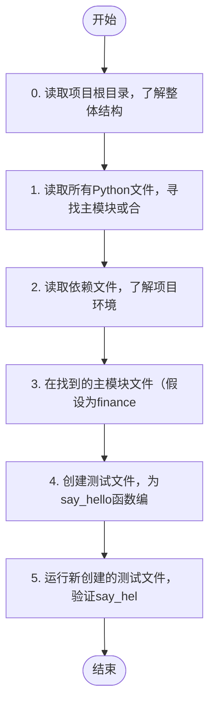

# 工作流: 在 finance_cli 项目中添加一个新的函数 say_hello

```mermaid
graph TD
    Start([开始]) --> S0
    S0["0. 读取项目根目录，了解整体结构"]
    S0 --> S1
    S1["1. 读取所有Python文件，寻找主模块或合"]
    S1 --> S2
    S2["2. 读取依赖文件，了解项目环境"]
    S2 --> S3
    S3["3. 在找到的主模块文件（假设为finance"]
    S3 --> S4
    S4["4. 创建测试文件，为say_hello函数编"]
    S4 --> S5
    S5["5. 运行新创建的测试文件，验证say_hel"]
    S5 --> End([结束])
```
