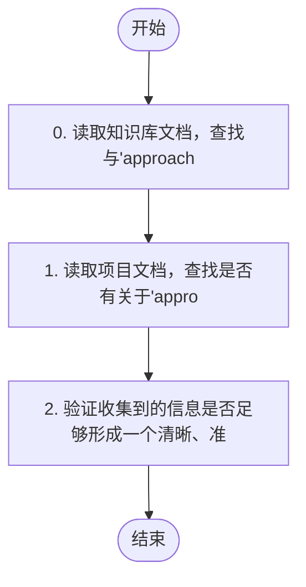

# 工作流: 了解什么是approach图

```mermaid
graph TD
    Start([开始]) --> S0
    S0["0. 读取知识库文档，查找与'approach"]
    S0 --> S1
    S1["1. 读取项目文档，查找是否有关于'appro"]
    S1 --> S2
    S2["2. 验证收集到的信息是否足够形成一个清晰、准"]
    S2 --> End([结束])
```
