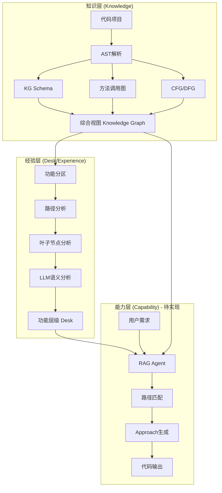

# Capability模块技术讨论

> **文档目的**：梳理Capability模块的整体架构、技术难点和待讨论问题，为后续实施提供参考。

---

## 一、整体架构理解

### 1.1 现有系统的三层架构



### 1.2 你描述的Capability模块框架

| 组件 | 输入 | 处理 | 输出 |
|------|------|------|------|
| **RAG Agent** | Knowledge + Desk 全部数据 | 向量化/索引 | 可检索的知识库 |
| **路径匹配器** | 用户需求 + Desk功能路径链 | 传统代码 + LLM语义分析 | 最接近的一条路径 |
| **Approach生成器** | 匹配到的路径 | 流程规划 | Approach图/计划 |
| **代码生成器** | Approach计划 | 代码生成 | 最终代码 |

---

## 二、核心技术问题与讨论

### 2.1 RAG Agent设计

#### 问题1：什么数据需要放入RAG？

**候选数据源：**
1. **Knowledge层数据**
   - 函数/方法签名和文档字符串
   - 类定义和继承关系
   - 调用关系图的边信息
   - CFG/DFG的路径信息

2. **Desk层数据**
   - 功能分区摘要（每个分区的功能描述）
   - 路径语义画像（每条路径的功能含义）
   - I/O签名（输入输出类型）

**讨论点：**
- 是用**单一向量库**存储所有数据，还是**分层索引**（先匹配分区，再匹配路径）？
- Embedding模型选择：用通用模型（如OpenAI embedding）还是代码专用模型（如CodeBERT）？

#### 问题2：RAG的检索粒度

| 粒度 | 优点 | 缺点 |
|------|------|------|
| **函数级** | 精确，复用性高 | 数量多，检索噪音大 |
| **路径级** | 语义完整，适合功能匹配 | 可能太粗，丢失细节 |
| **分区级** | 数量少，检索快 | 太粗，需要二次检索 |

**建议方案：分层检索**
```
用户需求 → 分区级粗筛 → 路径级精筛 → 函数级定位
```

---

### 2.2 路径匹配策略

#### 问题3：如何衡量"最接近"？

**匹配维度：**
1. **语义相似度**：需求描述与路径功能描述的文本相似度
2. **I/O匹配**：需求的输入输出类型与路径的I/O签名匹配度
3. **关键词匹配**：需求中的关键词在路径函数名/注释中的命中率

**可能的实现方式：**

```python
# 方式A：纯向量检索
def match_path_vector(requirement_embedding, path_embeddings):
    similarities = cosine_similarity(requirement_embedding, path_embeddings)
    return top_k(similarities)

# 方式B：混合匹配（推荐）
def match_path_hybrid(requirement, paths):
    # 1. 向量语义相似度 (权重0.5)
    semantic_score = vector_similarity(requirement.embedding, path.embedding)
    
    # 2. I/O类型匹配 (权重0.3)
    io_score = match_io_types(requirement.input_types, requirement.output_types,
                               path.input_types, path.output_types)
    
    # 3. 关键词命中 (权重0.2)
    keyword_score = keyword_hit_rate(requirement.keywords, path.function_names)
    
    return 0.5 * semantic_score + 0.3 * io_score + 0.2 * keyword_score
```

**讨论点：**
- 权重如何确定？是否需要可配置？
- I/O类型匹配如何处理模糊类型（如 `str` vs `用户名`）？

---

### 2.3 Approach生成

#### 问题4：Approach应该长什么样？

**候选格式：**

**格式A：步骤列表**
```json
{
  "steps": [
    {"index": 1, "description": "验证输入", "function": "existing:validate_input"},
    {"index": 2, "description": "查询数据", "function": "existing:query_database"},
    {"index": 3, "description": "处理结果", "function": "new:process_result"}
  ]
}
```

**格式B：调用图（超图）**
```json
{
  "nodes": [
    {"id": "n1", "type": "existing", "function": "validate_input"},
    {"id": "n2", "type": "existing", "function": "query_database"},
    {"id": "n3", "type": "new", "function": "process_result"}
  ],
  "edges": [
    {"from": "n1", "to": "n2", "data_flow": ["user_input"]},
    {"from": "n2", "to": "n3", "data_flow": ["query_result"]}
  ]
}
```

**格式C：完整流程图（带分支）**
```json
{
  "type": "flowchart",
  "nodes": [...],
  "edges": [...],
  "conditions": [
    {"id": "c1", "description": "如果验证失败", "branch_to": "error_handler"}
  ]
}
```

**讨论点：**
- 0.1版本用哪种格式？（建议：格式A，简单易实现）
- 如何区分"复用现有函数"和"需要新增函数"？

---

### 2.4 代码生成策略

#### 问题5：代码生成的边界在哪里？

| 级别 | 输出内容 | 复杂度 | 0.1版本？ |
|------|----------|--------|----------|
| Level 0 | 只输出Approach计划 | 低 | ✅ |
| Level 1 | 输出函数签名骨架 | 中 | ⚠️ 可选 |
| Level 2 | 输出伪代码 | 中高 | ❌ |
| Level 3 | 输出可运行代码 | 高 | ❌ |

**建议：0.1版本聚焦Level 0 + 部分Level 1**

---

## 三、用户需求的多种场景

你提到用户需求可能有三种类型：

### 场景1：了解代码
> 用户：这个项目的用户认证模块是怎么工作的？

**处理流程：**
```
需求 → 分区匹配 → 找到"用户认证"分区 → 提取路径和调用图 → 生成解释文档
```

### 场景2：需求分析 + 方案规划
> 用户：我想给这个项目添加OAuth登录功能，但我不太了解现有代码，帮我分析该怎么做。

**处理流程：**
```
需求 → Knowledge理解 → 匹配相似路径 → 生成Approach → 标注复用点和新增点
```

### 场景3：直接扩展代码
> 用户：帮我实现OAuth登录功能。

**处理流程：**
```
场景2的Approach → 代码生成 → 输出可运行代码
```

**讨论点：**
- 三种场景是否用同一套流水线？还是三个独立入口？
- 如何识别用户意图属于哪种场景？

---

## 四、待讨论的关键决策

### 决策1：RAG技术选型

| 选项 | 方案 | 优点 | 缺点 |
|------|------|------|------|
| A | LangChain + ChromaDB | 成熟、易集成 | 可能需要额外依赖 |
| B | LlamaIndex | 专为LLM设计 | 学习曲线 |
| C | 自研简易索引 | 轻量、可控 | 功能有限 |

### 决策2：LLM调用策略

| 选项 | 方案 | 适用场景 |
|------|------|---------|
| A | 单次调用（大Prompt） | 简单需求，快速响应 |
| B | 多轮调用（CoT） | 复杂需求，逐步推理 |
| C | Agent模式（ReAct） | 需要动态检索和决策 |

### 决策3：存储与缓存

- 向量索引如何持久化？每次启动重建还是保存到文件？
- 匹配结果是否缓存？相似需求复用之前的匹配结果？

---

## 五、与现有系统的集成点

### 5.1 复用现有模块

| 现有模块 | 可复用于 |
|----------|----------|
| `analysis/path_level_analyzer.py` | 提取路径数据给RAG |
| `analysis/function_call_hypergraph.py` | 生成Approach超图 |
| `llm/code_understanding_agent.py` | 理解需求、生成解释 |
| `llm/graph_knowledge_base.py` | 知识压缩和摘要 |
| `app.py` 的分析流程 | 获取Knowledge和Desk数据 |

### 5.2 新增模块建议

```
llm/
├── capability/
│   ├── __init__.py
│   ├── rag_agent.py           # RAG Agent核心
│   ├── requirement_parser.py   # 需求解析
│   ├── path_matcher.py         # 路径匹配
│   ├── approach_generator.py   # Approach生成
│   └── code_generator.py       # 代码生成（可选）
```

---

## 六、下一步讨论

请针对以下问题给出你的想法：

1. **RAG数据粒度**：你倾向于函数级、路径级还是分层检索？
2. **匹配策略**：纯向量检索 vs 混合匹配，你觉得哪个更合适？
3. **Approach格式**：步骤列表 vs 调用图，0.1版本用哪种？
4. **用户场景**：三种场景是否需要在0.1版本全部支持？
5. **技术选型**：RAG框架和LLM调用策略的偏好？

---

*文档版本：v0.1 | 创建时间：2026-01-21*
